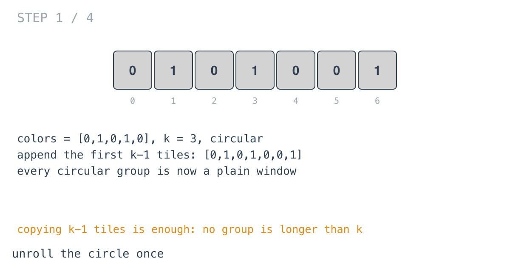
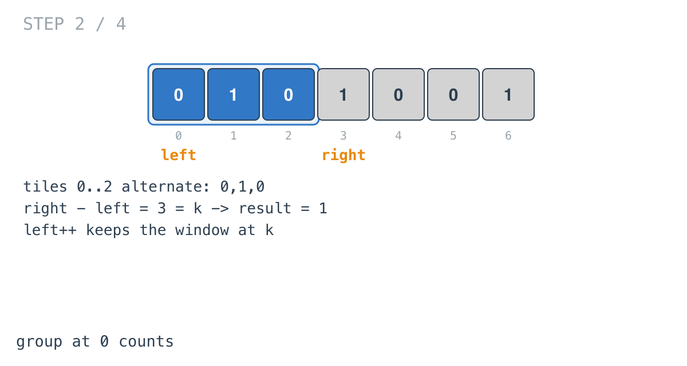
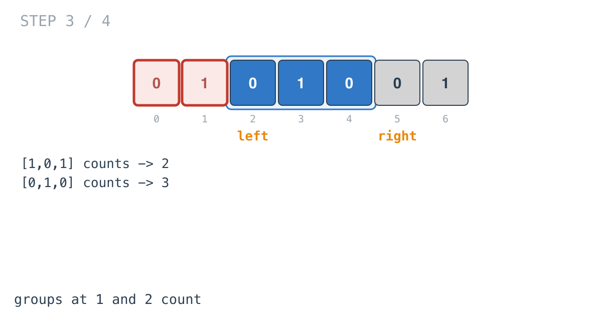
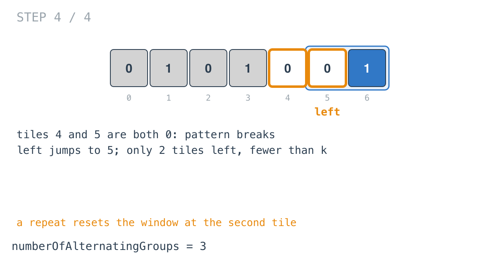

## Solution walkthrough

`numberOfAlternatingGroups(colors []int, k int) int` in `main.go` unrolls the circle once,
then grows a window of alternating tiles and counts every time it reaches `k`.

We'll trace Example 1: `colors = [0,1,0,1,0]`, `k = 3`, expected `3`.

1. **Unroll the circle.** `extendedColors := append(colors, colors[:k-1]...)` gives
   `[0,1,0,1,0,0,1]`. Any circular group starting at `0..4` is now a plain window.

   

2. **Grow while colours alternate.** `left` is inclusive and `right` exclusive. Each step
   compares `extendedColors[right]` with the tile before it. They differ, so `right++`.

3. **A full group.** When `right - left` reaches `k`, the window `[left, right)` is an
   alternating group: `result++`, then `left++` so the window stays at `k` tiles for the
   next start position. Tiles 0-2 (`0,1,0`) count.

   

4. **The next two starts.** `[1,0,1]` and `[0,1,0]` also alternate. `result = 3`.

   

5. **A repeat resets.** Tiles 4 and 5 are both `0`. No alternating window can hold both,
   so `left = right`: the window restarts at tile 5. Only two tiles remain after it, fewer
   than `k`, so nothing more counts. The answer is 3.

   

**Complexity:** O(n + k) time and space for the extended slice.
