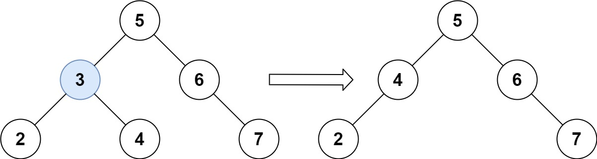
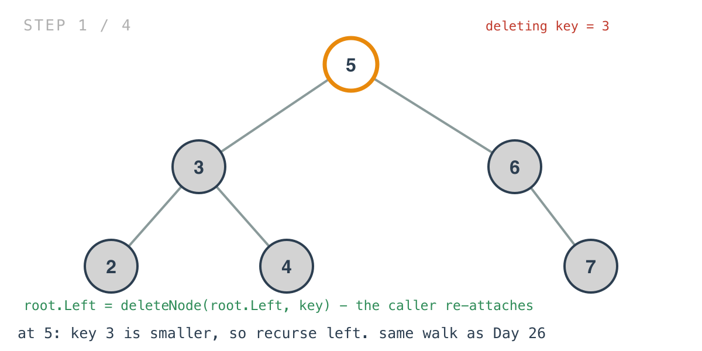
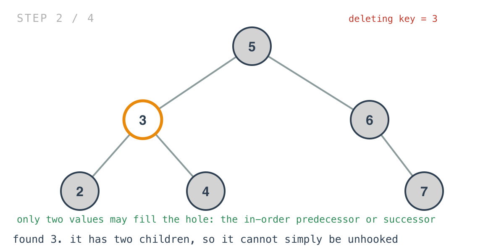
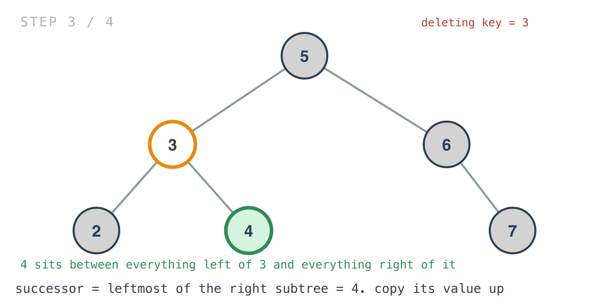
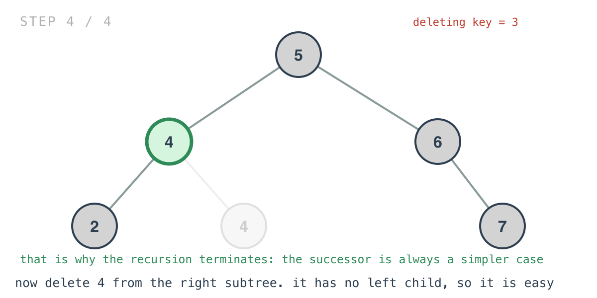

## 365 Days of LeetCode Challenge — Day 56/365

# Delete Node in a BST

🔗 https://leetcode.com/problems/delete-node-in-a-bst/ · Difficulty: Medium

### The problem

Given the root of a BST and a key, delete the node with that key and return the root of the
updated tree.



### The intuition

The problem splits itself for you: find the node, then delete it. The first half is Day
26's walk — compare the key against the node and go the one direction it could be in.

The second half is where it gets interesting, because a node with two children can't just
be unhooked. Something has to take its place, and only two values in the entire tree can:
its in-order predecessor and its in-order successor — the values immediately before and
after it in sorted order.

That follows directly from the property Day 52 used. If the in-order sequence must stay
sorted after the deletion, then whatever fills the hole must sit between the deleted node's
left subtree (all smaller) and its right subtree (all larger). The only two candidates are
the largest value on the left and the smallest on the right. Anything else breaks the
ordering somewhere.

So the implementation never removes an internal node at all. It overwrites the node's value
with a neighbour's, then recursively deletes that neighbour from the subtree it came from.

That looks circular on first read — delete calls delete — but it terminates, and for a
specific reason. The successor is the leftmost node of the right subtree, so by definition
it has no left child. A node with at most one child is one of the easy cases, so the
recursion descends into a strictly simpler problem every time and bottoms out at a leaf.

### Builds on

- [Day 45: Search in a Binary Search Tree](https://github.com/architagr/leetcode_solutions/blob/main/easy_problems/601_700/search_in_a_binary_search_tree/) — the comparison that picks a direction, which is the whole search half of this problem
- [Day 52: Validate Binary Search Tree](https://github.com/architagr/leetcode_solutions/blob/main/medium_problems/1_100/validate_binary_search_tree/) — in-order is sorted, which is the property the deletion has to preserve and the reason the successor is the right value to move

### The solution

```go
func deleteNode(root *TreeNode, key int) *TreeNode {
	if root == nil {
		return nil
	}
	if key > root.Val {
		root.Right = deleteNode(root.Right, key)
	} else if key < root.Val {
		root.Left = deleteNode(root.Left, key)
	} else {
		if root.Left == nil && root.Right == nil {
			root = nil
		} else if root.Right != nil {
			root.Val = successor(root)
			root.Right = deleteNode(root.Right, root.Val)
		} else {
			root.Val = predecessor(root)
			root.Left = deleteNode(root.Left, root.Val)
		}
	}
	return root
}
```

Tracing `root = [5,3,6,2,4,null,7]` with `key = 3`.



The reassignment isn't decoration. Deleting inside a subtree can change which node roots
that subtree, so every caller takes back what comes out and re-attaches it. It's also what
makes the leaf case work at all — `root = nil` deep in the recursion only takes effect
because the parent assigns the returned nil into its own child pointer.



`successor` walks one step right, then all the way left: the smallest value greater than
the node. Here that's `4`.



Note that the following line deletes `root.Val`, which by then is the *new* value. The node
itself is never removed — its value is overwritten and the duplicate below is deleted
instead.



The third branch exists for a concrete reason: `successor` does `root = root.Right`
unconditionally and would panic on a node with no right child, so that case can't fall
through to it. The predecessor — rightmost of the left subtree, so no right child of its
own — is the mirror answer and equally valid. The problem's own second picture shows an
alternative correct output for exactly this reason.


O(h) time, where h is the tree's height: one path down to find the node, one more to find a
successor, and the recursive delete follows that same path. O(log n) balanced, O(n) skewed.
Space is O(h) for the recursion stack.

Full code and the step-by-step walkthrough:
[delete_node_in_a_bst](https://github.com/architagr/leetcode_solutions/blob/main/medium_problems/401_500/delete_node_in_a_bst/SOLUTION.md)

#DSA #LeetCode #100DaysOfCode #CodingInterview #BinarySearchTree #Recursion #Golang

---

*Solution and code by Archit Agarwal. Write-up drafted with AI assistance from the code and problem statement.*
