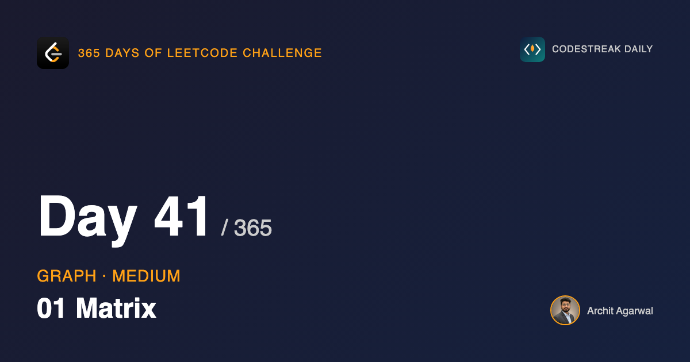
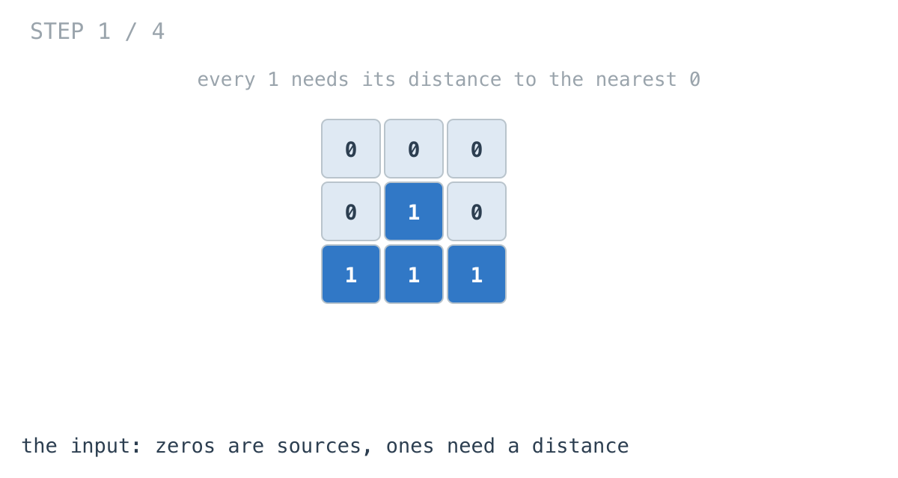
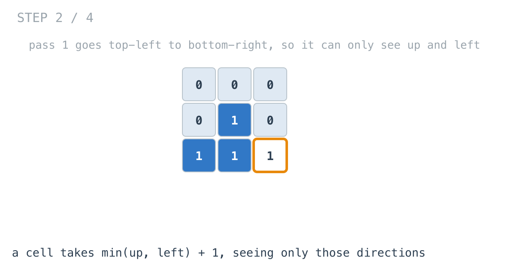
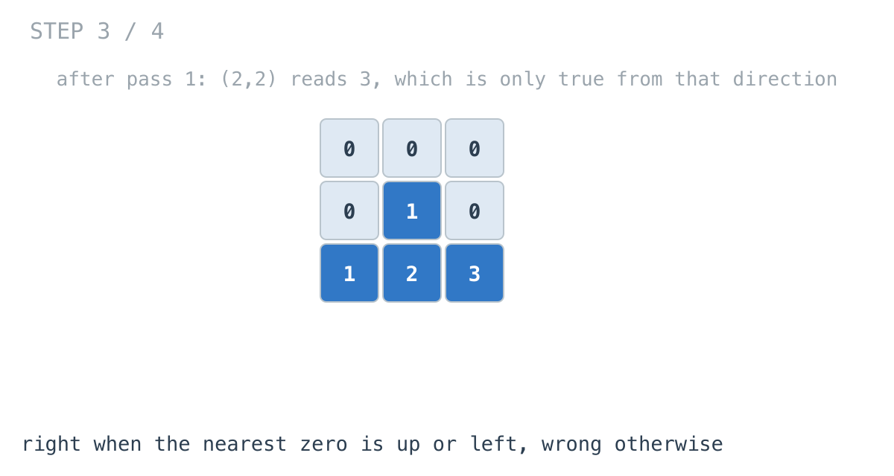
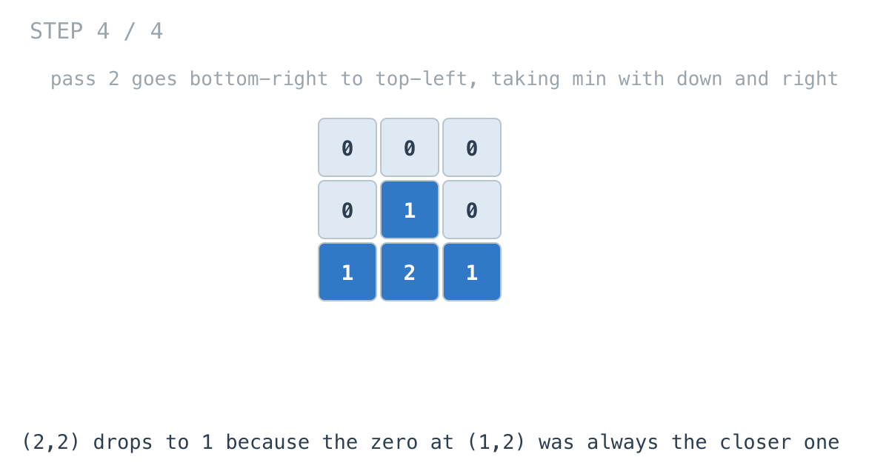

## 365 Days of LeetCode Challenge — Day 41/365

**[542. 01 Matrix](https://leetcode.com/problems/01-matrix/)** (Medium)

For every cell, how far is the nearest `0`?

## This is yesterday's problem

Rotting Oranges asked how many minutes until an orange rots, with every rotten orange spreading at once. This asks how far a cell is from the nearest zero, with every zero a source.

Same question. Multi-source BFS solves it directly, and if that is where your mind went, you are right.

Today's solution does something else, and that is the reason to read it.

## The definition is circular

The distance from a cell to its nearest zero is one more than the smallest distance among its four neighbours.

Obviously true, and useless as written. Every cell's answer depends on its neighbours', and theirs depend on it. There is no order in which to evaluate that.

## Direction breaks the circle

Any shortest path leaves a cell in one of four directions. Group them into two: up-or-left, and down-or-right.

Sweep the grid **top-left to bottom-right**. When you arrive at a cell, everything above and to the left of it is already final. So you can correctly compute its best distance *among paths that start by going up or left*.

Sweep **bottom-right to top-left** and you cover the other two directions.

Take the minimum of the two and every direction is accounted for. No queue, no visited set.





Pass one reads only `result[i-1][j]` and `result[i][j-1]` — up and left. Both finalised earlier in this same sweep, which is the whole reason for the sweep direction.



After pass one, cells whose nearest zero is up or left are correct. The rest are too large.



## The one line that makes two passes enough

```go
result[i][j] = minValue(result[i][j], minNeighbor+1)
```

`minValue` with the existing value, not a plain assignment.

Pass one's answer is kept when it was already better. Overwrite instead and you discard every correct distance the first pass computed, and the second pass only ever knows about down-and-right paths.

That single `minValue` is the difference between two passes that combine and two passes where the second one wins.

## Why exactly two

Every shortest path in a four-directional grid is a sequence of steps that never needs to backtrack. Pass one covers the paths that go up and left. Pass two covers the rest, and can improve on pass one because it takes a minimum.

There is no third case, so there is no third pass.

## Which should you write?

BFS, in an interview. It is the natural framing for a distance problem, it generalises to weighted moves and more dimensions, and it is easier to say out loud.

This one is worth knowing because it allocates nothing beyond the output, and because the pattern generalises: when a definition is circular, look for an evaluation order that makes part of it acyclic, then cover the rest with a second pass the other way.

## One quiet difference

Days 37, 38 and 40 all ate the grid they were handed. This one copies first and leaves the input alone — mostly because it has to return a grid anyway, so allocating was never avoidable.

## Complexity

- **Time: O(m x n)**. Two sweeps, constant work per cell.
- **Space: O(m x n)** for the output the problem asks for. No queue.

## Builds on

- [Day 40: Rotting Oranges](https://github.com/architagr/leetcode_solutions/blob/main/medium_problems/901_1000/rotting_oranges/) — the same question, distance from every cell to the nearest source, answered there with a queue and here without one

Full code and the step-by-step walkthrough:
[01_matrix](https://github.com/architagr/leetcode_solutions/blob/main/medium_problems/501_600/01_matrix/SOLUTION.md)

#DSA #LeetCode #Golang #DynamicProgramming #Grids #CodingInterview #Algorithms

---

*Solution and code by Archit Agarwal. Write-up drafted with AI assistance from the code and problem statement.*
