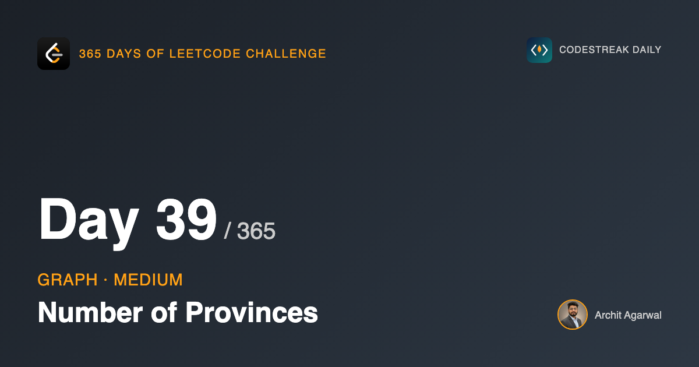
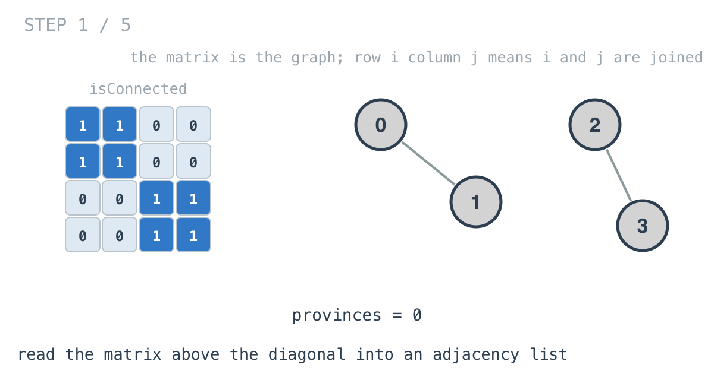
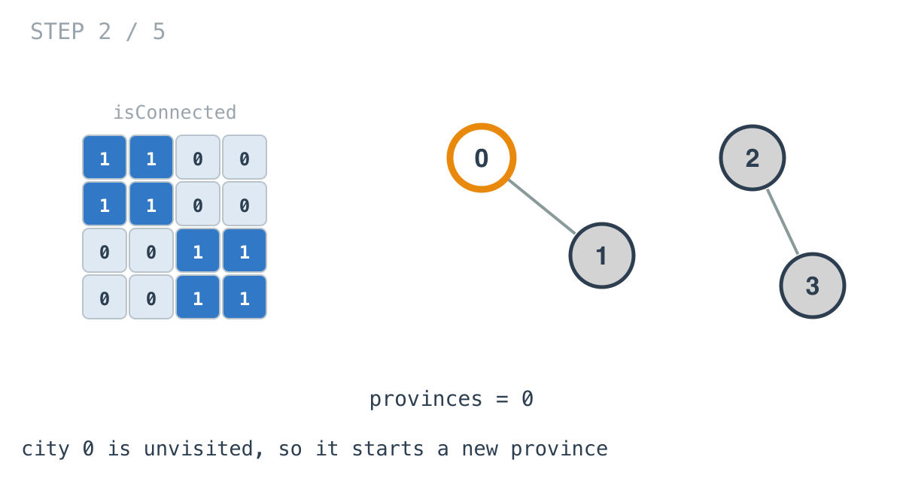
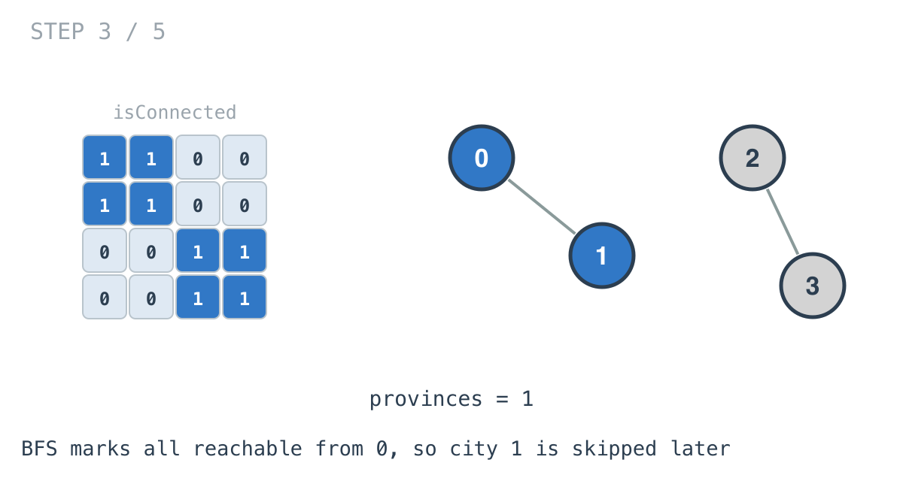
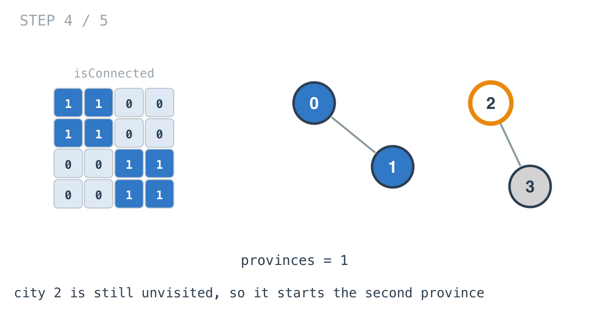
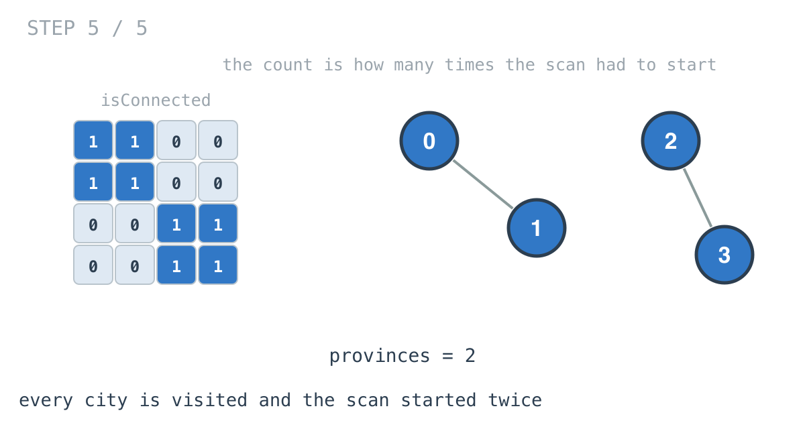

*365 Days of LeetCode Challenge — Day 39/365*

**[547. Number of Provinces](https://leetcode.com/problems/number-of-provinces/)** (Medium)

You are given an `n x n` matrix where `isConnected[i][j] == 1` means cities `i` and `j` are directly joined. A province is a group of cities that can all reach each other. Count the provinces.

## The algorithm is already written

Day 37 counted connected groups in a grid:

```
for every node:
    if not visited:
        count++
        traverse everything reachable from it
```

That is this problem too, without modification. The count is how many times the scan had to start.

So if the algorithm is settled, what is today actually about? The input format. And that turns out to be worth a day on its own, because this is the **third different way a graph has arrived in four days**.

Day 36 handed over a flat list of edge pairs. Day 37 handed over a grid where the edges were not written down at all, being implied by position. Today hands over a matrix.

All three end up as the same adjacency list before any interesting work happens. The graph does not change. Only the packaging does, and unpacking it correctly is the job.

## The trap

`isConnected` is a two-dimensional array of ints. So was day 37's grid. They look identical and they mean completely different things.

In Number of Islands, cell `(i, j)` was **a place**. The grid's shape was the map itself, and `(2, 3)` named a location you could stand on. Traversing the cells was traversing the graph.

Here, cell `(i, j)` is **a relationship**. It does not name a city. It answers a yes/no question about a pair of cities. An `n x n` matrix here describes `n` nodes, not `n²`.

So the outer loop of this solution runs over cities, `0` through `n-1`, and consults the matrix when it needs to know who is adjacent to whom. The matrix is a lookup table, not a territory.

If you carry day 37's habits into this problem you will write a nested scan over the cells, and it will compile, and it will run, and it will answer a question nobody asked.

## Building the adjacency list

```go
func getAdjeList(isConnected [][]int) map[int][]int {
	ajList := make(map[int][]int, len(isConnected))
	for i := 0; i < len(isConnected); i++ {
		for j := i + 1; j < len(isConnected[i]); j++ {
			if isConnected[i][j] == 1 {
				ajList[i] = append(ajList[i], j)
				ajList[j] = append(ajList[j], i)
			}
		}
	}
	return ajList
}
```



The inner loop starts at `i + 1`, and both halves of that matter.

**It skips the diagonal.** `isConnected[i][i]` is always `1`, and all it says is that a city is connected to itself, which is true of every city and tells you nothing.

**It reads only the upper triangle.** The matrix is symmetric: if city 0 is joined to city 2 then the matrix says so at `(0,2)` and again at `(2,0)`. Reading both halves would process every relationship twice. Reading above the diagonal sees each one exactly once.

And then the body writes *both* directions into the adjacency list:

```go
ajList[i] = append(ajList[i], j)
ajList[j] = append(ajList[j], i)
```

which is day 36's rule about undirected edges, arriving for the second time. The symmetry that let us read half the matrix is the same symmetry that forces us to write both entries in the list. Different structures, same underlying fact about undirected graphs.

## The scan





City 0 is unvisited, so it starts a province, and the BFS marks everything reachable from it. City 1 is now visited, so when the scan gets to it, nothing happens.





Two starts, two provinces.

## A deliberate contrast with day 36

Look at where this BFS marks nodes as visited:

```go
x := pop()
if _, alreadyVisited := visited[x]; !alreadyVisited {
	push(ajList[x]...)
	visited[x] = true
}
```

On **dequeue**. Day 36 made a point of marking on **enqueue**, and I said then that marking late lets a node enter the queue several times.

That is exactly what happens here. A city adjacent to five already-visited cities gets pushed five times, and four of those entries are popped, found to be visited, and discarded.

The answer is still correct, because the check on dequeue catches every duplicate. What it costs is queue size and pointless pops.

For this problem it does not matter at all: `n` is at most 200. I am pointing at it because the two versions sit four days apart and produce identical output, and the only way to notice the difference is to read the loop and think about it. Performance differences that never show up in the result are the ones worth learning to see by eye.

## Why convert the matrix at all

You could skip `getAdjeList` entirely and run the BFS against the matrix, asking `isConnected[x][k]` for every `k` when you need node `x`'s neighbours.

That works. It costs O(n) per node regardless of how many neighbours that node actually has, so the traversal is O(n²) even when the graph is nearly empty.

Converting first costs one O(n²) pass and then lets the traversal cost O(V + E), which on a sparse graph is much less.

The honest footnote is that the total is O(n²) either way, because the matrix must be read at least once and that read is the floor. What the conversion buys is that the *traversal* scales with the graph rather than with the matrix, which matters when the traversal is the part you run repeatedly.

## Complexity

- **Time: O(n²).** Reading the matrix dominates; nothing after it is worse.
- **Space: O(n + E)** for the adjacency list, plus O(n) for the visited map and the queue.

## Builds on

- [Day 36: Find if Path Exists in Graph](https://github.com/architagr/leetcode_solutions/blob/main/easy_problems/1901_2000/find_if_path_exists_in_graph/) — building an adjacency list, then BFS from a start node
- [Day 37: Number of Islands](https://github.com/architagr/leetcode_solutions/blob/main/medium_problems/101_200/number_of_islands/) — counting components by counting how many times the scan had to start

Full code and the step-by-step walkthrough:
[number_of_provinces](https://github.com/architagr/leetcode_solutions/blob/main/medium_problems/501_600/number_of_provinces/SOLUTION.md)

---

*Solution and code by Archit Agarwal. Write-up drafted with AI assistance from the code and problem statement.*
