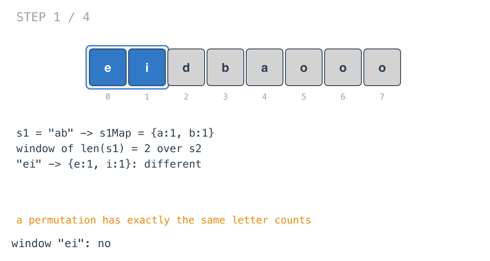
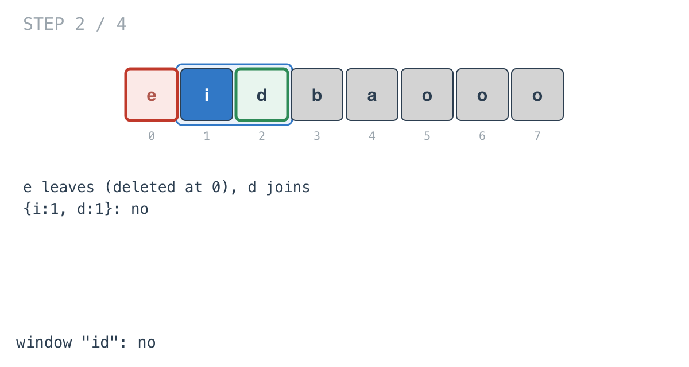
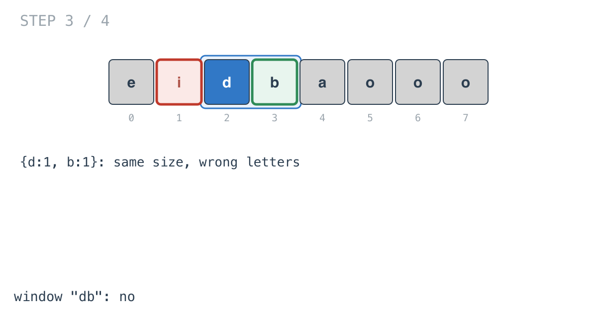
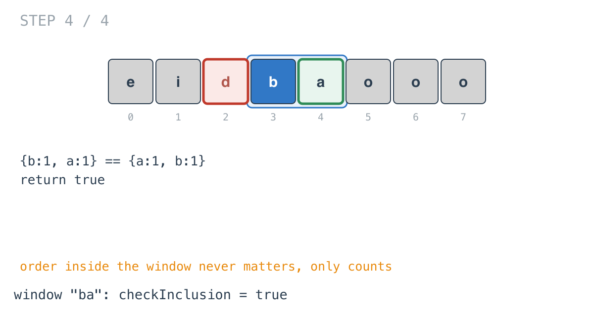

## Solution walkthrough

`checkInclusion(s1, s2 string) bool` in `permutation_in_string.go` slides a window of
length `len(s1)` over `s2` and compares letter counts with `s1`'s at every position.

We'll trace Example 1: `s1 = "ab"`, `s2 = "eidbaooo"`, expected `true`.

1. **Too long to fit.** `if len(s1) > len(s2) { return false }`.

2. **Build both maps together.** One loop over `len(s1)` fills `s1Map` from `s1` and
   `subStringMap` from the first `len(s1)` letters of `s2`. Here `{a:1, b:1}` and
   `{e:1, i:1}`. `check` says no.

   

3. **Slide: drop one letter, add one.** `start` and `end` move together, so the window
   stays the same length. The letter leaving is decremented and deleted at zero; the
   letter entering is incremented. `"id"` doesn't match.

   

4. **Same size isn't enough.** `"db"` has two letters like `s1`, but the wrong ones.
   `check` compares counts key by key, so it fails.

   

5. **A match.** `"ba"` has counts `{b:1, a:1}`, the same as `s1`. `check` returns true,
   and so does the function.

   

`check` first compares the number of keys, then each of `s1`'s letters. Since the window
map never keeps zero counts, equal key counts plus equal per-letter counts means equal
maps.

**Complexity:** O(26·n) time, O(1) space.
