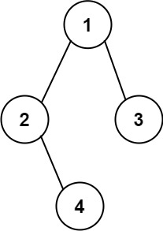
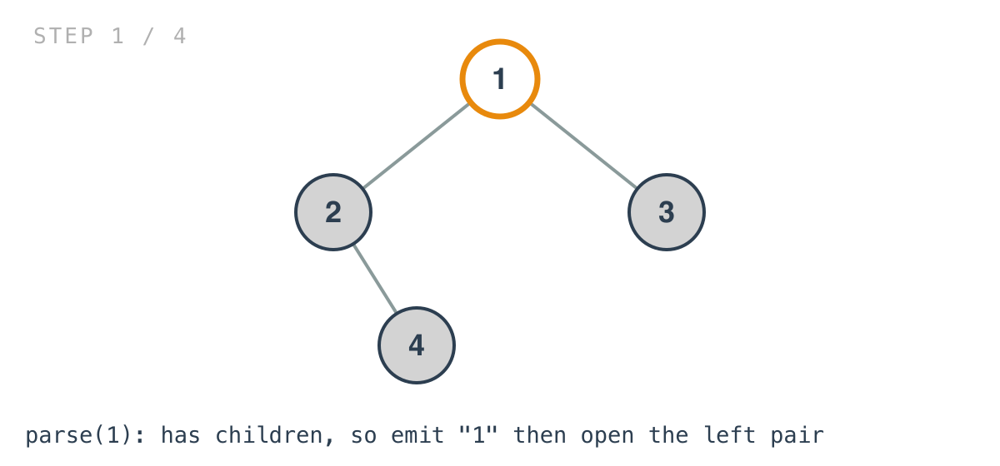
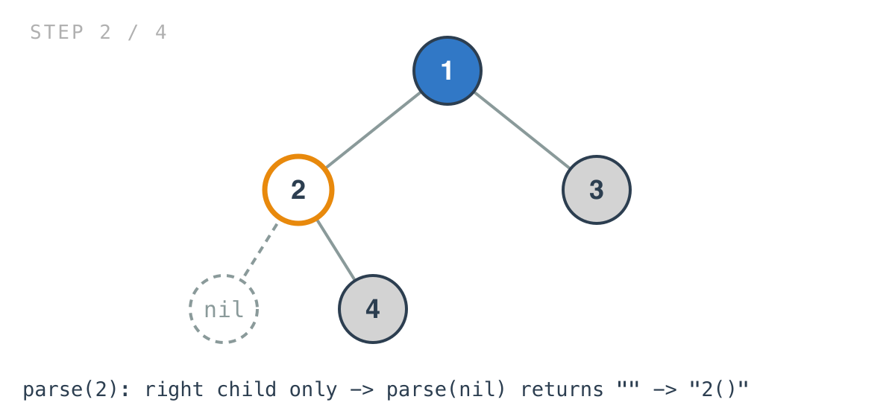
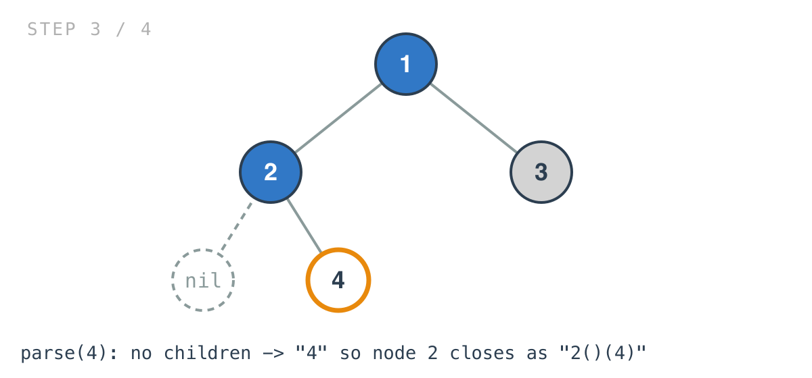
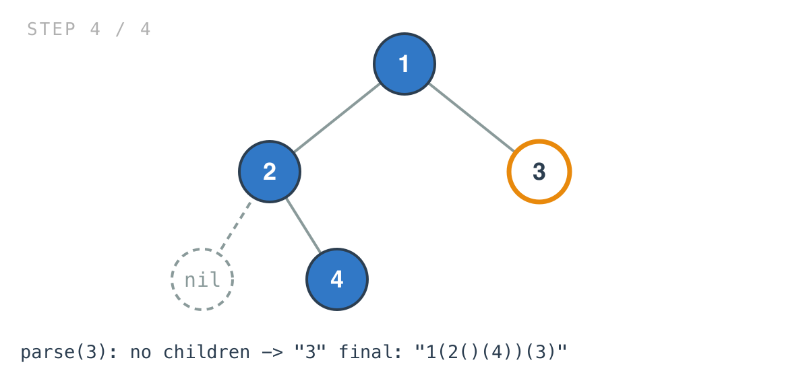

## 365 Days of LeetCode Challenge — Day 13/365

# Construct String from Binary Tree

🔗 https://leetcode.com/problems/construct-string-from-binary-tree/ · Difficulty: Medium

### The problem

Build a string representation of a binary tree from a pre-order traversal. Each node is
its value; a node with any child gets its children wrapped in parentheses, left then
right. Empty pairs are omitted — except when a node has a right child and no left child,
where an empty pair must appear before the right child.



### The intuition

The traversal is the easy part. It's pre-order, and the string is built in exactly that
order.

What makes this a medium is that one exception, and it isn't decoration. Without it the
string stops being reversible: `1(2)` would describe both "1 with a left child 2" and "1
with a right child 2", and the whole point of the representation is that it maps
one-to-one onto the tree. The empty pair is a positional marker saying the left slot is
empty and what follows is the right child.

So the question becomes how to write the branching so the exception falls out rather than
being special-cased.

The answer is to make the two children asymmetric in the code, the way they are asymmetric
in the rules. Once a node is known to have at least one child, emit the left parentheses
unconditionally, and the right ones only if a right child exists. When the left child
exists you get `(2(4))`. When it doesn't, `parse(nil)` returns the empty string and the
same line emits `()` — precisely the placeholder the exception asks for. No branch tests
for "right but no left" anywhere, because the shape of the recursion already produces it.

The mirror case never needs a placeholder: a node with a left child and no right child
emits `(left)` and stops, and nothing about that is ambiguous.

### Builds on

- [Day 8: Binary Tree Preorder Traversal](https://github.com/architagr/leetcode_solutions/blob/main/easy_problems/101_200/binary_tree_preorder_traversal/) — the node-then-left-then-right order this string is defined by
- [Day 3: Binary Tree Paths](https://github.com/architagr/leetcode_solutions/blob/main/easy_problems/201_300/binary_tree_path/) — building a string during a traversal, where each node contributes a piece and the recursion assembles them

### The solution

```go
func Tree2str(root *TreeNode) string {
	return parse(root)
}

func parse(node *TreeNode) string {
	if node == nil {
		return ""
	}
	s := strconv.Itoa(node.Val)
	if node.Right != nil || node.Left != nil {
		s += "(" + parse(node.Left) + ")"
		if node.Right != nil {
			s += "(" + parse(node.Right) + ")"
		}
	}
	return s
}
```

Tracing `[1,2,3,null,4]` — the example that exercises the rule. Node `1` has children `2`
and `3`; node `2` has no left child and a right child `4`. Expected: `"1(2()(4))(3)"`.

Every node writes its own value first, which is the "pre" in pre-order.



Node `2` is the interesting one. The left pair is emitted with no nil check, so
`parse(nil)` returning the empty string is what produces `()`.



A leaf skips the parentheses block entirely, which is why `4` becomes `"4"` and not
`"4()"`.



Unwinding: `parse(2)` finishes as `"2" + "()" + "(4)"`, `parse(3)` returns `"3"`, and the
root assembles `"1" + "(2()(4))" + "(3)"`.



Run the first example through the same code and the asymmetry shows from the other side:
`[1,2,3,4]` gives `"1(2(4))(3)"`, where node `2` has a left child and no right one, so the
conditional branch never fires and no placeholder appears.

The base case deserves one more look. Returning `""` for a nil node isn't only stopping
the recursion — that empty string is what becomes `()` once a caller wraps it. The rule
and the base case are the same mechanism.

O(n) node visits, each converting one value. The catch is `+=` on strings: Go strings are
immutable, so every concatenation allocates and copies what came before, which on a skewed
tree degrades to O(n^2) total copying. A `strings.Builder` threaded through the recursion
would hold it at O(n). Space is O(h) for the stack plus O(n) for the string.

Full code and the step-by-step walkthrough:
[construct_string_from_binary_tree](https://github.com/architagr/leetcode_solutions/blob/main/medium_problems/601_700/construct_string_from_binary_tree/SOLUTION.md)

#DSA #LeetCode #100DaysOfCode #CodingInterview #BinaryTree #Recursion #Golang

---

*Solution and code by Archit Agarwal. Write-up drafted with AI assistance from the code and problem statement.*
