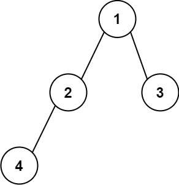

# Construct String from Binary Tree

Difficulty: Medium

[LeetCode #606](https://leetcode.com/problems/construct-string-from-binary-tree/)

Given the root node of a binary tree, create a string representation of the tree
following a specific set of formatting rules. The representation is based on a preorder
traversal and must follow these guidelines:

- **Node representation.** Each node is represented by its integer value.
- **Parentheses for children.** If a node has at least one child, its children are
  represented inside parentheses. A left child's value is enclosed in parentheses
  immediately after the node's value; a right child's parentheses follow the left
  child's.
- **Omitting empty parentheses.** Any empty parentheses pair `()` is omitted, with one
  exception: when a node has a right child but no left child, an empty pair must precede
  the right child's representation, so the string still maps one-to-one onto the tree.

In summary, empty pairs are omitted when a node has only a left child or no children.
When a node has a right child but no left child, the empty pair is required.

## Example 1



```
Input: root = [1,2,3,4]
Output: "1(2(4))(3)"
```

Originally it would be `"1(2(4)())(3()())"`, but all the empty pairs are omitted.

## Example 2


```
Input: root = [1,2,3,null,4]
Output: "1(2()(4))(3)"
```

Almost the same as example 1, except the `()` after `2` is necessary: it marks the
absence of a left child and the presence of a right one.

## Constraints

- The number of nodes in the tree is in the range `[1, 10^4]`.
- `-1000 <= Node.val <= 1000`
