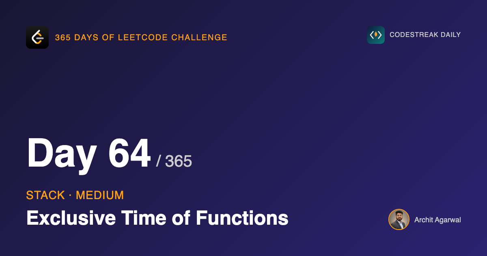

## 365 Days of LeetCode Challenge — Day 64/365

**[636. Exclusive Time of Functions](https://leetcode.com/problems/exclusive-time-of-functions/)** (Medium)

Given start and end logs from a single thread, how long did each function spend running *itself*, not counting the functions it called?

This closes the stack arc, and it is the one where the stack is not a modelling choice at all.

## The input is stack activity

Function calls nest. A function that starts while another is running must finish before that one resumes.

That is what a call stack *is*, and the log is a recording of one. The algorithm is not choosing a data structure — it is replaying the structure the input already describes.

## Exclusive is the word doing the work

If function `0` runs from 0 to 6 and function `1` runs from 2 to 5 inside it, then `0`'s exclusive time is **2**, not 6. The time it spent waiting on `1` belongs to `1`.

So a running function must be **paused** when another starts and **resumed** when that one ends. Every stack entry carries the timestamp it most recently resumed at.

That is day 60's idea in a new setting — an entry stores a value that makes the pop cheap. There it was a minimum; here it is a resume time.


Function 1 starts at 2, so function 0 is charged `2 - 0 = 2` and paused.

## Two interval rules, and they differ

```go
out[idx] += time - sTime        // a pause
out[idx] += time - sTime + 1    // an end
```

**Pausing** uses no `+1`. Function 0 ran at instants 0 and 1; at instant 2 function 1 took over. Half-open.

**Ending** uses `+1`, because an end timestamp is inclusive. A function that starts and ends at the same instant ran for one unit, not zero.


Function 1 ends at 5 and is charged `5 - 2 + 1 = 4` — instants 2, 3, 4 and 5.

Two rules, twenty lines apart, in the same short function. Mixing them up is the main way this goes wrong, and neither mistake produces an obviously silly number.

## The line that makes it exclusive

```go
if len(st) > 0 {
	st[len(st)-1][1] = time + 1
}
```


When function 1 finishes at 5, function 0 becomes the running function again — but not at 5. Instant 5 was already charged to function 1. Function 0 resumes at **6**.

Delete this line and the entry underneath still holds its original start of 0. When it ends at 6 it is charged `6 - 0 + 1 = 7`: the whole span, including everything its child did.

That is *inclusive* time — a different and easier question, arrived at by omission.


## The entry is mutated, not written once

```go
st[len(st)-1][1] = time + 1
```

`st` is a `[][]int`, so this writes through to the entry. The same entry is updated once for every child that starts and ends inside it.

That is the contrast with day 60. There, an entry's `min` was written at push and never touched — which is exactly why popping needed no work. Here the entry is a running tally that keeps changing while it sits on the stack.

Both are "put something in the entry so the pop is cheap". Only one of them is immutable.

## Complexity

- **Time: O(n)** in the number of logs; each parsed once, one push or pop each.
- **Space: O(d)** for the stack, the maximum call depth.

## Builds on

- [Day 60: Min Stack](https://github.com/architagr/leetcode_solutions/blob/main/medium_problems/101_200/min_stack/) — stack entries carrying a second field, so that popping restores the right state without recomputation

Full code and the step-by-step walkthrough:
[exclusive_time_of_functions](https://github.com/architagr/leetcode_solutions/blob/main/medium_problems/601_700/exclusive_time_of_functions/SOLUTION.md)

#DSA #LeetCode #Golang #Stack #CodingInterview #SoftwareEngineering #Algorithms

---

*Solution and code by Archit Agarwal. Write-up drafted with AI assistance from the code and problem statement.*
