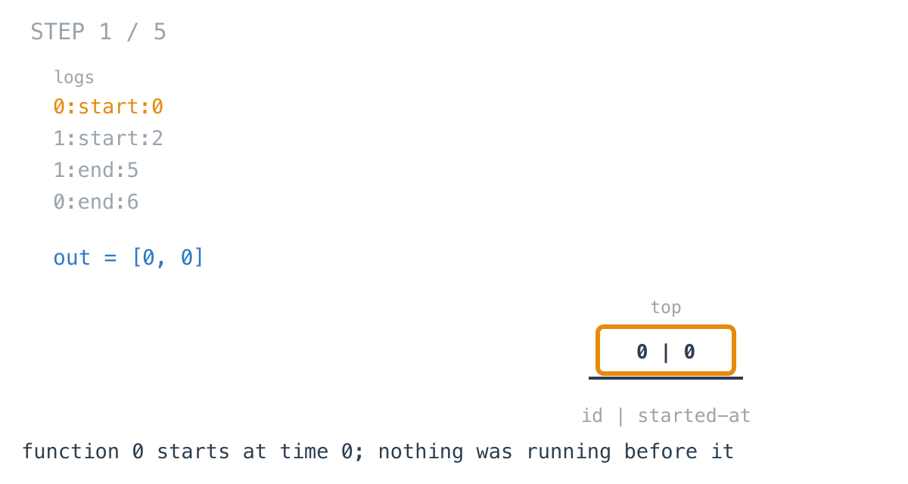
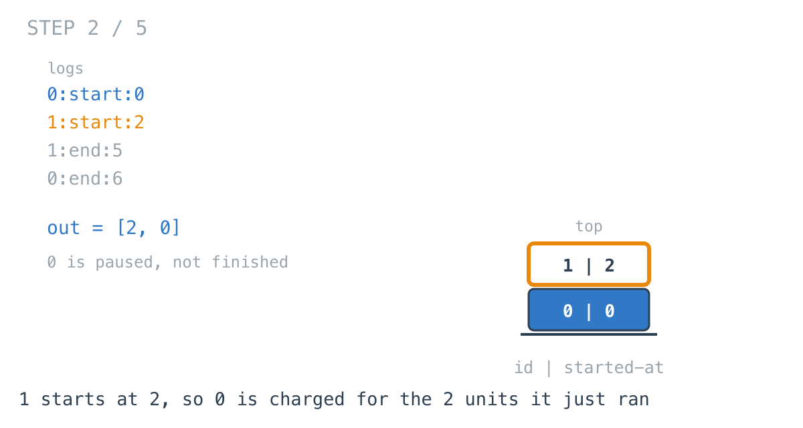
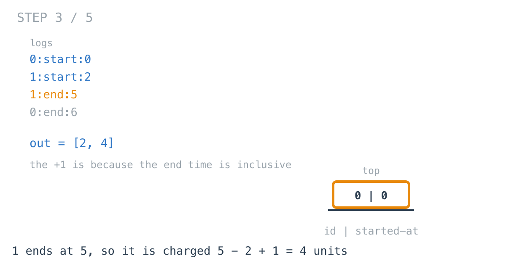
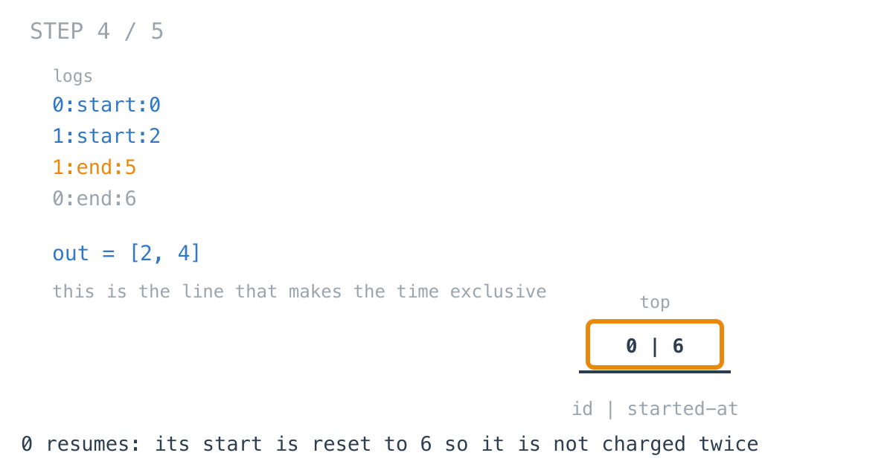
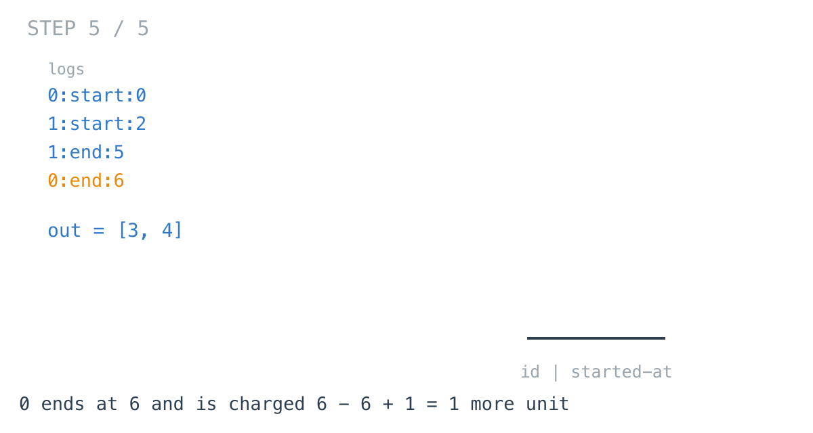

# Exclusive Time of Functions — solution walkthrough

From `main.go`:

```go
func exclusiveTime(n int, logs []string) []int {
	st := [][]int{} // [id,startTime]
	out := make([]int, n)
	for i := 0; i < len(logs); i++ {
		id, logType, time := getData(logs[i])
		if logType == "start" {
			if len(st) > 0 {
				idx, sTime := st[len(st)-1][0], st[len(st)-1][1]
				out[idx] += time - sTime
			}
			st = append(st, []int{id, time})
		} else {
			idx, sTime := st[len(st)-1][0], st[len(st)-1][1]
			st = st[:len(st)-1]
			out[idx] += time - sTime + 1
			if len(st) > 0 {
				st[len(st)-1][1] = time + 1
			}
		}
	}
	return out
}
```

## The input is stack activity

Function calls nest: a function that starts while another is running must finish before that one resumes.

So the stack here is not a modelling decision. The log is a recording of a call stack, and this function replays it.

## Exclusive is the word doing the work

If function `0` runs from 0 to 6 and function `1` runs from 2 to 5 inside it, then `0`'s exclusive time is 2, not 6. The time it spent waiting on `1` belongs to `1`.

So a running function must be paused when another starts and resumed when that one ends, and each stack entry carries the timestamp it most recently resumed at.

That is day 60's idea in a different setting: an entry stores a value that makes the pop cheap. There it was a minimum, here it is a resume time — and unlike the minimum, this one gets **updated in place**.

## Event one: a start with something already running

```go
if len(st) > 0 {
	idx, sTime := st[len(st)-1][0], st[len(st)-1][1]
	out[idx] += time - sTime
}
st = append(st, []int{id, time})
```



The first start has nothing beneath it, so nothing is charged.



Function 1 starts at 2, so function 0 is charged for `2 - 0 = 2` units and then paused.

Note the arithmetic: `time - sTime`, with **no** `+1`. Function 0 ran at instants 0 and 1, and at instant 2 function 1 took over. The interval is half-open.

## Event two: an end

```go
idx, sTime := st[len(st)-1][0], st[len(st)-1][1]
st = st[:len(st)-1]
out[idx] += time - sTime + 1
```



Function 1 ends at 5, so it is charged `5 - 2 + 1 = 4`.

Here the `+1` **is** present, and the reason is that an end timestamp is inclusive: a function that starts and ends at the same instant ran for one unit, not zero. It occupied instants 2, 3, 4 and 5.

Two intervals, two different rules, in the same twenty lines. Getting them mixed up is the main way this problem goes wrong, and neither produces an obviously silly answer.

## Event three: the resume

```go
if len(st) > 0 {
	st[len(st)-1][1] = time + 1
}
```



This is the line that makes the result *exclusive*.

When function 1 finishes at time 5, function 0 becomes the running function again — but not at time 5. Instant 5 has already been charged to function 1. Function 0 resumes at 6.

Without this line, the entry underneath still holds its original start of 0, and when it finally ends at 6 it is charged `6 - 0 + 1 = 7` — the whole span, including everything its child did. The answer becomes inclusive time, which is a different and easier question.



Function 0 ends at 6 and is charged `6 - 6 + 1 = 1` more unit, giving 3 in total.

## The entry is mutated, not replaced

```go
st[len(st)-1][1] = time + 1
```

`st` is a `[][]int`, so the entry is a slice and this writes through to it. The same entry can be updated many times — once for every child that starts and ends inside it.

This is the difference from day 60. There, an entry's `min` was written once at push and never touched, which is exactly why popping needed no work. Here the entry is a running tally that keeps changing while it sits on the stack.

Both are "put something in the entry so the pop is cheap"; only one of them is immutable.

## What is not checked

The top of the stack is read without testing for emptiness on the `end` branch, and `getData` ignores the errors from `strconv.Atoi`.

Both are safe because the problem guarantees well-formed, balanced logs. Parsing a real trace would need to handle an `end` with nothing running and a malformed line, and neither is hard — it is just not this problem.

## Complexity

- **Time: O(n)** in the number of log entries. Each is parsed once and causes one push or one pop.
- **Space: O(d)** for the stack, where `d` is the maximum call depth, plus O(n) for the output.

## Test

`main_test.go` covers the worked examples, including recursion — the same function id appearing at more than one stack level, which works here because each entry carries its own resume time rather than the id indexing into shared state.
