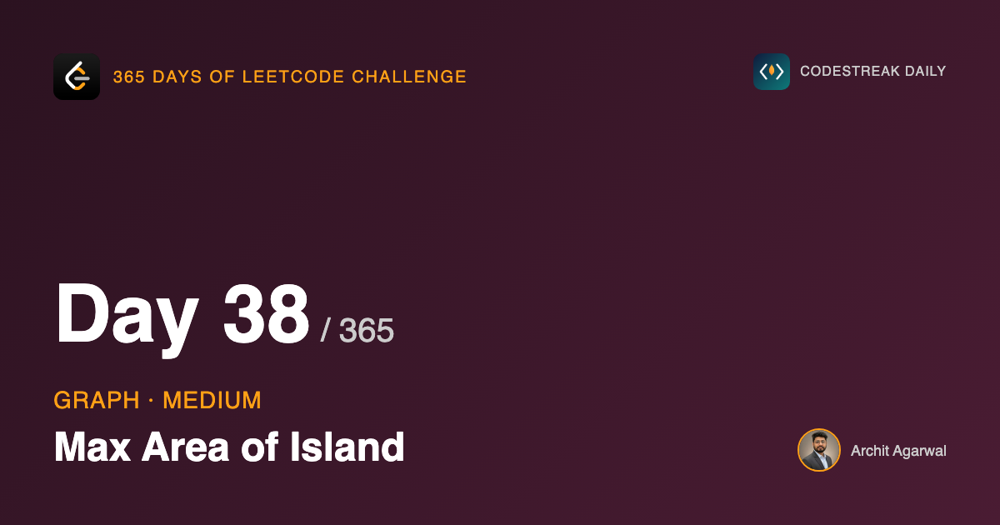

*365 Days of LeetCode Challenge — Day 38/365*

**[695. Max Area of Island](https://leetcode.com/problems/max-area-of-island/)** (Medium)

Same grid as yesterday, same definition of an island: cells holding `1`, connected horizontally or vertically. Instead of counting the islands, return the number of cells in the largest one.

## This really is yesterday's solution

Not "similar to". The scan is the same scan, the guard is the same guard, and the fill visits the same cells in the same order. Two things change: the fill returns an `int`, and the scan keeps a running maximum rather than a count.

I am labouring this because problem sets rarely make the relationship between two problems this explicit, and it is worth noticing when they do. Yesterday the flood fill was called purely for its side effect, to remove an island from the grid so the scan would not count it twice. The return value was discarded because there was not one.

Today the same traversal has to report something, and the something has a natural recursive shape:

> The area reachable from a cell is that cell, plus the area reachable from each of its four neighbours.

Which is this:

```go
func dfs(i, j int, grid *[][]int) int {
	if i < 0 || j < 0 || i >= len(*grid) || j >= len((*grid)[0]) || (*grid)[i][j] != 1 {
		return 0
	}
	(*grid)[i][j] = 0

	return 1 + dfs(i+1, j, grid) + dfs(i-1, j, grid) + dfs(i, j+1, grid) + dfs(i, j-1, grid)
}
```

The `1` is the current cell. The four calls are everything reachable from it.

## The guard earns its keep twice over

```go
return 0
```

Three different situations reach that line: the coordinate is off the grid, the cell is water, or the cell is land a fill has already consumed.

All three contribute nothing to an area, and all three are one statement. There is no `if` anywhere in this function distinguishing them, and there does not need to be, because the correct answer for all three is the same number.

That is why the sum can be written as a single expression with no special cases in it. A version that checked bounds before recursing would need four guarded call sites and would still have to decide what to add when a call was skipped.

## Watching it run


An isolated cell. All four neighbours are rejected by the guard, so the call evaluates to `1 + 0 + 0 + 0 + 0`.


The three-cell island's total is assembled as the recursion unwinds: the deepest call returns `1`, its caller adds its own `1`, and so on back up.


## The part that looks wrong

I want to spend some time here, because this is the step where people who understand day 37 perfectly well get stuck.

Read the sum again with a suspicious eye. Cell A calls its four neighbours. One of them is cell B. B calls *its* four neighbours, and one of those is A. So A is going to be counted again inside B's total, and B will be counted again inside A's, and the whole thing should spiral into nonsense.

It does not, and the reason is on the line above:

```go
(*grid)[i][j] = 0
```

The cell is sunk **before** the four calls are made. Not after, not as part of the return. Before.

So by the time B runs, A no longer reads as `1`. B's recursive call into A hits the guard, sees `0`, and returns `0`, contributing nothing. Every cell contributes its `1` on exactly one call: the first one to reach it, which is also the call that sank it.

Now put that next to yesterday. In day 37 this same assignment was what made the function terminate at all: without it, `dfs(A)` calls `dfs(B)` calls `dfs(A)` and the stack overflows.

One line. Yesterday it bought termination. Today it buys termination *and* arithmetic that is not double counted. The fix for "this never stops" and the fix for "this counts things twice" turn out to be the same fix, which is the kind of thing that makes a problem worth remembering rather than just solving.

## Counting without a set

An earlier version of this solution kept a `visited` map for each island and returned `len(visited)` as the area.

It produced correct answers. What it cost was a map allocated per island, to count something that the call stack was already in a position to report.

That is a small thing and it generalises into a larger one: when a traversal already visits exactly the set of things you want to measure, the measurement can usually come back up the recursion rather than being accumulated on the side. The `1 +` is doing what the map did, with no allocation and one fewer moving part.

## Sinking with `0` rather than a marker

Day 37 wrote `'2'` to keep consumed land distinguishable from water that was always water. This writes `0`, collapsing the distinction.

Nothing here needs it. The guard asks one question, whether the cell equals `1`, and both kinds of non-land answer it the same way.

## Complexity

- **Time: O(m x n).** The scan visits every cell once. Across all fills, each cell is entered at most once more, since a sunk cell is rejected at the guard.
- **Space: O(m x n)** in the worst case. As yesterday, that is the recursion stack rather than a data structure, and the worst case is a grid that is entirely one island.

## Builds on

- [Day 37: Number of Islands](https://github.com/architagr/leetcode_solutions/blob/main/medium_problems/101_200/number_of_islands/) — the same scan-and-sink flood fill; the only change is that the fill now reports how big it was

Full code and the step-by-step walkthrough:
[max_area_of_island](https://github.com/architagr/leetcode_solutions/blob/main/medium_problems/601_700/max_area_of_island/SOLUTION.md)

---

*Solution and code by Archit Agarwal. Write-up drafted with AI assistance from the code and problem statement.*
