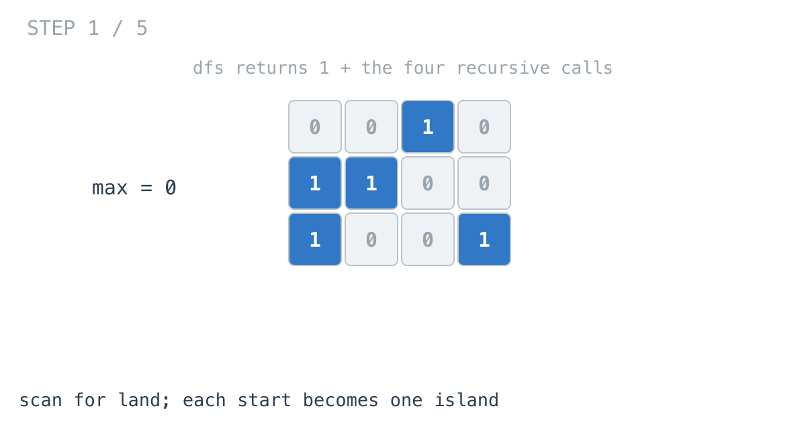
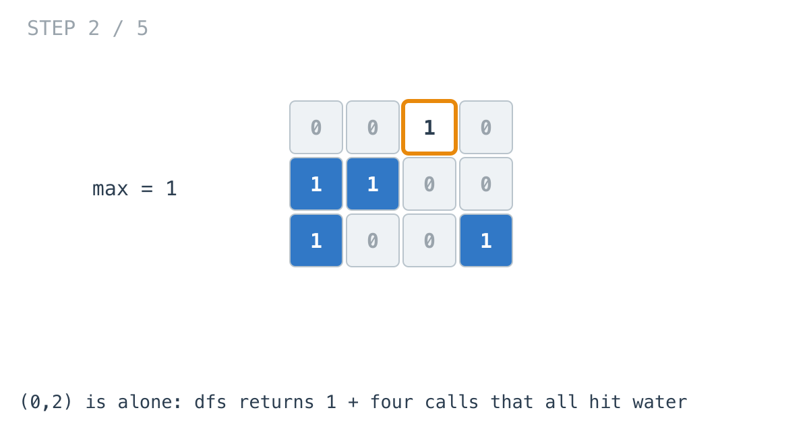
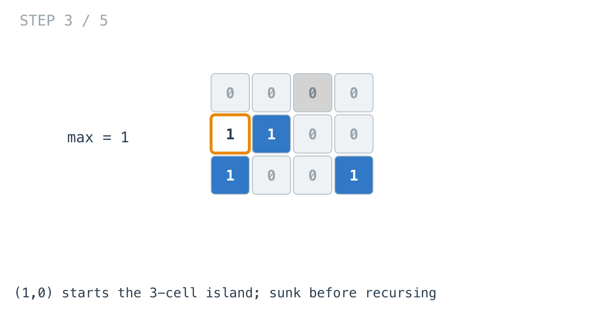
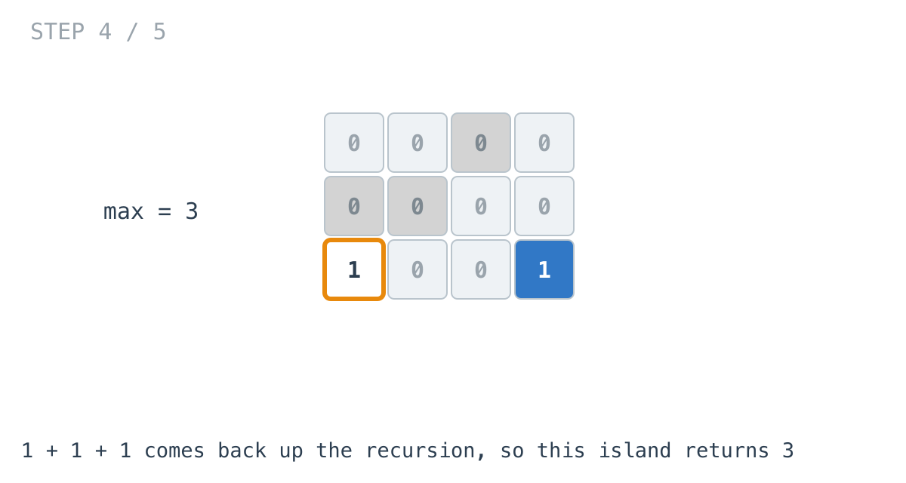
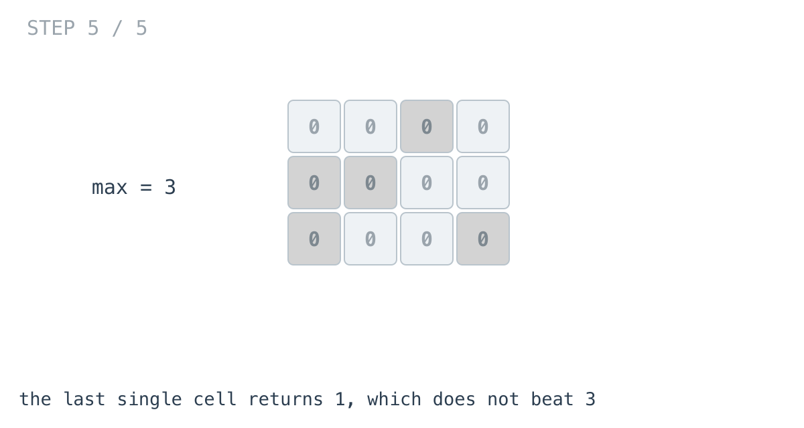

# Max Area of Island — solution walkthrough

From `main.go`:

```go
func maxAreaOfIsland(grid [][]int) int {
	max := 0

	for i := 0; i < len(grid); i++ {
		for j := 0; j < len(grid[0]); j++ {
			if grid[i][j] == 1 {
				if area := dfs(i, j, &grid); area > max {
					max = area
				}
			}
		}
	}
	return max
}

func dfs(i, j int, grid *[][]int) int {
	if i < 0 || j < 0 || i >= len(*grid) || j >= len((*grid)[0]) || (*grid)[i][j] != 1 {
		return 0
	}
	(*grid)[i][j] = 0

	return 1 + dfs(i+1, j, grid) + dfs(i-1, j, grid) + dfs(i, j+1, grid) + dfs(i, j-1, grid)
}
```

Put this next to day 37 and the diff is small: the fill returns an `int` instead of nothing, and the scan keeps a maximum instead of a count.

## The scan



Same structure as yesterday. Find land, fill from it, and the fill consumes the island so the scan can never start on it twice.



A single isolated cell: the guard rejects all four neighbours, so the call returns `1 + 0 + 0 + 0 + 0`.

## The recursive sum

```go
return 1 + dfs(i+1, j, grid) + dfs(i-1, j, grid) + dfs(i, j+1, grid) + dfs(i, j-1, grid)
```

The area reachable from a cell is that cell plus everything reachable from its neighbours. The `1` is this cell; the four calls are the rest.

The guard returning `0` is what makes this work without special cases. Out of bounds contributes nothing, water contributes nothing, already-sunk land contributes nothing, and all three are the same `return 0`.





The three-cell island returns `1 + 1 + 1`, assembled as the recursion unwinds.



## Why cells are not double counted

The sum looks wrong the first time you read it. Each of four neighbours recurses into its own four neighbours, and every one of those includes the cell you just came from. It reads like it should count cells many times over.

The line above the sum is what prevents it:

```go
(*grid)[i][j] = 0
```

The cell is sunk **before** the four calls run. So by the time any neighbour tries to recurse back into it, the guard sees `0`, not `1`, and returns `0`.

Every cell contributes its `1` exactly once: on the one call that first reached it, before it was sunk.

This is the same statement that made day 37 terminate rather than recurse forever. Here it is doing two jobs at once, and the second one is arithmetic.

## Sinking with `0` rather than a marker value

Day 37 wrote `'2'` to keep consumed land distinguishable from original water. This writes `0`, so the two become indistinguishable.

Nothing here needs to tell them apart. The guard only asks whether the cell equals `1`.

## Counting without a set

An earlier version of this solution built a `visited` map for each island and used `len(visited)` as the area. It gave the same answers.

What it cost was a map allocation per island, to count something the recursion could return. When a traversal already visits exactly the cells you want to count, the count can come back up the call stack for free, which is what the `1 +` does.

## Complexity

- **Time: O(m x n).** Every cell is scanned once and entered by a fill at most once more.
- **Space: O(m x n)** worst case, the recursion stack on an all-land grid.

## Test

`main_test.go` covers the empty grid returning `0`, and the large worked example from the problem statement whose biggest island is 6.
