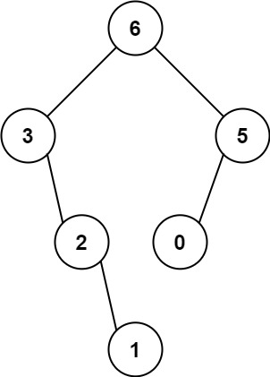
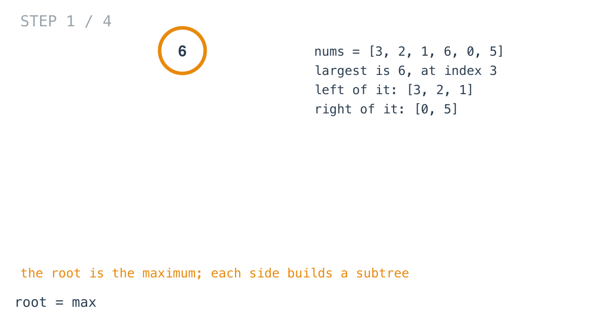
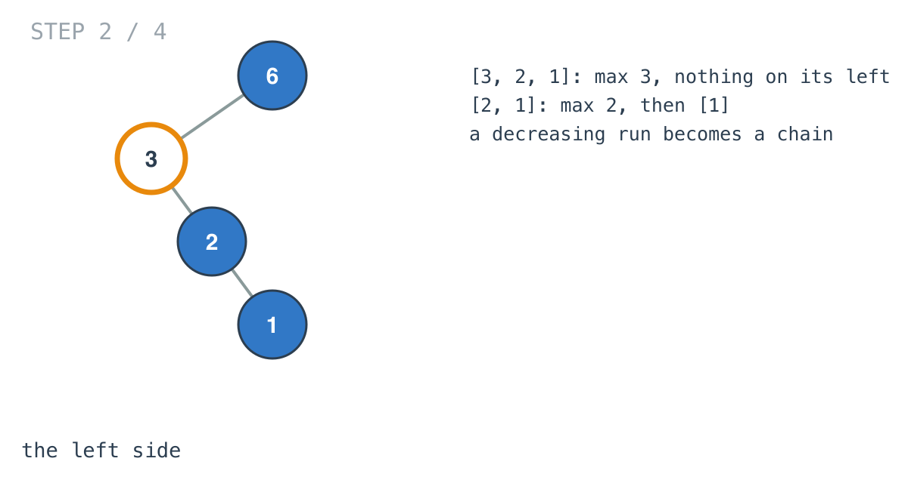
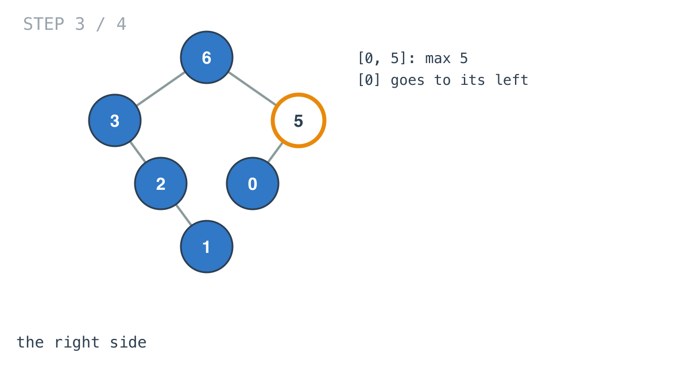
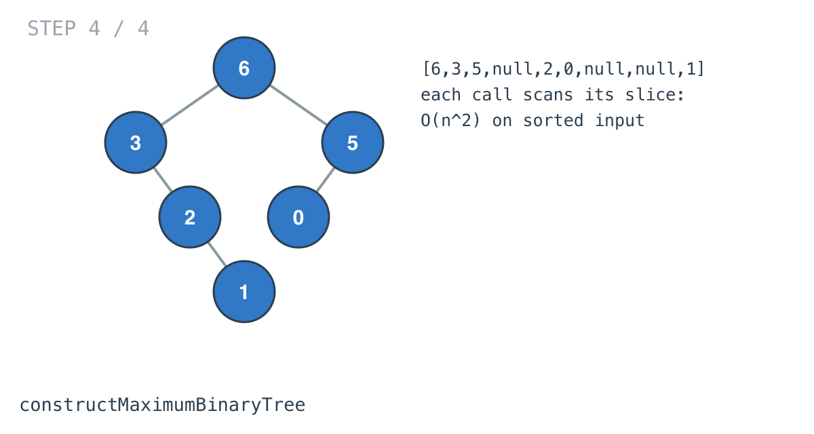

## Solution walkthrough

`constructMaximumBinaryTree(nums []int) *TreeNode` in `main.go` finds the maximum, makes it
the root, and recurses on the two sides.



We'll trace Example 1: `[3,2,1,6,0,5]`, expected `[6,3,5,null,2,0,null,null,1]`.

1. **The maximum is the root.** `findHigest` scans the slice and returns 6 at index 3.

   ```go
   return &TreeNode{
       Val:   higestVal,
       Left:  constructMaximumBinaryTree(nums[:higestIndex]),
       Right: constructMaximumBinaryTree(nums[higestIndex+1:]),
   }
   ```

   Left `[3,2,1]`, right `[0,5]`.

   

2. **The left side.** In `[3,2,1]` the maximum is 3, first, so nothing goes to its left and
   `[2,1]` goes right; that repeats down to 1. A decreasing run becomes a chain of right
   children.

   

3. **The right side.** In `[0,5]` the maximum is 5, and `[0]` becomes its left child.

   

4. **Done.** `[6,3,5,null,2,0,null,null,1]`. `findHigest` starts its best at -1, which is
   below every allowed value (they're 0 or more), so the first element always replaces it.

   

**Complexity:** O(n²) worst case, O(h) recursion.
