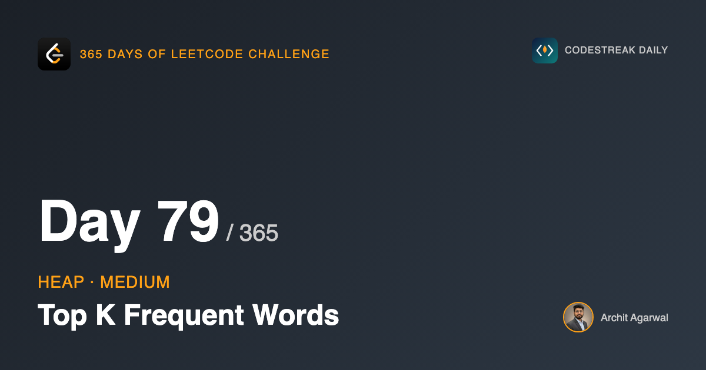
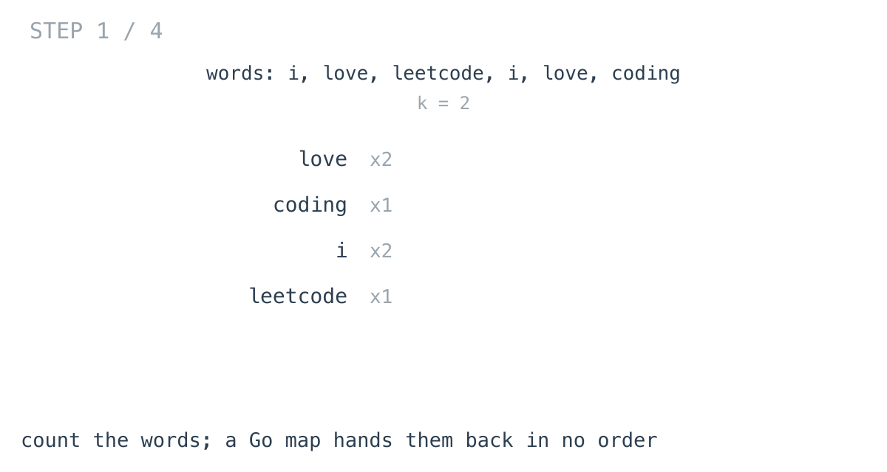
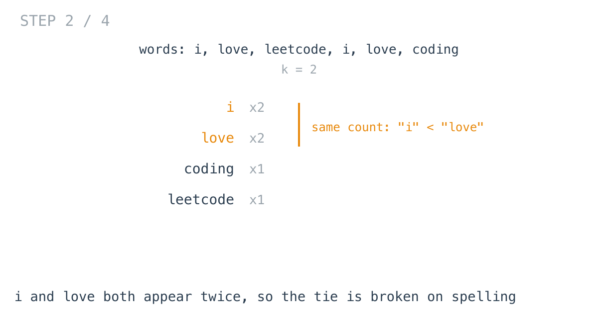
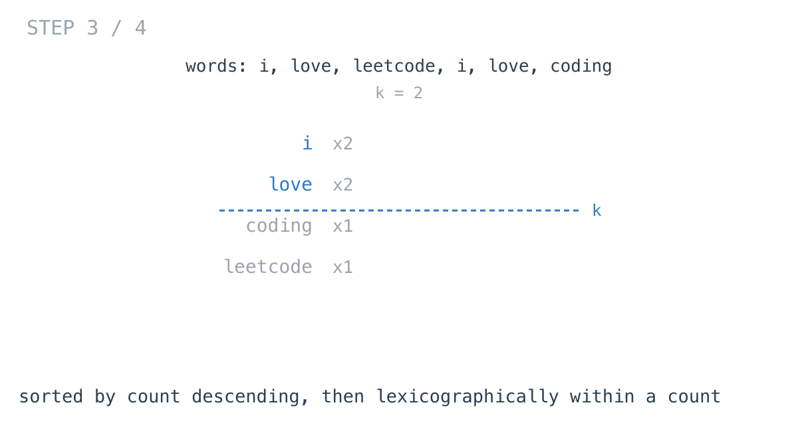
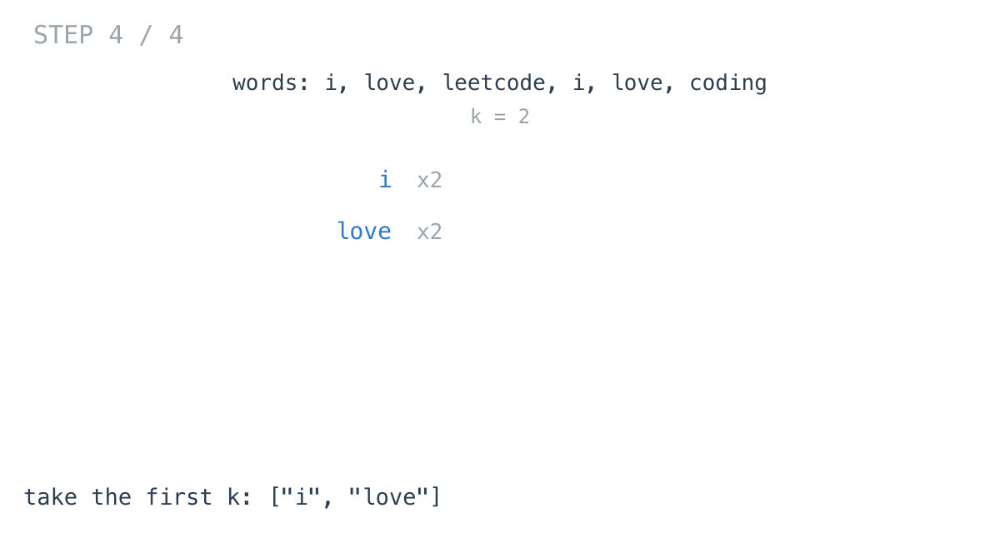

## 365 Days of LeetCode Challenge — Day 79/365

**[692. Top K Frequent Words](https://leetcode.com/problems/top-k-frequent-words/)** (Medium)

Return the `k` most frequent words, ordered by frequency descending, with ties broken lexicographically.

## One sentence separates this from yesterday

Day 78: *return the k most frequent elements, in any order.*

Today: *return them sorted by frequency from highest to lowest, and sort words with the same frequency by lexicographical order.*

That addition is the whole difference between the problems — and it is enough to change which tool is right.

## The comparator is the solution

```go
sort.Slice(wordCount, func(i, j int) bool {
	if wordCount[i].count == wordCount[j].count {
		return wordCount[i].word < wordCount[j].word
	}
	return wordCount[i].count > wordCount[j].count
})
```

Read it against the problem statement. "Sorted by frequency from highest to lowest" is `count > count`. "Ties by lexicographical order" is `word < word`.

The code says what the requirement says.





`i` and `love` both appear twice, so the tie-break decides it.





## Why not yesterday's heap

It still works. It gives the right set in ascending frequency, so you reverse it, and you put the tie-break in the comparator.

That comparator is where it turns unpleasant. A heap evicts its **root**, which must therefore be the *worst* entry. For counts, worst means least frequent. For a tie, worst means the word that should **lose** — the lexicographically later one.

So the two fields point in opposite directions:

```go
if a.count == b.count {
	return a.word > b.word   // inverted for the tie-break
}
return a.count < b.count     // not inverted
```

That is correct. It is also exactly the kind of line that sits wrong in a codebase for months, because nothing about it looks unusual and it only misbehaves on ties.

## The honest comparison

Sorting is O(d log d); the heap is O(d log k). On paper the heap wins when k is small and d is large.

Here `words.length` is capped at 500, so d is at most 500 and the difference is unmeasurable.

What *is* measurable: one comparator reads like the specification, and the other has an inversion you have to re-derive every time you read it.

Days 76 to 78 built the case for the heap. **This is the day to notice the technique is not the goal.**

## Two things that could be tightened

`for i := 0; i < k; i++` would index past the end if `k` exceeded the distinct word count. The constraints forbid it, so it cannot happen — but `&& i < len(wordCount)` costs nothing and removes the dependence.

And `sort.Slice` is not stable, which is fine here because the comparator is a total order with no pair left to arbitrary choice. An unstable sort with an *incomplete* comparator is a genuine source of irreproducible output.

## Complexity

- **Time: O(n + d log d)** — counting, then sorting the distinct words.
- **Space: O(d)**.

## Builds on

- [Day 78: Top K Frequent Elements](https://github.com/architagr/leetcode_solutions/blob/main/medium_problems/301_400/top_k_frequent_elements/) — the same counting problem with an ordering requirement added, which is enough to change the tool

Full code and the step-by-step walkthrough:
[top_k_frequent_words](https://github.com/architagr/leetcode_solutions/blob/main/medium_problems/601_700/top_k_frequent_words/SOLUTION.md)

#DSA #LeetCode #Golang #Sorting #Heap #CodingInterview #Algorithms

---

*Solution and code by Archit Agarwal. Write-up drafted with AI assistance from the code and problem statement.*
