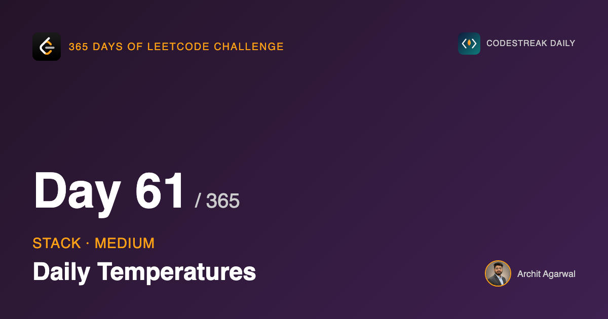
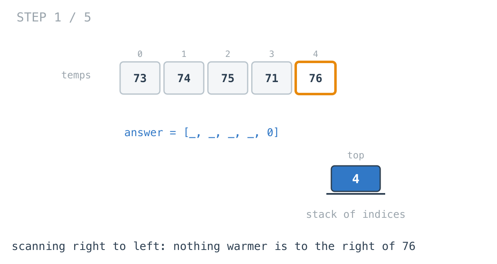
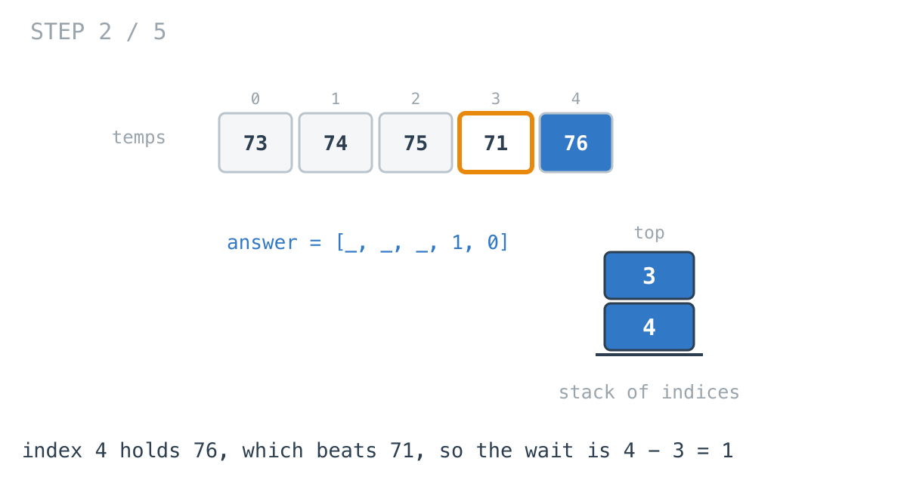
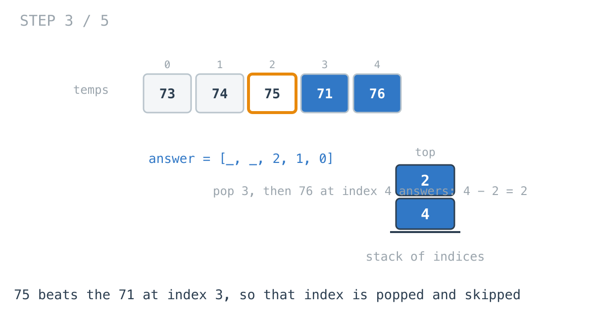
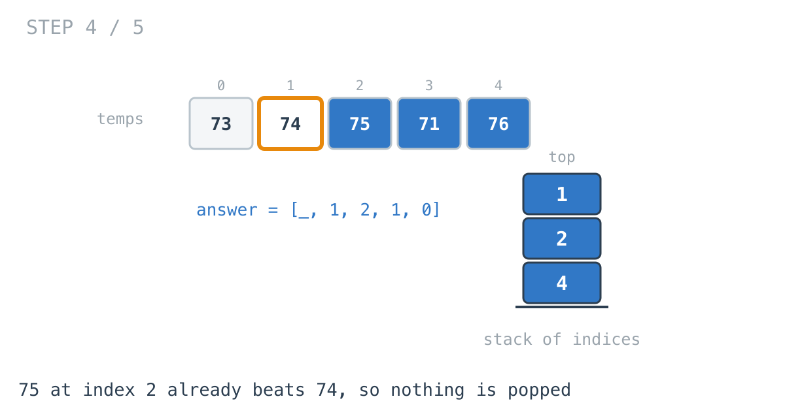
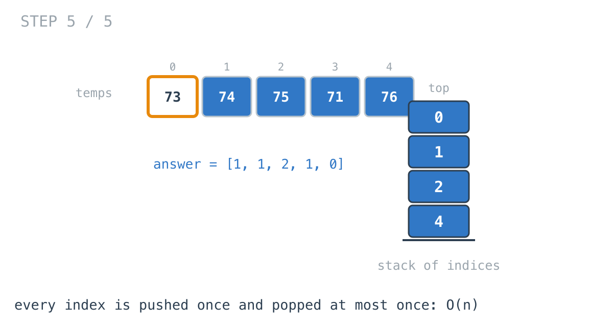

## 365 Days of LeetCode Challenge — Day 61/365

**[739. Daily Temperatures](https://leetcode.com/problems/daily-temperatures/)** (Medium)

For each day, how many days until a warmer one? Zero if there is no warmer day.

## Yesterday's stack, two changes

Day 59 asked *which* value comes next and is larger. This asks *how far away* it is, and everything follows from that.

**The stack holds indices, not values.** A distance needs positions. `i` goes on the stack; the answer is `stack.Top() - i`.

**Values repeat.** Day 59 stored answers in a map keyed by value, and I flagged then that it was only safe because uniqueness was guaranteed. Temperatures repeat constantly. Indices are unique by construction, so the problem disappears rather than needing a workaround.

## Scanning backwards

Day 59 went left to right, asking "which earlier values does this one answer?", writing results into a map as it resolved them.

This goes right to left, asking "what is the first thing to my right that beats me?" The answer for `i` is known while standing on `i`, so it goes straight into `results[i]`. No map, no deferred bookkeeping.

```go
for i := len(temperatures) - 1; i >= 0; i-- {
	for !stack.IsEmpty() && temperatures[stack.Top()] <= temperatures[i] {
		stack.Pop()
	}
	if stack.IsEmpty() {
		results[i] = 0
	} else {
		results[i] = stack.Top() - i
	}
	stack.Push(i)
}
```







The 71 at index 3 is cooler than 75, so it can never be the answer for index 2 or anything left of it — popped.





## The invariant

The stack holds indices of days to the right that are still candidates for being somebody's answer.

A day stops being a candidate the moment a warmer-or-equal day appears to its left, because everyone further left would reach that nearer day first.

After the pops, the stack reads increasing in temperature from top to bottom, and its top is the nearest warmer day.

## The one character that matters

```go
temperatures[stack.Top()] <= temperatures[i]
```

Equal temperatures are **not warmer**. A day holding the same temperature can never be anyone's answer, so it has to be popped.

Write `<` instead and equal days stay on the stack. The first one found then reports a warmer day that is merely an equal one. On `[70, 70]` the correct answer is `[0, 0]`; `<` gives `[1, 0]`.

This is precisely the duplicate hazard day 59 sidestepped by having unique values. Here duplicates are guaranteed, and one character is where they are handled.

## Why the nested loop is still linear

Each index is pushed exactly once and popped at most once. The inner loop can run several times in one iteration, but every one of those iterations permanently removes an index.

Same argument as yesterday, and worth repeating: a nested loop looks quadratic until you count what it *consumes* rather than what it visits.

## Complexity

- **Time: O(n)**. Each index pushed once, popped at most once.
- **Space: O(n)**, worst case a strictly decreasing sequence.

## Builds on

- [Day 59: Next Greater Element I](https://github.com/architagr/leetcode_solutions/blob/main/easy_problems/401_500/next_greater_element_i/) — the same monotonic stack, holding indices here because the answer is a distance and values can repeat

Full code and the step-by-step walkthrough:
[daily_temperatures](https://github.com/architagr/leetcode_solutions/blob/main/medium_problems/701_800/daily_temperatures/SOLUTION.md)

#DSA #LeetCode #Golang #Stack #MonotonicStack #CodingInterview #Algorithms

---

*Solution and code by Archit Agarwal. Write-up drafted with AI assistance from the code and problem statement.*
