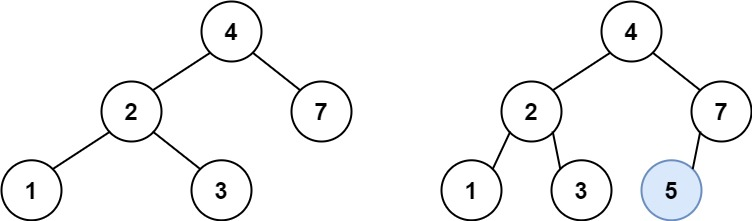
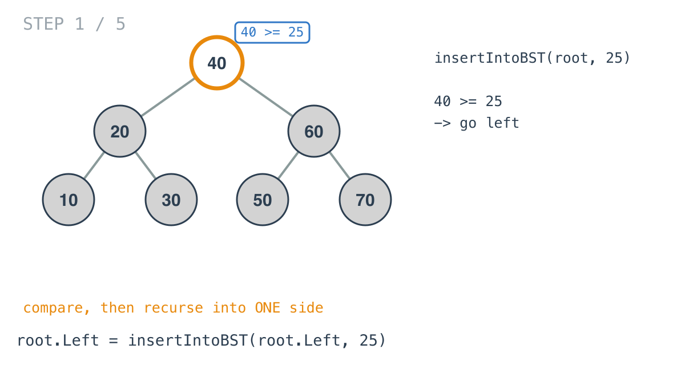
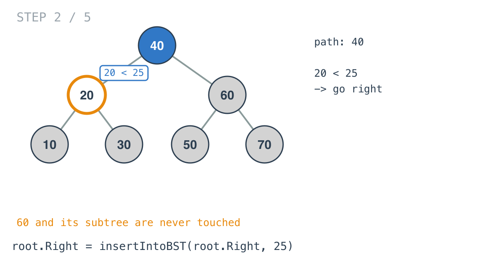
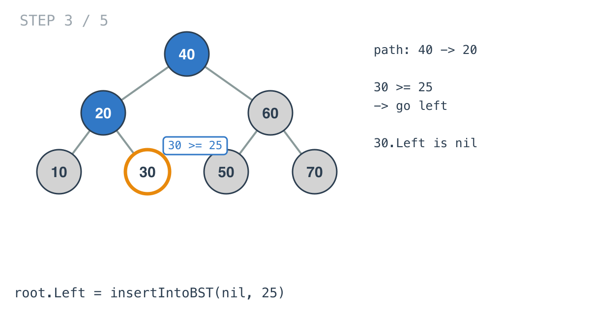
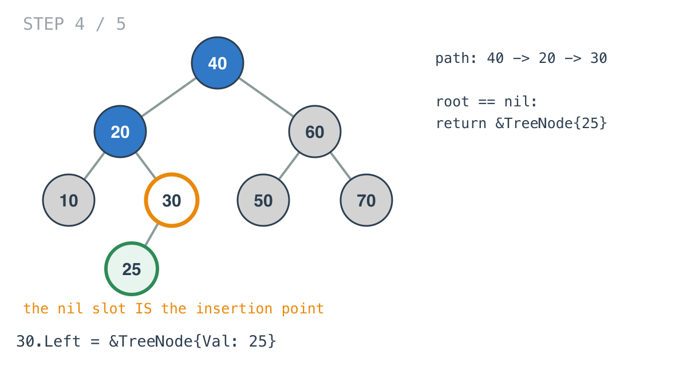
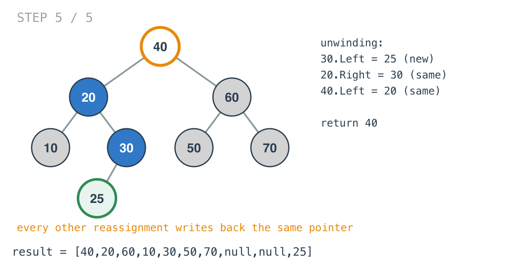

## Solution walkthrough

The whole implementation is `insertIntoBST(root *TreeNode, val int) *TreeNode` in
`main.go`, eleven lines of recursion.



We'll trace Example 2: insert `25` into `[40,20,60,10,30,50,70]`. Expected output
`[40,20,60,10,30,50,70,null,null,25]`, with `25` as the left child of `30`.

1. **Compare, then recurse into one side.** At the root, `root.Val >= val` is `40 >= 25`,
   so the call goes left:

   ```go
   root.Left = insertIntoBST(root.Left, val)
   ```

   The assignment matters as much as the call. Whatever the left subtree looks like after
   the insert, this node stores it back.

   

2. **The other side is never touched.** At `20`, `20 >= 25` is false, so the `else`
   branch runs and the call goes right. Node `60` and everything under it were ruled out
   by the first comparison and are never visited, which is where the O(h) comes from.

   

3. **Down to the empty slot.** At `30`, `30 >= 25` sends it left again, and `30.Left` is
   nil. The next call receives `root == nil`.

   

4. **The nil case builds the node.**

   ```go
   if root == nil {
       return &TreeNode{Val: val}
   }
   ```

   This is the base case and the insertion at once. The new node comes back to the call at
   `30`, which stores it with `root.Left = ...`. That assignment is the one that changes
   the tree.

   It also covers the empty tree: `insertIntoBST(nil, val)` returns the new node, and that
   node is the answer.

   

5. **Unwinding writes back the same pointers.** Each frame returns its own `root`. So
   `20.Right = 30` and `40.Left = 20` both store the pointer they already held, and the
   top call returns `40`. Those writes cost nothing and save the code from needing to know
   which level the insertion happened on.

   

6. **`>=` instead of `>`.** The comparison is `root.Val >= val`, which would send an equal
   value left. The problem guarantees `val` isn't already in the tree, so equality never
   happens here, and the choice only matters if you reuse this function on a tree that
   allows duplicates.

**Complexity:** O(h) time, one node per level along a single path. O(h) space for the
recursion stack. On a balanced tree h is log n; on a tree built by inserting sorted values,
it's n.
