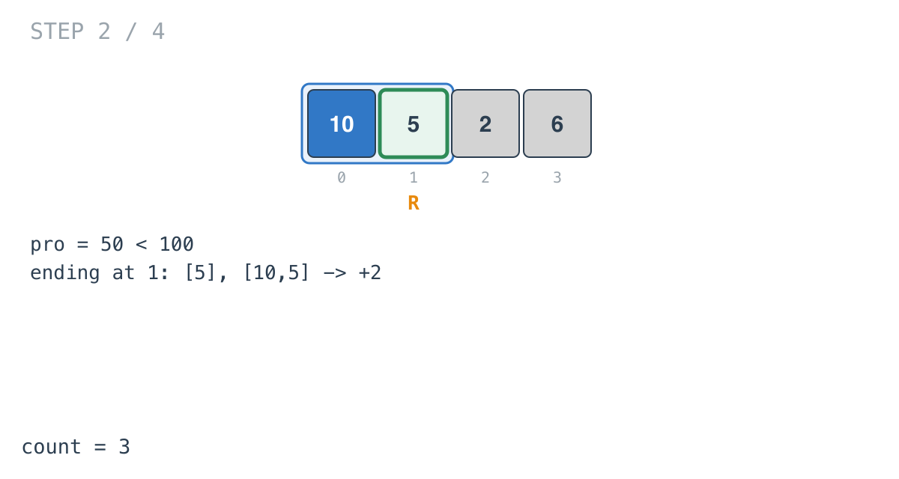
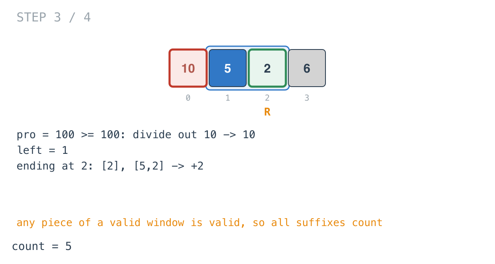
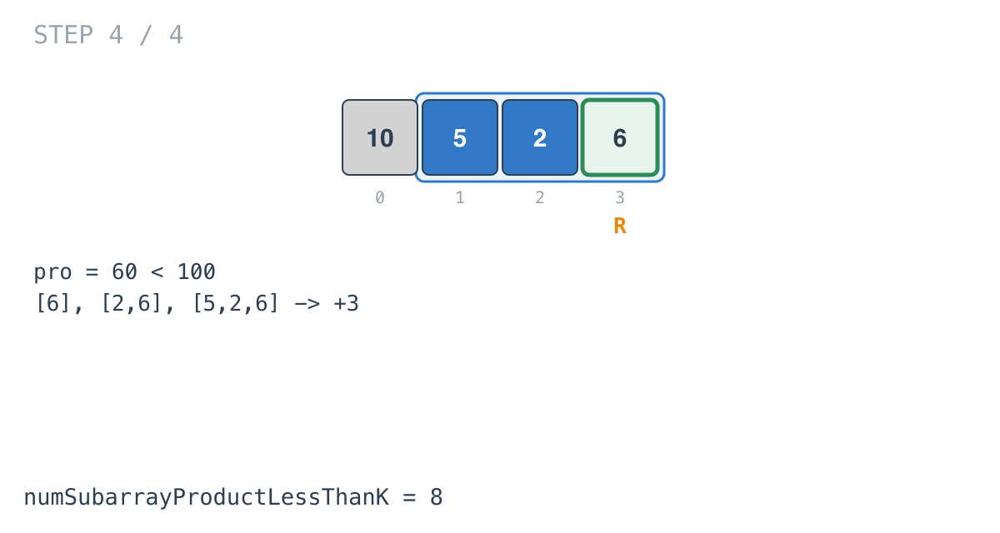

## Solution walkthrough

`numSubarrayProductLessThanK(nums []int, k int) int` in `main.go` keeps a window whose
product is below `k` and adds its length at every step.

We'll trace Example 1: `nums = [10,5,2,6]`, `k = 100`, expected `8`.

1. **Multiply in, and count by end position.** `pro *= nums[right]`, then after any
   shrinking, `count += right - left + 1`. At `right = 0` the product is 10: one subarray,
   `[10]`.

   ![Step 1: [10]](images/walkthrough-1.png)

2. **Still under.** `10 × 5 = 50`. The subarrays ending at 1 are `[5]` and `[10,5]`: +2,
   total 3.

   

3. **At or over k: divide out from the left.**

   ```go
   for left <= right && pro >= ka {
       pro /= int64(nums[left])
       left++
   }
   ```

   `50 × 2 = 100` isn't strictly less than 100. Dividing out 10 leaves 10, and `left` is 1.
   The window `[5,2]` is valid, and both subarrays ending at 2, `[2]` and `[5,2]`, count:
   total 5.

   

4. **The last element.** `10 × 6 = 60`. Three subarrays end at 3: `[6]`, `[2,6]`,
   `[5,2,6]`. Total 8.

   

With `k <= 1`, every product fails, the loop pushes `left` past `right`, and
`right - left + 1` is 0 each time, so the answer is 0 without a special case.

**Complexity:** O(n) time, O(1) space.
