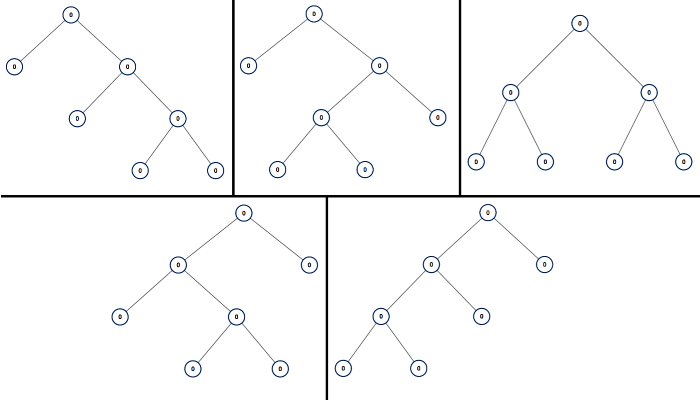

# All Possible Full Binary Trees

Difficulty: Medium

[LeetCode #894](https://leetcode.com/problems/all-possible-full-binary-trees/)

Given an integer `n`, return *a list of all possible **full binary trees** with* `n` *nodes*.
Each node of each tree in the answer must have `Node.val == 0`.

Each element of the answer is the root node of one possible tree. You may return the final list
of trees in **any order**.

A **full binary tree** is a binary tree where each node has exactly `0` or `2` children.

## Example 1



```
Input: n = 7
Output: [[0,0,0,null,null,0,0,null,null,0,0],[0,0,0,null,null,0,0,0,0],[0,0,0,0,0,0,0],[0,0,0,0,0,null,null,null,null,0,0],[0,0,0,0,0,null,null,0,0]]
```

## Example 2

```
Input: n = 3
Output: [[0,0,0]]
```

## Constraints

- `1 <= n <= 20`
