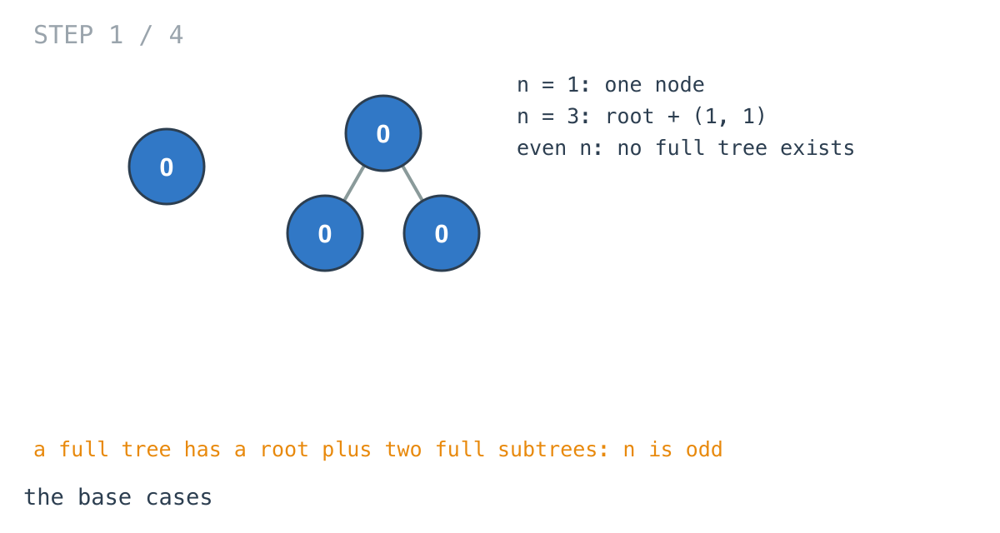
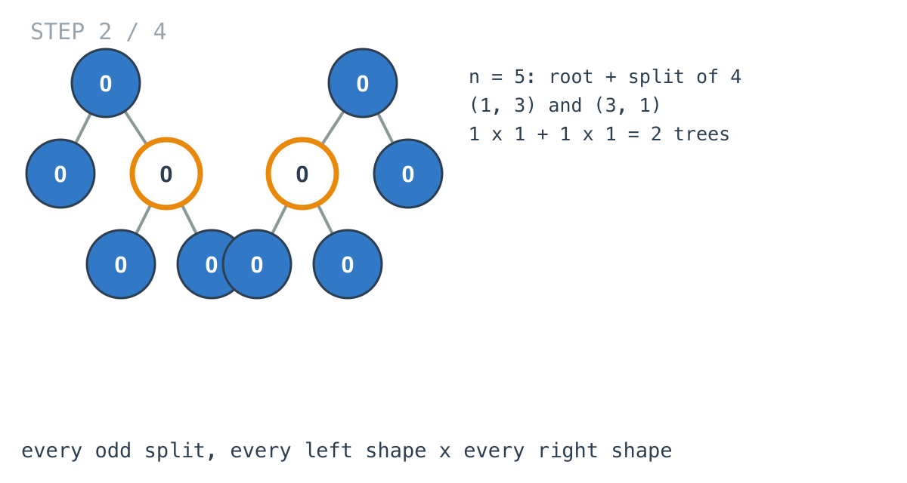
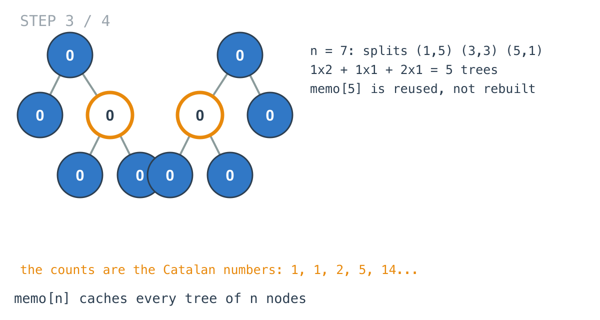
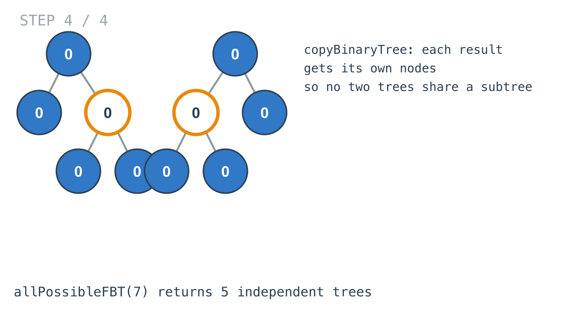

## Solution walkthrough

`allPossibleFBT(n int) []*TreeNode` in `main.go` resets the memo and calls `build(n)`, which
returns every full binary tree with exactly `n` nodes.


We'll build up to Example 1, `n = 7`, which has 5 trees.

1. **Base cases.** `build` returns nil for even `n` (no full tree has an even number of nodes)
   and a single node for `n == 1`. `n = 3` pairs the only 1-node tree with itself: one tree.

   

2. **Every odd split, every pairing.** For `n = 5`, the root takes one node and the remaining 4
   split as `(1, 3)` or `(3, 1)`:

   ```go
   for left := 1; left <= n-2; left += 2 {
       right := n - 1 - left
       for _, l := range build(left) {
           for _, r := range build(right) {
               res = append(res, &TreeNode{Val: 0, Left: copyBinaryTree(l), Right: copyBinaryTree(r)})
           }
       }
   }
   ```

   Each split gives one tree: 2 in total.

   

3. **The memo pays off.** For `n = 7` the splits are `(1,5)`, `(3,3)` and `(5,1)`: 2 + 1 + 2 = 5
   trees. `build(5)` is needed twice and computed once; after the first call it comes from
   `memo[5]`.

   

4. **Independent trees.** Each new tree gets copies of its subtrees, so no two trees in the answer
   share nodes.

   

**Complexity:** proportional to the total size of the output.
