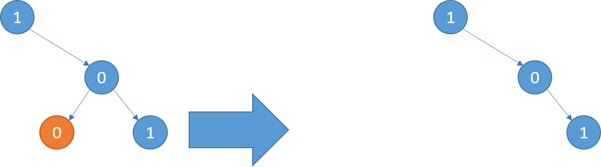
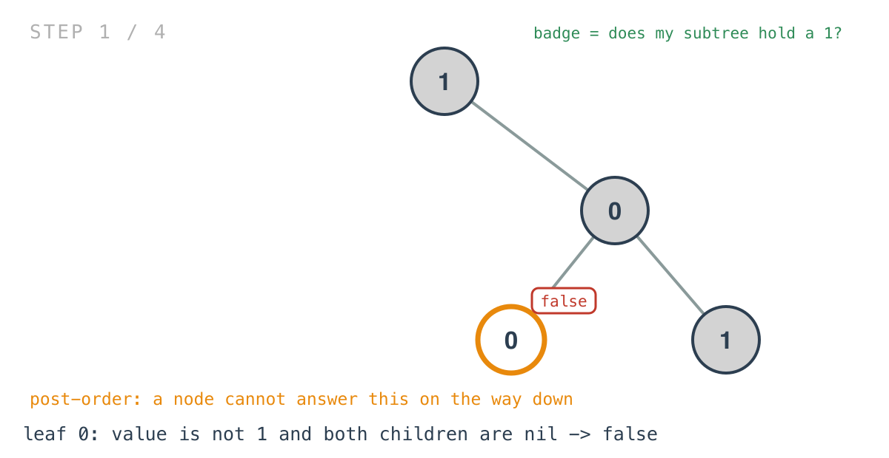
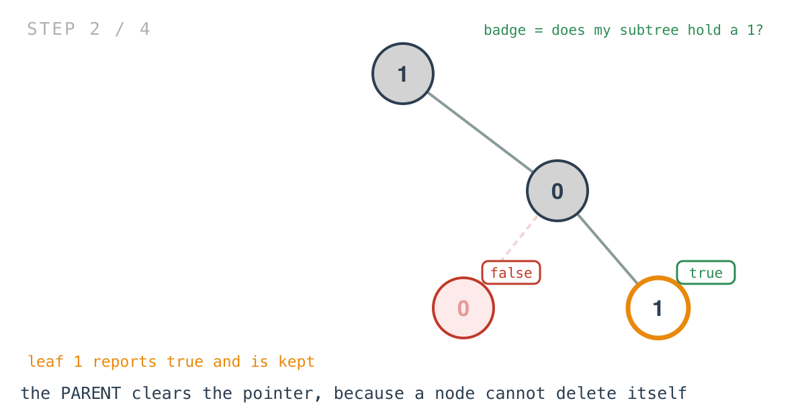
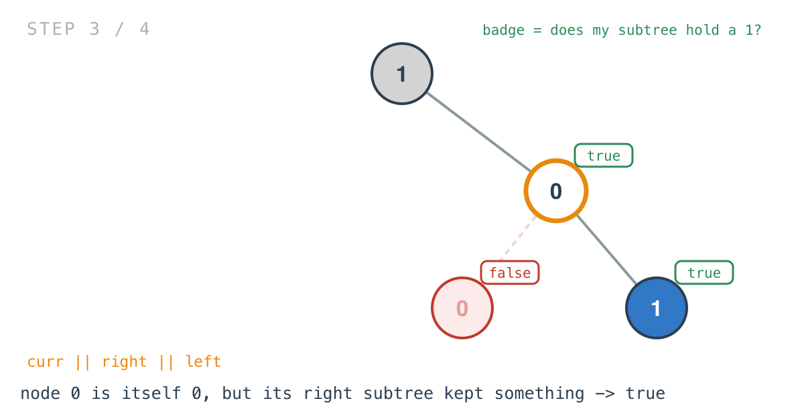
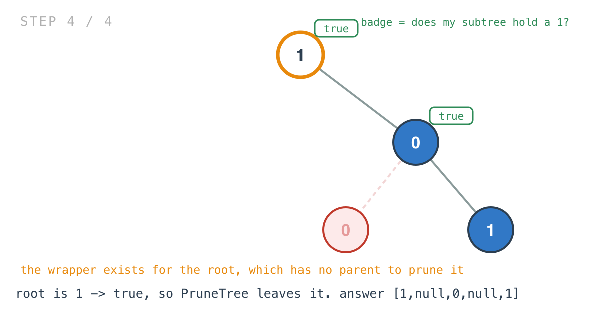

## 365 Days of LeetCode Challenge — Day 71/365

# Binary Tree Pruning

🔗 https://leetcode.com/problems/binary-tree-pruning/ · Difficulty: Medium

### The problem

Return the same tree with every subtree not containing a `1` removed.



### The intuition

A node survives if its own subtree contains a `1` anywhere. Written as a recursion, that's
almost the definition read aloud: this node keeps its place if it is a `1`, or if either of
its subtrees keeps anything.

The direction matters. A node cannot answer that question on the way down — it doesn't yet
know what's beneath it. So this is post-order: both children report first, and the node
combines their answers with its own value.

The part that's easy to get wrong is who does the deleting. A node can't remove itself — it
has no reference to its own parent, and nulling a local variable changes nothing the caller
can see. So the pruning is done by the parent, immediately after each recursive call
returns. The child reports "nothing worth keeping down here", and the parent is the one
holding the pointer that has to be cleared.

Which leaves the root, because the root has no parent. That's why `PruneTree` exists as a
wrapper at all: it calls `parse`, and if the whole tree reports back false, it sets `root`
to nil itself. Without that, a tree of all zeroes would come back intact instead of empty.

### Builds on

- [Day 9: Binary Tree Postorder Traversal](https://github.com/architagr/leetcode_solutions/blob/main/easy_problems/101_200/binary_tree_postorder_traversal/) — the children-before-parent order that makes a bottom-up answer possible
- [Day 69: Evaluate Boolean Binary Tree](https://github.com/architagr/leetcode_solutions/blob/main/easy_problems/2301_2400/evaluate_boolean_binary_tree/) — the same shape, where each node returned a boolean built from its children's booleans

### The solution

```go
func PruneTree(root *TreeNode) *TreeNode {
	temp := root
	curr := parse(temp)
	if !curr {
		root = nil
	}
	return root
}

func parse(node *TreeNode) bool {
	if node == nil {
		return false
	}
	curr := node.Val == 1
	right := parse(node.Right)
	if !right {
		node.Right = nil
	}
	left := parse(node.Left)
	if !left {
		node.Left = nil
	}
	return curr || right || left
}
```

Tracing `[1,null,0,0,1]`: root `1` with no left child and a right child `0`, whose children
are `0` and `1`. Expected output `[1,null,0,null,1]`.





Node `0` is not a `1`, but its right subtree kept the leaf `1`, so it survives — which is
the case that shows why "prune every 0" would be the wrong rule.





The nil base case returning `false` does quiet work: an absent subtree contains no `1`, so
it contributes nothing to the `||`, and the parent's `node.Right = nil` becomes a harmless
no-op on a pointer that was already nil.

`parse` recurses right before left, and here that's arbitrary — each subtree's answer is
independent of the other's.

One note on the shape. This returns a boolean and mutates the tree as a side effect. The
more common formulation returns `*TreeNode` and has the caller reassign — `root.Left =
prune(root.Left)` — which is what Day 56 used for deletion. Both work, and the reassigning
version needs no wrapper, because returning nil for the root handles the whole-tree case
naturally.

O(n) time, every node visited once. Space is O(h) for the recursion stack.

Full code and the step-by-step walkthrough:
[binary_tree_pruning](https://github.com/architagr/leetcode_solutions/blob/main/medium_problems/801_900/binary_tree_pruning/SOLUTION.md)

#DSA #LeetCode #100DaysOfCode #CodingInterview #BinaryTree #Recursion #Golang

---

*Solution and code by Archit Agarwal. Write-up drafted with AI assistance from the code and problem statement.*
