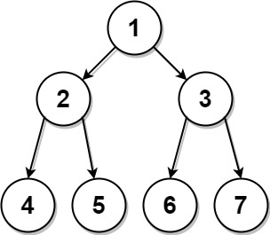
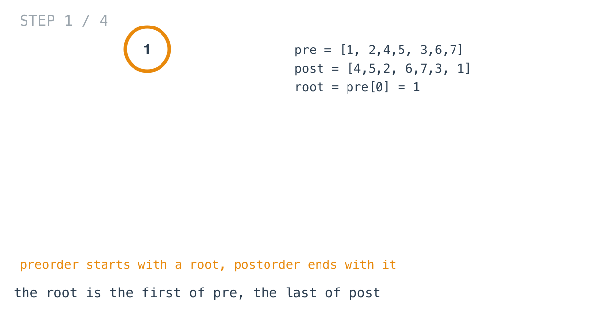
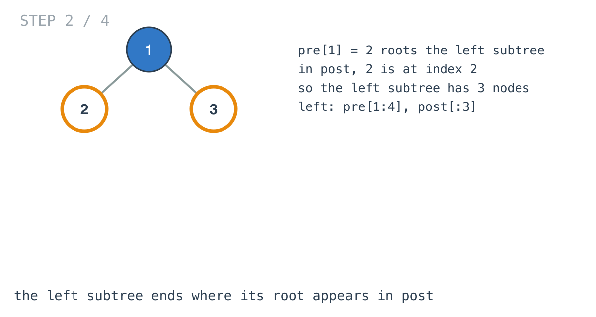
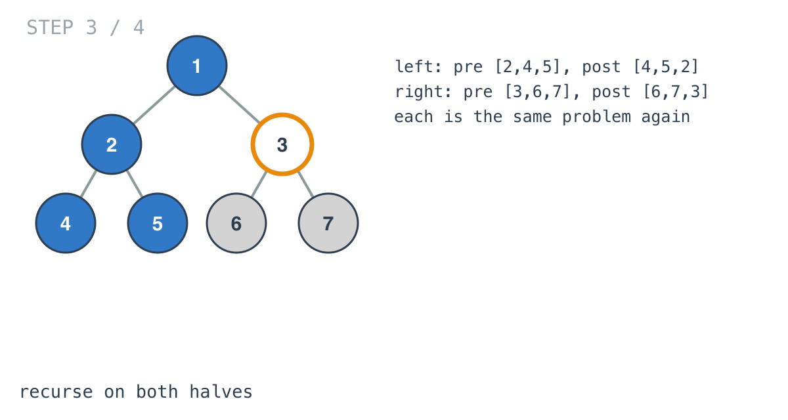
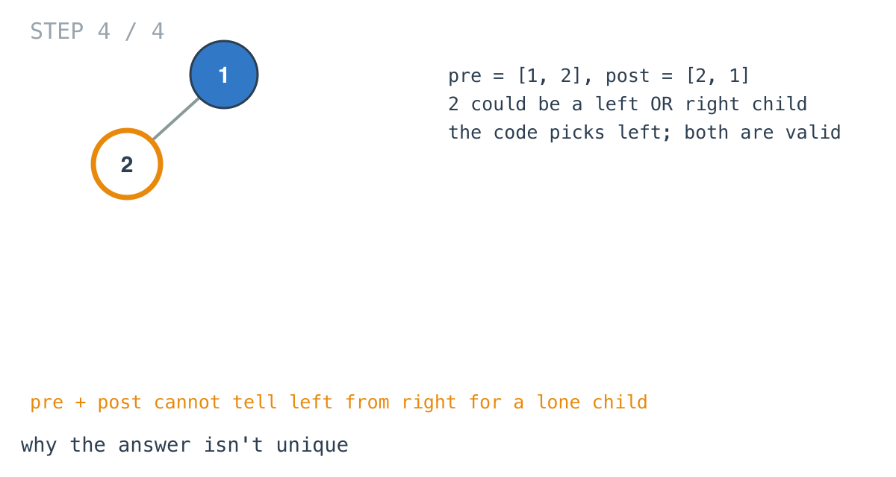

## Solution walkthrough

`constructFromPrePost(preorder, postorder []int) *TreeNode` in `main.go` takes the root from
`preorder[0]`, finds the left subtree's size from where `preorder[1]` sits in postorder, and
recurses on matching pieces of both lists.



We'll trace Example 1: `preorder = [1,2,4,5,3,6,7]`, `postorder = [4,5,2,6,7,3,1]`.

1. **The root.** `preorder[0] = 1`. It's also the last value in postorder. A single-element
   list returns just the root.

   

2. **Find the left subtree's root in postorder.** `preorder[1] = 2` is the root of the left
   subtree, and postorder writes a subtree's root last. The scan finds 2 at index `i = 2`, so
   the left subtree has `i + 1 = 3` nodes.

   ```go
   root.Left = constructFromPrePost(preorder[1:i+2], postorder[:i+1])
   root.Right = constructFromPrePost(preorder[i+2:], postorder[i+1:len(postorder)-1])
   ```

   

3. **Recurse on both pairs.** Left: `[2,4,5]` / `[4,5,2]`. Right: `[3,6,7]` / `[6,7,3]` (the
   root at the end of postorder is dropped). Each is solved the same way, giving
   `[1,2,3,4,5,6,7]`.

   

4. **Why the answer can vary.** For `[1,2]` / `[2,1]`, node 2 could be a left or a right
   child; both trees have those traversals. The code always makes it a left child, which the
   problem accepts.

   

**Complexity:** O(n²) worst case, O(h) recursion.
