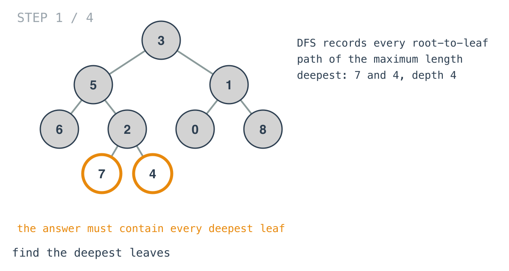
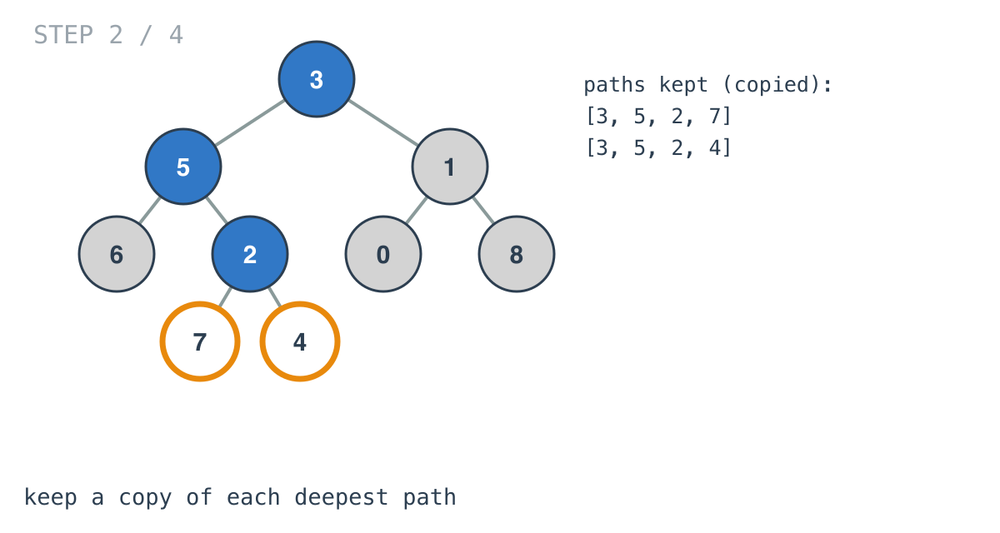
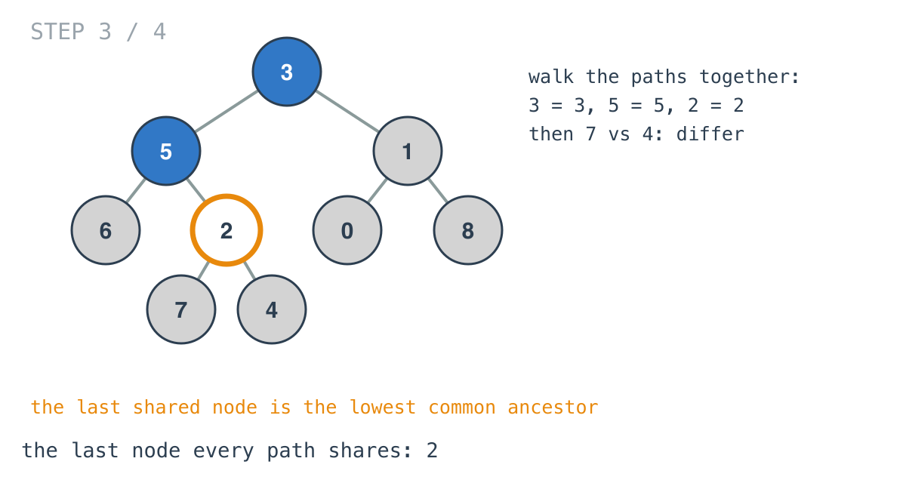
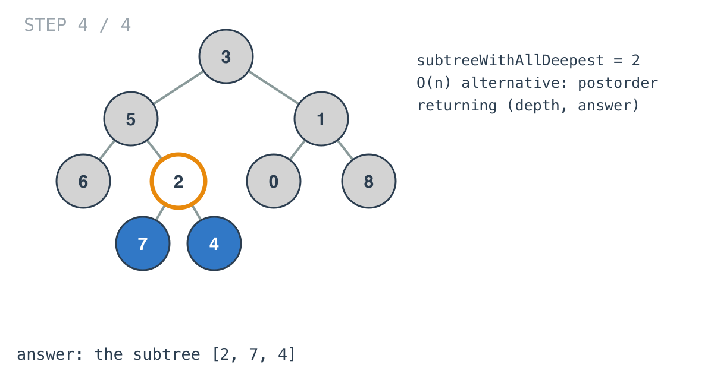

## Solution walkthrough

`subtreeWithAllDeepest(root *TreeNode) *TreeNode` in `main.go` saves every deepest
root-to-leaf path with `dfs`, then returns the last node those paths share.

We'll trace Example 1: `[3,5,1,6,2,0,8,null,null,7,4]`, expected the node 2.

1. **Find the deepest leaves.** `dfs` appends each node to `path`. At a leaf, `maxDepth` is
   raised if needed, and if the path is exactly that long, a *copy* is stored in
   `data[len(path)]`. The copy matters: `path` shares its backing array with sibling calls, so
   storing it directly would let later appends overwrite it. The deepest leaves are 7 and 4.

   

2. **The saved paths.** `data[maxDepth]` holds `[3,5,2,7]` and `[3,5,2,4]`. (Shallower
   paths saved earlier sit under smaller keys and are never read.)

   

3. **Walk them in parallel.** If only one path exists, its leaf is the answer. Otherwise the
   loop checks each depth `i`: if every path has the same node there, it becomes `res`. At
   indices 0, 1, 2 all paths agree (3, 5, 2); after that they differ.

   

4. **The answer.** `res` is the node 2, and its subtree `[2,7,4]` contains both deepest
   leaves.

   

**Complexity:** O(n · h) time and space for the saved paths. A postorder pass returning
(depth, node) gets it to O(n); see INTUITION.md.
