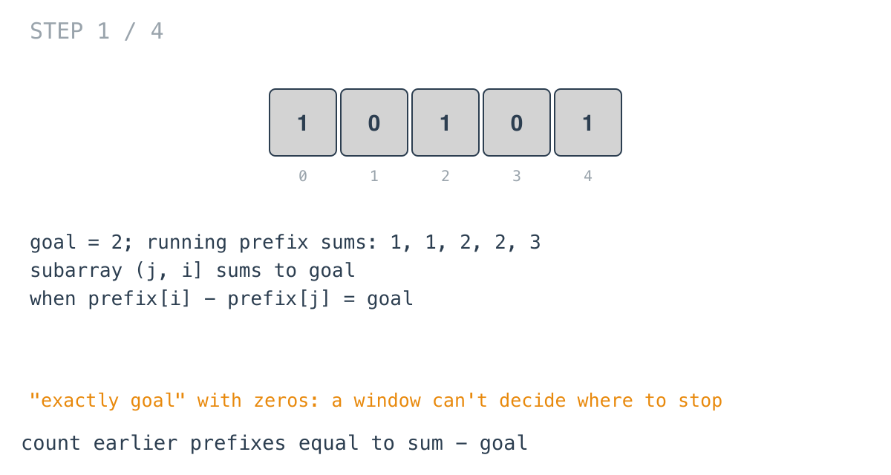
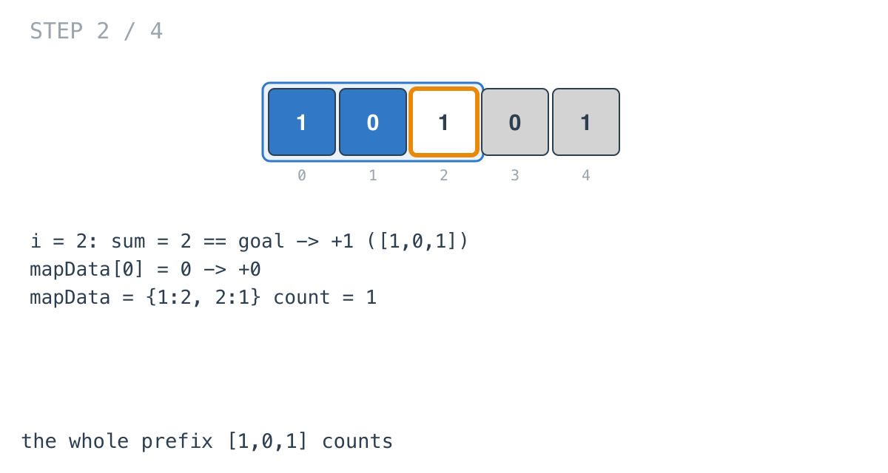
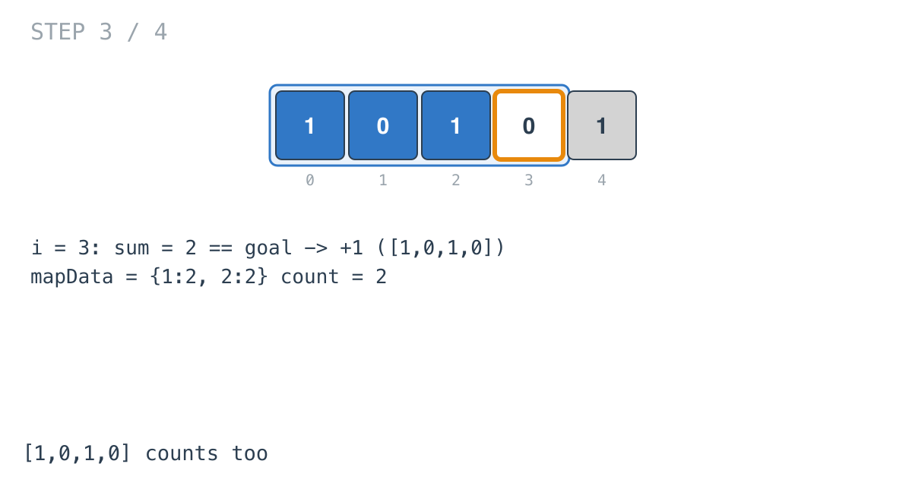
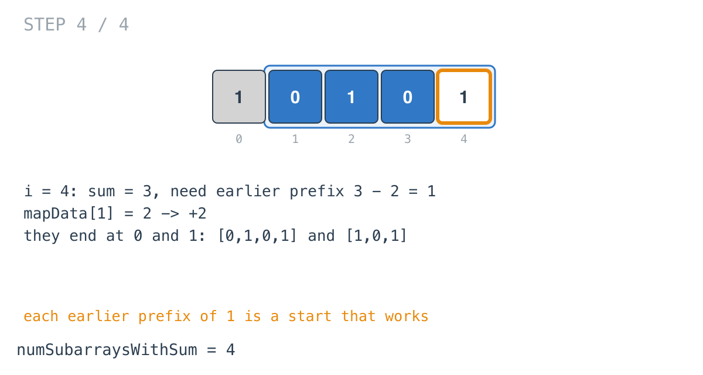

## Solution walkthrough

`numSubarraysWithSum(nums []int, goal int) int` in `main.go` walks the array once, keeping
the running sum and a map of how many times each running sum has appeared.

We'll trace Example 1: `nums = [1,0,1,0,1]`, `goal = 2`, expected `4`.

1. **The subarray-sum identity.** A subarray `(j, i]` sums to `prefix[i] - prefix[j]`. It
   equals `goal` when `prefix[j] = sum - goal`, so the subarrays ending at `i` that work are
   the earlier prefixes with that value.

   

2. **The empty prefix.** `if sum == goal { count++ }` counts the subarray from index 0 to
   `i`, whose left boundary is the empty prefix. At `i = 2`, `sum = 2`: `[1,0,1]` counts.

3. **Earlier prefixes.** `if sum >= goal { count += mapData[sum-goal] }`. At `i = 2` that's
   `mapData[0] = 0`. Then `mapData[sum]++` records this prefix for later positions. After
   `i = 2`: `mapData = {1:2, 2:1}`, `count = 1`.

   

4. **Zeros add more.** At `i = 3` the sum is still 2, so `[1,0,1,0]` counts too: `count = 2`.

   

5. **Two at once.** At `i = 4`, `sum = 3`. Earlier prefixes equal to `3 - 2 = 1` happened
   twice (after indices 0 and 1), so two subarrays end here: `[0,1,0,1]` and `[1,0,1]`.
   `count = 4`.

   

The `sum >= goal` guard only skips a lookup that would find nothing (no prefix is negative).

**Complexity:** O(n) time, O(n) space.
