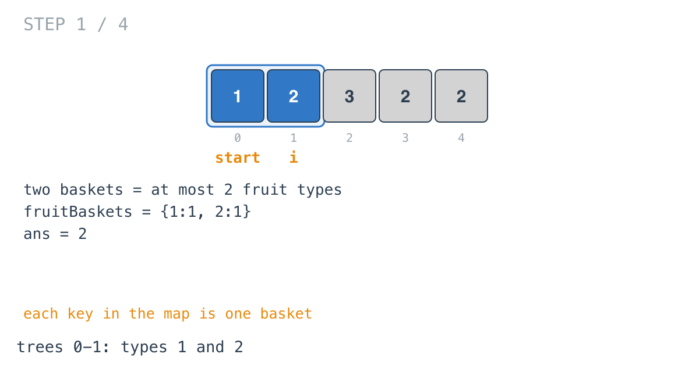
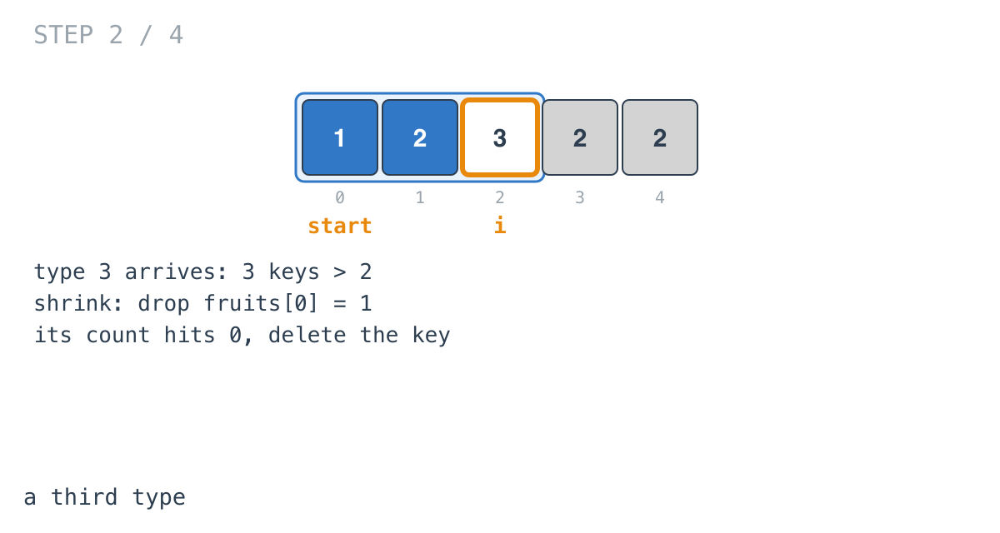
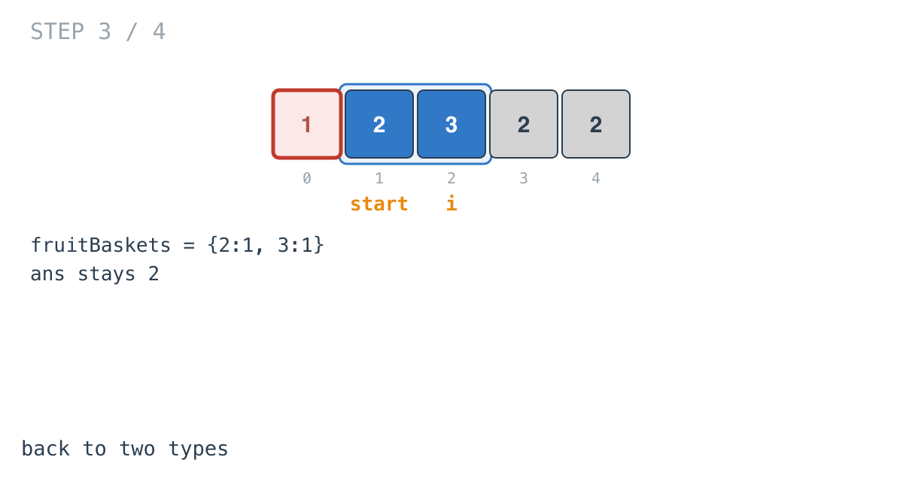
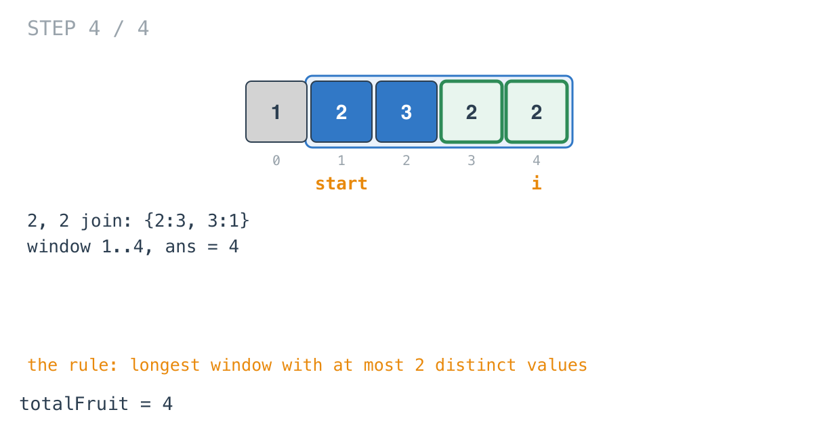

## Solution walkthrough

`totalFruit(fruits []int) int` in `main.go` keeps a window of trees with at most two fruit
types, counted in `fruitBaskets`.

We'll trace Example 3: `fruits = [1,2,3,2,2]`, expected `4`.

1. **Grow and count.** `fruitBaskets[fruit]++` for each tree. After two trees the map is
   `{1:1, 2:1}`: two types, two baskets. `ans = 2`.

   

2. **A third type.** Tree 2 has type 3. The map has three keys, one too many.

   

3. **Shrink until two types remain.**

   ```go
   for len(fruitBaskets) > 2 {
       fruitBaskets[fruits[start]]--
       if fruitBaskets[fruits[start]] == 0 {
           delete(fruitBaskets, fruits[start])
       }
       start++
   }
   ```

   Dropping tree 0 takes type 1's count to 0, and the key is deleted. `len` is 2 again.
   The delete matters: without it the key would linger and `len` would still say 3.

   

4. **Grow through the rest.** Two more type-2 trees join. The window is trees 1-4 with
   types 2 and 3, and `ans = maxValue(ans, i-start+1) = 4`.

   

**Complexity:** O(n) time, O(1) space.
