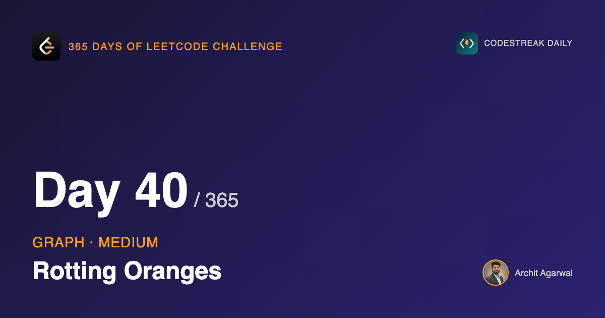

*365 Days of LeetCode Challenge — Day 40/365*

**[994. Rotting Oranges](https://leetcode.com/problems/rotting-oranges/)** (Medium)

A grid of oranges. `0` is empty, `1` is fresh, `2` is rotten. Every minute, rot spreads from each rotten orange to its four neighbours. Return the number of minutes until nothing fresh is left, or `-1` if some orange can never rot.

## A promise from four days ago

On day 36 I wrote that reachability can be answered by BFS or DFS equally well, and that the distinction only starts to matter when a problem asks about *distance*. I said day 40 would be where that mattered.

Here we are.

BFS expands outward one ring at a time, so it reaches every node by a shortest path. DFS follows one route as far as it goes before backing up, so it reaches a node by whatever path it happened to wander down, which may be arbitrarily longer than the best one.

For "can I get there?", both answer correctly. For "how far is it?", only one does.

And this problem is asking how far. An orange rots when the *nearest* rotten orange reaches it. The minute at which a cell rots is its distance, in steps, from the closest source. Write this with DFS and you will not get a slow solution, you will get a wrong one.

## Every rotten orange starts at the same moment

A textbook BFS has a single start node. This problem has as many starts as there are rotten oranges, all spreading simultaneously.

The answer is to put all of them into the queue before the walk begins:

```go
for i := 0; i < len(grid); i++ {
	for j := 0; j < len(grid[i]); j++ {
		if grid[i][j] == 2 {
			q = append(q, node{row: i, col: j, t: 0})
		}
	}
}
```


This is called multi-source BFS, and I want to be clear about how little it changes, because the name makes it sound like a variant algorithm.

It is not. It is the same loop. The only difference is what the queue contains at the start.

A BFS expands whatever is in its queue as a single wavefront. Seed it with one node and the wavefront is a circle growing from that node. Seed it with ten and the wavefront is the combined boundary of ten circles growing at once. Either way, the first time the wave touches a cell is the earliest any source could have reached it, so every cell ends up holding its distance to the *nearest* source.

Nothing inside the loop knows or cares how many sources there were. The queue does not remember where its contents came from.

The alternative is a separate BFS from each rotten orange, taking the minimum at every cell. It is correct and it costs O(sources x cells) rather than O(cells).

## The walk

```go
for len(q) > 0 {
	x := pop()
	ans = x.t
	push(x.row+1, x.col, x.t+1)
	push(x.row-1, x.col, x.t+1)
	push(x.row, x.col+1, x.t+1)
	push(x.row, x.col-1, x.t+1)
}
```


The empty cell is rejected by the guard inside `push`, so the rot travels around it rather than through it. Nothing special was written to make that happen; an empty cell simply is not a fresh orange.


## The line that looks like a bug

```go
ans = x.t
```

No comparison. It overwrites `ans` on every single pop, including pops that are not the last one.

The first time I read something like this I assumed it was a mistake that happened to pass. It is not.

BFS dequeues in non-decreasing order of `t`. Everything queued at minute 1 was queued before anything at minute 2, and a FIFO queue preserves that order. So the values assigned to `ans` form a non-decreasing sequence, and the last one is the largest. Writing `if x.t > ans` would compute the same number with an extra branch.

What makes it fragile is that the argument rests entirely on the queue being FIFO. Replace `q[0]` with `q[len(q)-1]` and you have a stack, the traversal becomes a DFS, the order stops being non-decreasing, and this line quietly starts producing whatever `t` the final wander happened to end on. The code still runs. The tests mostly still pass.

## `push` does everything

```go
push := func(row, col, t int) {
	if row < 0 || row >= len(grid) || col < 0 || col >= len(grid[0]) || grid[row][col] != 1 {
		return
	}
	grid[row][col] = 2
	q = append(q, node{row: row, col: col, t: t})
}
```

Bounds, "not a fresh orange", and "already rotten" are one condition, exactly as in day 37's `dfs`. That is what lets the four calls in the main loop carry no checks at all.

And the cell is turned rotten **as it is pushed**, which is day 36's mark-on-enqueue rule for the third time. Here it earns something extra: there is no separate visited set anywhere in this solution, because the grid is the visited set. A cell already queued reads as `2`, and `push` rejects it.

One asymmetry worth noticing: the seeding loop appends to `q` directly instead of calling `push`. It has to. The cells it is adding are already `2`, and `push` would reject every one of them.

## The scan at the end is not tidying up

```go
for i := 0; i < len(grid); i++ {
	for j := 0; j < len(grid[i]); j++ {
		if grid[i][j] == 1 {
			return -1
		}
	}
}
```

This is where `-1` comes from, and it cannot be moved into the traversal.

BFS only ever visits what it can reach. An orange sealed off behind empty cells is never enqueued, never rots, and the queue empties without the algorithm ever learning it exists. There is no moment during the walk when the code could notice.

This is the same fact as day 36's second example, where a walk from node 0 had no way of discovering that nodes 3, 4 and 5 were sitting in another component. Unreachable things do not announce themselves. If you need to know about them, you have to go and look afterwards.

## The quiet edge case

A grid with no rotten oranges and no fresh ones: the queue starts empty, the walk does nothing, the final scan finds no `1`, and `ans` is still `0`.

Correct, and no code was written to handle it. That is usually a sign the state is being represented honestly rather than patched.

## Complexity

- **Time: O(m x n).** Every cell is pushed at most once, since `push` rejects anything not currently fresh, plus the two full scans.
- **Space: O(m x n)** for the queue in the worst case, which is a grid that starts entirely rotten.

## Builds on

- [Day 29: Binary Tree Level Order Traversal](https://github.com/architagr/leetcode_solutions/blob/main/medium_problems/101_200/binary_tree_level_order_traversal/) — BFS visiting a whole level before the next; here a level is a minute
- [Day 37: Number of Islands](https://github.com/architagr/leetcode_solutions/blob/main/medium_problems/101_200/number_of_islands/) — a grid as a graph, with neighbours computed rather than looked up

Full code and the step-by-step walkthrough:
[rotting_oranges](https://github.com/architagr/leetcode_solutions/blob/main/medium_problems/901_1000/rotting_oranges/SOLUTION.md)

---

*Solution and code by Archit Agarwal. Write-up drafted with AI assistance from the code and problem statement.*
