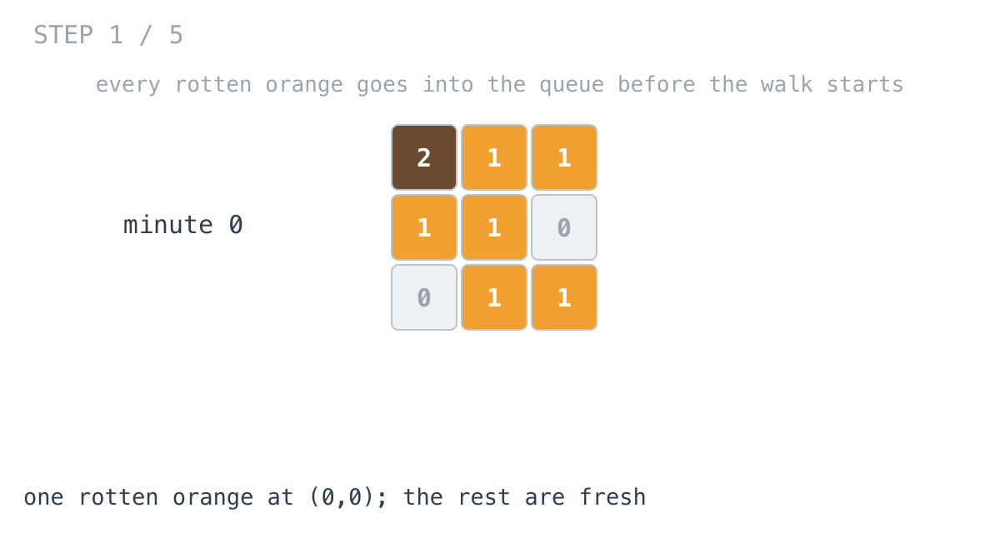
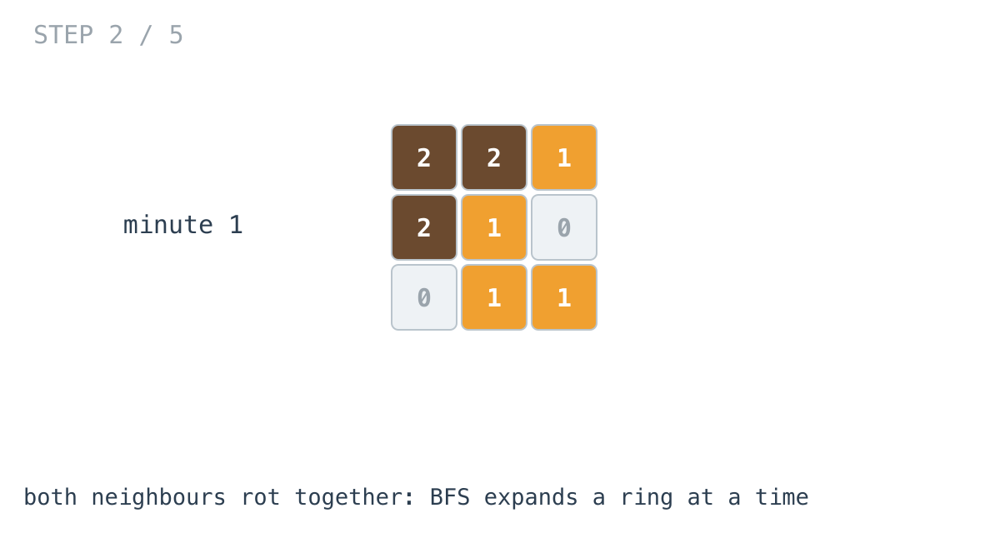
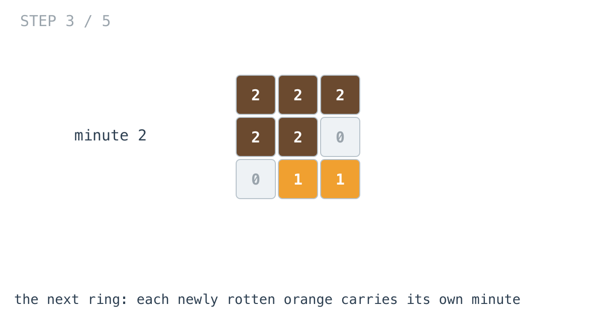
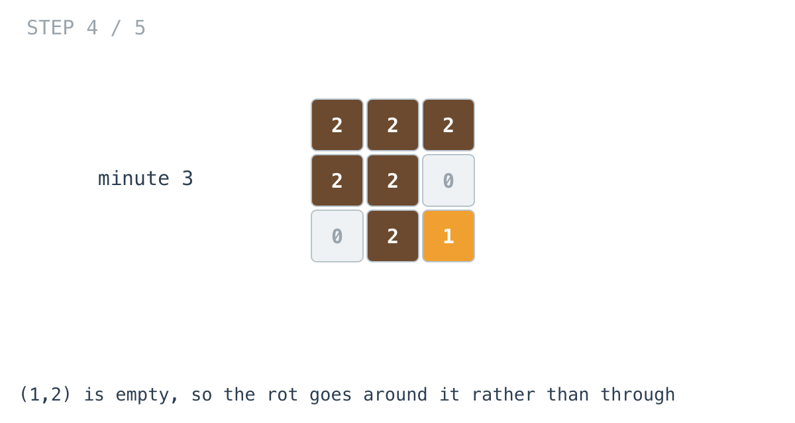
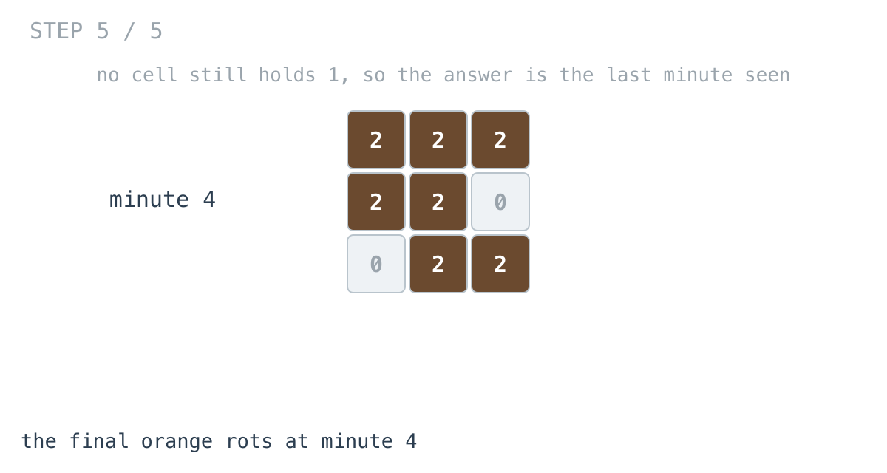

# Rotting Oranges — solution walkthrough

From `main.go`:

```go
func orangesRotting(grid [][]int) int {
	q := make([]node, 0, 100)
	push := func(row, col, t int) {
		if row < 0 || row >= len(grid) || col < 0 || col >= len(grid[0]) || grid[row][col] != 1 {
			return
		}
		grid[row][col] = 2
		q = append(q, node{row: row, col: col, t: t})
	}
	pop := func() node {
		x := q[0]
		q = q[1:]
		return x
	}
	ans := 0
	for i := 0; i < len(grid); i++ {
		for j := 0; j < len(grid[i]); j++ {
			if grid[i][j] == 2 {
				q = append(q, node{row: i, col: j, t: 0})
			}
		}
	}

	for len(q) > 0 {
		x := pop()
		ans = x.t
		push(x.row+1, x.col, x.t+1)
		push(x.row-1, x.col, x.t+1)
		push(x.row, x.col+1, x.t+1)
		push(x.row, x.col-1, x.t+1)
	}

	for i := 0; i < len(grid); i++ {
		for j := 0; j < len(grid[i]); j++ {
			if grid[i][j] == 1 {
				return -1
			}
		}
	}
	return ans
}
```

## Why this one has to be BFS

Day 36 said that for reachability, BFS and DFS are interchangeable, and that the distinction starts mattering when a problem asks about distance. This is that problem.

BFS reaches every cell by a shortest path, because it expands outward one ring at a time. DFS reaches a cell by whatever route it happened to wander down first, which may be far longer than necessary.

"When does this orange rot?" is a shortest-path question: an orange rots as soon as the *nearest* rotten one reaches it. Run this with DFS and you get wrong answers, not slow ones.

## Multi-source: seeding every rotten orange

```go
for i := 0; i < len(grid); i++ {
	for j := 0; j < len(grid[i]); j++ {
		if grid[i][j] == 2 {
			q = append(q, node{row: i, col: j, t: 0})
		}
	}
}
```



Every orange that starts rotten goes into the queue at `t = 0`, before the walk begins.

This is the whole idea of the solution and it is less clever than it looks. A BFS seeded with many sources expands as a single combined wavefront, and each cell ends up holding its distance to the *nearest* source. Nothing inside the loop has to know there was more than one start; the queue does not care where its contents came from.

The alternative is running a separate BFS per rotten orange and taking the minimum at each cell, which is correct and costs O(sources x cells) instead of O(cells).

## The walk

```go
for len(q) > 0 {
	x := pop()
	ans = x.t
	push(x.row+1, x.col, x.t+1)
	...
}
```



Each dequeued cell pushes its four neighbours at `t + 1`.





An empty cell at `(1,2)` is rejected by the guard, so the rot goes around it rather than through.



## `ans = x.t` with no comparison

```go
ans = x.t
```

Not `if x.t > ans`. It overwrites unconditionally, and that is correct rather than sloppy.

BFS dequeues in non-decreasing order of `t`: everything at minute 1 comes out before anything at minute 2. So the last value assigned is the largest, and a comparison would be doing work to reach the same answer.

It relies on the queue being FIFO. Swap it for a stack and this line silently becomes wrong.

## `push` does the marking and the guarding

```go
push := func(row, col, t int) {
	if row < 0 || row >= len(grid) || col < 0 || col >= len(grid[0]) || grid[row][col] != 1 {
		return
	}
	grid[row][col] = 2
	q = append(q, node{row: row, col: col, t: t})
}
```

Bounds, "not a fresh orange", and already-rotten are one condition, exactly as in day 37's `dfs`. That is what lets the four calls in the loop be unguarded.

The cell is turned rotten **as it is pushed**, which is day 36's mark-on-enqueue rule. Here it also removes the need for a separate visited structure: the grid records what has been reached, so a cell already queued reads as `2` and is rejected.

Note also that `push` is used for neighbours but *not* for seeding. The seeding loop appends directly, because the cells it adds are already `2` and `push` would reject every one of them.

## The final scan is not optional

```go
for i := 0; i < len(grid); i++ {
	for j := 0; j < len(grid[i]); j++ {
		if grid[i][j] == 1 {
			return -1
		}
	}
}
```

BFS only ever visits what it can reach. An orange sealed off behind empty cells is never enqueued, never rots, and the queue drains without any indication that it exists.

So the `-1` case cannot be detected during the traversal. It has to be a scan afterwards, asking whether anything fresh survived.

This is the same fact as day 36's two-component example, where BFS from node 0 simply never learned that nodes 3, 4 and 5 existed.

## The zero-orange edge case

A grid with no rotten oranges and no fresh ones leaves the queue empty, the walk does nothing, the final scan finds no `1`, and `ans` is still `0`. Correct, and nothing special was written to make it so.

## Complexity

- **Time: O(m x n).** Each cell is pushed at most once, because `push` rejects anything not currently fresh. Plus two full scans.
- **Space: O(m x n)** for the queue in the worst case, where the whole grid starts rotten.

## Test

`main_test.go` covers the three worked examples: the grid that fully rots in 4 minutes, the grid with an unreachable orange returning `-1`, and the grid with no fresh oranges returning `0`.
