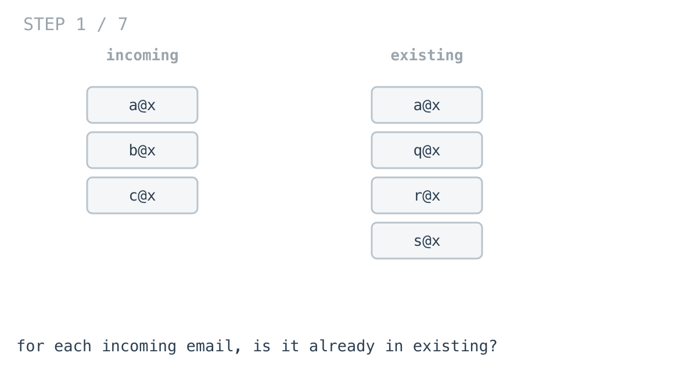
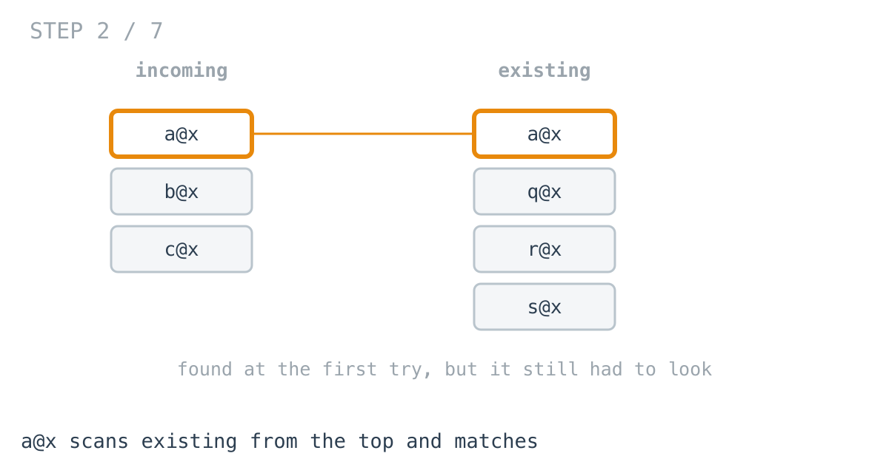
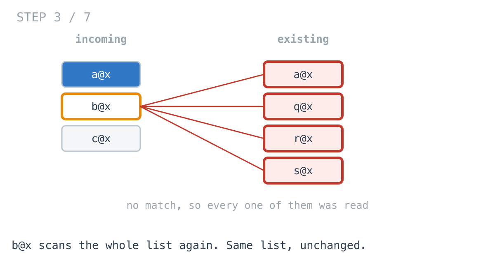
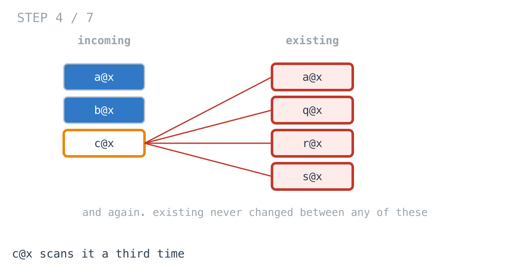
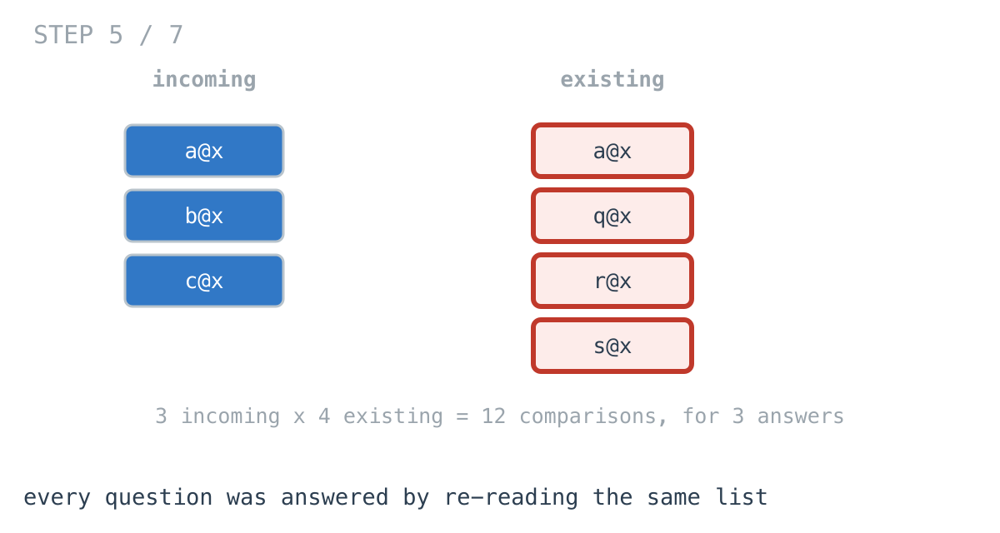
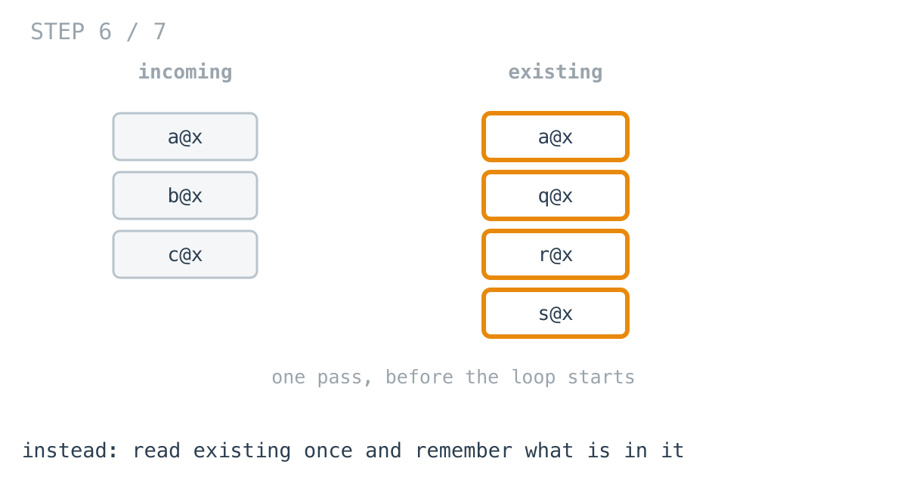
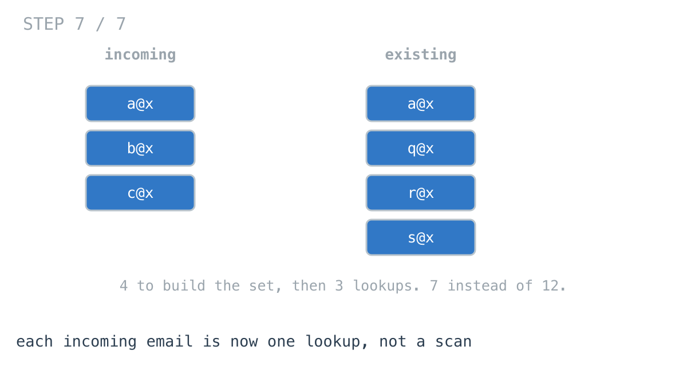

# Why your CSV import crawls on a real customer's file

**It worked in dev · Episode 1 · technique: set membership**

A customer uploads a CSV of their users. You have to work out which rows are
new, so you can insert those and skip the rest.

You wrote that function against a twelve-row fixture. It was instant. Today
somebody uploaded twenty thousand rows and the request timed out.

Nothing changed. The code was always this slow. The file finally got big enough
to show it.

---

## The problem

Two lists:

- **incoming** — the rows in the uploaded file
- **existing** — the users already in the database

Return the incoming rows whose email is not already in `existing`.

That is it. A CSV import, a webhook batch, a nightly sync against some API —
every codebase has this function somewhere, usually written early and never
looked at again.





## What you would write

```go
func MissingNested(incoming, existing []User) []User {
	var out []User
	for _, want := range incoming {
		found := false
		for _, have := range existing {
			if have.Email == want.Email {
				found = true
				break
			}
		}
		if !found {
			out = append(out, want)
		}
	}
	return out
}
```

I want to defend this, because the episode is worthless if the slow version is
a strawman.

It reads exactly like the sentence describing the job: for each incoming record,
look through the existing ones, keep it if nothing matched. It allocates nothing
beyond the result. There is no setup step to forget, no second data structure to
keep in sync, and nothing that behaves differently on an empty input. It is
correct, and it passes review anywhere.

---

## How bad, on its own

Before comparing it to anything, watch it scale. Both lists the same length,
half the incoming records already present:

```
Apple M1 Pro · go1.26.4 · go test -bench=BenchmarkNested -benchtime=50x
```

| records each side | nested loop |
|---|---:|
| 100 | 13.7 µs |
| 1,000 | 1.12 ms |
| 5,000 | 30.3 ms |
| 20,000 | **516 ms** |

Read the top row first. **13.7 microseconds.** Nothing in a web request is
measured in microseconds. At this size the function is free, and no amount of
knowing better would have been worth acting on.

Now the bottom. **516 milliseconds.** Half a second, in one function, doing
nothing but comparing strings.

And 20,000 is not a big number. It is a mid-size customer's user table. It is
one nightly import. It is the number your fixture will reach in a year without
anybody noticing the day it crossed over.

From 5,000 to 20,000 is four times the input for **17 times the work**. Four in,
sixteen out — the next doubling costs four times again.

---

## From the symptom to the shape

The fix is four lines and you will guess it before the end of this section.
That is fine. The part worth having is the path, because next time there is no
article — just some slow code and a hunch.

### The issue, said plainly

The same list is being read over and over.

`existing` is scanned once for every record in `incoming`. Not once. Once *per
incoming record*. With 20,000 on each side that is 20,000 scans of a
20,000-element list, and the test suite counts them rather than asserting it in
prose:

```go
if want := n * n; compares != want {
```

Four hundred million string comparisons. That is what 516 ms buys.







### Why is it allowed to happen?

Because the inner loop has no memory between outer iterations.

It walks `existing` from the top, finds its answer or does not, and then throws
away everything it learned. The next incoming record starts from the beginning
as if the list had never been read. Nothing is wrong with the comparison — the
waste is that it has all been done before.

### We already know the answer before we start

Here is the part worth sitting with.

`existing` does not change. Not during the loop, not at all. Every scan of it
asks a different question — *is this particular email in here* — but the thing
being asked about is **fixed from the first line of the function**.

So the work is not just repeated. It is repeated against data that was already
completely known before the loop began, and we are re-deriving a fact about it
twenty thousand times.

That reframe is the whole thing, and notice it does not name a technique yet.

### What question are we actually asking?

Worth being precise, because the shape of the question decides what can answer it.

Every trip through the inner loop asks exactly one thing:

> **Is this email somewhere in `existing`?**

Not *where* is it. Not *which record* is it. Not *how many* are there. Just
**yes or no, is it present.**

That matters. A list is built to answer "what is at position 7" and it is very
good at that. Nobody asked what is at position 7. We are using an ordered
structure to answer an unordered question, and paying for the ordering on every
single lookup.

### So what answers presence directly?

A structure that stores *membership* rather than *sequence*. Hand it a value, it
tells you whether it has seen one, without looking through anything. In Go that
is a map used as a set.

That is the rule worth keeping, and it generalises well past this function:

> **When the repeated work is "is this thing present", and the collection being
> searched does not change, the answer is a set built once.**



### The cost moves, it does not vanish

Building the set means one pass over `existing` up front. That pass is not free.

It is paid **once**, instead of once per incoming record. That is the entire
change: the same reading of the same list, hoisted out of the loop.

### When this does not apply

The rule had two conditions and both do real work.

If the collection **changes inside the loop**, a set built beforehand is stale
and the answer is wrong rather than slow. Rebuilding it each iteration puts you
back where you started.

If the question is not **presence** — if you need the matching record's fields,
its position, a count, or the nearest value rather than an exact one — then a
set does not answer it, and a map to something, or a sorted structure, or an
index is what you want instead.

Knowing which of those you are holding is the skill. The map is just what
happens once you know.

### Where this sits in the challenge

This one is the opener, and it is honest to say it stands alone: nothing in the
first ten days of the [365-day
challenge](https://github.com/architagr/leetcode_solutions) teaches hashing —
they are binary trees, and the series follows the challenge.

What it does establish is the shape every later episode has. Reasonable code,
a scale at which it stops being reasonable, and a reframe that comes from
looking at the question rather than the algorithm. From episode 2 on, each one
is built on days you can go and read.

---

## Try it before reading on

You have the rule: the collection does not change, and the question is presence.

Rewrite `MissingNested` so `existing` is read once instead of once per incoming
record. It is a small change — no new dependency, no sorting, no second pass
over `incoming`.

```bash
git clone https://github.com/architagr/leetcode_solutions
cd leetcode_solutions/series/it-worked-in-dev/episodes/01-dedupe-user-list
go test ./...
```

The tests will tell you when you have it. Reading on costs you the rep.

---

## The version that scales

```go
func MissingSet(incoming, existing []User) []User {
	seen := make(map[string]struct{}, len(existing))
	for _, have := range existing {
		// struct{}{} rather than true: the value is never read, and an empty
		// struct occupies no space, so the map stores only its keys.
		seen[have.Email] = struct{}{}
	}
	var out []User
	for _, want := range incoming {
		if _, ok := seen[want.Email]; !ok {
			out = append(out, want)
		}
	}
	return out
}
```

The loop over `existing` moved **out** of the loop over `incoming`. That is the
change. It runs once, before anything else, and after that each lookup is a
single hash instead of a scan.



Two details worth the keystrokes. `make(map[string]struct{}, len(existing))`
sizes the map up front so it does not rehash as it grows. And `struct{}{}` as
the value stores nothing at all — the map holds only keys, which is exactly what
a set is.

---

## The measurement

| records each side | nested loop | set | ratio |
|---|---:|---:|---:|
| 100 | 13.7 µs | 5.31 µs | 2.6x |
| 1,000 | 1.12 ms | 40.3 µs | 27.8x |
| 5,000 | 30.3 ms | 282 µs | 108x |
| 20,000 | **516 ms** | 1.30 ms | **398x** |

Raw ns: 13,662 / 5,311 · 1,121,888 / 40,286 · 30,334,418 / 281,760 · 516,400,558 / 1,296,928

**At 100 records it is 2.6x.** Both are microseconds. Nobody would ever notice.

**At 20,000 it is 398x.** Half a second against one and a third milliseconds.

The set version going 5,000 to 20,000 costs a factor of 4.6 against 4x the
input. The nested one costs 17.0. That gap is the four lines.

---

## What it costs

Memory, and it is a real cost rather than a rounding error.

| records | nested | set |
|---|---:|---:|
| 100 | 7.5 KB | 11.0 KB |
| 20,000 | 2.3 MB | 3.2 MB |

About **37% more** at 20,000, because the map has to hold every existing email.
Both grow linearly, so the ratio stays flat rather than getting worse.

Half a second of CPU for 0.9 MB is a trade nearly anybody takes. It is still a
trade, and if `existing` genuinely will not exceed a few hundred entries, the
nested loop is the right call — it is simpler, it allocates less, and it has one
fewer thing to get wrong.

**At your scale the naive version may well be fine.** The point is knowing the
number at which it stops being, before a customer finds it for you.

---

## The one line to keep

When the repeated work is "is this present", and the collection being searched
does not change while you search it, the answer is a set built once.

---

## Run it yourself

```bash
git clone https://github.com/architagr/leetcode_solutions
cd leetcode_solutions/series/it-worked-in-dev/episodes/01-dedupe-user-list
go test ./...                                  # both implementations agree
go test -bench=. -benchtime=50x -run=XXX       # the numbers above
```

The tests assert the two functions return identical results on eight
hand-written cases and 2,000 randomised ones, including inputs where they
partially overlap — because the whole argument depends on them being the same
function.

---

Part of [It worked in dev](../../), the long-form companion to the
[365-day LeetCode challenge](https://github.com/architagr/leetcode_solutions).

---

*Ideation, problem selection, benchmarks and conclusions: Archit Agarwal.
The prose was drafted with AI assistance and edited by me. Every number here
comes from a run you can reproduce with the commands above.*
