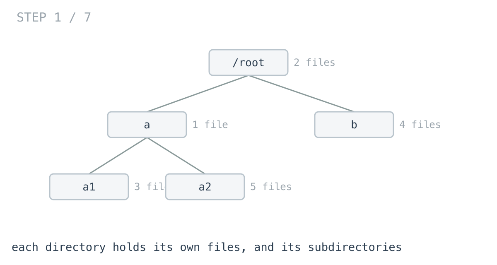
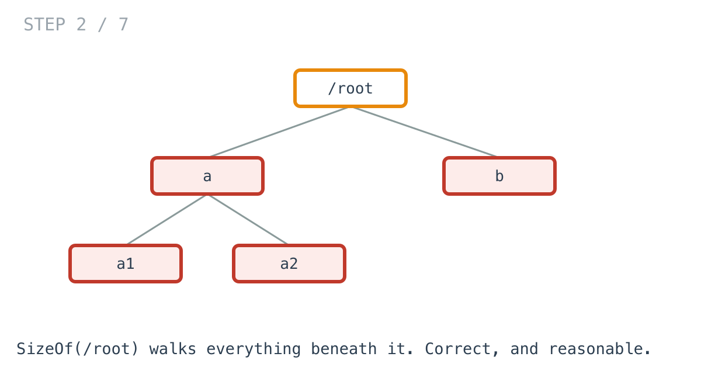
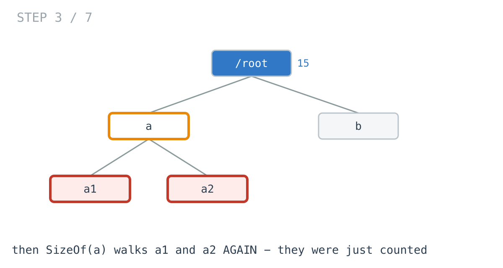
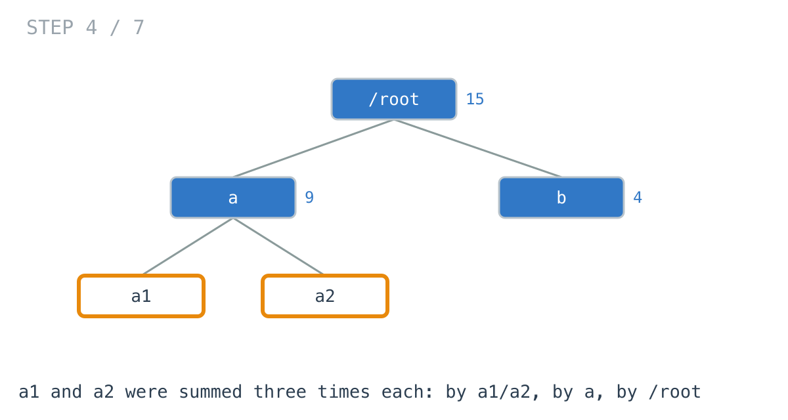
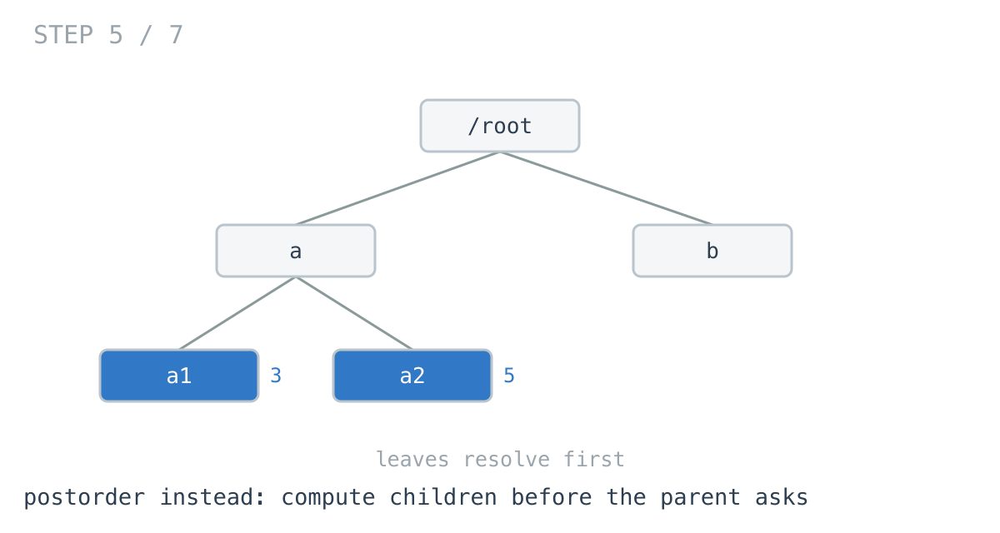
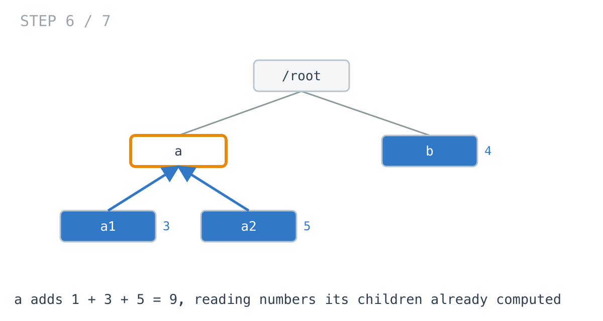
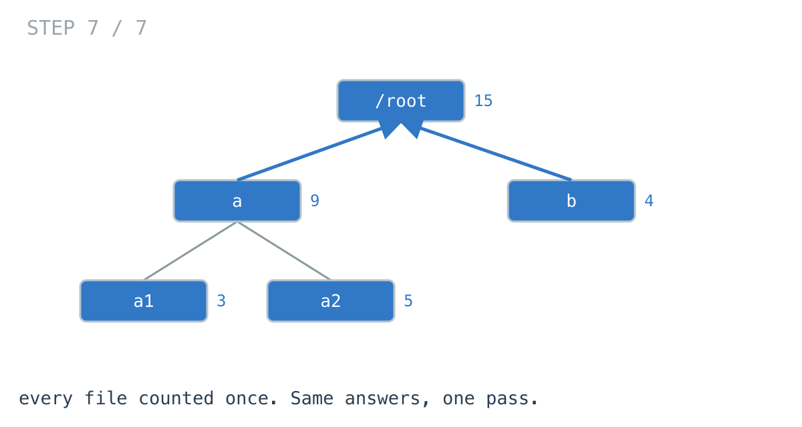

# Why `du` crawls on node_modules

**It worked in dev · Episode 1 · technique: postorder traversal**

You want the total size of every directory in a project. You write the obvious
thing, it works, and then someone runs it on a `node_modules` and it stops
coming back.

The code is not wrong. It is doing the same addition thousands of times.

---

## The problem

Given a directory tree, report the total bytes under **every** directory — what
`du` prints. A directory's size is its own files plus everything nested beneath it.



---

## What you would write

```go
func SizeOf(dir *Dir) int64 {
	var total int64
	for _, f := range dir.Files {
		total += f.Size
	}
	for _, child := range dir.Children {
		total += SizeOf(child)
	}
	return total
}
```

There is nothing wrong with this. It is correct, it is clear, and it is what a
good engineer writes when asked how big a directory is.

Then you need it for every directory:

```go
func AllSizesBrute(root *Dir) map[string]int64 {
	out := make(map[string]int64)
	var walk func(*Dir)
	walk = func(d *Dir) {
		out[d.Path] = SizeOf(d)
		for _, child := range d.Children {
			walk(child)
		}
	}
	walk(root)
	return out
}
```

Also reasonable. Visit each directory, ask how big it is, record the answer.

---

## Where it goes wrong

The walk visits each directory once. But `SizeOf` re-walks that directory's
**entire subtree** every time it is called.







A file nested `d` levels deep gets added into a running total `d` separate times —
once for every ancestor that asks how big it is.

That is not a guess. The test suite counts the additions:

```go
// a chain of n directories makes n + (n-1) + ... + 1 additions
want := dirs * (dirs + 1) / 2
```

---

## How bad, on its own

Before comparing it to anything, look at how this one function scales. Same
machine, same code, four tree shapes:

```
Apple M1 Pro · go1.26.4 · go test -bench=BenchmarkBrute -benchtime=200x
```

| shape | directories | brute force | |
|---|---:|---:|---:|
| balanced, depth 12 | 8,191 | 864,951 ns | 0.86 ms |
| chain, depth 200 | 201 | 157,175 ns | 0.16 ms |
| chain, depth 800 | 801 | 2,633,461 ns | 2.63 ms |

Read the last two rows against each other. **Four times the directories cost
16.8 times the work.** Four-in, sixteen-out is the fingerprint of a quadratic,
and it means every extra level of nesting is more expensive than the one before it.

Now read the first row against the last. **8,191 directories finish in a third
of the time 801 directories take** — because those 8,191 are only twelve levels
deep, and the 801 are eight hundred.

It is not size that hurts. It is depth. Which is exactly what `node_modules` is.

---

## From the symptom to the shape

The fix is two lines, and you will see it coming well before the end of this
section. That is intentional. What is worth having is the path, because next
time there is no article - only some slow code and a hunch.

### The issue, said plainly

The same numbers are being added more than once.

Take the tree from the diagrams. `a1` holds 3 bytes. Count how many times that
3 gets added into something:

- once when the walk reaches `a1` and calls `SizeOf(a1)`
- again when the walk reaches `a` and calls `SizeOf(a)`, which descends into `a1`
- again when the walk reaches `/root` and calls `SizeOf(/root)`, which descends
  through `a` into `a1`

Three times, for a directory two levels down. A directory `d` levels deep is
summed `d + 1` times, once for itself and once for every ancestor above it. That
is where the quadratic came from, and it is why depth is the axis and size is not.

### Why is it allowed to happen?

Because `SizeOf(a)` has no memory of `SizeOf(a1)`. Every call starts from
nothing and rebuilds the whole subtree total from the leaves up. The function is
correct in isolation, which is exactly why it survives review - you cannot see
the problem by looking at `SizeOf`. You can only see it by looking at the walk
that calls it.

### We already had the answer

Now look at the order things happen in.

When the walk reaches `a1`, it computes 3 and **writes it into `out`**. The
answer exists, in memory, in a map we are holding. Three frames later `/root`
computes that same 3 from scratch and never consults the map.

So the information was not missing. It was produced too late to be useful:
`out["a1"]` gets filled in on the way down, and by the time `/root` wants it,
`/root` has already been and gone. The results are being produced in the wrong
order.

That reframing is the whole thing, and notice it does not name a single
algorithm yet.

### What shape is this data, actually?

Worth asking, because the shape decides what is available to you.

Directories nest inside directories. Every directory has exactly one parent.
Nothing loops back on itself - a directory cannot contain one of its own
ancestors. Follow any path down and it ends at a leaf.

One parent, no cycles, a single root. That is a **tree**, and it is worth
saying out loud rather than assuming, because the next step is only true for
trees.



### What the tree gives you

On a tree, write the definition of the thing you want as an equation:

```
size(d) = sum of d's own files
        + size(child) for each child of d
```

Read the right-hand side. Every term is either a plain number sitting in `d`
itself, or the answer for a node **strictly below** `d`. Nothing on that line
refers to `d`'s parent, or `d`'s siblings, or how you arrived at `d`.

That is the property that matters, and it is the one to go looking for in your
own problems:

> **Does the answer for a node depend only on the answers for its children?**

### So the order is forced

If `size(d)` needs `size(child)`, then every child has to be finished before `d`
can be. Not preferred - required.

Children first, then the parent. Applied to a whole tree, that is a traversal
order with a name: **postorder**. And `du` is a real use of it, which is not
something you can say about every traversal you learn.

### And one thing left: how does the answer get up?

A child computes a number. Its parent needs it. There is a mechanism for that
which costs nothing and you already use it everywhere - the child **returns** it.

That is why the fast version changes the signature from `func(*Dir)` to
`func(*Dir) int64`. The return value is the whole mechanism. It is how a finished
answer travels one level up without the parent going to look.

### Where you have already written this

Not one of these steps is new. All three pieces are in the first nine days of
the daily challenge, and each contributes a different one:

- **[Day 1 — Maximum Depth of Binary Tree](https://github.com/architagr/leetcode_solutions/blob/main/easy_problems/101_200/maximum_depth_of_binary_tree/SOLUTION.md)**
  — a node's depth is 1 + the deeper of its children. The equation-with-only-children-on-the-right shape, and a recursion that returns a number up the tree.
- **[Day 4 — Sum of Left Leaves](https://github.com/architagr/leetcode_solutions/blob/main/easy_problems/401_500/sum_of_left_leaves/SOLUTION.md)**
  — a parent reads what its children returned instead of going down to look. The mechanism.
- **[Day 9 — Binary Tree Postorder Traversal](https://github.com/architagr/leetcode_solutions/blob/main/easy_problems/101_200/binary_tree_postorder_traversal/SOLUTION.md)**
  — children before the parent, stated on its own. The order.

All of it, and the other 78 days, is at
[github.com/architagr/leetcode_solutions](https://github.com/architagr/leetcode_solutions).

`du` is those three with bytes in it. That is what the daily grind is building:
not trivia, a set of shapes you recognise when the slow code is yours.

### When this does not apply

The last step matters as much as the rest, because a rule you cannot switch off
is not a rule.

Go back to the equation. It worked because the right-hand side mentioned only
children. The moment a node's answer needs its **parent**, or its **siblings**,
or the **path taken to reach it**, that equation no longer closes and none of
this follows. Depth-of-each-node needs the path. Distance-between-two-nodes
needs a common ancestor. Both are trees, neither is postorder.

Knowing which of those two you are holding is the skill. The traversal is just
what happens once you know.

---

## Try it before reading on

You have everything you need. The rule is that a directory's total depends only
on its children's totals, and that a function returning a value can carry a
result upward.

Take `AllSizesBrute` and rewrite it so nothing is computed twice. It is a small
change — no new data structure, no cache, no extra pass.

Clone it and make the tests pass:

```bash
git clone https://github.com/architagr/leetcode_solutions
cd leetcode_solutions/series/it-worked-in-dev/episodes/01-directory-sizes
go test ./...
```

Genuinely worth ten minutes. Reading the answer costs you the rep.

---

## The version that scales

```go
func AllSizesPostorder(root *Dir) map[string]int64 {
	out := make(map[string]int64)
	var visit func(*Dir) int64
	visit = func(d *Dir) int64 {
		var total int64
		for _, f := range d.Files {
			total += f.Size
		}
		// Recurse first. Each child hands back a number it computed once.
		for _, child := range d.Children {
			total += visit(child)
		}
		// Only now is this directory's own answer known.
		out[d.Path] = total
		return total
	}
	visit(root)
	return out
}
```

The change is the **order of two lines**. Recording `out[d.Path]` moved from
before the recursion to after it, and the function now returns the total instead
of discarding it.

That return value is the whole mechanism. It is how a child's finished answer
reaches its parent without the parent going to look.





---

## The measurement

Now the two of them, same machine, same shapes:

```
Apple M1 Pro · go1.26.4 · go test -bench=. -benchtime=200x
```

| shape | directories | brute force | postorder | ratio |
|---|---:|---:|---:|---:|
| balanced, depth 3 | 85 | 4.96 µs | 3.91 µs | 1.3x |
| balanced, depth 12 | 8,191 | 865 µs | 631 µs | 1.4x |
| chain, depth 200 | 201 | 157 µs | 12.5 µs | **12.6x** |
| chain, depth 800 | 801 | 2,633 µs | 76.3 µs | **34.5x** |

Raw nanoseconds, for reproducing: 4,960 / 3,909 · 864,951 / 630,819 ·
157,175 / 12,497 · 2,633,461 / 76,335.

**8,191 directories in a balanced tree: 40% slower.** Nobody would notice.

**801 directories in a chain: 34 times slower.** A tenth of the directories, and
it falls over.

The postorder version going 200-deep to 800-deep costs a factor of 6.1 against
4x the input — linear, plus the map growing. The brute force costs 16.8. That gap
is the two lines.

---

## What it costs

Honestly: almost nothing here. Both versions allocate identically — same
`B/op`, same `allocs/op` at every shape — because the output map is the same
size either way.

The real cost is that `SizeOf` as a standalone function disappears. If callers
want "how big is this one directory", they now either keep the slow function
alongside, or call the whole-tree version and index into it. That is a genuine
API trade, and on a small tree it is not worth making.

**At your scale, the naive version is probably fine.** It falls over on depth,
not on size, and most trees are not deep. The point is knowing which axis to
watch.

---

## The one line to keep

When a recursive function is called at every node *and* re-walks the subtree
underneath it, the subtree's answer wants to be a return value, not a second walk.

---

## Run it yourself

```bash
git clone https://github.com/architagr/leetcode_solutions
cd leetcode_solutions/series/it-worked-in-dev/episodes/01-directory-sizes
go test ./...                      # both implementations agree
go test -bench=. -benchtime=200x   # the numbers above
```

The tests assert that the two implementations return identical maps on six tree
shapes, including a 50-deep chain — because the whole argument depends on them
being the same function.
