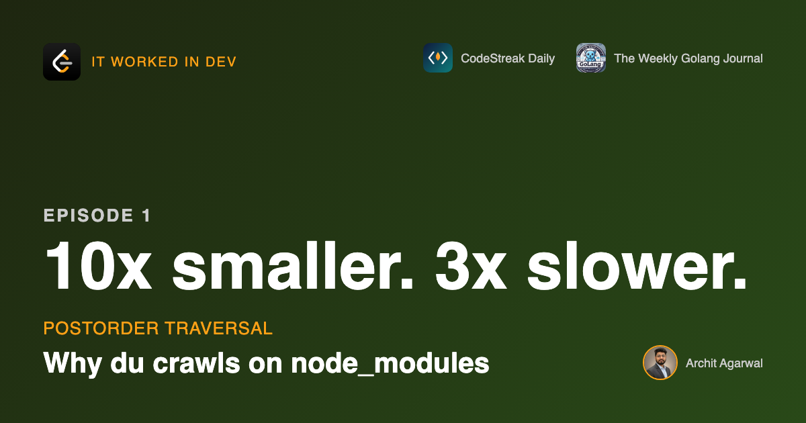

<!-- LinkedIn article. Paste body below the title. Upload images at the marked
     points; LinkedIn does not fetch relative paths. Links to https://github.com/architagr/leetcode_solutions/tree/main/series/it-worked-in-dev,
     https://www.linkedin.com/newsletters/the-weekly-golang-journal-7261403856079597568/ and https://medium.com/@architagr go in the closing block. -->

---
meta_title: "Why du crawls on node_modules: depth, not size, is the axis"
meta_description: "801 directories in a chain ran 3x slower than 8,191 in a balanced tree, and the naive version 34x slower than the fix. Both Go versions and the numbers."
hero: ../HERO.png
tags: [golang, algorithms, performance, recursion, dsa]
hashtags: "#Golang #DSA #Algorithms #Performance #SoftwareEngineering #DataStructures #100DaysOfCode"
---



# 801 directories were 3x slower than 8,191. Depth is the axis nobody watches.

I wrote the function everyone writes, benchmarked it, and the result was not
the one I expected.

The job: report the total bytes under every directory in a tree. What `du`
prints. A directory's size is its own files plus everything nested under it.

Here is the honest first version.

```go
func SizeOf(dir *Dir) int64 {
	var total int64
	for _, f := range dir.Files {
		total += f.Size
	}
	for _, child := range dir.Children {
		total += SizeOf(child)
	}
	return total
}

func AllSizesBrute(root *Dir) map[string]int64 {
	out := make(map[string]int64)
	var walk func(*Dir)
	walk = func(d *Dir) {
		out[d.Path] = SizeOf(d)
		for _, child := range d.Children {
			walk(child)
		}
	}
	walk(root)
	return out
}
```

I want to defend this code for a second, because the point of the exercise
depends on it. `SizeOf` is correct and clear. Calling it once per directory is
the obvious way to get an answer for every directory. I would approve this in a
review and so would you.


## The measurement, before any fix

Apple M1 Pro, go1.26.4, `go test -bench=BenchmarkBrute -benchtime=200x`.

- balanced tree, 8,191 directories, 12 levels deep: 0.86 ms
- single chain, 201 directories, 200 levels deep: 0.16 ms
- single chain, 801 directories, 800 levels deep: 2.63 ms

Four times the directories in that last pair cost 16.8 times the work. Four in,
sixteen out is a quadratic.

And 8,191 directories finish in a third of the time 801 directories take,
because those 8,191 are twelve levels deep and the 801 are eight hundred.

Size is not the axis. Depth is. Which is what a `node_modules` is: not
enormous, just nested as far as your dependency graph goes.


## From the symptom to the shape

I care more about this part than the fix, because next time there is no article
to read. There is some slow code and a hunch.

**The issue, said plainly: the same numbers are added more than once.**

`a1` holds 3 bytes. That 3 gets added in once when the walk reaches `a1`, again
when `a` is computed, and again when `/root` is computed. Three times, for a
directory two levels down. A directory `d` levels deep is summed `d + 1` times,
once for itself and once per ancestor. That is the quadratic, and it is why
depth is the axis rather than size.

**Why is it allowed to happen?** Because `SizeOf(a)` has no memory of
`SizeOf(a1)`. Every call rebuilds its subtree total from the leaves. Nothing is
wrong with `SizeOf` in isolation, which is exactly why it passes review - the
problem is only visible in the walk that calls it.


**And we already had the answer.** When the walk reaches `a1` it computes 3 and
writes it into `out`. The answer is sitting in a map we are holding. Three
frames later `/root` derives that same 3 from scratch and never looks at the
map. The information was not missing, it was produced too late to use. The
results are coming out in the wrong order.

Notice that nothing so far has named an algorithm.

**So what shape is this data?** Directories nest. Every directory has exactly
one parent. Nothing loops back on itself. Follow a path down and it ends. One
parent, no cycles, a single root - that is a **tree**, and it is worth saying
out loud, because the next step is only true for trees.


**On a tree, write down what you want as an equation:**

```
size(d) = sum of d's own files
        + size(child) for each child of d
```

Every term on the right is either a number sitting in `d`, or the answer for a
node strictly below `d`. Nothing refers to `d`'s parent, `d`'s siblings, or the
path taken to reach `d`. That is the property to go looking for in your own
problems:

**Does the answer for a node depend only on the answers for its children?**

**Then the order is forced.** If `size(d)` needs `size(child)`, every child has
to be finished before `d` can be. Not preferred, required. Children first, then
the parent, applied to the whole tree. That order has a name: **postorder**.

**One piece left - how does a child's answer reach its parent?** It returns it.
That is why the fast version's signature changes from `func(*Dir)` to
`func(*Dir) int64`. The return value is the mechanism.

**And when does none of this apply?** Go back to the equation. It closed because
the right-hand side mentioned only children. The moment a node needs its parent,
its siblings, or the path taken to reach it, the equation no longer closes and
postorder gives you nothing. Depth-of-each-node needs the path. Distance between
two nodes needs a common ancestor. Both are trees. Neither is this.

Knowing which one you are holding is the skill. The traversal is what happens
after you know.

## Try it before you scroll

You have the rule. Rewrite `AllSizesBrute` so nothing is computed twice. No new
data structure, no cache, no second pass. The repo is linked at the bottom and
the tests will tell you when you have it.

## The version that scales

```go
func AllSizesPostorder(root *Dir) map[string]int64 {
	out := make(map[string]int64)
	var visit func(*Dir) int64
	visit = func(d *Dir) int64 {
		var total int64
		for _, f := range d.Files {
			total += f.Size
		}
		// Recurse first. Each child hands back a number it computed once.
		for _, child := range d.Children {
			total += visit(child)
		}
		// Only now is this directory's own answer known.
		out[d.Path] = total
		return total
	}
	visit(root)
	return out
}
```

Two lines moved. `out[d.Path]` went from before the recursion to after it, and
the function returns the total instead of discarding it. That return value is
the mechanism — it is how a finished child answer reaches a parent without the
parent going to look.


## Both of them, same machine

| shape | directories | brute force | postorder | ratio |
|---|---|---|---|---|
| balanced, depth 3 | 85 | 4.96 µs | 3.91 µs | 1.3x |
| balanced, depth 12 | 8,191 | 865 µs | 631 µs | 1.4x |
| chain, depth 200 | 201 | 157 µs | 12.5 µs | 12.6x |
| chain, depth 800 | 801 | 2,633 µs | 76.3 µs | 34.5x |

8,191 directories, 40% slower. Nobody notices that, ever.

801 directories, 34 times slower.

## What I am not saying

At your scale the naive version is probably fine. It falls over on depth, and
most trees are not deep. Both versions allocate identically, so there is no
memory argument either.

There is even a real cost to the fast one: `SizeOf` as a standalone function
disappears. Callers who want one directory now index into the whole-tree result
or keep the slow function around. On a small tree that trade is not worth making.

The value is knowing which axis to watch before it matters.

## Where this came from

This is three days of my 365-day LeetCode series, applied to something with
bytes in it. Each one contributes a different piece of the derivation above:

- **[Day 1 — Maximum Depth of Binary Tree](https://github.com/architagr/leetcode_solutions/blob/main/easy_problems/101_200/maximum_depth_of_binary_tree/SOLUTION.md)** — a node's depth is 1 + the
  deeper of its children. The equation with only children on the right-hand
  side, and a recursion that returns a number up the tree.
- **[Day 4 — Sum of Left Leaves](https://github.com/architagr/leetcode_solutions/blob/main/easy_problems/401_500/sum_of_left_leaves/SOLUTION.md)** — a parent reads what its children
  returned instead of going down to look. The mechanism.
- **[Day 9 — Binary Tree Postorder Traversal](https://github.com/architagr/leetcode_solutions/blob/main/easy_problems/101_200/binary_tree_postorder_traversal/SOLUTION.md)** — children before the
  parent, stated on its own. The order.

All of it, and the other 78 days so far, is at
[github.com/architagr/leetcode_solutions](https://github.com/architagr/leetcode_solutions).

That is what the daily grind is actually building. Not trivia. A set of shapes
you recognise when the slow code is yours.

---

## Where to keep reading

Two to three of these a week, and they live in two places. Pick whichever you
already read things in:

**Medium** — https://medium.com/@architagr. Every episode as a full article, same as this one,
if you would rather read in the Medium app and highlight as you go.

**The Weekly Golang Journal** — https://www.linkedin.com/newsletters/the-weekly-golang-journal-7261403856079597568/. My newsletter, here on
LinkedIn, so subscribing is one click and there is no new account. Every
episode lands in it, alongside the Go writing that does not fit an article
like this one.

Same content either way, so there is no wrong pick and no reason to do both.

The code, the tests, the benchmark you can run yourself and all seven
walkthrough diagrams: https://github.com/architagr/leetcode_solutions/tree/main/series/it-worked-in-dev

The daily LeetCode series, all 365: https://github.com/architagr/leetcode_solutions

What is the worst repeated-work bug you have shipped? I will take the honest
answers over the clever ones.

#Golang #DSA #Algorithms #Performance #SoftwareEngineering #DataStructures #100DaysOfCode
