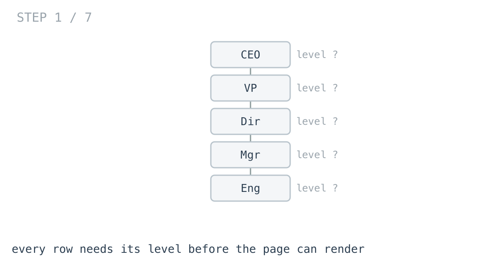
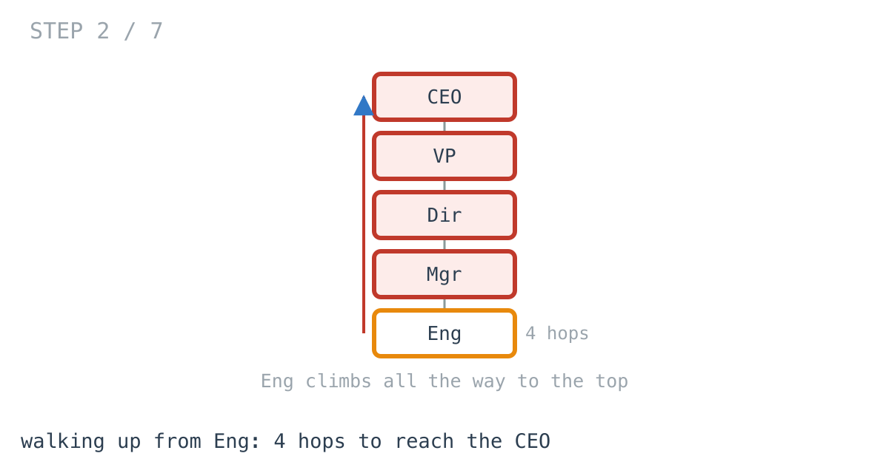
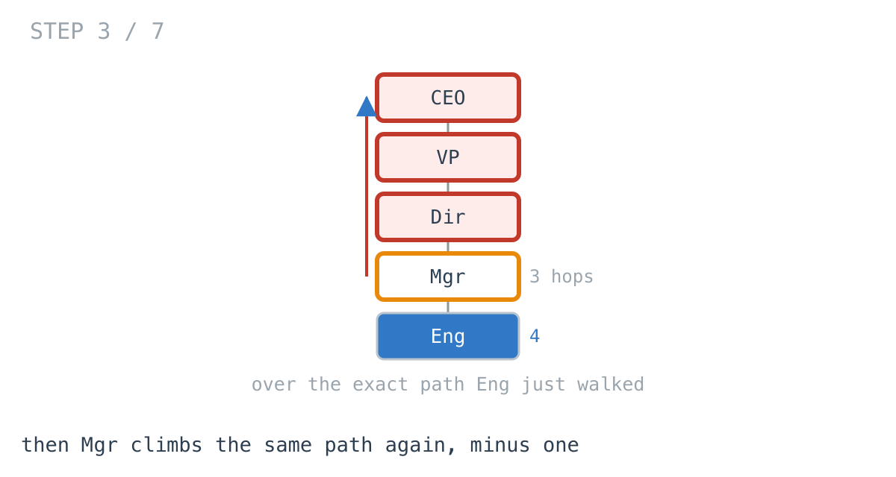
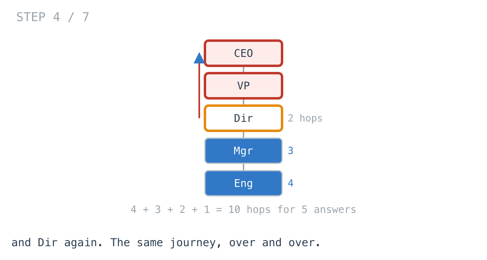
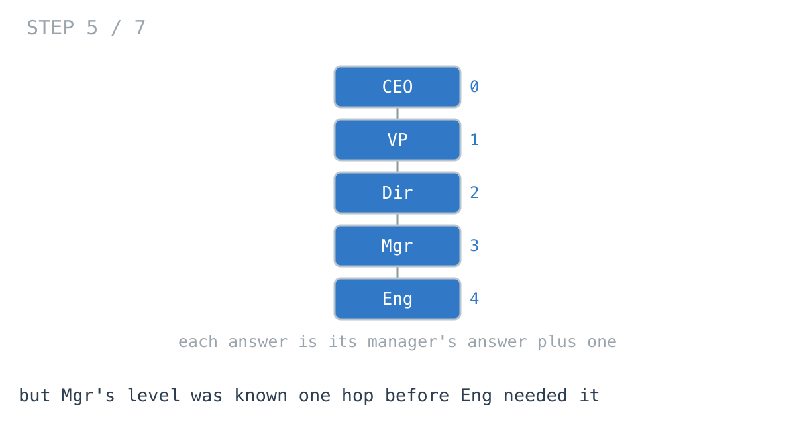
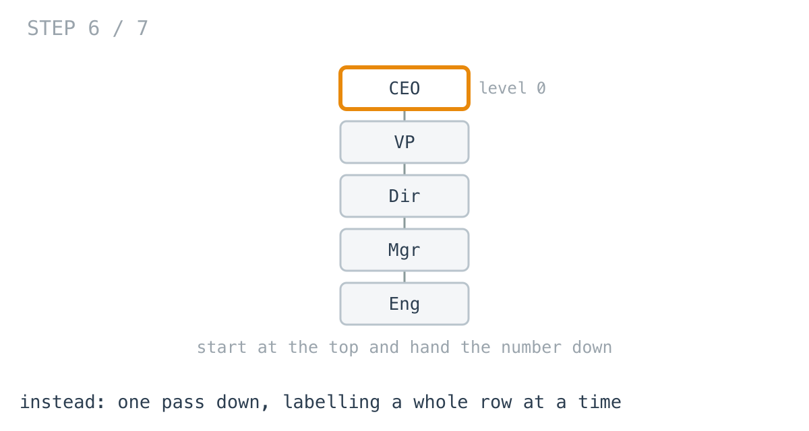
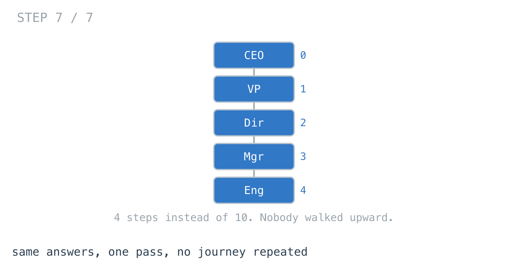

# Your org chart is fine. Your comment thread is not.

**It worked in dev · Episode 2 · technique: level order traversal**

Every row in an indented list needs to know how deep it is. That is the number
that decides how far to push it across, and you need it for every person on the
page before you can render any of them.

This episode ends somewhere unusual for a performance piece: **on a real org
chart the obvious version wins and you should keep it.** Five thousand people
finish in a millisecond. The same code on a two-thousand-deep comment thread
takes sixty-four, and that is the shape worth knowing about.

---

## The problem

You have a flat list of people. Each row carries its own manager:

```go
type Person struct {
	ID        string
	Name      string
	ManagerID string   // empty for the person at the top
}
```

Return each person's level: 0 for the person at the top, 1 for their direct
reports, and so on.





---

## What you would write

```go
func LevelsByWalkingUp(people []Person) map[string]int {
	byID := make(map[string]Person, len(people))
	for _, p := range people {
		byID[p.ID] = p
	}
	out := make(map[string]int, len(people))
	for _, p := range people {
		level, cur := 0, p
		for cur.ManagerID != "" {
			next, ok := byID[cur.ManagerID]
			if !ok {
				break
			}
			cur = next
			level++
		}
		out[p.ID] = level
	}
	return out
}
```

This one is more defensible than most first drafts.

It needs nothing you do not already have. Every row carries its own manager, so
each person's answer is derivable entirely on its own — no ordering
requirement, no tree to build first, no assumption that the data arrives in any
particular sequence. It is also the **only** version you can write if somebody
hands you one person and asks how deep they are, which is a question that gets
asked.

---

## How bad, on its own

```
Apple M1 Pro · go1.26.4 · go test -bench=BenchmarkWalkingUp -benchtime=100x
```

| shape | people | levels | walking up |
|---|---:|---:|---:|
| flat | 1,000 | 1 | 65.1 µs |
| a real company | 5,461 | 6 | 1.09 ms |
| deep thread | 200 | 200 | 503 µs |
| deeper thread | 2,000 | 2,000 | **64.0 ms** |

Read the first two rows and then stop for a second.

**Five and a half thousand people, six levels deep, in about a millisecond.**
On a page that also talks to a database, that is invisible. There is no
performance problem here and there never will be.

Now look at row four. Two thousand records — **a third** as many as the company
— taking **sixty times longer**. 64 milliseconds, of one function, counting.

And 200 to 2,000 is ten times the input for **127 times the work**. Ten in, a
hundred out is a quadratic.

The difference between those rows is not size. The company row has 5,461 people
and finishes; the thread row has 2,000 and does not.

---

## From the symptom to the shape

### The issue, said plainly

The same journey is being walked over and over.

Take a straight reporting line, ten deep. Person 10 walks up through 9, 8, 7 …
all the way to the top: ten hops. Then person 9 walks up through 8, 7, 6 …
nine hops, over **exactly the path person 10 just took**. Then person 8 does it
again.

The test suite counts them rather than the prose claiming it:

```go
if want := n * (n - 1) / 2; hops != want {
```

At 2,000 deep that is 1,999,000 hops. That is what 64 ms is spent on.





### Why is it allowed to happen?

Because each person is worked out in isolation, and isolation is the thing that
made the function so easy to write.

The loop takes one person, climbs to the top, and returns a number. It does not
know or care that the person before it climbed nearly the same path. Every
answer is computed from scratch from the raw data, which is exactly the property
that let it work on an unordered list with no tree — and exactly the property
that makes it quadratic.

That is worth noticing on its own: **the reason it is slow is the reason it is
good.**

### The answer was already computed, one hop away

Watch the order.

When person 9 finishes, we know their level. Person 10's manager **is** person
9. Person 10's level is person 9's level plus one — a single addition — and
instead we throw that away and walk the whole path again.

So the information is not missing. It was computed moments ago and discarded,
because nothing in the function is arranged to hand it along.



Nothing above names a technique yet.

### What is the shape of the data?

Worth asking, because the shape decides what is available.

Every person has exactly one manager. Follow managers upward and you always
end at somebody with none. Nothing loops back — nobody manages their own boss.
One parent, no cycles: a **tree**, arriving as a flat list that happens to
describe one.

### What does depth actually mean on a tree?

Here is the reframe.

We have been treating depth as a property of a **person** — something you
compute by asking them and following their chain. It is not. Depth is a
property of a **level**: every person at the same distance from the top has the
same answer, and their reports all have that answer plus one.

Which means depth does not have to be computed per person at all. It can be
**assigned** — handed out a whole row at a time, on the way down.



> **When every node's answer is one step from its parent's, walk down from the
> root once and carry the answer with you, instead of walking up from each node
> to find it.**

### The order this forces

Start at the top with level 0. Everyone in the queue right now is on the same
level, so label all of them, collect their reports, and that whole set is the
next level.

Children after parents, a row at a time. That is **level-order traversal**, and
[Day 1 of the challenge](https://github.com/architagr/leetcode_solutions/blob/main/easy_problems/101_200/maximum_depth_of_binary_tree/SOLUTION.md)
is exactly it: maximum depth, solved with a queue and a marker between levels
rather than recursion. The counter that ticks once per level there is the number
being written into the map here.

### When this does not apply

Two conditions, and both do work.

If you need **one person's** depth rather than everybody's, walking up wins
outright. It touches the path and stops; the level-order version builds an index
of the whole company to answer a question about one row.

If the data is **not a tree** — a matrix organisation where somebody has two
managers, or any structure with a cycle — the upward walk loops forever and the
downward walk visits nodes twice. Both need a different tool, and the flat list
will not tell you which you have.

---

## Try it before reading on

You have the rule: depth belongs to a level, not a person, and every level is
one more than the one above it.

Rewrite `LevelsByWalkingUp` so nobody walks upward at all. No recursion needed,
no sorting, and the signature does not change.

```bash
git clone https://github.com/architagr/leetcode_solutions
cd leetcode_solutions/series/it-worked-in-dev/episodes/02-org-chart-depth
go test ./...
```

---

## The version that scales

```go
func LevelsByLevelOrder(people []Person) map[string]int {
	reports := make(map[string][]string, len(people))
	var roots []string
	for _, p := range people {
		if p.ManagerID == "" {
			roots = append(roots, p.ID)
			continue
		}
		reports[p.ManagerID] = append(reports[p.ManagerID], p.ID)
	}

	out := make(map[string]int, len(people))
	queue := roots
	for level := 0; len(queue) > 0; level++ {
		// Everything in the queue sits at this level, so the whole row is
		// labelled before any of their reports are queued. That is what makes
		// the level a property of the pass rather than of each person.
		next := make([]string, 0, len(queue))
		for _, id := range queue {
			out[id] = level
			next = append(next, reports[id]...)
		}
		queue = next
	}
	return out
}
```

Two things changed. The index is now **manager → reports** rather than
ID → person, which is what lets you move downward. And `level` is a loop
variable rather than something each person works out, because it belongs to the
pass.



Note it handles several roots without any special case — an org after an
acquisition, before anybody wires the two chief executives together. The tests
cover that shape.

---

## The measurement

| shape | people | levels | walking up | level order | ratio |
|---|---:|---:|---:|---:|---:|
| flat | 1,000 | 1 | 65.1 µs | 61.6 µs | 1.1x |
| a real company | 5,461 | 6 | 1.09 ms | 572 µs | 1.9x |
| deep thread | 200 | 200 | 503 µs | 19.8 µs | 25.5x |
| deeper thread | 2,000 | 2,000 | 64.0 ms | 255 µs | **251x** |

Raw ns: 65,143 / 61,641 · 1,089,758 / 571,889 · 502,970 / 19,755 · 63,977,230 / 255,102

---

## What it costs, and why you should probably not do it

The fast version allocates **more, and far more often**: 1.12 MB across 4,152
allocations on the company shape, against 809 KB across 34. It builds a slice
per level and an index of every manager's reports.

So on the shapes an org chart actually has, you would be paying real memory and
GC pressure to turn one millisecond into half of one. That is a bad trade, and
the naive version also keeps a property the fast one loses: it can answer
*how deep is this one person* without touching anybody else.

**Write the simple one.** Then know the shape that breaks it: not a company, but
a threaded discussion, a nested category tree, a bill of materials, a dependency
chain — anywhere the structure grows by nesting rather than by breadth.

---

## The one line to keep

If every node's answer is one step from its parent's, carry it down from the
root once instead of walking up from every node to rediscover it.

---

## Run it yourself

```bash
git clone https://github.com/architagr/leetcode_solutions
cd leetcode_solutions/series/it-worked-in-dev/episodes/02-org-chart-depth
go test ./...                      # both implementations agree
go test -bench=. -benchtime=100x   # the numbers above
```

The tests assert both versions return identical maps on seven shapes including
two disconnected trees, plus 1,000 randomised orgs with the rows shuffled, since
the whole argument depends on them being the same function.

---

Part of [It worked in dev](../../), the long-form companion to the
[365-day LeetCode challenge](https://github.com/architagr/leetcode_solutions).

---

*Ideation, problem selection, benchmarks and conclusions: Archit Agarwal.
The prose was drafted with AI assistance and edited by me. Every number here
comes from a run you can reproduce with the commands above.*
