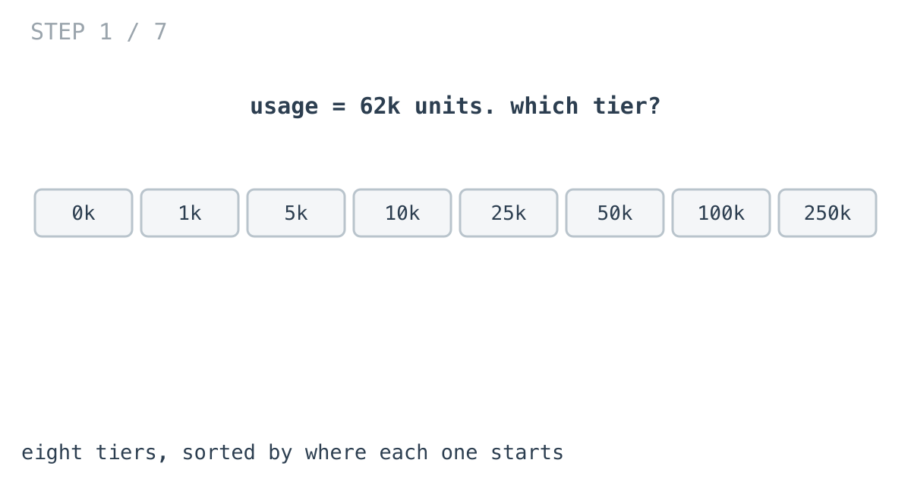
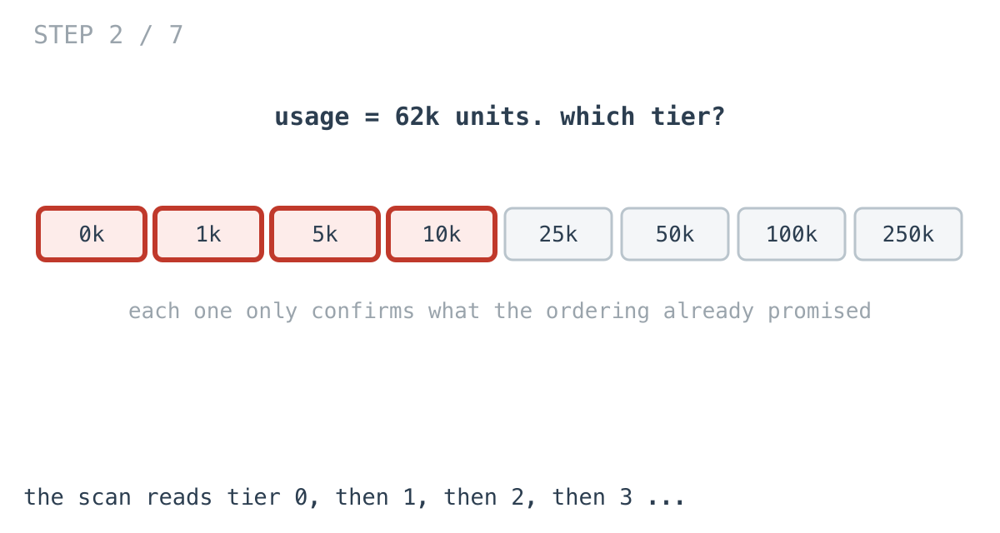
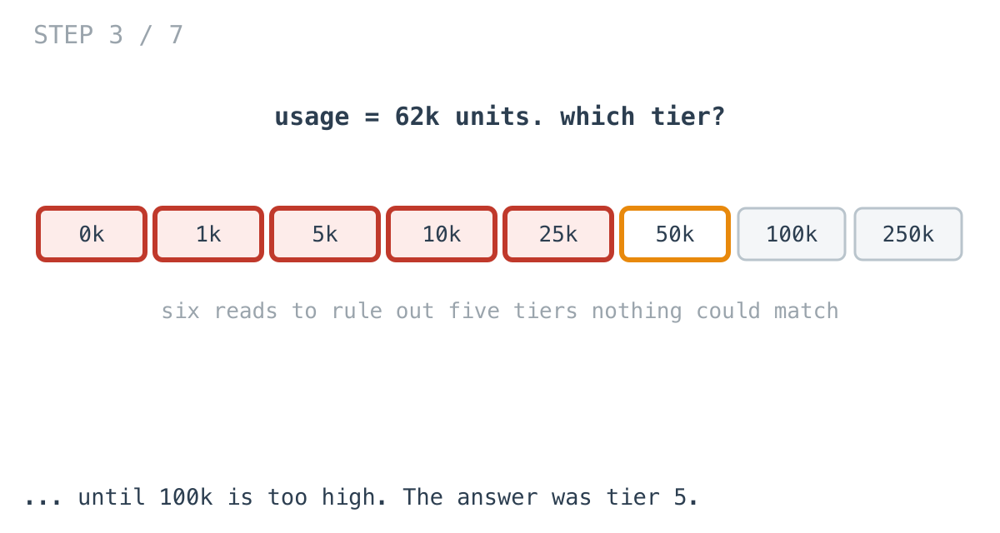
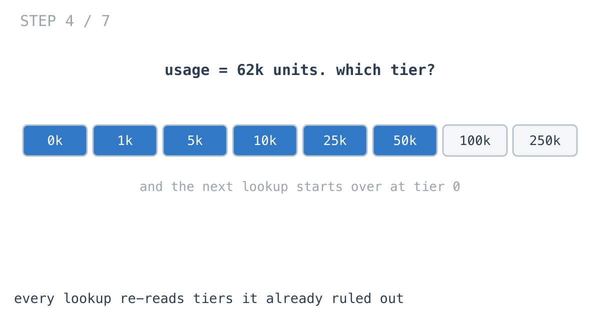
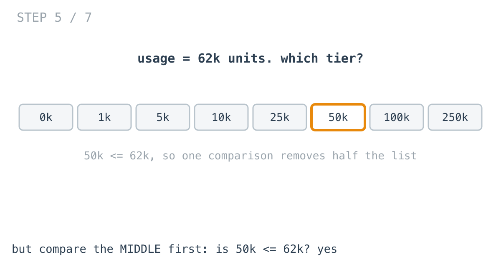
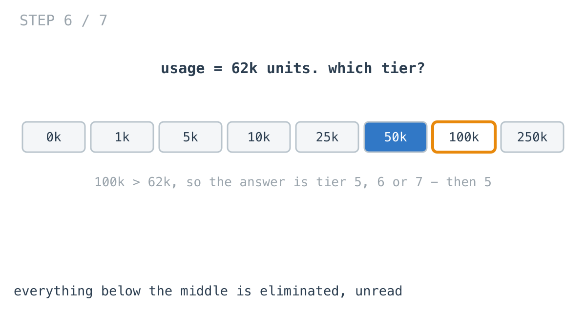
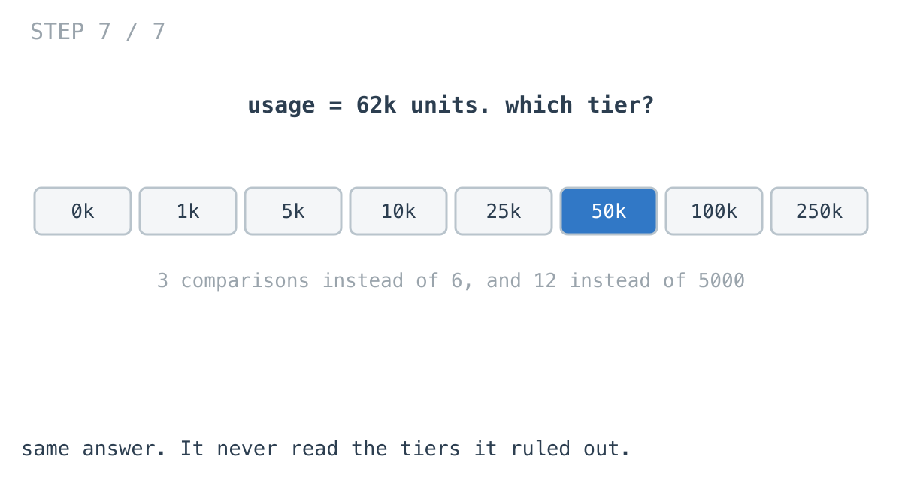

# Why adding pricing tiers made every request slower

**It worked in dev · Episode 3 · technique: binary search over sorted ranges**

Your price list had six tiers and the lookup was free. Somebody moved you to
per-region pricing and now it has five thousand, and the invoice job that used
to finish in seconds does not.

This one has a result I did not expect when I wrote the benchmark, and it is
the most useful thing in the episode.

---

## The problem

Usage-based pricing. Bands, sorted by where they start:

```go
type Tier struct {
	MinUnits  int
	PricePerK int    // cents per thousand units
	Name      string
}
```

Given a usage figure, which band does it fall into?



**A hash map cannot answer this.** That is what makes it different from
[episode 1](../01-dedupe-user-list/), where a set solved everything. There, the
question was *is this exact value present*. Here you are asking *which range
contains this value*, and a customer who used 4,732 units is not a key in
anything — no map has an entry for 4,732, and there is no useful key to build
one from.

---

## What you would write

```go
func TierForScan(tiers []Tier, units int) (Tier, bool) {
	var found Tier
	var ok bool
	for _, t := range tiers {
		if t.MinUnits > units {
			break
		}
		found, ok = t, true
	}
	return found, ok
}
```

This is the clearest possible statement of what a tier is: keep taking tiers
while they still apply, and the last one that did is the answer. It assumes
nothing about the list beyond it being in order, and it reads the way the
pricing page reads.

---

## How bad, on its own

Each figure below is **1,000 lookups**, because one lookup is never the
workload — this is a month of usage rows being priced.

```
Apple M1 Pro · go1.26.4 · go test -bench=BenchmarkScan -benchtime=200x
```

| tiers | scan, per 1,000 lookups |
|---:|---:|
| 6 | 2.56 µs |
| 50 | 16.6 µs |
| 500 | 98.1 µs |
| 5,000 | 901 µs |

Straight-line growth: ten times the tiers, ten times the cost. Which is exactly
what "adding tiers made every request slower" means — each lookup got longer,
and there are a lot of lookups.

---

## From the symptom to the shape

### The issue, said plainly

Every lookup reads tiers it has already ruled out.

To decide that 4,732 units lands in tier 4, the loop reads tier 0, tier 1, tier
2 and tier 3 first. Every one of those reads confirms something the list's own
ordering already guaranteed: if tier 3 starts below 4,732, then tier 2 does too,
and tier 1, and tier 0. The loop re-establishes that fact one element at a time.







### Why is it allowed to happen?

Because the loop treats the list as a bag of tiers that happens to be in order,
rather than as an ordered thing.

`break` is the one place it uses the ordering at all, and only to stop early. Up
to that point it moves one step at a time, which is exactly what you would do if
the tiers were shuffled.

### We already know what we will find, before we look

Here is the part worth sitting with.

Look at any single tier and compare it to the usage figure. If `tiers[i].MinUnits`
is **greater** than the usage, then every tier after `i` also is — they all start
higher. The answer is somewhere before `i`, and you know that from one
comparison.



That is not a fact about this data. It is a fact the sorted order gives you for
free, on every comparison, and the scan throws it away every time.

### What shape is the question?

Worth being precise, because it is the shape that decides the tool.

We are not asking *is this value present* — that was episode 1, and a set
answered it. We are asking **which range contains this value**, over a set of
ranges that are **sorted and do not overlap**.

Those two properties are the whole inventory. Sorted, and non-overlapping.

### What does sorted actually buy you?

One comparison against any element does not tell you about that element. It
tells you about **everything on one side of it**.

So compare against the middle. Either the answer is in the top half or the
bottom half, and half the list is gone — not because of anything about the
data, but because it was in order.





> **When the question is "which range contains this", and the ranges are sorted,
> every comparison should eliminate half of what is left rather than one item.**

Halving repeatedly is **binary search**, and
[day 2 of the challenge](https://github.com/architagr/leetcode_solutions/blob/main/easy_problems/101_200/convert_sorted_array_to_binary_search_tree/SOLUTION.md)
is the same idea wearing a different hat: building a balanced tree from a sorted
array by taking the middle element as the root and recursing on each half. The
tree built there *is* the decision sequence a binary search follows. Same
midpoint, same halving, one written as a structure and one as a loop.

### When this does not apply

Three conditions, and all of them do work.

If the ranges **overlap**, one comparison no longer rules out a side, because a
match can sit on either. You need an interval tree, and this gives you a wrong
answer rather than a slow one.

If the list is **not sorted**, the same thing. And sorting it to use this only
pays if you look up more than once, which brings us to the last one.

If the list is **short**, binary search is slower. That is not a caveat. It is
the actual result of this episode, and it is next.

---

## Try it before reading on

You have the rule: the ranges are sorted, so one comparison should eliminate
half of them.

Rewrite `TierForScan` so it does not read tiers it has already ruled out. Watch
the boundaries — a usage figure landing exactly on a tier's `MinUnits` belongs
to that tier, not the one before.

```bash
git clone https://github.com/architagr/leetcode_solutions
cd leetcode_solutions/series/it-worked-in-dev/episodes/03-pricing-tier-lookup
go test ./...
```

The tests probe every boundary and both sides of it, over 3,000 random price
lists, which is roughly the amount of paranoia binary search deserves.

---

## The version that scales

```go
func TierForBinary(tiers []Tier, units int) (Tier, bool) {
	if len(tiers) == 0 || tiers[0].MinUnits > units {
		return Tier{}, false
	}
	lo, hi := 0, len(tiers)-1
	for lo < hi {
		// Bias the midpoint upward. With lo and hi adjacent, rounding down
		// would pick lo, and the lo = mid branch would never advance - the
		// loop would spin forever on two remaining candidates.
		mid := (lo + hi + 1) / 2
		if tiers[mid].MinUnits <= units {
			lo = mid
		} else {
			hi = mid - 1
		}
	}
	return tiers[lo], true
}
```

`lo` ends on the last tier whose `MinUnits` is at or below the usage, which is
the definition of the answer.

That `+ 1` in the midpoint is not a style choice. Without it, `lo` and `hi`
adjacent gives `mid == lo`, the `lo = mid` branch changes nothing, and the loop
runs forever. It is the classic way to get this wrong, and it is why the tests
hammer the boundaries.

---

## The measurement, and the surprise

| tiers | scan | binary search | winner |
|---:|---:|---:|---|
| 6 | 2.56 µs | 4.26 µs | **scan, by 1.7x** |
| 50 | 16.6 µs | 14.8 µs | binary, by 1.1x |
| 500 | 98.1 µs | 22.4 µs | binary, by 4.4x |
| 5,000 | 901 µs | 39.4 µs | binary, by 22.9x |

Raw ns: 2,556 / 4,256 · 16,589 / 14,794 · 98,062 / 22,402 · 901,077 / 39,386

**At six tiers — which is what a price list actually has — the scan is 1.7 times
faster.** Not equal. Faster.

Six sequential reads sit in one cache line and the branch predictor learns the
loop immediately. Binary search on six elements makes three jumps to
unpredictable offsets, with a branch that is a coin flip every time, and pays
that to avoid work that was never expensive.

The two meet at **around fifty tiers**. Below that the clever version is a
pessimisation. Above it, the gap opens quickly.

---

## What it costs

Not memory, for once. Both report `0 B/op` at every size — the scan holds one
variable, the binary search holds three integers, and nothing is built. That
makes this episode different from the two before it, where speed was bought with
allocations.

The cost is an **invariant**. The list has to stay sorted, and now something
depends on it silently: feed the binary search an unsorted list and it returns a
confidently wrong tier, where the scan would have returned a slightly different
wrong tier and been just as quiet about it. If those tiers come from a database,
that is an `ORDER BY` somebody can delete in a refactor and no test will notice
unless you wrote one.

The other cost is the `+ 1`.

**So at six tiers, write the scan.** It is faster, it is obviously correct, and
it has no invariant to protect. Reach for the other one when the list stops
being a price list — a rate-limit table, a geo-IP range table, a histogram
bucket lookup, a leaderboard band — where the count is in the thousands and the
lookups are in the millions.

---

## The one line to keep

When the question is "which range contains this" and the ranges are sorted, a
comparison should eliminate half of what is left — but only once the list is
long enough that halving beats reading it.

---

## Run it yourself

```bash
git clone https://github.com/architagr/leetcode_solutions
cd leetcode_solutions/series/it-worked-in-dev/episodes/03-pricing-tier-lookup
go test ./...                                  # both implementations agree
go test -bench=. -benchtime=200x -run=XXX      # the numbers above
```

The scan is the reference implementation, so the binary search is checked
against it rather than against hand-written expectations: 3,000 random price
lists, probing every boundary, both sides of every boundary, below the first
tier and past the last.

---

Part of [It worked in dev](../../), the long-form companion to the
[365-day LeetCode challenge](https://github.com/architagr/leetcode_solutions).

---

*Ideation, problem selection, benchmarks and conclusions: Archit Agarwal.
The prose was drafted with AI assistance and edited by me. Every number here
comes from a run you can reproduce with the commands above.*
