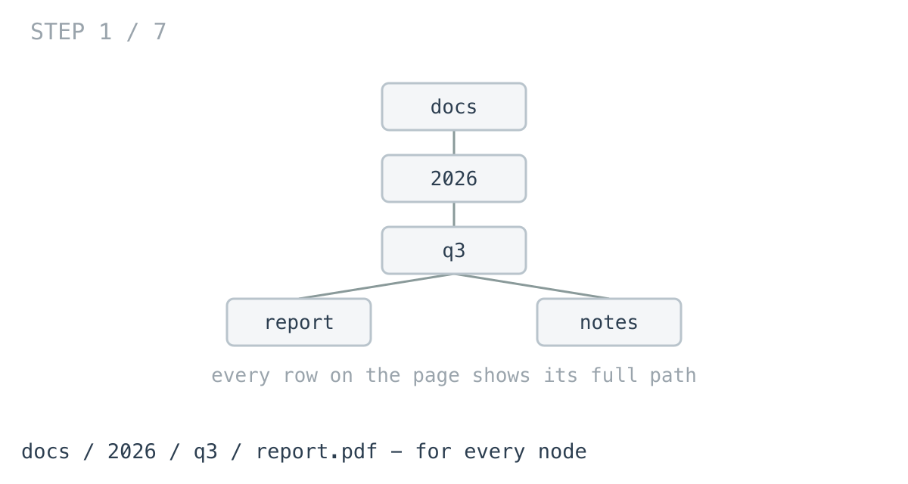
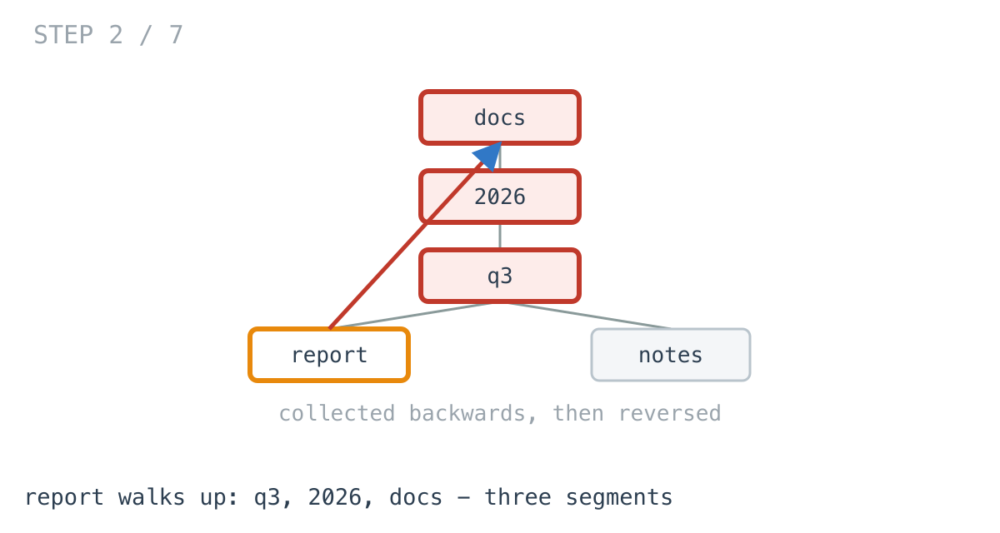
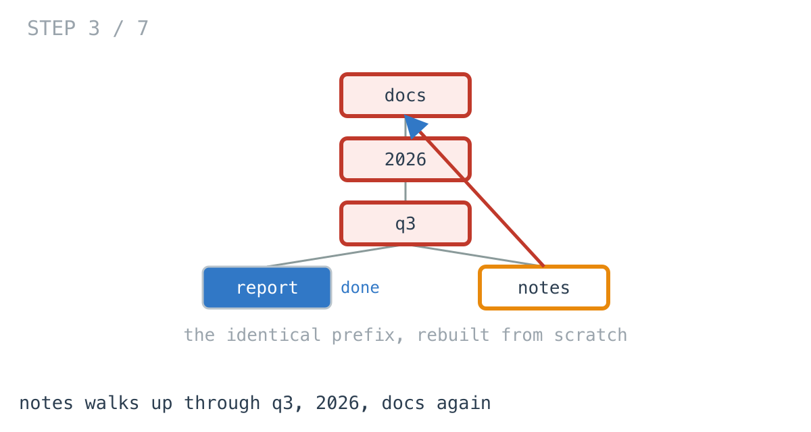
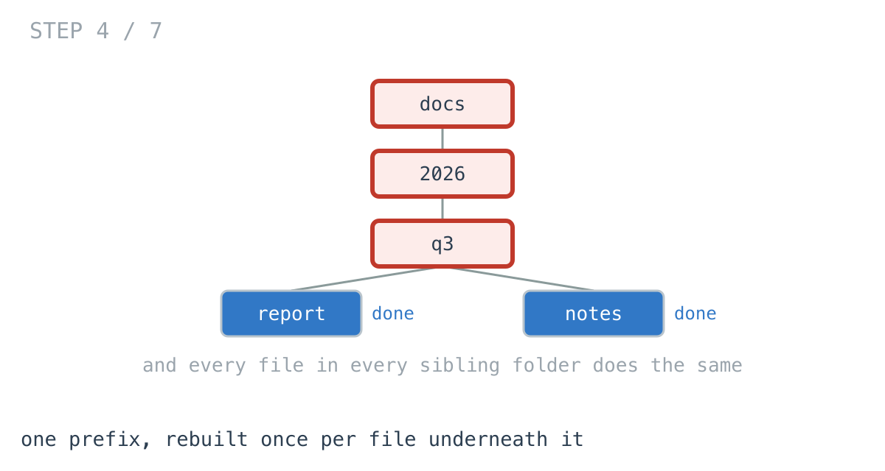
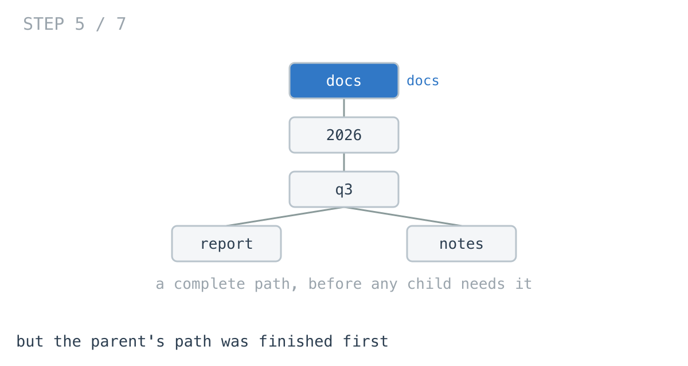
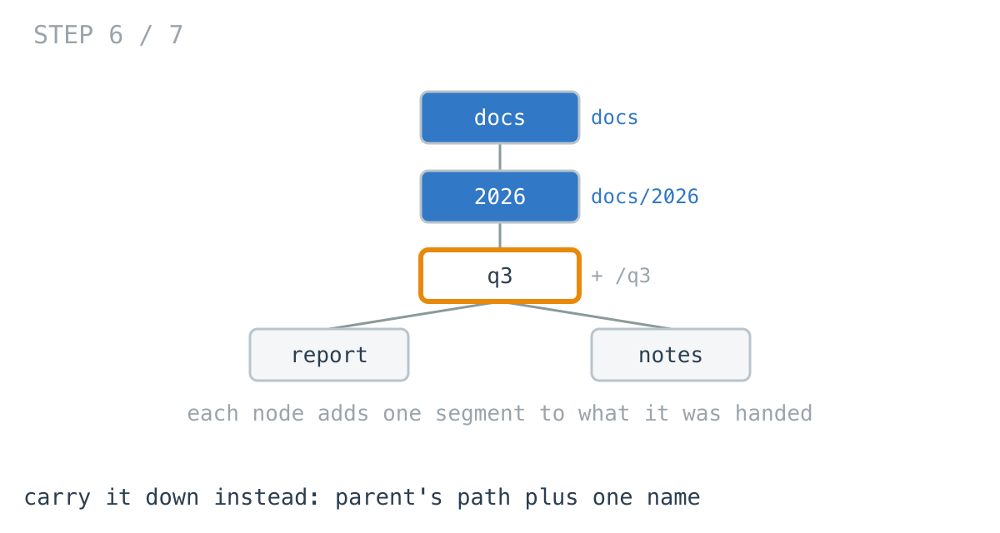
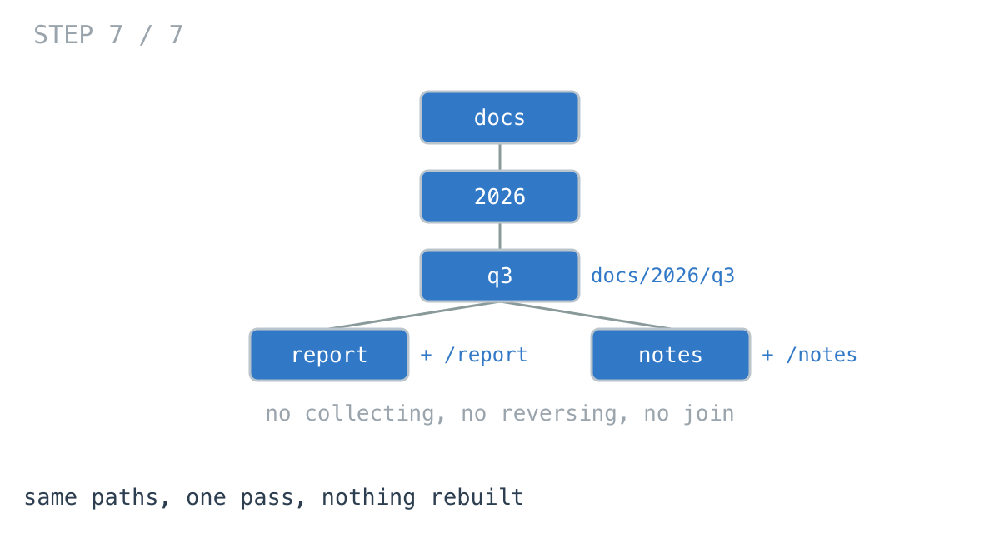

# Why the breadcrumbs cost more than the file list

**It worked in dev · Episode 4 · technique: root-to-leaf path building**

Listing a folder is cheap. Showing each row's full path — `docs / 2026 / q3 /
report.pdf` — turned out to cost three times as much as everything else on the
page, and on a deep tree, thirteen.

---

## The problem

A tree of folders and files. Each node knows its own name and its parent:

```go
type Node struct {
	Name     string
	Parent   *Node
	Children []*Node
}
```

Produce the full path of **every** node, because every row on the page displays
one.



---

## What you would write

```go
func PathsByWalkingUp(all []*Node) map[*Node]string {
	out := make(map[*Node]string, len(all))
	for _, n := range all {
		var parts []string
		for cur := n; cur != nil; cur = cur.Parent {
			parts = append(parts, cur.Name)
		}
		for i, j := 0, len(parts)-1; i < j; i, j = i+1, j-1 {
			parts[i], parts[j] = parts[j], parts[i]
		}
		out[n] = strings.Join(parts, Sep)
	}
	return out
}
```

This is a fair first version and I would sign it off.

Each node's path is derivable from the node alone — no traversal order to get
right, no state threaded through a recursion, no requirement that you hold the
whole tree. It works identically on one node or a million, which matters,
because *show me the path of the file I just clicked* is a real request and this
answers it directly.

---

## How bad, on its own

```
Apple M1 Pro · go1.26.4 · go test -bench=BenchmarkWalkingUp -benchtime=100x
```

| shape | nodes | walking up |
|---|---:|---:|
| one folder, 500 files | 501 | 47.9 µs |
| a project tree, 5 levels | 1,365 | 275 µs |
| 100 deep | 101 | 108 µs |
| 600 deep | 601 | **3.66 ms** |

Row one is fine and always will be. Row two is a real project tree and it is
already costing a quarter of a millisecond to produce nothing but strings.

Row four is 601 nodes — **fewer than half** the project tree — taking **thirteen
times longer**.

Six times the depth, from 100 to 600, costs **33.9 times the work**.

---

## From the symptom to the shape

### The issue, said plainly

The same prefix is rebuilt from scratch for every node underneath it.

`docs/2026/q3/report.pdf` walks up through `q3`, `2026`, `docs`. Its sibling
`notes.md` walks up through `q3`, `2026`, `docs` again. Every file in that
folder re-derives the identical prefix, and so does every file in every folder
beside it.

The tests count it rather than the prose claiming it:

```go
want := (d + 1) * (d + 2) / 2
```

At 600 deep that is 181,503 segments copied. That is what 3.66 ms buys.







### Why is it allowed to happen?

Because each path is computed from the node alone, and that independence is the
whole reason the function is so easy to write.

It asks nothing of the order, holds no state between nodes, and cannot be got
wrong. It is also why it re-walks a chain it finished a microsecond ago: there
is nowhere for that work to have been kept.

### The parent's answer was finished before the child needed it

Watch the order.

`docs/2026/q3` is a complete path. `report.pdf` sits directly inside it, and its
path is that string plus one separator plus one name — a concatenation, not a
walk.

So the prefix is not missing. On any sensible traversal it was finished moments
earlier, and the upward version throws it away because it never visits parents
before children in the first place.



### What shape is this, and which direction does it want?

Every node has one parent, chains end at the root, nothing loops. A tree.

And the thing being built has a direction. A path reads **root first**. The
upward walk collects it backwards and then reverses it — which is a fair signal
on its own: **when you find yourself reversing, you gathered it the wrong way
round.**

### The rule

> **When a node's answer is its parent's answer plus a little, compute it on the
> way down and hand it to the children, instead of reconstructing it upward from
> each node.**



That is exactly
[day 3 of the challenge](https://github.com/architagr/leetcode_solutions/blob/main/easy_problems/201_300/binary_tree_path/SOLUTION.md)
— root-to-leaf paths, built by passing the prefix into the recursion as a
parameter, so each node receives a finished string rather than building one.
Strings being immutable in Go is what makes siblings safe from each other, with
no undo step.

### When this does not apply

If you want **one** node's path, walk up. It touches that chain and stops; the
downward version traverses the entire tree to answer a question about one row.

If the tree has no usable root — you were handed a flat list of nodes with
parent pointers and nothing else — the downward version has nowhere to start
until you find the roots, and that is a pass of its own.

---

## Try it before reading on

You have the rule: a child's path is its parent's path plus one segment, and a
path reads root-first so there should be nothing to reverse.

Rewrite it so no node walks upward. No extra data structure needed, and nothing
to undo between siblings.

```bash
git clone https://github.com/architagr/leetcode_solutions
cd leetcode_solutions/series/it-worked-in-dev/episodes/04-file-breadcrumbs
go test ./...
```

---

## The version that scales

```go
func PathsByCarryingDown(root *Node) map[*Node]string {
	out := make(map[*Node]string)
	var visit func(n *Node, prefix string)
	visit = func(n *Node, prefix string) {
		path := n.Name
		if prefix != "" {
			path = prefix + Sep + n.Name
		}
		out[n] = path
		for _, c := range n.Children {
			// path is a local string and strings are immutable, so siblings
			// cannot disturb each other's prefix - no undo step is needed.
			visit(c, path)
		}
	}
	if root != nil {
		visit(root, "")
	}
	return out
}
```

No collecting, no reversing, no join. A node receives a finished prefix and adds
one segment.



Note the signature changed from `[]*Node` to `*Node`. That is the trade arriving
in the open: the function now needs the tree, not a bag of nodes.

---

## The measurement

| shape | nodes | walking up | carrying down | ratio |
|---|---:|---:|---:|---:|
| one folder, 500 files | 501 | 47.9 µs | 36.1 µs | 1.3x |
| a project tree, 5 levels | 1,365 | 275 µs | 93.0 µs | 3.0x |
| 100 deep | 101 | 108 µs | 12.0 µs | 9.0x |
| 600 deep | 601 | 3.66 ms | 275 µs | **13.3x** |

Raw ns: 47,912 / 36,082 · 275,108 / 92,982 · 107,895 / 12,048 · 3,659,173 / 275,371

---

## What it costs: less, for once

The two episodes before this one bought speed with memory. This one does not.

| shape | walking up | carrying down |
|---|---|---|
| a project tree | 402 KB / 6,738 allocs | 146 KB / 1,386 allocs |
| 600 deep | **8.58 MB / 6,043 allocs** | **1.27 MB / 617 allocs** |

At 600 deep the upward version allocates **6.7x the memory across 9.8x as many allocations**, because every node builds a slice of segments, reverses
it, joins it, and drops all of it.

The real cost is the signature. `PathsByCarryingDown` needs a root, so it can no
longer answer *what is the path of this one node* without walking the whole
tree — and that question is the one the naive version was uniquely good at. In a
file browser you want both: the downward pass for the listing, the upward walk
for the row somebody clicked.

**And there is a floor this cannot get under.** In a chain of `n` nodes, the
node at depth `d` has `d + 1` segments in its path, so the total size of the
answer is quadratic in `n` before any code exists. Carrying down removes the
repeated *walking*; it cannot remove the output. That is why the deep rows still
grow faster than linearly, and why the flat row — where paths are short — is
only 1.3x.

---

## The one line to keep

If you are reversing what you collected, you gathered it in the wrong direction.

---

## Run it yourself

```bash
git clone https://github.com/architagr/leetcode_solutions
cd leetcode_solutions/series/it-worked-in-dev/episodes/04-file-breadcrumbs
go test ./...                      # both implementations agree
go test -bench=. -benchtime=100x -run=XXX
```

The tests assert both versions produce identical maps on five shapes plus 500
randomly grown trees, since the whole argument depends on them being the same
function.

---

Part of [It worked in dev](../../), the long-form companion to the
[365-day LeetCode challenge](https://github.com/architagr/leetcode_solutions).
