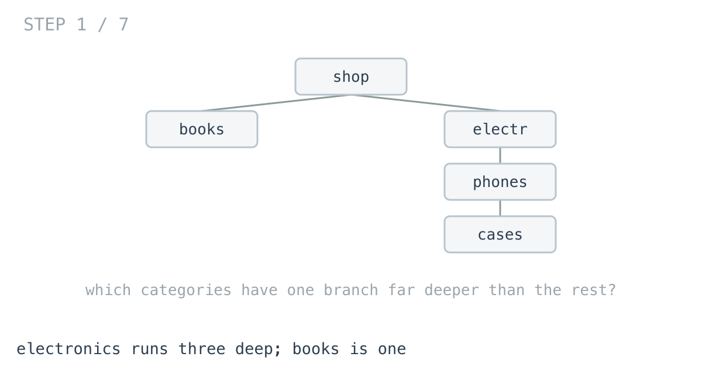
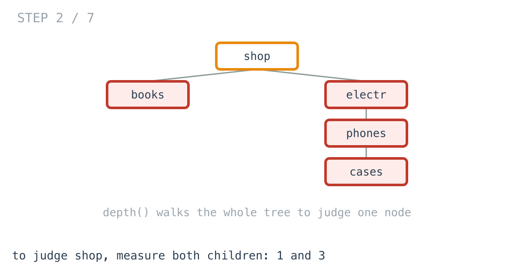
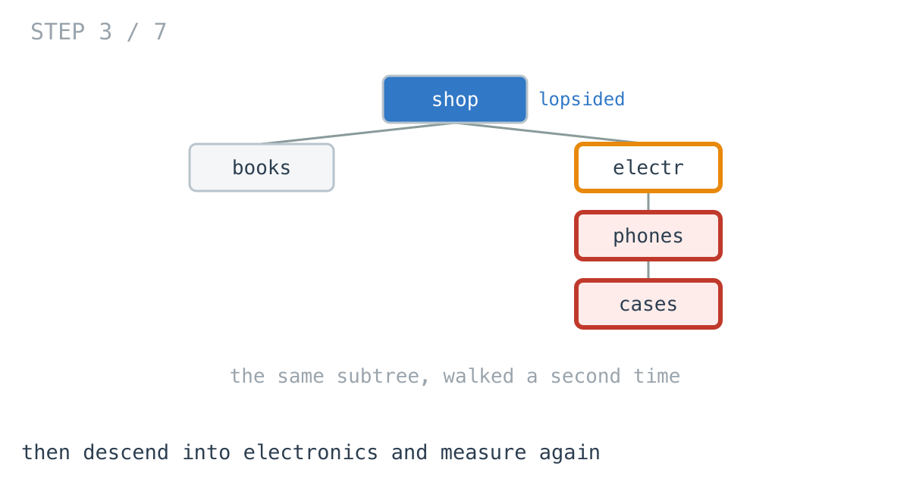
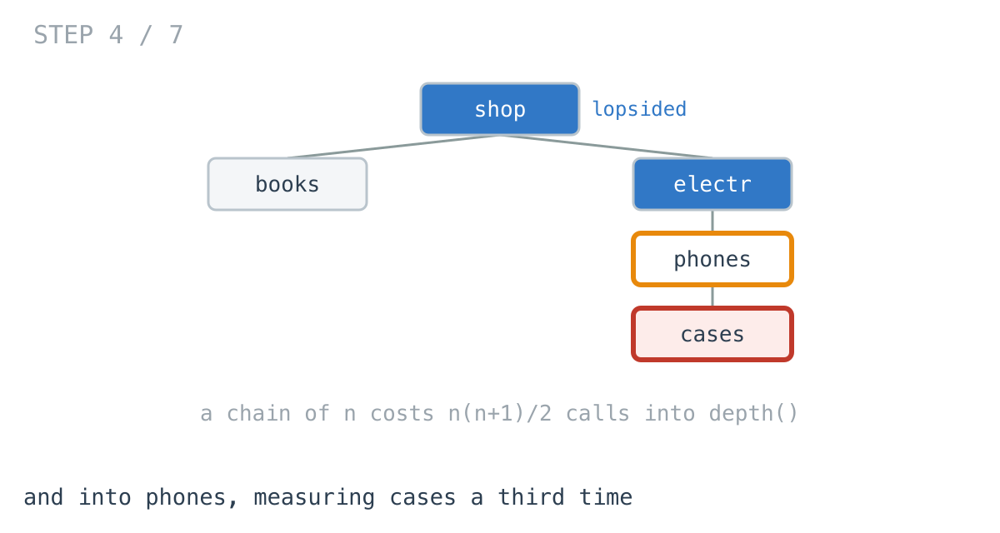
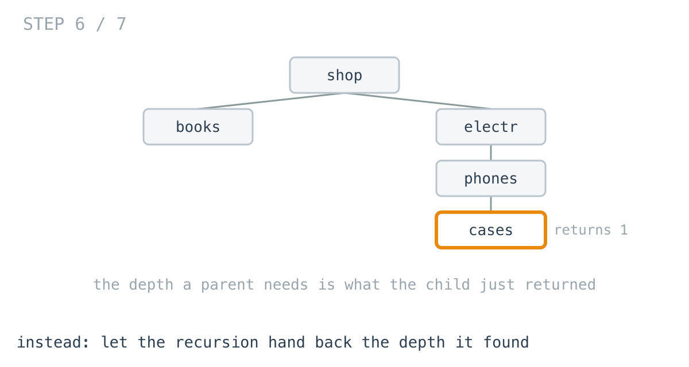
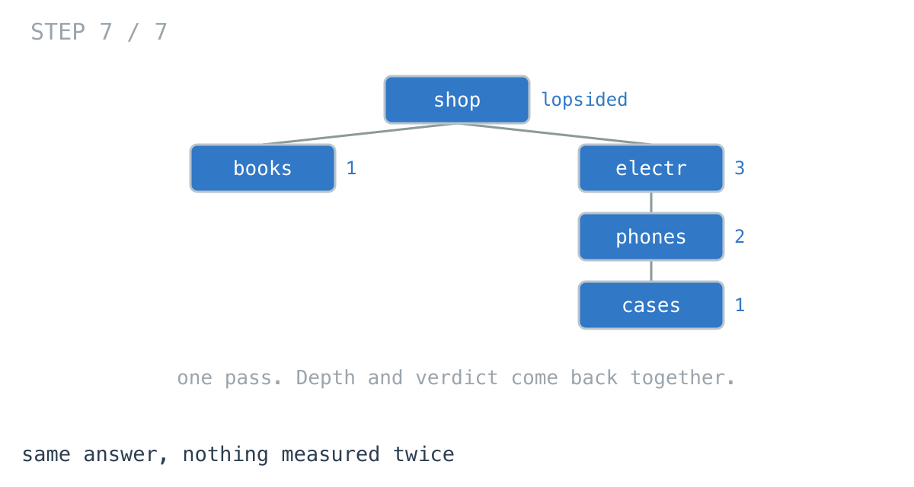

# Why your nav health check slowed down as the menu grew

**It worked in dev · Episode 5 · technique: returning two facts from one pass**

You run a check over the category tree to find branches that have grown
lopsided — one section eight levels deep while its siblings are two, which is
what makes a single navigation page feel slow.

The check was instant. Then one section kept growing, and the check became
slower than anything it was checking.

---

## The problem

A navigation tree:

```go
type Category struct {
	Name     string
	Children []*Category
}
```

Report every category whose children differ in depth by more than one. Those
are the lopsided ones.



---

## What you would write

```go
func depth(c *Category) int {
	if c == nil {
		return 0
	}
	best := 0
	for _, ch := range c.Children {
		if d := depth(ch); d > best {
			best = d
		}
	}
	return best + 1
}
```

and then, for each category, ask how deep each child is and compare:

```go
lo, hi := -1, -1
for _, ch := range c.Children {
	d := depth(ch)
	if lo == -1 || d < lo { lo = d }
	if d > hi { hi = d }
}
if len(c.Children) > 1 && hi-lo > MaxTilt {
	out = append(out, c.Name)
}
```

I want to defend this properly, because it is better code than most first
drafts.

It reads exactly like the definition of the thing. `depth` is small, obviously
correct and useful on its own. And the two concerns stay **separate**: one
function measures, the other judges. That separation is normally the thing you
are told to want, and it is the reason nobody looks at this again.

---

## How bad, on its own

```
Apple M1 Pro · go1.26.4 · go test -bench=BenchmarkAskingTwice -benchtime=100x
```

| shape | nodes | asking twice |
|---|---:|---:|
| nav tree, 3 levels | 156 | 1.48 µs |
| nav tree, 4 levels | 781 | 9.51 µs |
| one branch, 200 deep | 201 | 146 µs |
| one branch, 1,000 deep | 1,001 | **3.95 ms** |

Row two is a real navigation tree — 781 categories — in under ten microseconds.
Fine, permanently.

Row four has **1,001** categories, barely more, and takes **415.6 times longer**.

Five times the depth costs **27 times the work**.

And note what that means: the check gets expensive under exactly the condition
it exists to detect. It is slowest on the trees you most need it to run on.

---

## From the symptom to the shape

### The issue, said plainly

The depth of a subtree is measured again for every ancestor above it.

To judge the root, `depth` runs over the whole tree. To judge the root's child,
it runs over that child's whole subtree — which it just finished walking. To
judge the grandchild, again.

The tests count it rather than the prose claiming it:

```go
if want := n * (n + 1) / 2; calls != want {
```

At 1,000 deep that is 500,500 entries into `depth`. That is what 3.95 ms buys.







### Why is it allowed to happen?

Because `depth` and the balance check are separate functions, and separateness
is what makes them both easy to read.

`depth` cannot know who is asking or what was measured a moment ago — it takes a
category and starts from nothing, every time. That is the property that makes it
reusable, and it is the property that makes this quadratic.

Which is the same trap as the last few episodes in a different costume: the
thing that makes the code good is the thing that makes it slow.

### The answer was computed and thrown away

Watch the order.

`walk` visits the root, and to judge it calls `depth` on each child. Those calls
compute the exact depth of every child — and return a single number that gets
compared and discarded. Then `walk` descends into a child and computes its
children's depths again.


The information was not missing. It was produced by the call one level up and
thrown away, because the function was only asked for a comparison.

### What is the shape of the question?

Two questions are being asked of every node, and they are being asked
separately:

1. *How deep are you?*
2. *Is anything under you lopsided?*

The second one needs the first. And critically, **the first is already computed
while answering the second** — you cannot know whether a node is balanced
without knowing how deep its children are.

So they are not two traversals that happen to visit the same tree. They are one
traversal that was split in half, and the half that was thrown away is the
expensive one.

### The rule

> **When a function has to compute something on the way to its answer, and the
> caller needs that something too, return both. A second traversal to recover a
> value the first one already had is the most expensive kind of tidiness.**



That is
[day 5 of the challenge](https://github.com/architagr/leetcode_solutions/blob/main/easy_problems/101_200/balanced_binary_tree/SOLUTION.md)
exactly — `validateTree` returns `(height, ok)` in one postorder pass, and its
own comment says why: checking height at every node is O(n²). The height half
comes from
[day 1](https://github.com/architagr/leetcode_solutions/blob/main/easy_problems/101_200/maximum_depth_of_binary_tree/SOLUTION.md).

### When this does not apply

If the two facts are **not** computed together — if answering the second does
not already require the first — then fusing them buys nothing and costs you the
separation. This works here only because depth is unavoidable on the way to a
balance verdict.

And if `depth` is called **once**, from one place, leave it alone. The cost is
not in the function; it is in calling it once per ancestor.

---

## Try it before reading on

You have the rule: the check already knows each child's depth by the time it
judges the parent, so nothing should ask twice.

Rewrite it as a single traversal. The signature of the inner function has to
change — that is the whole move.

```bash
git clone https://github.com/architagr/leetcode_solutions
cd leetcode_solutions/series/it-worked-in-dev/episodes/05-lopsided-categories
go test ./...
```

---

## The version that scales

```go
func LopsidedInOnePass(root *Category) []string {
	var out []string
	var visit func(*Category) int
	visit = func(c *Category) int {
		if c == nil {
			return 0
		}
		lo, hi := -1, -1
		for _, ch := range c.Children {
			// visit returns the child's depth AND records anything lopsided
			// beneath it, so the parent never asks a second time.
			d := visit(ch)
			if lo == -1 || d < lo { lo = d }
			if d > hi { hi = d }
		}
		if len(c.Children) > 1 && hi-lo > MaxTilt {
			out = append(out, c.Name)
		}
		if hi < 0 { hi = 0 }
		return hi + 1
	}
	visit(root)
	return out
}
```

`visit` does both jobs: it returns the depth its caller needs, and appends to
`out` on the way. `depth` is gone entirely.



---

## The measurement

| shape | nodes | asking twice | one pass | ratio |
|---|---:|---:|---:|---:|
| nav tree, 3 levels | 156 | 1.48 µs | 637 ns | 2.3x |
| nav tree, 4 levels | 781 | 9.51 µs | 4.05 µs | 2.4x |
| one branch, 200 deep | 201 | 146 µs | 2.50 µs | 58.6x |
| one branch, 1,000 deep | 1,001 | 3.95 ms | 13.2 µs | **298.7x** |

Raw ns: 1,482 / 637 · 9,514 / 4,047 · 146,488 / 2,498 · 3,954,433 / 13,239

---

## What it costs

Not memory. Both report `0 B/op` at every shape — the recursion carries
integers, and the only allocation either makes is the result slice.

Two real costs, though.

**The reporting order changes.** Asking twice reports a parent before the
categories inside it, because it judges on the way down. One pass cannot: a
parent's verdict is not known until its children have returned, so it reports
bottom-up. The set is identical and the order is not, and if anything downstream
relied on that order it will now be wrong rather than slow. There is a test
pinning the difference so nobody discovers it in production.

**The concerns are fused.** `depth` was a small, obviously-correct, independently
useful function, and it is gone. Anything else that wanted a depth now has to
either re-add it or thread through a function whose job is finding lopsided
categories. That is a genuine loss, and it is why the readable version is the
right call at 781 nodes.

**So keep the simple one for a navigation menu.** Reach for this when the tree
is one that grows by nesting — a threaded discussion, a file system, a
dependency graph, a bill of materials — or when the check runs on every request
rather than in a nightly job.

---

## The one line to keep

A second traversal to recover a value the first one already computed is the most
expensive kind of tidiness.

---

## Run it yourself

```bash
git clone https://github.com/architagr/leetcode_solutions
cd leetcode_solutions/series/it-worked-in-dev/episodes/05-lopsided-categories
go test ./...                      # both find the same categories
go test -bench=. -benchtime=100x   # the numbers above
```

The tests assert both versions find the same set on five shapes and 1,000
randomly grown trees, pin the ordering difference deliberately, and count the
`depth` calls rather than letting the write-up claim the number.

---

Part of [It worked in dev](../../), the long-form companion to the
[365-day LeetCode challenge](https://github.com/architagr/leetcode_solutions).

---

*Ideation, problem selection, benchmarks and conclusions: Archit Agarwal.
The prose was drafted with AI assistance and edited by me. Every number here
comes from a run you can reproduce with the commands above.*
