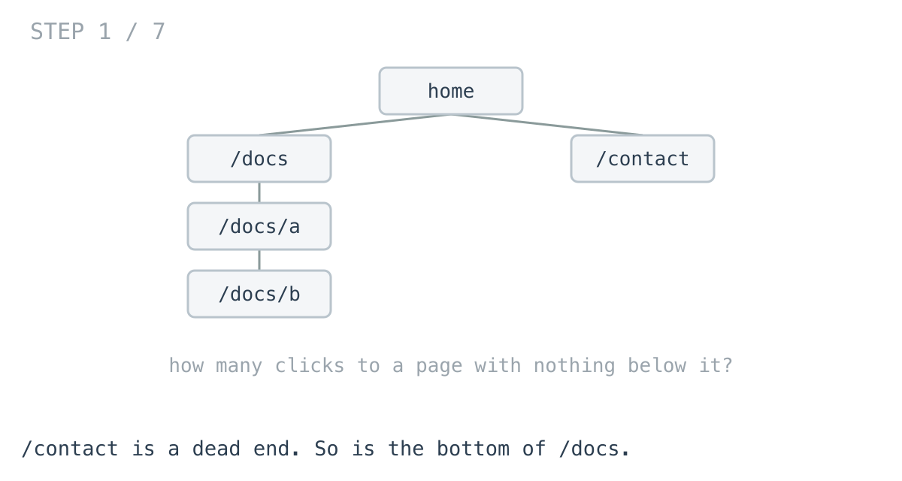
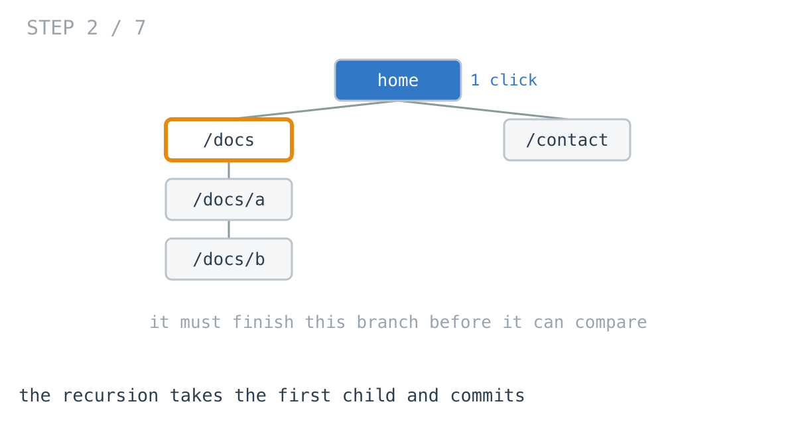
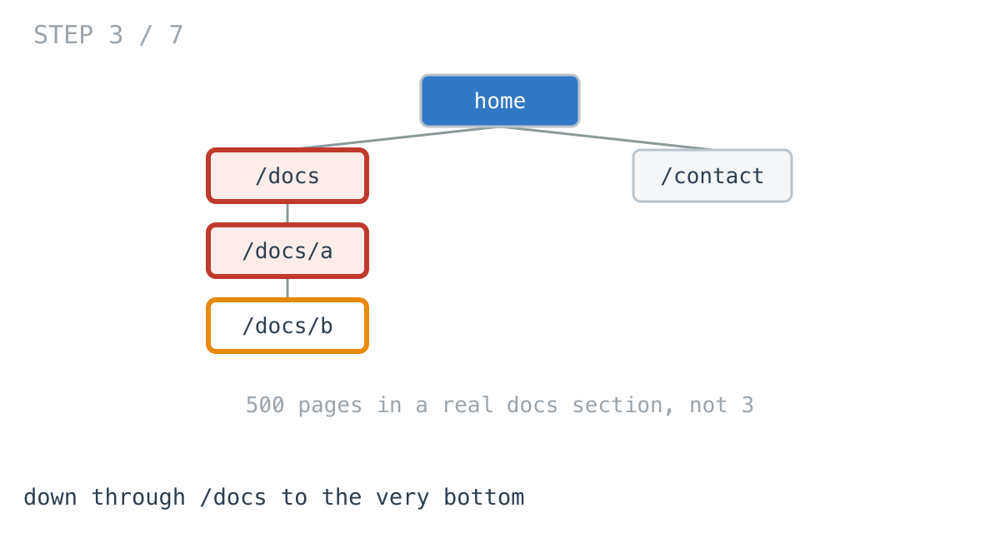
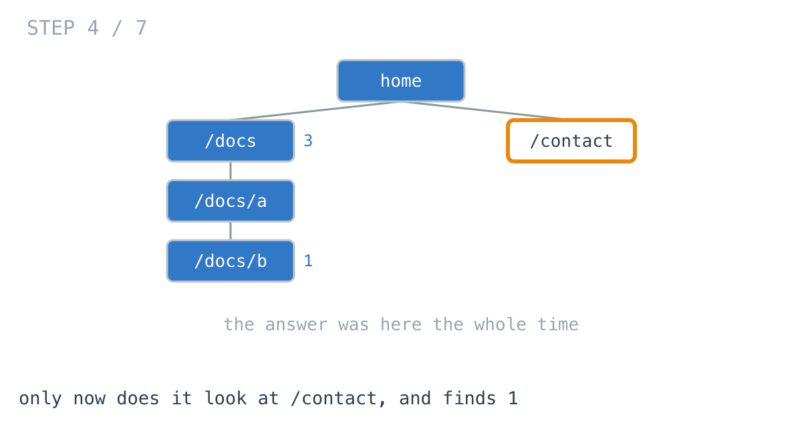
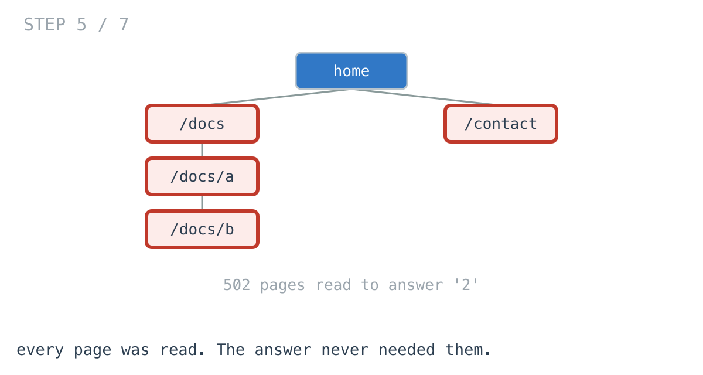
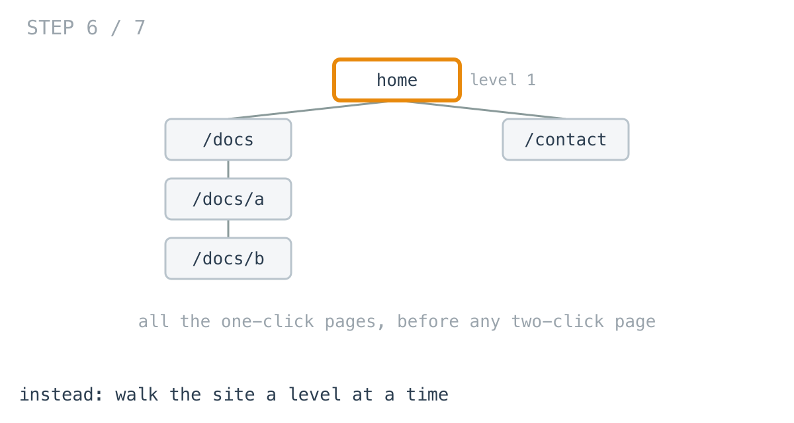
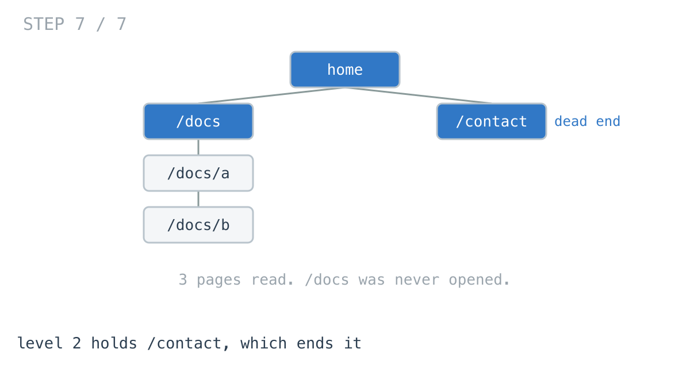

# The answer was two clicks away. We read all 5,464 pages.

**It worked in dev · Episode 6 · technique: stopping at the first level that answers**

SEO people ask how many clicks it takes to reach real content from the
homepage, because pages buried deep get crawled less. The check is four lines
and it is correct.

It also reads your entire documentation section to answer a question the
`/contact` page settles immediately.

---

## The problem

A navigation tree. A page with no children is where a visitor stops — a
product, an article, a form:

```go
type Page struct {
	URL      string
	Children []*Page
}
```

How many clicks from the homepage to the **shallowest** such page?



---

## What you would write

```go
func ClicksByRecursion(root *Page) int {
	if root == nil {
		return 0
	}
	if len(root.Children) == 0 {
		return 1 // a dead end: one click to get here
	}
	best := -1
	for _, c := range root.Children {
		if d := ClicksByRecursion(c); best == -1 || d < best {
			best = d
		}
	}
	return best + 1
}
```

Four lines of logic, it states the definition directly, it needs no queue and no
thought about ordering, and **it allocates nothing** — the whole computation
rides on the call stack.

It is also completely correct, which is worth saying because
[day 7](https://github.com/architagr/leetcode_solutions/blob/main/easy_problems/101_200/minimum_depth_of_binary_tree/SOLUTION.md)
is mostly about a way this goes wrong. On a binary tree, a missing child returns
0, that 0 wins the `min`, and the function reports a dead end that does not
exist. Here it cannot happen: a page with one child has **one entry** in
`Children`, not one entry and one nil. The data model deleted the bug, and
there is a test proving that rather than a sentence claiming it.

So this is a rare episode where the first version has nothing wrong with it at
all. It is just doing far more work than the question needs.

---

## How bad, on its own

```
Apple M1 Pro · go1.26.4 · go test -bench=BenchmarkRecursion -benchtime=200x
```

| shape | pages | answer | recursion |
|---|---:|---:|---:|
| uniform, every leaf at depth 6 | 1,365 | 6 clicks | 2.85 µs |
| one long route | 400 | 400 clicks | 3.48 µs |
| marketing site + docs | 5,464 | 2 clicks | 11.6 µs |
| deep docs, shallow page last | 2,002 | 2 clicks | **21.8 µs** |

Look at the bottom two rows against the top two.

The bottom rows have the **shallowest possible answers** — two clicks — and they
are the slowest. The uniform tree needs six clicks and finishes in a quarter of
the time.

That is backwards, and it is the whole episode. The cost has nothing to do with
the answer.

---

## From the symptom to the shape

### The issue, said plainly

The function reads pages that cannot possibly change the answer.

`/contact` is one click from the homepage and has nothing below it. That settles
it. But the recursion is partway into `/docs`, four levels down, and it will
keep going until it has been everywhere.

`TestLevelWalkStopsEarly` counts it on a site with a 500-page docs section and
one shallow page: the recursion visits **502** pages. Three would have done.





### Why is it allowed to happen?

Because the recursion has no way to compare across branches until they are all
finished.

It asks each child for a number and takes the smallest. To take the smallest it
must have them all. So it commits to exploring `/docs` completely before it can
look at `/contact` at all — not because `/docs` is promising, but because the
shape of `min` over a set requires the whole set.

The order it visits in is decided by the structure of the tree, and the tree has
no idea which branch is short.

### What we already know, and are not using

Here is the reframe.

The answer is the **smallest** depth. So the moment we find a dead end at depth
2, nothing at depth 3 or below matters. Nothing. Half the site could be one
click from an answer and it would not change a thing.

That fact is available immediately and the recursion cannot use it, because it
does not visit pages in depth order. It visits them in branch order, so a dead
end at depth 2 in the last branch arrives after everything at depth 40 in the
first one.





### What shape is the question?

Not *what is the depth of this tree* — that needs every branch. It is **what is
the first depth at which any dead end appears**, which is a question about
order, not about totals.

And that reframing brings its own requirement: to answer it you must visit pages
**in order of depth**. All the one-click pages, then all the two-click pages,
and so on.



### The rule

> **When the answer is a minimum and the search can be ordered so candidates
> arrive smallest-first, the first one found is the answer, and everything after
> it is work you did not have to do.**

That is level-order traversal — the technique from
[day 1](https://github.com/architagr/leetcode_solutions/blob/main/easy_problems/101_200/maximum_depth_of_binary_tree/SOLUTION.md),
where maximum depth is solved with a queue and a marker between levels rather
than recursion. Here the same queue does more: for a **maximum** you have to
drain it, and for a **minimum** you can leave.

### When this does not apply

If there is no shallow answer, ordering by depth buys nothing and the queue is
pure cost. That is not hypothetical — it is two of the four rows in the
benchmark, and the recursion wins both.

And if you need the depth of **every** page rather than the smallest, there is
nothing to stop early for.

---

## Try it before reading on

You have the rule: the answer is a minimum, so visit pages in order of depth and
stop at the first dead end.

```bash
git clone https://github.com/architagr/leetcode_solutions
cd leetcode_solutions/series/it-worked-in-dev/episodes/06-sitemap-click-depth
go test ./...
```

---

## The version that stops early

```go
func ClicksByLevel(root *Page) int {
	if root == nil {
		return 0
	}
	queue := []*Page{root}
	for clicks := 1; len(queue) > 0; clicks++ {
		next := make([]*Page, 0, len(queue))
		for _, p := range queue {
			if len(p.Children) == 0 {
				// Everything shallower has already been checked, so this is
				// the answer - and the rest of the site is never touched.
				return clicks
			}
			next = append(next, p.Children...)
		}
		queue = next
	}
	return 0
}
```

The `return` inside the loop is the entire point. Every other version of this
computes an answer; this one leaves as soon as it has one.



---

## The measurement

| shape | pages | answer | recursion | by level | winner |
|---|---:|---:|---:|---:|---|
| marketing site + docs | 5,464 | 2 clicks | 11.6 µs | 117 ns | **level, 99.2x** |
| uniform, every leaf at depth 6 | 1,365 | 6 clicks | 2.85 µs | 7.11 µs | **recursion, 2.5x** |
| one long route | 400 | 400 clicks | 3.48 µs | 5.83 µs | **recursion, 1.7x** |
| deep docs, shallow page last | 2,002 | 2 clicks | 21.8 µs | 58.8 ns | **level, 370.9x** |

Raw ns: 11,619 / 117.1 · 2,854 / 7,109 · 3,483 / 5,834 · 21,789 / 58.75

**It goes both ways**, and the dividing line is not size. The level walk wins the
two shapes where the answer is near the top and loses the two where nothing can
be skipped. 5,464 pages cost it 117 nanoseconds because it looked at four of
them.

---

## What it costs

**The recursion allocates nothing.** Zero bytes, zero allocations, every shape.
The level walk builds a slice per level: 104 bytes on the shapes it wins, and
41.3 KB on the uniform tree, where the widest level holds 1,024 pages — and it
pays that to *lose* by 2.5x.

So this is not a faster algorithm. It is a **bet**: that the answer is near the
top. On a marketing site it pays 99x. On a documentation site where every route
is long, it costs you.

The recursion also keeps something the level walk gives up: it is four lines,
and it is the one you can read in a code review without thinking about queues.

**Take the bet when you know the shape.** A site with a contact page is a good
bet. A file tree where you are looking for the shallowest empty directory is a
good bet. A uniform hierarchy is not.

---

## The one line to keep

When the answer is a minimum, search in an order that produces candidates
smallest-first — then the first hit is the answer and everything else is work
you avoided.

---

## Run it yourself

```bash
git clone https://github.com/architagr/leetcode_solutions
cd leetcode_solutions/series/it-worked-in-dev/episodes/06-sitemap-click-depth
go test ./...                      # both agree, including on 2,000 random sites
go test -bench=. -benchtime=200x   # the numbers above
```

One test counts pages visited rather than timing anything: 502 against 3.

---

Part of [It worked in dev](../../), the long-form companion to the
[365-day LeetCode challenge](https://github.com/architagr/leetcode_solutions).

---

*Ideation, problem selection, benchmarks and conclusions: Archit Agarwal.
The prose was drafted with AI assistance and edited by me. Every number here
comes from a run you can reproduce with the commands above.*
