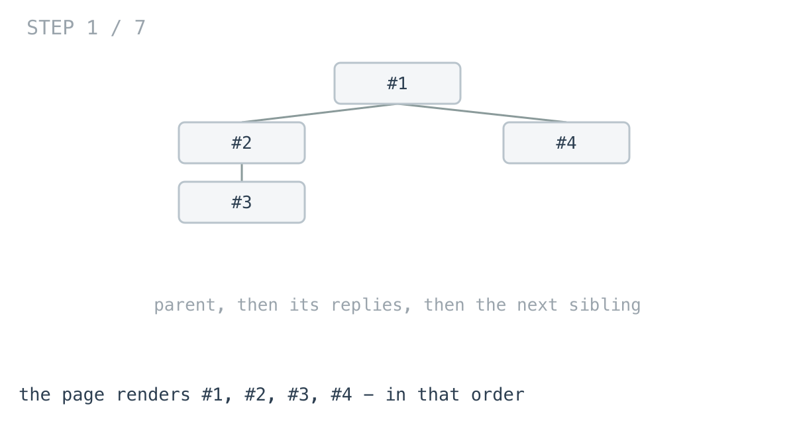
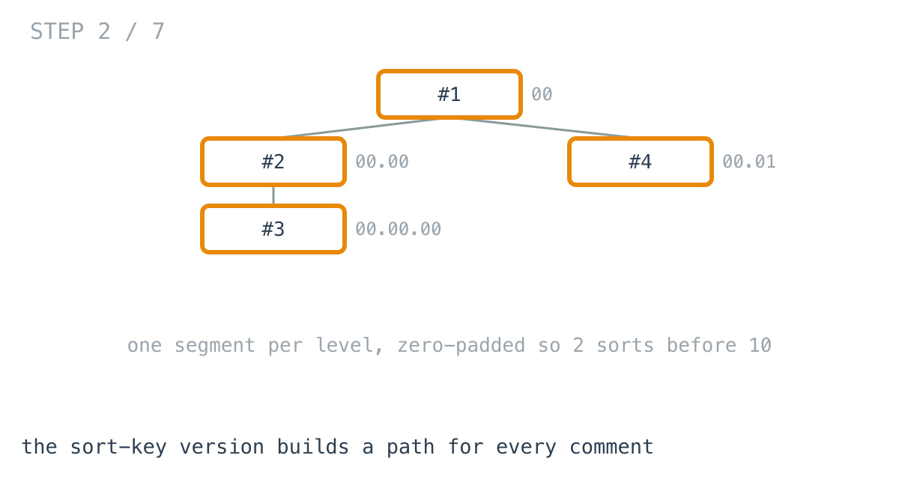
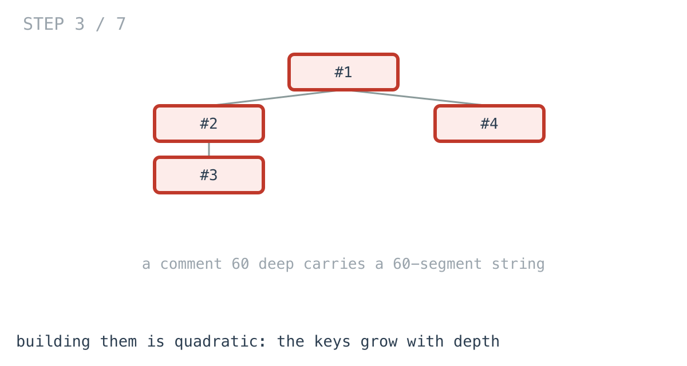
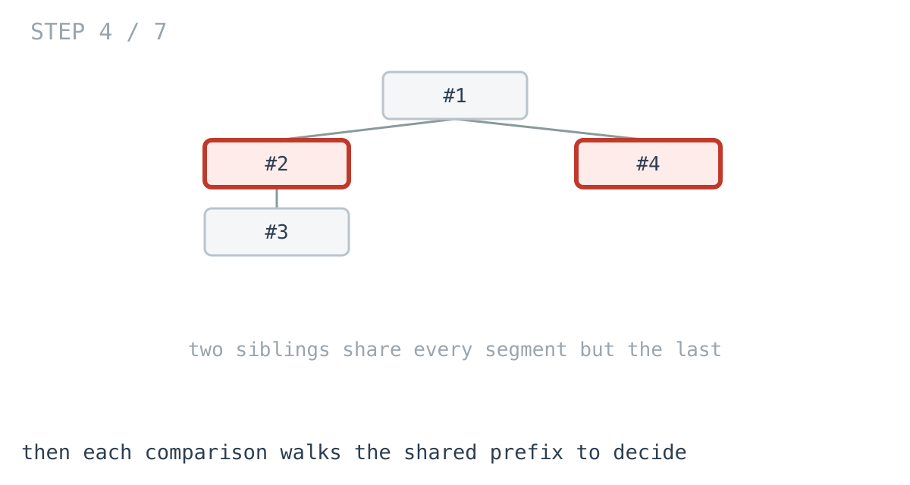
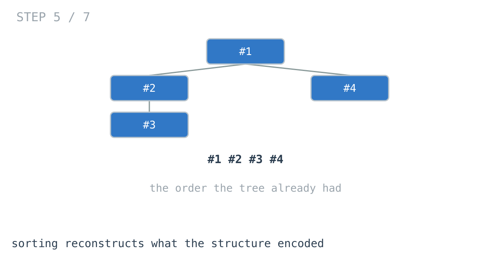
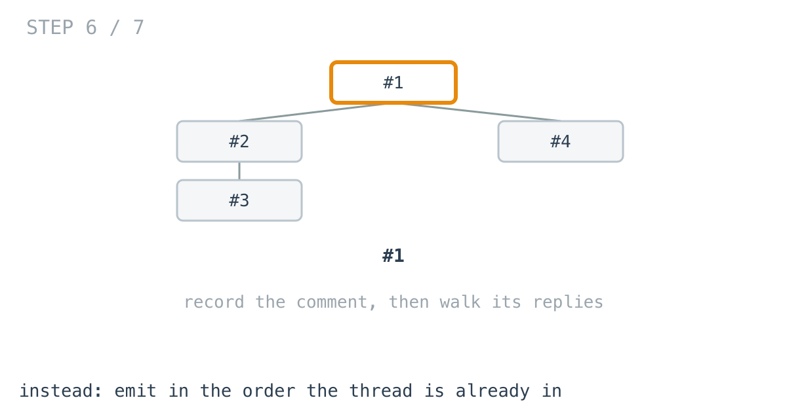

# 61 nested replies cost nearly as much to sort as 259

**It worked in dev · Episode 7 · technique: preorder traversal**

A threaded discussion has to render parent-then-replies, indented. The database
gives you a flat result set, so you give every row a path, sort by it, and hand
the result to the template.

Then somebody has a sixty-reply argument in one thread, and that thread takes
longer to render than a page with four times as many comments on it.

---

## The problem

```go
type Comment struct {
	ID      int
	Author  string
	Replies []*Comment
}
```

Produce the display order: every comment, with its indent level, parent
immediately above its replies.



---

## What you would write

The database suggests it, so most codebases have this:

```go
var collect func(c *Comment, path []string)
collect = func(c *Comment, path []string) {
	rows = append(rows, keyed{strings.Join(path, "."), len(path) - 1, c.ID})
	for i, r := range c.Replies {
		collect(r, append(append([]string{}, path...), fmt.Sprintf("%06d", i)))
	}
}
collect(root, []string{"000000"})

sort.Slice(rows, func(a, b int) bool { return rows[a].key < rows[b].key })
```

Give every comment a materialised path, sort by it.

This is a genuinely good pattern and I want to defend it properly. It works on a
flat result set with no tree in memory at all, which is what you have after a
query. It survives being handed straight to a template. And if the ordering rule
changes — newest first, most-upvoted first — it is one comparator, not a
rewrite.

The zero padding is load-bearing, incidentally: without it `"10"` sorts before
`"2"` and reply eleven jumps above reply three. There is a test for that, at a
width where it bites.



---

## How bad, on its own

```
Apple M1 Pro · go1.26.4 · go test -bench=BenchmarkSortKey -benchtime=300ms
```

| shape | comments | sort key |
|---|---:|---:|
| a discussion, 2 deep | 73 | 16.9 µs |
| a busy thread, 3 deep | 259 | 51.6 µs |
| an argument, 60 deep | 61 | 47.4 µs |
| a long argument, 400 deep | 401 | **1.50 ms** |

Row three is the one. **61 comments cost nearly as much as 259.** Not because
there are more of them — there are a quarter as many — but because they are
sixty levels deep.

And row four: 401 comments, a millisecond and a half, for what is fundamentally
a list.

---

## From the symptom to the shape

### The issue, said plainly

The order is being computed, and the thread already knew it.

A comment's position on the page is not a fact we have to derive. It is decided
entirely by where the comment sits in the thread: under its parent, after its
parent's earlier replies. That is the structure itself.

The sort-key version writes that structure out as a string, throws the structure
away, and then reconstructs the ordering by comparing the strings.

### Why is it allowed to happen?

Because sorting is how you order things when you do not have structure — and a
flat result set from a database genuinely does not have any.

Given rows and no tree, a sort key is the correct answer. The problem is that by
the time this code runs, the tree has been built. The function takes a `*Comment`
with `Replies` on it. The structure is right there, and the code is still acting
as though it only has rows.

### What the strings cost, twice

Worth being precise, because the depth row needs explaining.

Each key is one segment per level, so a comment sixty deep carries a sixty-segment
string. Building them is quadratic on its own — a test counts the characters and
asserts they sum to the depths.



Then the sort compares those strings, and a string comparison walks until the
characters differ. Two siblings sixty levels down share fifty-nine identical
segments before the comparison can decide anything. So depth makes the keys
longer **and** makes each comparison read more of them.





That is why 61 deep comments cost what 259 shallow ones do.

### What shape is the question?

Not *what order should these rows be in* — that is the sorting question, and it
needs keys because it starts from an unordered set.

It is **what order does this tree render in**, and a tree is not an unordered
set. It has one obvious traversal that emits exactly the display order: visit
the comment, then each reply in turn.



### The rule

> **If the structure already encodes the order, walk it. Sorting is for when you
> have lost the structure, and re-deriving an ordering you were handed is
> quadratic in the thing that made it a tree.**

Visiting a node before its children is
[day 8](https://github.com/architagr/leetcode_solutions/blob/main/easy_problems/101_200/binary_tree_preorder_traversal/SOLUTION.md)
— preorder, where the whole difference from the other traversals is one line's
position. The path-building the sort key does is
[day 3](https://github.com/architagr/leetcode_solutions/blob/main/easy_problems/201_300/binary_tree_path/SOLUTION.md),
and here it is work being done to reach an order the walk gets for free.

### When this does not apply

If you really do have a flat result set and no tree, the sort key is right, and
building a tree solely to walk it will not pay.

And if the ordering is **not** the structure — newest first across the whole
thread, or by score — then the tree does not encode it, sorting is the answer,
and this is the wrong episode.

---

## Try it before reading on

The order you want is the order the thread is already in. Emit it without
comparing anything.

```bash
git clone https://github.com/architagr/leetcode_solutions
cd leetcode_solutions/series/it-worked-in-dev/episodes/07-comment-thread
go test ./...
```

---

## The version that scales

```go
func OrderByWalking(root *Comment) []Rendered {
	out := make([]Rendered, 0, 16)
	var visit func(c *Comment, indent int)
	visit = func(c *Comment, indent int) {
		// Record this comment BEFORE its replies. That is the whole ordering
		// rule, and it is the only place order is decided.
		out = append(out, Rendered{ID: c.ID, Indent: indent})
		for _, r := range c.Replies {
			visit(r, indent+1)
		}
	}
	if root != nil {
		visit(root, 0)
	}
	return out
}
```

No keys, no comparator, no sort. The indent is a parameter rather than something
measured, which is episode 2's move, and the ordering is one statement's
position, which is day 8's.


---

## The measurement

| shape | comments | sort key | walking | ratio |
|---|---:|---:|---:|---:|
| a discussion, 2 deep | 73 | 16.9 µs | 912 ns | 18.6x |
| a busy thread, 3 deep | 259 | 51.6 µs | 4.14 µs | 12.4x |
| an argument, 60 deep | 61 | 47.4 µs | 967 ns | 49.0x |
| a long argument, 400 deep | 401 | 1.50 ms | 7.48 µs | **200.5x** |

Raw ns: 16,942 / 912.1 · 51,557 / 4,144 · 47,406 / 966.6 · 1,500,670 / 7,484

**The walk wins every shape**, which has not been true in this series before —
episodes 3, 5 and 6 all had rows where the simple version was correct to keep.
Here there is no crossover, because the walk is not doing something cleverer. It
is doing strictly less: no strings, no comparisons.

---

## What it costs

Memory goes the right way too: **2.03 MB against 15.8 KB** at 400 deep, 1,263
allocations against 6.

The real cost is the one named above — it needs the tree. If your data arrives
flat and stays flat, this function cannot run, and assembling a tree to use it is
a different piece of work with its own price.

It also gives up the thing that made the sort key attractive: changing the
ordering rule. Sorting by score is a new comparator; walking in score order means
sorting the replies at each node, at which point you are doing both.

**So keep the sort key when the order is not the structure.** Reach for the walk
when it is — which, for a threaded discussion rendered parent-first, it always is.

---

## The one line to keep

Sorting re-derives an order the structure already had. If you were handed a tree,
the order came with it.

---

## Built on

Days from the [365-day LeetCode challenge](https://github.com/architagr/leetcode_solutions),
with the solution write-up and the problem itself:

- **Day 3 — [Binary Tree Paths](https://github.com/architagr/leetcode_solutions/blob/main/easy_problems/201_300/binary_tree_path/SOLUTION.md)** · LeetCode [#257](https://leetcode.com/problems/binary-tree-paths/) · easy
  <br>building a root-to-leaf path by passing the prefix down the recursion
- **Day 8 — [Binary Tree Preorder Traversal](https://github.com/architagr/leetcode_solutions/blob/main/easy_problems/101_200/binary_tree_preorder_traversal/SOLUTION.md)** · LeetCode [#144](https://leetcode.com/problems/binary-tree-preorder-traversal/) · easy
  <br>visiting a node before its children - the whole difference is one line's position

---

## Run it yourself

```bash
git clone https://github.com/architagr/leetcode_solutions
cd leetcode_solutions/series/it-worked-in-dev/episodes/07-comment-thread
go test ./...                              # both agree, on 1,000 random threads
go test -bench=. -benchtime=300ms -run=XXX # the numbers above
```

Use `-benchtime=300ms`, not a fixed iteration count. At `-benchtime=200x` this
benchmark reported a 61-comment walk as eleven times slower than it is, in the
direction that would have made this write-up wrong.

---

Part of [It worked in dev](../../), the long-form companion to the
[365-day LeetCode challenge](https://github.com/architagr/leetcode_solutions).

---

*Ideation, problem selection, benchmarks and conclusions: Archit Agarwal.
The prose was drafted with AI assistance and edited by me. Every number here
comes from a run you can reproduce with the commands above.*
