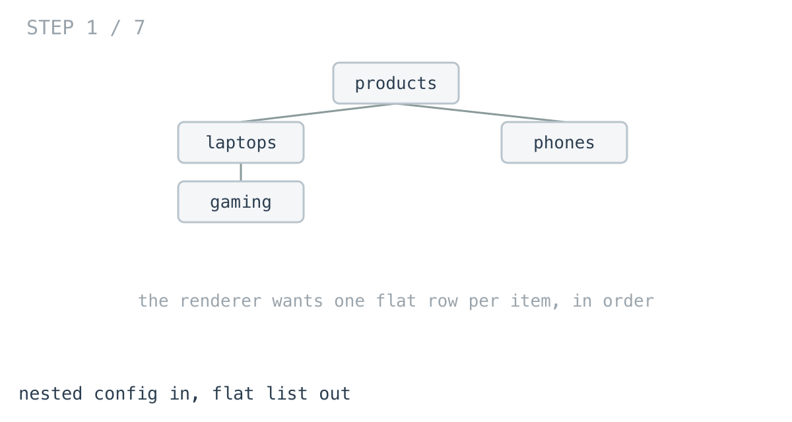
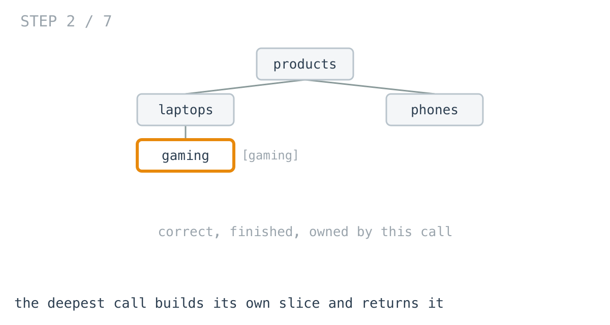
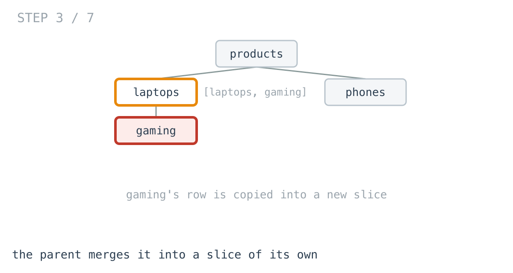
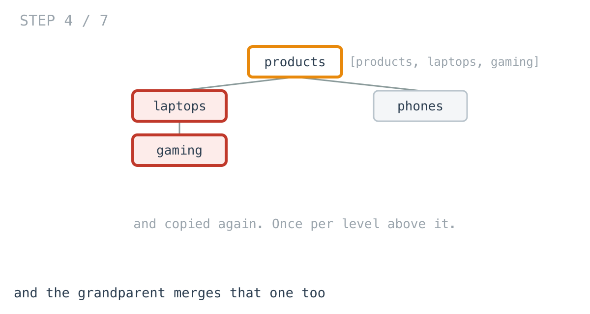
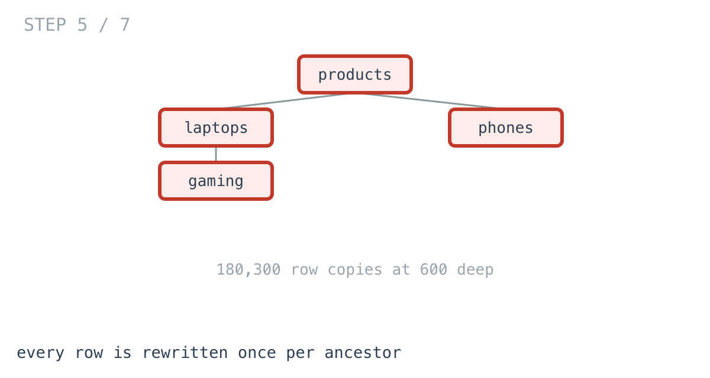
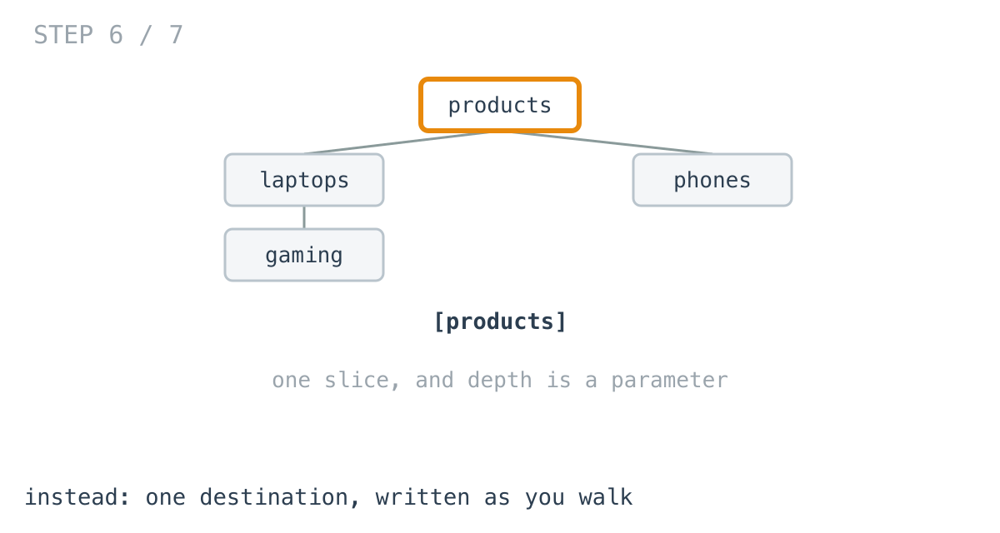
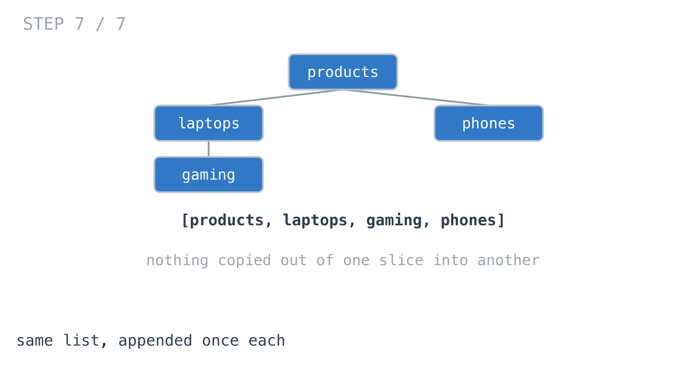

# 601 menu items took 2.4 milliseconds to flatten

**It worked in dev · Episode 9 · technique: writing into one destination**

A nav config is nested, because that is how a human writes it. A renderer wants
it flat — one row per item, in order, each carrying its depth.

The function that converts between them is six lines and functional-looking, and
on a docs sidebar it produces 11.4 MB of garbage to return a 601-row slice.

---

## The problem

```go
type Item struct {          // config: nested
	Label    string
	Children []*Item
}

type Row struct {           // renderer: flat
	Label string
	Depth int
}
```

Turn the first into the second, in display order.



---

## What you would write

```go
func FlattenByConcat(root *Item) []Row {
	if root == nil {
		return nil
	}
	out := []Row{{Label: root.Label, Depth: 0}}
	for _, c := range root.Children {
		for _, r := range FlattenByConcat(c) {
			out = append(out, Row{Label: r.Label, Depth: r.Depth + 1})
		}
	}
	return out
}
```

This is the shape functional style asks for, and it has real virtues. Every call
is independent and returns a complete answer for its own subtree. There is no
accumulator to thread through, nothing shared, nothing to forget to pass, and
you can call it on any node and get a correct result.

It also reads as the definition: an item's rows are its own row, followed by its
children's rows one level deeper.

---

## How bad, on its own

```
Apple M1 Pro · go1.26.4 · go test -bench=BenchmarkConcat -benchtime=300ms
```

| shape | items | concat |
|---|---:|---:|
| a nav menu, 2 deep | 43 | 2.41 µs |
| a docs sidebar, 3 deep | 156 | 11.9 µs |
| 100 levels | 101 | 86.6 µs |
| 600 levels | 601 | **2.41 ms** |

Row three against row two: **101 items take seven times longer than 156**.

And row four is 2.4 milliseconds — plus **11.4 MB allocated** — to build a list
of 601 things.

Six times the depth costs 27.8 times the work.

---

## From the symptom to the shape

### The issue, said plainly

Every row is copied once for each ancestor above it.

The deepest item's row is built by the call that owns it, then copied into its
parent's slice, then into the grandparent's, and so on to the root. A row a
hundred levels down is written out a hundred times.

A test counts it rather than the prose claiming it:

```go
want := d * (d + 1) / 2
```

180,300 row copies at 600 deep. That is what 2.41 ms buys.





### Why is it allowed to happen?

Because each call returns a **finished, independent** slice, and that
independence is the whole appeal.

For the parent to return one slice, it must merge its children's slices into
its own — and merging means copying, because the child's slice is the child's,
allocated separately and owned separately. The function is not doing anything
careless. It is paying the cost that "every call returns its own complete
answer" implies.



### It was already correct the first time

Watch a single row.

The call that owns the deepest item creates its `Row` — correct, finished, done.
Then that finished row is copied into a new slice, with its `Depth` incremented,
and that slice is copied into another, and so on.

Nothing about the row changes except a number that could have been known at the
start. It was correct the first time, and it gets rewritten a hundred times to
travel upward.



### What shape is the output?

Here is the turn. The output is **one flat list**. Not a tree of lists. One.

Every intermediate slice in that recursion exists solely to be poured into
another one and discarded. They are not answers anybody asked for — they are
scaffolding for a shape the result does not have.

And the depth, the one thing that genuinely differs per row, is not something to
be derived by counting hops upward on the way out. It is known on the way in:
it is how far down you currently are.



### The rule

> **When the result is one collection, write into one collection. Building a
> collection per node and merging them copies every element once per level, and
> the merge exists only because each call insisted on owning its own answer.**

Visiting an item before its children is
[day 8](https://github.com/architagr/leetcode_solutions/blob/main/easy_problems/101_200/binary_tree_preorder_traversal/SOLUTION.md)
— preorder, which is the display order here. And
[day 10](https://github.com/architagr/leetcode_solutions/blob/main/medium_problems/101_200/flatten_binary_tree_to_linked_list/SOLUTION.md)
is this exact conversion on a binary tree: collect in preorder, then rebuild as
a flat chain. Its solution keeps the two phases separate and says why — nothing
but the values crosses between them.

### When this does not apply

If callers genuinely need a subtree's rows **on their own** — a partial render,
a lazily-expanded branch — then the concat version is the one that gives you
that, and the walking version cannot without a second entry point.

And if the tree is shallow and small, this is microseconds against microseconds.
A 43-item nav menu is 2.41 µs against 729 ns, and nobody will ever find it.

---

## Try it before reading on

The output is one list. Write into it.

```bash
git clone https://github.com/architagr/leetcode_solutions
cd leetcode_solutions/series/it-worked-in-dev/episodes/09-flatten-nav-config
go test ./...
```

---

## The version that scales

```go
func FlattenByAppending(root *Item) []Row {
	if root == nil {
		return nil
	}
	out := make([]Row, 0, 16)
	var visit func(it *Item, depth int)
	visit = func(it *Item, depth int) {
		out = append(out, Row{Label: it.Label, Depth: depth})
		for _, c := range it.Children {
			visit(c, depth+1)
		}
	}
	visit(root, 0)
	return out
}
```

One slice, created once. `depth` is a parameter rather than something fixed up
afterwards. No row is ever copied out of one slice into another.



---

## The measurement

| shape | items | concat | appending | ratio |
|---|---:|---:|---:|---:|
| a nav menu, 2 deep | 43 | 2.41 µs | 729 ns | 3.3x |
| a docs sidebar, 3 deep | 156 | 11.9 µs | 1.88 µs | 6.3x |
| 100 levels | 101 | 86.6 µs | 2.31 µs | 37.6x |
| 600 levels | 601 | 2.41 ms | 11.0 µs | **219.7x** |

Raw ns: 2,413 / 729.3 · 11,933 / 1,882 · 86,589 / 2,306 · 2,411,063 / 10,974

Memory is starker than time: **11.4 MB against 31.0 KB** at 600 deep, across 893
times as many allocations.

---

## The optimisation that stops paying

`append` grows the slice by doubling, so the obvious next step is to count the
items first and allocate exactly once.

```go
out := make([]Row, 0, Count(root))
```

| shape | appending | presized | |
|---|---:|---:|---|
| a nav menu, 43 | 729 ns | 393 ns | 1.9x faster |
| a docs sidebar, 156 | 1.88 µs | 1.43 µs | 1.3x faster |
| 100 levels | 2.31 µs | 2.10 µs | 1.1x faster |
| 600 levels | 11.0 µs | 11.9 µs | **1.08x slower** |

It is always exactly one allocation instead of three to six. And it pays for
that with a **full extra pass over the tree**, which by 600 levels costs more
than the few re-allocations it avoids.

"Allocate once" is a heuristic, not a law. `append`'s doubling is already close
to free, and the counting pass is real work — so the benefit shrinks as the tree
grows, and eventually inverts. I would not have guessed the crossover was that
low.

---

## What it costs

The walking version gives up the property that made the first one attractive:
**every call no longer returns a usable answer on its own.** `visit` returns
nothing; it writes into a slice belonging to its caller. If something wants just
one branch flattened — a lazily-expanded menu section — it cannot use this
without a second entry point.

That is the whole trade, and it is a smaller one than it looks for a nav config,
which is rendered whole or not at all.

**At 43 items, keep the readable one.** Reach for this when the nesting is
genuinely deep — a category tree, a docs sidebar that grew, a file browser.

---

## The one line to keep

If the result is one collection, build one collection. A slice per node exists
only to be poured into another one.

---

## Built on

Days from the [365-day LeetCode challenge](https://github.com/architagr/leetcode_solutions),
with the solution write-up and the problem itself:

- **Day 8 — [Binary Tree Preorder Traversal](https://github.com/architagr/leetcode_solutions/blob/main/easy_problems/101_200/binary_tree_preorder_traversal/SOLUTION.md)** · LeetCode [#144](https://leetcode.com/problems/binary-tree-preorder-traversal/) · easy
  <br>visiting a node before its children - the whole difference is one line's position
- **Day 10 — [Flatten Binary Tree to Linked List](https://github.com/architagr/leetcode_solutions/blob/main/medium_problems/101_200/flatten_binary_tree_to_linked_list/SOLUTION.md)** · LeetCode [#114](https://leetcode.com/problems/flatten-binary-tree-to-linked-list/) · medium
  <br>collecting in preorder, then rebuilding the tree as a flat chain

---

## Run it yourself

```bash
git clone https://github.com/architagr/leetcode_solutions
cd leetcode_solutions/series/it-worked-in-dev/episodes/09-flatten-nav-config
go test ./...                         # all three agree, on 1,000 random menus
go test -bench=. -benchtime=300ms     # the numbers above
```

---

Part of [It worked in dev](../../), the long-form companion to the
[365-day LeetCode challenge](https://github.com/architagr/leetcode_solutions).

---

*Ideation, problem selection, benchmarks and conclusions: Archit Agarwal.
The prose was drafted with AI assistance and edited by me. Every number here
comes from a run you can reproduce with the commands above.*
