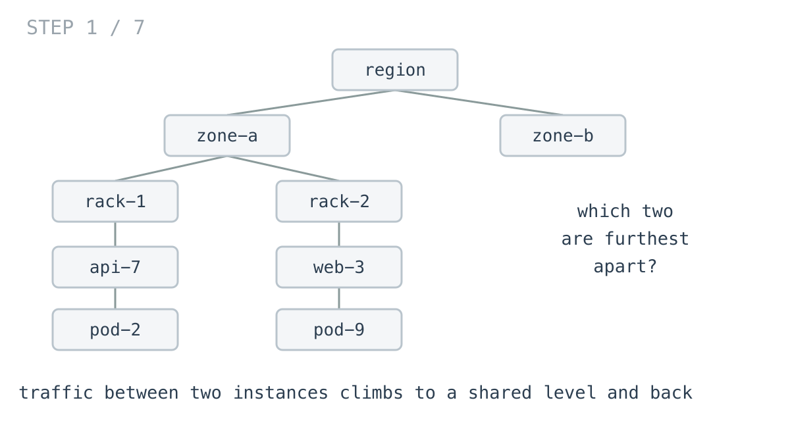
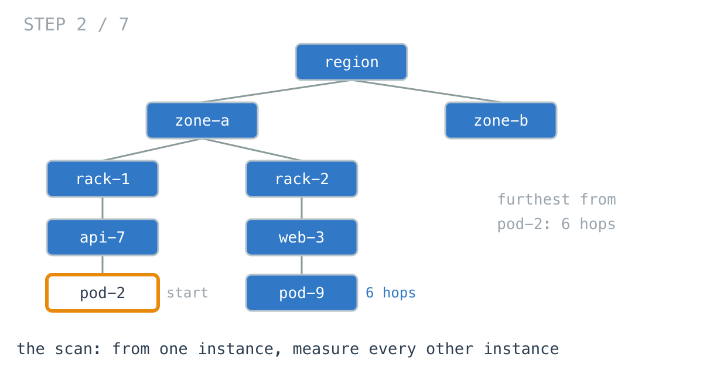
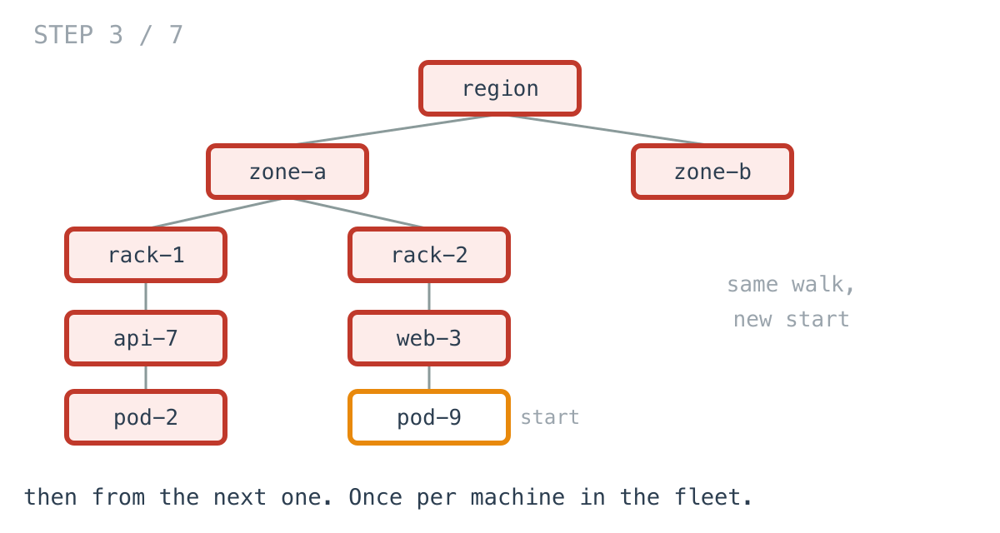
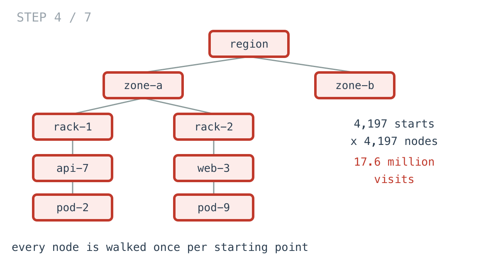
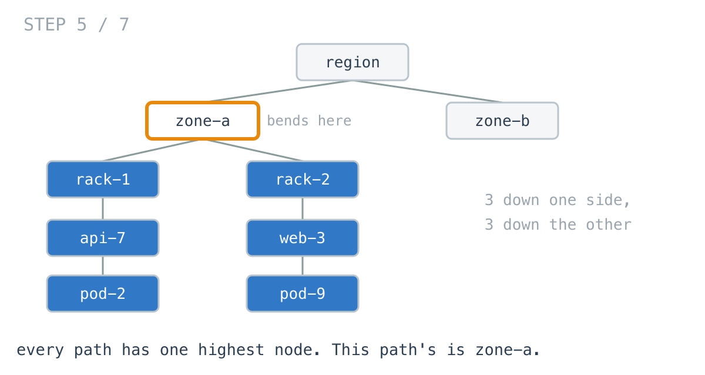
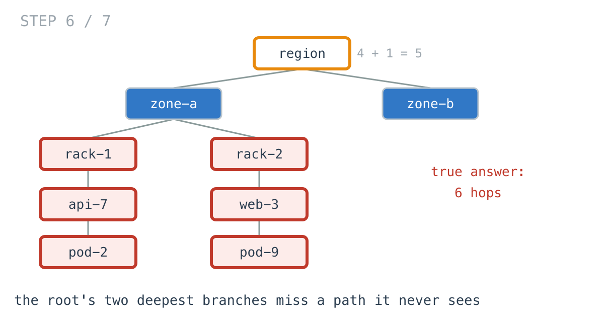
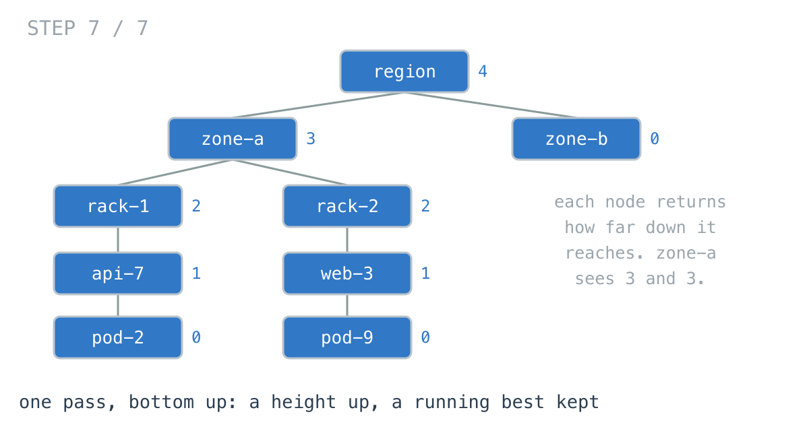

# Your fleet tripled and the check got 12x slower

**It worked in dev · Episode 10 · technique: diameter, from two child results at each node**

Two service instances sit in a topology — region, zone, rack, host. The pair
furthest apart in that topology is the pair whose traffic climbs the most levels
and comes back down, and it is the pair that sets the worst case for anything
you spread on purpose: replicas, shards, a quorum.

Finding that pair on one rack takes 8 microseconds. On a 4,197-node fleet it
takes 153 milliseconds and allocates 529 MB.

---

## The problem

```go
type Node struct {          // region, zone, rack, instance
	Name     string
	Children []*Node
}
```

Which two instances are furthest apart, in hops?



---

## What you would write

You already have the helper. Something needed "how far is everything else from
this instance" at some point, so there is a breadth-first walk sitting in the
package, and it is tested.

```go
func WidestByScan(root *Node) int {
	adj := neighbours(root)
	best := 0
	for i := range adj {
		if d := FurthestFrom(adj, i); d > best {
			best = d
		}
	}
	return best
}
```

The question says *the two furthest apart*. This is the largest distance over
every starting point, which is that sentence with nothing added and nothing
assumed. It cannot be subtly wrong the way a cleverer version can: there is no
tie-break to get backwards, no case where a path is missed, and the helper it
leans on is the one already in production.

I would sign off on this in review. I did write it, and the tests passed on the
first try.

---

## How bad, on its own

```
Apple M1 Pro · go1.26.4 · go test -bench=BenchmarkScan -benchtime=300ms
```

| shape | nodes | widest pair | scan |
|---|---:|---:|---:|
| one rack, 24 instances | 25 | 2 hops | 8.03 µs |
| 4 zones, 10 racks, 30 each | 1,245 | 6 hops | 12.9 ms |
| one level deeper again | 4,197 | 8 hops | 153 ms |
| a topology that is really a chain | 2,000 | 1,999 hops | 73.3 ms |

Row two to row three is the one to look at. **3.4x the machines cost 11.9x the
time.** Add a level to the hierarchy and the check does not get a bit slower,
it gets an order slower.

The memory is worse than the clock: **529 MB allocated** to return one small
integer about 4,197 machines.

And on one rack it is 8 microseconds, which nobody will ever find.

---

## From the symptom to the shape

### The issue, said plainly

The same walk is run once per machine.

`FurthestFrom` visits every node in the fleet. `WidestByScan` calls it once for
every node in the fleet. Nothing in there is wasteful on its own — the waste is
that there are 4,197 of them.





A test counts the visits rather than the prose claiming them:

```go
if want := size * size; visits != want {
```

17.6 million node visits for a fleet of 4,197 machines. That is what 153
milliseconds buys.



### Why is it allowed to happen?

Because each walk is **independent**, and that independence is the appeal.

`FurthestFrom(adj, i)` knows nothing about `FurthestFrom(adj, i-1)` and needs
to know nothing. You can call it on any node, in any order, and get a correct
answer. The scan is paying the price that "every call stands alone" implies,
which is the same bargain a lot of clean code makes.

Deleting the garbage does not change the bargain, incidentally — I tried that
first, and the section after the measurement has the numbers.

### The first walk already knew most of it

Watch one subtree during the very first breadth-first walk.

By the time that walk finishes, it has passed through `rack-1` and reached
every instance below it, so the distance from `rack-1` down to its deepest
instance was computed — and thrown away, because the walk was only asked for
one number, the furthest node from one start. The second walk computes it
again. So does the third.

The information is not missing. It is produced and discarded, 4,197 times.

### What shape is the topology, actually?

Do not assume it. A region contains zones, a zone contains racks, a rack
contains instances. Each thing sits in exactly one parent, nothing contains
itself, and there is one top. One parent, no cycles, one root: it is a
**tree**, and the next rung is only true because of that.

In a tree there is exactly one path between any two nodes. Not a shortest path
among several — one path, the only one.

### Write down what a path is

Take any path in the tree and follow it. It goes up for a while, turns around
once, and goes down. It cannot turn around twice, because that would mean
visiting a node twice, and in a tree that means a cycle.

So every path has exactly **one highest node**, and:

> length of a path = how far down one branch of its highest node
> &nbsp;&nbsp;&nbsp;&nbsp;&nbsp;&nbsp;&nbsp;+ how far down another branch of that node



Now read the right-hand side. Both terms are depths of things strictly **below**
that node. Neither one needs the parent, the siblings, or the route taken to
arrive.

### So which node is the highest one?

Unknown, and it does not have to be known. Every node gets a turn: for each
node, the longest path bending there is its two tallest branches added
together, and the answer is the largest of those over all nodes.

It is tempting to skip that and use the root, since the root is the highest
node in the tree. That is wrong, and it is wrong on a topology you could
actually deploy — one zone holding two deep branches, beside a zone holding
almost nothing. The winning path never touches the root.



`TestRootOnlyIsWrong` pins it: the shortcut says 5 hops, the true answer is 6.

### Conclude the order

If the answer at a node is built from the depths of its branches, the branches
have to be finished first. Not preferred — required. So the walk goes bottom
up, and each node hands its parent one number: how far down it reaches.

That is
[day 13](https://github.com/architagr/leetcode_solutions/blob/main/easy_problems/501_600/diameter_of_binary_tree/SOLUTION.md)
exactly, on a binary tree: `calc` returns a height to its parent while a
running best takes `left + right` at every node. The only thing this episode
adds is that a zone has more than two children, so `left + right` becomes **the
two tallest of however many**.

[Day 11](https://github.com/architagr/leetcode_solutions/blob/main/easy_problems/101_200/path_sum/SOLUTION.md)
is the useful contrast. There the running total is carried *down* and only
means something at a leaf, because every path it cares about starts at the
root. Here no path starts anywhere in particular, which is precisely why the
facts have to come back up instead.

### The rule

> **When the answer is about pairs but every pair meets at one node, stop
> iterating over pairs. Ask each node for the two best things hanging off it,
> and let one pass produce every candidate.**

### When this does not apply

The moment the topology stops being a tree, this stops being true. Give two
racks a redundant link between them and there are now two paths between some
pairs, the path no longer has one highest node, and the equation no longer
closes. For a real mesh you are back to a search per node, or to an algorithm
that knows about cycles.

It also assumes every hop costs the same. If what you want is latency rather
than hops, and a cross-zone hop costs twenty times a cross-rack one, the same
one-pass shape still works — but "two tallest branches" has to mean two
heaviest, and the naive version you are replacing has to be measuring weights
too, or the two do not answer the same question.

And if you genuinely need the distance between *every* pair — a full matrix,
not the widest one — then the scan is not the wrong tool. It is the tool.

---

## Try it before reading on

One walk, bottom up. No adjacency map, no second pass, no cache.

The rule: each node returns one number to its parent, and the answer is a
running best updated as you go.

```bash
git clone https://github.com/architagr/leetcode_solutions
cd leetcode_solutions/series/it-worked-in-dev/episodes/10-two-furthest-services
go test ./...
```

Reading on costs you the rep.

---

## The version that scales

```go
func WidestByOnePass(root *Node) int {
	if root == nil {
		return 0
	}
	best := 0
	var tallest func(n *Node) int
	tallest = func(n *Node) int {
		top1, top2 := 0, 0             // the two tallest branches hanging off n
		for _, c := range n.Children {
			h := tallest(c) + 1
			if h > top1 {
				top1, top2 = h, top1
			} else if h > top2 {
				top2 = h
			}
		}
		if top1+top2 > best {          // the path that bends here, if it wins
			best = top1 + top2
		}
		return top1                    // all the parent needs
	}
	tallest(root)
	return best
}
```

Three lines carry the idea: keeping the top two rather than the top one, taking
`top1 + top2` as this node's candidate, and returning `top1` alone.



---

## The measurement

| shape | nodes | scan | one pass | ratio |
|---|---:|---:|---:|---:|
| one rack | 25 | 8.03 µs | 78 ns | 102x |
| a fleet | 1,245 | 12.9 ms | 3.62 µs | 3,554x |
| a deeper fleet | 4,197 | 153 ms | 13.3 µs | 11,512x |
| a chain | 2,000 | 73.3 ms | 18.6 µs | 3,933x |

Raw ns: 8,027 / 78.38 · 12,862,965 / 3,619 · 152,958,930 / 13,287 ·
73,287,100 / 18,633

The one-pass version allocates **nothing**: two ints per frame, one number
returned.

---

## The fix that looked obvious and bought 3.6x

529 MB is a loud number, and the first thing I did was delete it. The visited
slice and the two frontier buffers get allocated once and reused for every
starting point instead of once per starting point.

| shape | scan | reusing buffers | | still slower than one pass |
|---|---:|---:|---|---:|
| one rack, 25 | 8.03 µs | 3.44 µs | 2.3x faster | 44x |
| a fleet, 1,245 | 12.9 ms | 3.70 ms | 3.5x faster | 1,022x |
| a deeper fleet, 4,197 | 153 ms | 42.2 ms | 3.6x faster | 3,175x |
| a chain, 2,000 | 73.3 ms | 22.6 ms | 3.2x faster | 1,211x |

Allocation was the loudest symptom, not the problem. Removing all of it is
worth 3.6x at 4,197 nodes. Changing the shape of the work is worth 11,512x, and
it is still quadratic afterwards — the reused-buffer version doubles its cost
when the fleet doubles, twice over, exactly like the one it replaced.

A profile would have pointed at the allocator, and the allocator was innocent.

---

## What it costs

The one-pass version answers one question. `FurthestFrom` answers "how far is
everything from here", which is a question operators ask constantly — where to
put the next replica, which rack is most isolated, what the spread looks like
from this host. Replacing the scan with the diameter walk does not give you any
of that, and if the scan is there because something else needs the distances,
deleting it trades a fleet-wide answer for a single integer.

It also gives up composability. `FurthestFrom` works on any node in any order;
`tallest` is a closure over a running best and means nothing on its own.

Naming the pair costs a little more again: carrying the deepest leaf's name up
beside its height is 1.3x slower than counting hops alone, and still allocates
nothing. Worth it — "api-7 and web-3, 8 hops apart" is an answer somebody can
act on, and "8" is not.

**At one rack, keep the scan.** 8 microseconds is not a problem, it is tested,
and it answers more questions than the fast one does. Reach for the one-pass
version when the topology has thousands of leaves, or when this runs on every
scheduling decision rather than once in a report.

---

## The one line to keep

When every pair meets at exactly one node, ask the nodes, not the pairs.

---

## Built on

Days from the [365-day LeetCode challenge](https://github.com/architagr/leetcode_solutions),
with the solution write-up and the problem itself:

- **Day 11 — [Path Sum](https://github.com/architagr/leetcode_solutions/blob/main/easy_problems/101_200/path_sum/SOLUTION.md)** · LeetCode [#112](https://leetcode.com/problems/path-sum/) · easy
  <br>carrying a running total down a path, which is the shape this problem cannot use - no path here starts at the root
- **Day 13 — [Diameter of Binary Tree](https://github.com/architagr/leetcode_solutions/blob/main/easy_problems/501_600/diameter_of_binary_tree/SOLUTION.md)** · LeetCode [#543](https://leetcode.com/problems/diameter-of-binary-tree/) · easy
  <br>a height returned to the parent while a running best takes left + right at every node - the same walk, with two children instead of many

---

## Run it yourself

```bash
git clone https://github.com/architagr/leetcode_solutions
cd leetcode_solutions/series/it-worked-in-dev/episodes/10-two-furthest-services
go test ./...                         # all four versions agree, on 2,000 random topologies
go test -bench=. -benchtime=300ms     # the numbers above
```

---

Part of [It worked in dev](../../), the long-form companion to the
[365-day LeetCode challenge](https://github.com/architagr/leetcode_solutions).

---

*Ideation, problem selection, benchmarks and conclusions: Archit Agarwal.
The prose was drafted with AI assistance and edited by me. Every number here
comes from a run you can reproduce with the commands above.*
