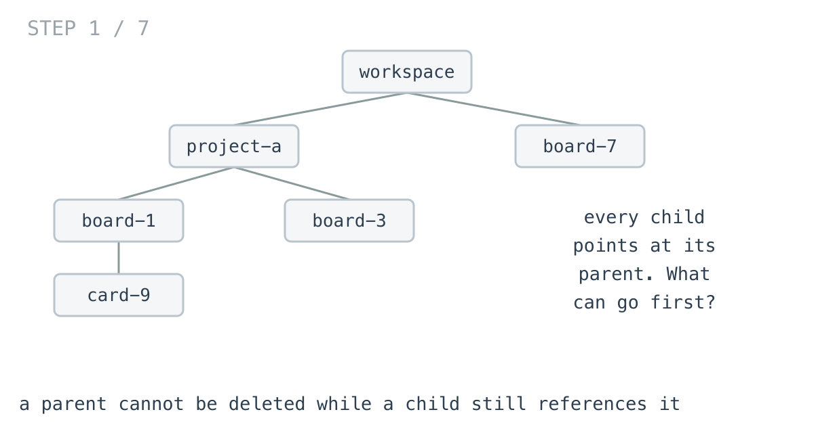
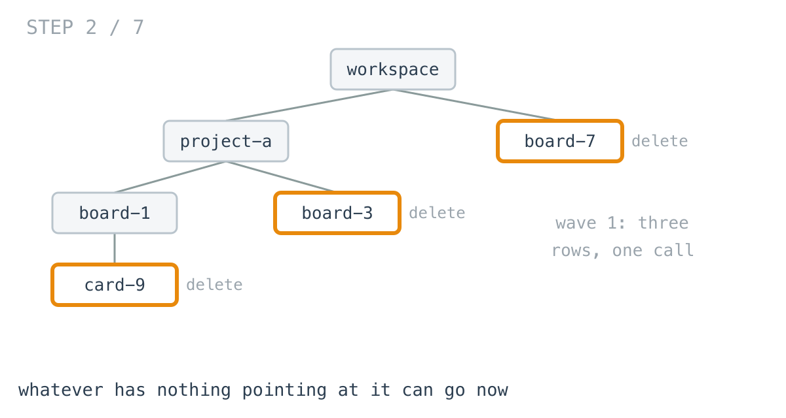
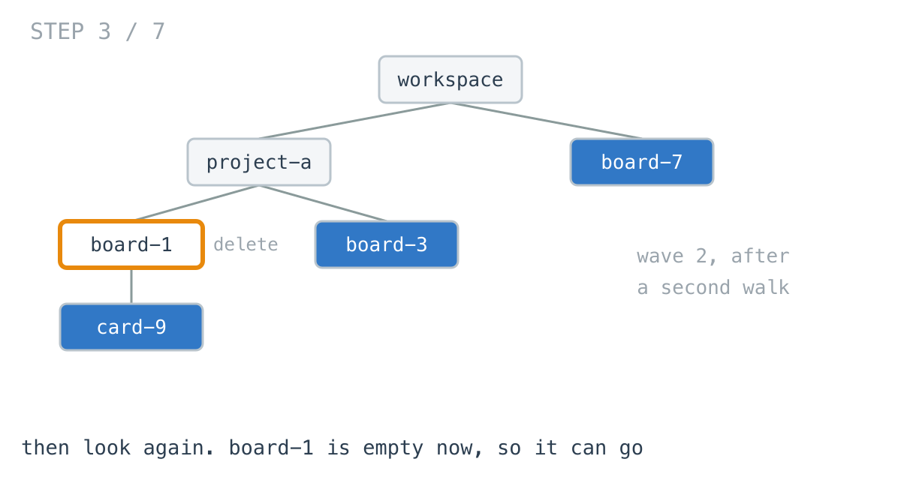
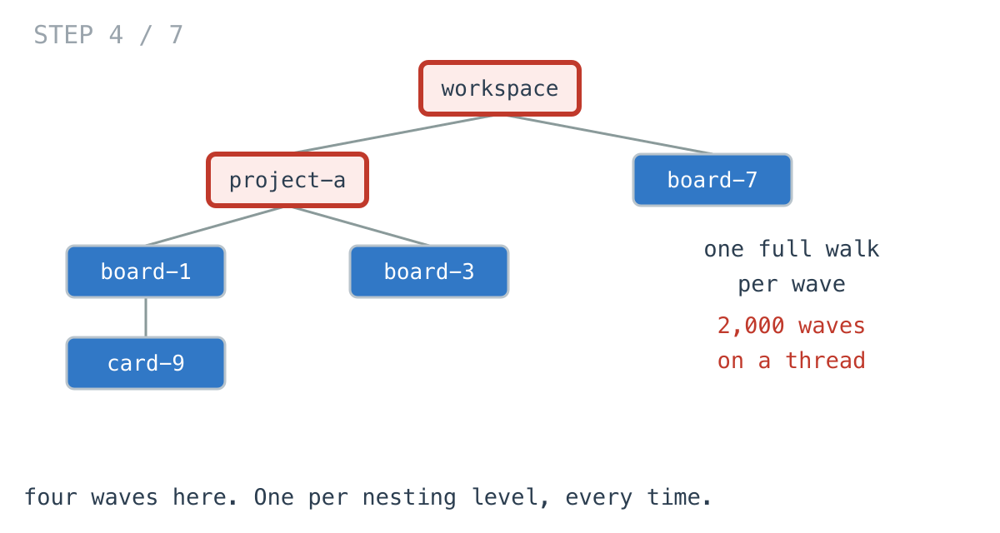
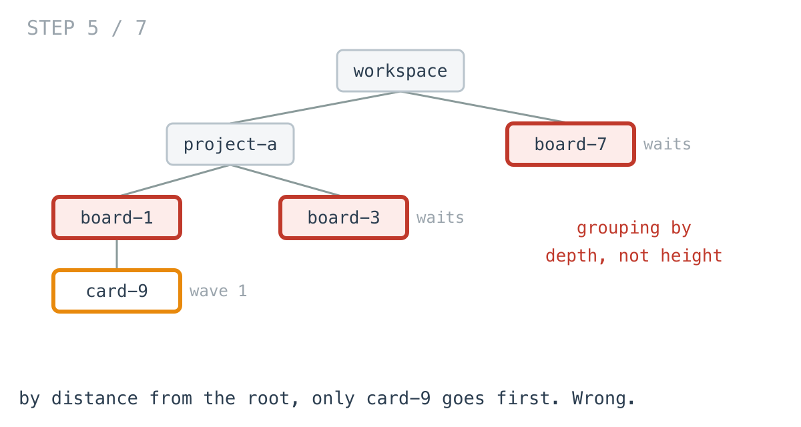
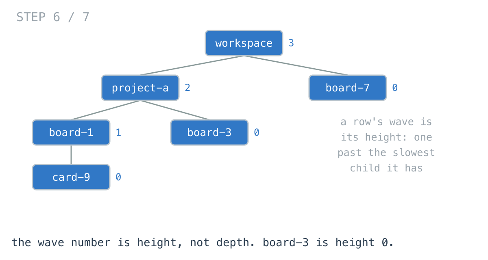
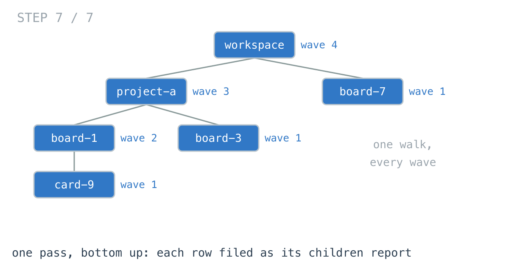

# A deep reply chain made the delete plan 790x slower

**It worked in dev · Episode 11 · technique: peeling leaves, one layer at a time**

Deleting a workspace means deleting everything inside it, and every child row
holds a foreign key to its parent, so the order is not free: a row can only go
once nothing points at it any more.

Working out that order for a 1,245-row tenant takes 123 microseconds. Working it
out for a 2,000-row comment thread takes 75.8 milliseconds — 1.6x the rows, 618x
the time.

---

## The problem

```go
type Record struct {          // a workspace, a project, a board, a card
	ID       string
	Children []*Record         // rows that reference this one
}
```

Produce the delete plan: which ids can go in the first statement, which in the
second, and so on until the workspace itself.



---

## What you would write

The constraint says a row can go when nothing points at it. So look for those,
delete them, and look again.

```go
for {
	var wave []string
	var removed []*Record
	var visit func(r *Record)
	visit = func(r *Record) {
		for _, c := range r.Children {
			visit(c)
		}
		if gone[r] {
			return
		}
		for _, c := range r.Children {
			if !gone[c] {   // something still points at this row
				return
			}
		}
		wave = append(wave, r.ID)
		removed = append(removed, r)
	}
	visit(root)
	if len(wave) == 0 {
		return waves
	}
	...
}
```

This is the database's rule, executed. It reads like the constraint it enforces,
it needs no facts about the shape of the data, and it is trivially safe: it
never puts a row in a wave while one of its children is still standing, because
it literally checks.





I like this code. It is the version I would write under time pressure and the
version I would be happy to find in a code review.

---

## How bad, on its own

```
Apple M1 Pro · go1.26.4 · go test -bench=BenchmarkRepeatedScan -benchtime=300ms
```

| shape | records | waves | repeated scan |
|---|---:|---:|---:|
| one board of cards | 21 | 2 | 2.19 µs |
| a workspace: 3 projects, 5 boards, 20 cards | 319 | 4 | 31.1 µs |
| one tenant, wider again | 1,245 | 4 | 123 µs |
| categories nested 10 deep | 2,047 | 11 | 386 µs |
| a reply to a reply, 2,000 deep | 2,000 | 2,000 | 75.8 ms |

The last two rows have almost the same number of records. One takes 386
microseconds and the other takes 75.8 milliseconds.

Width is free here. **Depth is what costs**, and the tenant against the thread
is 1.6x the records for 618x the time.

On a real workspace — a few hundred rows, four levels — it is 31 microseconds,
and nobody will ever find it.

---

## From the symptom to the shape

### The issue, said plainly

The whole hierarchy is walked once per wave.

Wave one walks 2,000 records to find the one leaf at the bottom of the thread.
Wave two walks 2,000 records to find the next one. There are 2,000 waves.

A test counts it rather than the prose claiming it:

```go
if want := (waves + 1) * records; visits != want {
```

Four million record visits to produce a plan. That is what 75.8 milliseconds
buys.



### Why is it allowed to happen?

Because "deletable" is defined in terms of the current state, and the loop takes
that definition at its word. A row is deletable when its children are gone; the
children go in a wave; so the only honest way to know what is deletable next is
to look again after each wave.

Nothing in that reasoning is wrong. It is the same reasoning the database uses
when it rejects your statement.

### The first walk already knew

Watch `board-1` during wave one.

The walk reaches it, checks its child `card-9`, finds `card-9` still present,
and moves on. But it had just visited `card-9` and put it in this wave — so at
that exact moment it knew `board-1` would be free immediately afterwards. It
discarded that and went round again to rediscover it.

Every wave after the first is rediscovering something the previous walk already
knew.

### What shape is the hierarchy, actually?

Each row carries one foreign key to its parent. Nothing references itself,
nothing loops back, and there is one row at the top that nothing references. One
parent, no cycles, one root: it is a **tree**, and everything below depends on
that.

### Write down what a wave is

A row goes one wave after the last of its children has gone. So:

> wave(r) = 0 if r has no children,
> &nbsp;&nbsp;&nbsp;&nbsp;otherwise 1 + the largest wave among r's children

Read the right-hand side. It mentions only children. Not the parent, not the
siblings, not how deep the row sits.

And that value has a name: it is the row's **height** — the distance down to the
furthest leaf below it — not its depth from the root.

### Height, not depth, and the difference is the answer

This is the part worth slowing down on, because depth is the intuitive one and
it is wrong.

`board-3` is an empty board sitting two levels down. `card-9` is a card sitting
three levels down. They can both go in the first statement, because neither has
anything pointing at it. Group by depth and `board-3` waits for a wave it has no
reason to wait for.



Grouping by depth is *safe* — `TestEveryPlanIsSafeToApply` confirms no parent
ever precedes its children — and it is not the answer to the question that was
asked. "What can I delete first" comes back with one row where three are free.



### Conclude the order

If a row's wave is built from its children's waves, the children have to report
first. Required, not preferred. So one walk, bottom up, each row returning its
wave number to its parent and filing itself into that wave on the way past.

That is
[day 16](https://github.com/architagr/leetcode_solutions/blob/main/medium_problems/301_400/find_leaves_of_binary_tree/SOLUTION.md)
exactly — Find Leaves of Binary Tree, where the round a node is removed in is
`max(left, right) + 1` and the nil case returns `-1` so leaves land in round
zero. Its write-up makes the same point in one line: round is height, not depth,
which is why a shallow leaf shares a round with a deep one.

[Day 13](https://github.com/architagr/leetcode_solutions/blob/main/easy_problems/501_600/diameter_of_binary_tree/SOLUTION.md)
is where that upward-returning height first shows up in the challenge, in a
problem that looks nothing like this one.

### The rule

> **When a step's eligibility depends only on the steps below it, the whole
> schedule is one bottom-up pass. Re-scanning for what is ready now is
> rediscovering, once per round, something the previous round already computed.**

### When this does not apply

Real foreign keys are not always a tree. The moment a row is referenced by two
parents — a tag on many cards, a shared attachment — the hierarchy is a graph,
"the largest wave among my children" is no longer enough, and you need the
in-degree bookkeeping a topological sort does. A nullable self-reference can
even give you a cycle, and then no plan exists until something is set to null
first.

And the waves themselves are not negotiable. A 2,000-deep thread needs 2,000
statements whichever way you compute the plan, because that is a property of the
data. What the one-pass version buys is the time to produce the plan, not a
shorter plan.

---

## Try it before reading on

One walk, bottom up. No repeated scanning, no set of deleted rows, no second
pass.

Each row returns one number to its parent, and files itself into that wave on
the way past.

```bash
git clone https://github.com/architagr/leetcode_solutions
cd leetcode_solutions/series/it-worked-in-dev/episodes/11-safe-delete-order
go test ./...
```

Reading on costs you the rep.

---

## The version that scales

```go
func WavesByOnePass(root *Record) Waves {
	if root == nil {
		return nil
	}
	var waves Waves
	var wave func(r *Record) int
	wave = func(r *Record) int {
		w := 0
		for _, c := range r.Children {
			if cw := wave(c) + 1; cw > w {   // wait for the slowest child
				w = cw
			}
		}
		for len(waves) <= w {
			waves = append(waves, nil)
		}
		waves[w] = append(waves[w], r.ID)   // filed on the way past
		return w
	}
	wave(root)
	return waves
}
```

The return value is the row's wave, which is what its parent needs. The plan
accumulates as a side effect, which is why nothing has to be joined at the end.



---

## The measurement

| shape | records | repeated scan | one pass | ratio |
|---|---:|---:|---:|---:|
| one board | 21 | 2.19 µs | 471 ns | 4.7x |
| a workspace | 319 | 31.1 µs | 3.46 µs | 9.0x |
| one tenant | 1,245 | 123 µs | 16.0 µs | 7.7x |
| categories, 10 deep | 2,047 | 386 µs | 28.2 µs | 13.7x |
| a 2,000-deep thread | 2,000 | 75.8 ms | 95.9 µs | 790x |

Raw ns: 2,192 / 471.2 · 31,081 / 3,461 · 122,765 / 15,984 · 386,446 / 28,206 ·
75,837,800 / 95,936

Both produce the same plan: the same waves, holding the same ids. The ratio is
entirely the cost of working it out.

Memory barely moves — under 2x everywhere — because the plan is the same object
either way. This one is a time story, which is unusual for this series.

---

## What it costs

The one-pass version is harder to read. The scan says what the database rule
says; `1 + max(children)` says what the rule *implies*, and somebody has to
believe the derivation. That is a real cost on a team, and it is why the test
that replays both plans and checks no parent precedes its children matters more
than the benchmark does.

It also assumes the tree is a tree. The scan degrades gracefully into
correctness if someone adds a second parent — it would simply never mark that
row deletable and the plan would come back short, which a test would catch. The
one-pass version would quietly produce an unsafe plan, because it trusts that
each row has exactly one parent. If that invariant is not enforced by the
schema, enforce it in the code.

**At 319 rows, keep the scan.** 31 microseconds is not a problem, and it is the
version a new engineer reads correctly on the first try. Reach for the one pass
when the hierarchy nests into itself — threads, subtasks, categories under
categories — because that is where depth turns a linear walk into a quadratic
one.

---

## The one line to keep

If eligibility depends only on what is below, the schedule falls out of one
bottom-up pass — and the round number is height, not depth.

---

## Built on

Days from the [365-day LeetCode challenge](https://github.com/architagr/leetcode_solutions),
with the solution write-up and the problem itself:

- **Day 13 — [Diameter of Binary Tree](https://github.com/architagr/leetcode_solutions/blob/main/easy_problems/501_600/diameter_of_binary_tree/SOLUTION.md)** · LeetCode [#543](https://leetcode.com/problems/diameter-of-binary-tree/) · easy
  <br>a height returned to the parent while a running best takes left + right at every node - the same walk, with two children instead of many
- **Day 16 — [Find Leaves of Binary Tree](https://github.com/architagr/leetcode_solutions/blob/main/medium_problems/301_400/find_leaves_of_binary_tree/SOLUTION.md)** · LeetCode [#366](https://leetcode.com/problems/find-leaves-of-binary-tree/) · medium
  <br>the round a node is removed in is max(left, right) + 1, which is its height - so a shallow leaf shares round zero with a deep one

---

## Run it yourself

```bash
git clone https://github.com/architagr/leetcode_solutions
cd leetcode_solutions/series/it-worked-in-dev/episodes/11-safe-delete-order
go test ./...                         # both plans agree, on 2,000 random hierarchies
go test -bench=. -benchtime=300ms     # the numbers above
```

---

Part of [It worked in dev](../../), the long-form companion to the
[365-day LeetCode challenge](https://github.com/architagr/leetcode_solutions).

---

*Ideation, problem selection, benchmarks and conclusions: Archit Agarwal.
The prose was drafted with AI assistance and edited by me. Every number here
comes from a run you can reproduce with the commands above.*
