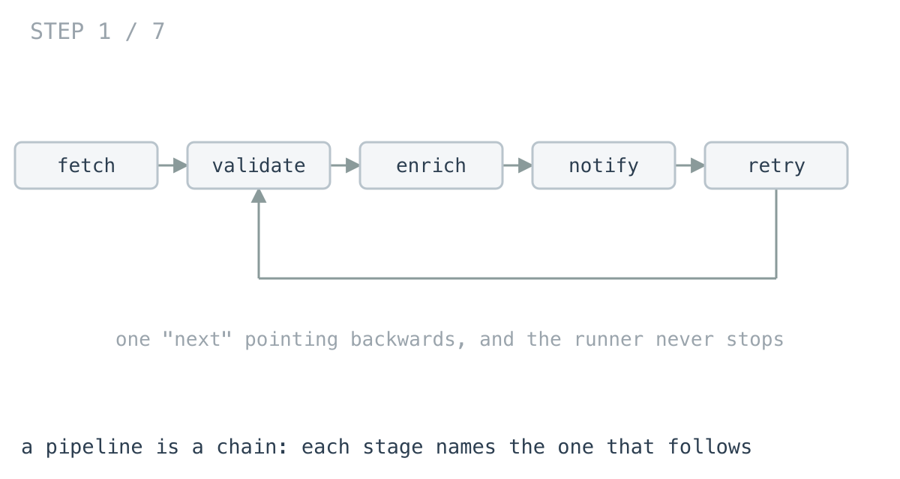
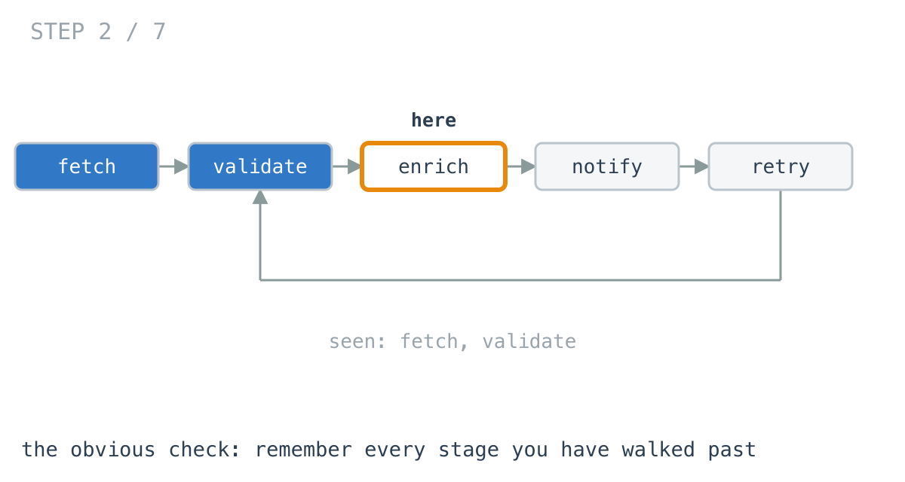
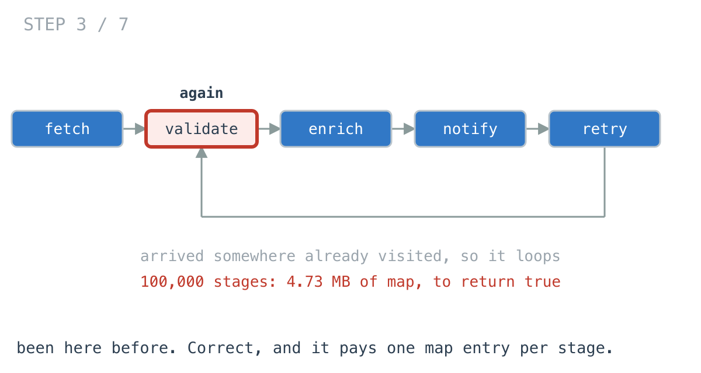
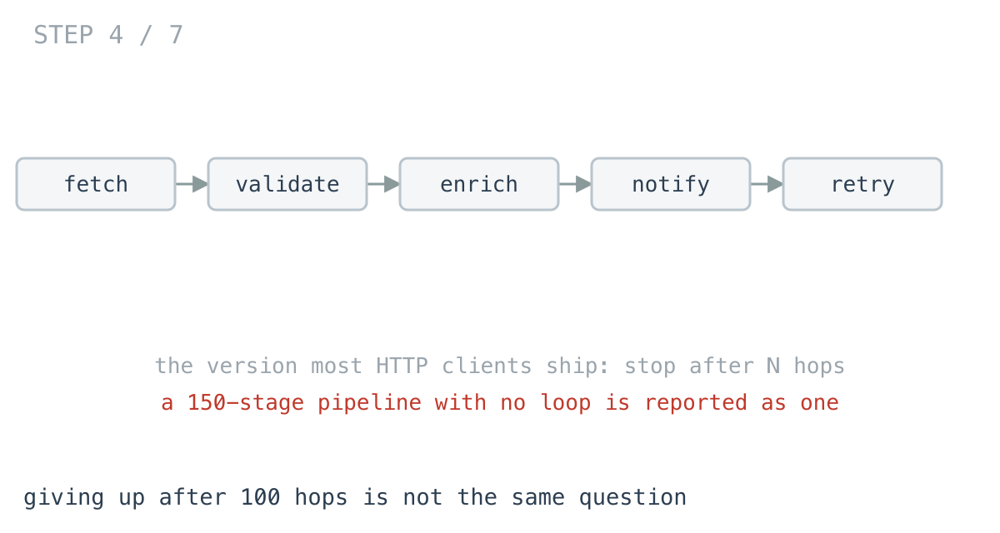
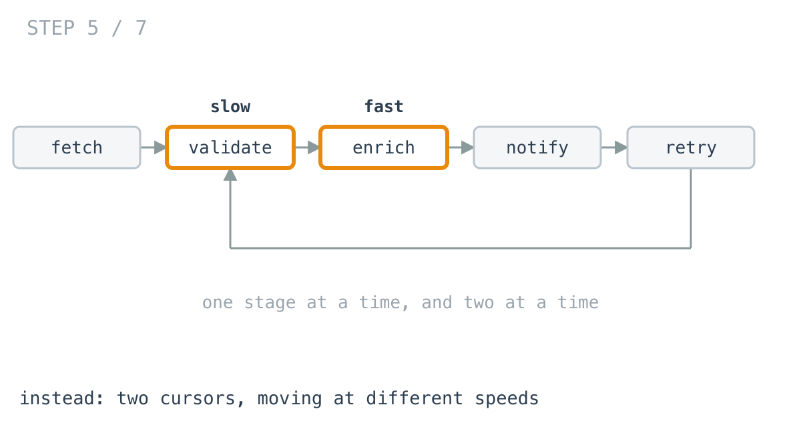
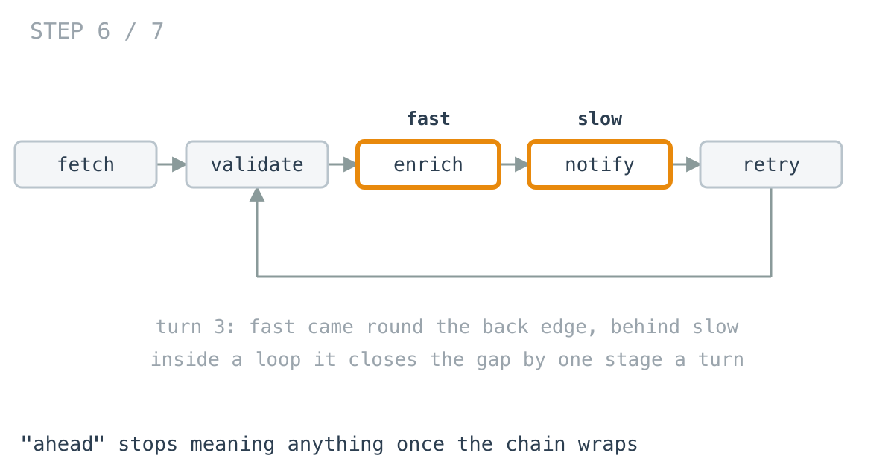
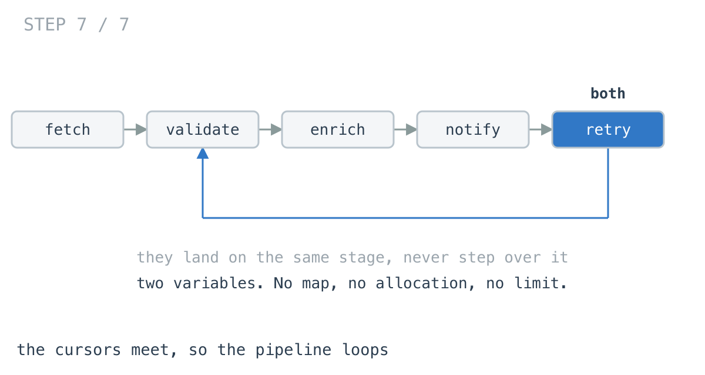

# The loop check allocated 4.7 MB to return a boolean

**It worked in dev · Episode 12 · technique: two cursors at different speeds**

A pipeline stage names the stage that runs next. Someone edits a config, a
`next` points backwards, and the runner walks that chain forever — so before
running anything you check whether following `next` ever comes back to
somewhere it has already been.

The obvious check builds a map of every stage it has walked past. On a
100,000-stage chain that is 4.73 MB and 530 allocations, to return `true`.

---

## The problem

```go
type Stage struct {
	Name string
	Next *Stage       // the one stage that runs after this one
}
```

Does following `Next` from here ever arrive somewhere it has already been?



---

## What you would write

```go
func HasCycleBySeen(head *Stage) bool {
	seen := map[*Stage]bool{}
	for s := head; s != nil; s = s.Next {
		if seen[s] {
			return true
		}
		seen[s] = true
	}
	return false
}
```

This is the definition of "loops" written down: been here before. It needs no
argument about why it works — you can read it once and be sure.

It is also the version that can tell you **where** the loop starts, which is
what the person reading the alert actually needs. `EntryBySeen` is the same four
lines returning `s.Name` instead of `true`.

I have shipped this. I would ship it again on a config file with twelve stages
in it.



---

## How bad, on its own

```
Apple M1 Pro · go1.26.4 · go test -bench=BenchmarkSeen -benchtime=300ms
```

| shape | stages | loops | map of seen |
|---|---:|---|---:|
| a hand-written pipeline | 12 | no | 383 ns |
| generated, one step per rule | 200 | no | 9.09 µs |
| a long chain that terminates | 100,000 | no | 5.48 ms |
| a long chain looping near the top | 100,000 | yes | 5.35 ms |
| a long chain looping in the last 1% | 100,000 | yes | 5.38 ms |

Two things in that table.

**4.73 MB allocated** on the 100,000-stage rows, to produce a boolean.

And the last three rows cost the same. A chain that loops back after two stages
costs what a chain that loops after ninety-nine thousand costs, because the map
gets built either way.



---

## The version most things actually ship

Before going further, the third option, because it is the one in production
almost everywhere: give up after N hops and call that a loop. Every HTTP client
does it with redirects.

```go
if hops >= limit {
	return true
}
```

It is O(1) memory and it is not an answer to this question.
`TestHopLimitLiesAboutLongChains` holds the pipeline it is wrong on: 150 stages,
no loop anywhere in it, reported as a loop because somebody guessed 100.



A check that answers the wrong question quickly is not a faster check. It is
not benchmarked below for that reason.

---

## From the symptom to the shape

### The issue, said plainly

The whole chain is being remembered so that one repeat can be noticed.

The question is *does some stage repeat*. The map answers a much larger
question — *for every stage, have I been there* — and the extra answers are
thrown away. A test counts the entries rather than the prose claiming them:
100,000 stages, 100,000 entries.

### Why is it allowed to happen?

Because for an arbitrary graph, remembering is the only way. If a stage could
name three successors, a walk really does have to record where it has been, and
the map is not an implementation detail, it is the algorithm.

The check is paying the price of a general solution on a structure that is not
general.

### The map's answer was already there

Every lookup asks "have I already been here", and 99,999 times out of 100,000
the answer is no — and that no changes nothing. The map is a record of a walk
that is happening anyway, consulted for one bit of information that arrives at
most once.

### What shape is the pipeline, actually?

Look at the struct rather than assuming. A stage names **one** next stage. Many
stages can point at the same one, but each points at exactly one.

That single fact is the whole episode. It is not a tree and not a general
graph: it is a **chain**, and a chain that loops has one shape available to it —
a run-in, then a ring. There is nowhere else to go, because from any stage the
future is fixed.

### Two cursors on a fixed path

If the path from a stage is fixed, two cursors starting from the head are
walking the same path, just at different points along it. Move one a stage at a
time and the other two at a time.

There are exactly two cases:

- The chain ends. The fast cursor runs off the end, because it gets there first.
- The chain rings. Neither cursor can reach an end, because there is no end, so
  both end up inside the ring.



### Once both are in the ring, they cannot miss

Inside the ring, measure the gap as the forward distance from the fast cursor
round to the slow one. Each turn, slow moves one and fast moves two, so that
gap shrinks by exactly one.

Exactly one, never two. A gap that decreases by one cannot skip zero — so they
land on the same stage rather than stepping over each other. Meeting is
arithmetic, not luck.



`TestTwoPointersAlwaysMeet` runs every ring size up to 200 from five different
run-in lengths, and `TestDrawnTrace` pins the exact trace the diagrams above
draw — which exists because the first version of those diagrams drew the wrong
turn.

### The rule

> **When every node has exactly one successor, the path is fixed and no history
> is needed to detect a repeat. Two cursors at different speeds turn a memory
> problem into two variables.**

### Where it came from in the challenge

This is
[day 21](https://github.com/architagr/leetcode_solutions/blob/main/easy_problems/101_200/linked_list_cycle/SOLUTION.md),
Linked List Cycle, unchanged — the same `slow`, `fast`, `fast.Next.Next`, and
the same comparison of node identity rather than value. Its write-up makes the
point about the loop condition that matters here: `fast != nil &&
fast.Next != nil` is not a guard against a nil dereference, it *is* the
no-cycle answer.

[Day 19](https://github.com/architagr/leetcode_solutions/blob/main/easy_problems/201_300/reverse_linked_list/SOLUTION.md),
Reverse Linked List, is where the two-cursor walk over one chain first shows up
— `prev` and `head` moving in lockstep, with `next` saved before the link is
overwritten. It also demonstrates the failure this episode is about: its loop is
`for head != nil`, so on a chain that rings, it never returns.

### When this does not apply

The moment a stage can name two successors — a workflow that branches, a job
that fans out — the path stops being fixed, the two cursors are no longer
walking the same route, and the map comes back as the right answer. That is a
different problem with a different shape, and it is the one topological sort
solves.

It also compares identity. Two stages holding the same name are not the same
stage, and if your pipeline is keyed by name rather than pointer, compare names
and accept that a duplicate name is now a false positive.

And if anything mutates the chain while the walk runs, neither version is
trustworthy.

---

## Try it before reading on

No map, no counter, no limit. Two variables, and the answer falls out of where
they end up.

```bash
git clone https://github.com/architagr/leetcode_solutions
cd leetcode_solutions/series/it-worked-in-dev/episodes/12-pipeline-never-finishes
go test ./...
```

Reading on costs you the rep.

---

## The version that scales

```go
func HasCycleByTwoPointers(head *Stage) bool {
	slow, fast := head, head
	for fast != nil && fast.Next != nil {   // an end exists, so no ring
		slow = slow.Next
		fast = fast.Next.Next
		if slow == fast {                   // the same stage, not the same name
			return true
		}
	}
	return false
}
```

Three things carry it: the two speeds, the identity comparison, and a loop
condition that doubles as the negative answer.



---

## The measurement

| shape | stages | map of seen | two pointers | ratio |
|---|---:|---:|---:|---:|
| a hand-written pipeline | 12 | 383 ns | 3.17 ns | 120.6x |
| generated | 200 | 9.09 µs | 195 ns | 46.7x |
| a long chain, no loop | 100,000 | 5.48 ms | 115 µs | 47.8x |
| looping near the top | 100,000 | 5.35 ms | 238 µs | 22.5x |
| looping in the last 1% | 100,000 | 5.38 ms | 208 µs | 25.8x |

Raw ns: 382.7 / 3.172 · 9,089 / 194.6 · 5,475,021 / 114,592 ·
5,351,342 / 237,749 · 5,375,737 / 207,961

The twelve-stage row is the one I did not expect: **120.6x**, because the map
pays for a map before it walks anything — 328 bytes and three allocations for a
pipeline that fits on a screen, against a handful of instructions.

In absolute terms 383 nanoseconds is nothing, and no profiler will ever point
at it. It matters only where the check runs per request.

---

## Naming the loop, without the map

The map version knows where the loop starts because it kept everything. Two
pointers can recover it too: once the cursors meet, walk one cursor from the
head and the other from the meeting point, one stage at a time, and they meet
at the top of the ring.

| shape | map of seen | two pointers | ratio |
|---|---:|---:|---:|
| looping near the top | 4.61 ms | 235 µs | 19.6x |
| looping in the last 1% | 4.65 ms | 320 µs | 14.5x |

Raw ns: 4,611,735 / 235,012 · 4,646,652 / 319,764

Still zero allocations, and notice the gap narrowing — 14.5x here against 47.8x
for the plain check. That second walk is real work the map version never has to
do, because it already knew.

---

## What it costs

The two-pointer version needs an argument before you can believe it. "Been here
before" is self-evident; "the gap shrinks by exactly one, so they cannot step
over each other" is a proof, and a reviewer either follows it or takes it on
trust. That is a real cost, and it is why the meeting property is a test over
every ring size rather than a sentence in a comment.

It also gives up everything except the answer. The map holds the walked set, so
it can report the loop's entry for free, list the stages involved, or tell you
how long the chain was. Two cursors know none of that without walking again.

And the identity assumption is load bearing in a way a comment cannot enforce.

**At twelve stages, keep the map.** It is 383 nanoseconds, it is obviously
correct, and it tells you where the loop is. Reach for two pointers when the
chain is long, when the check runs on every request, or when allocation itself
is the thing you are trying to avoid.

One thing not to keep either way: the hop limit. Giving up after 100 steps is
what most HTTP clients do with redirects, and
`TestHopLimitLiesAboutLongChains` shows the cost — a 150-stage pipeline with no
loop in it, reported as a loop. It answers a different question quickly, which
is not the same as answering this one.

---

## The one line to keep

One successor per node means the path is fixed, and a fixed path needs no
memory to detect a repeat.

---

## Built on

Days from the [365-day LeetCode challenge](https://github.com/architagr/leetcode_solutions),
with the solution write-up and the problem itself:

- **Day 19 — [Reverse Linked List](https://github.com/architagr/leetcode_solutions/blob/main/easy_problems/201_300/reverse_linked_list/SOLUTION.md)** · LeetCode [#206](https://leetcode.com/problems/reverse-linked-list/) · easy
  <br>two cursors walking one chain, and a loop that ends on a nil pointer rather than on a count
- **Day 21 — [Linked List Cycle](https://github.com/architagr/leetcode_solutions/blob/main/easy_problems/101_200/linked_list_cycle/SOLUTION.md)** · LeetCode [#141](https://leetcode.com/problems/linked-list-cycle/) · easy
  <br>the two-speed walk itself, and the reason the loop condition is the no-cycle answer rather than a guard against dereferencing nil

---

## Run it yourself

```bash
git clone https://github.com/architagr/leetcode_solutions
cd leetcode_solutions/series/it-worked-in-dev/episodes/12-pipeline-never-finishes
go test ./...                         # both checks agree, on 5,000 random pipelines
go test -bench=. -benchtime=300ms     # the numbers above
```

---

Part of [It worked in dev](../../), the long-form companion to the
[365-day LeetCode challenge](https://github.com/architagr/leetcode_solutions).

---

*Ideation, problem selection, benchmarks and conclusions: Archit Agarwal.
The prose was drafted with AI assistance and edited by me. Every number here
comes from a run you can reproduce with the commands above.*
