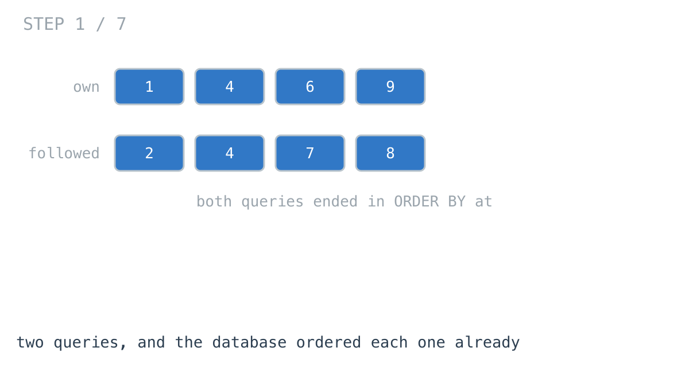
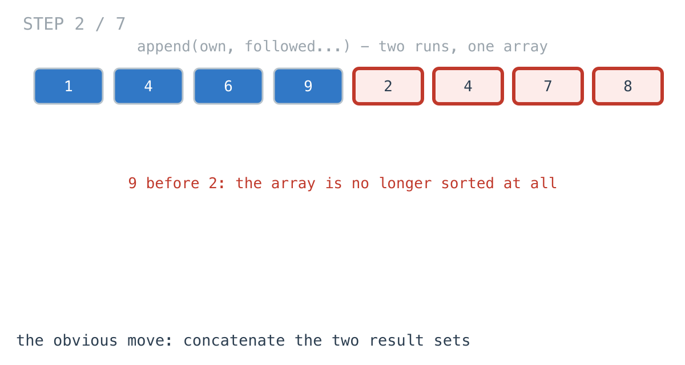
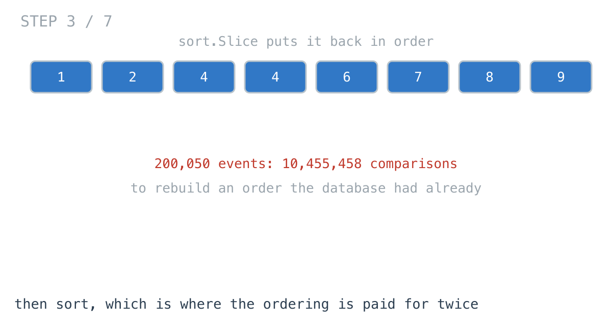
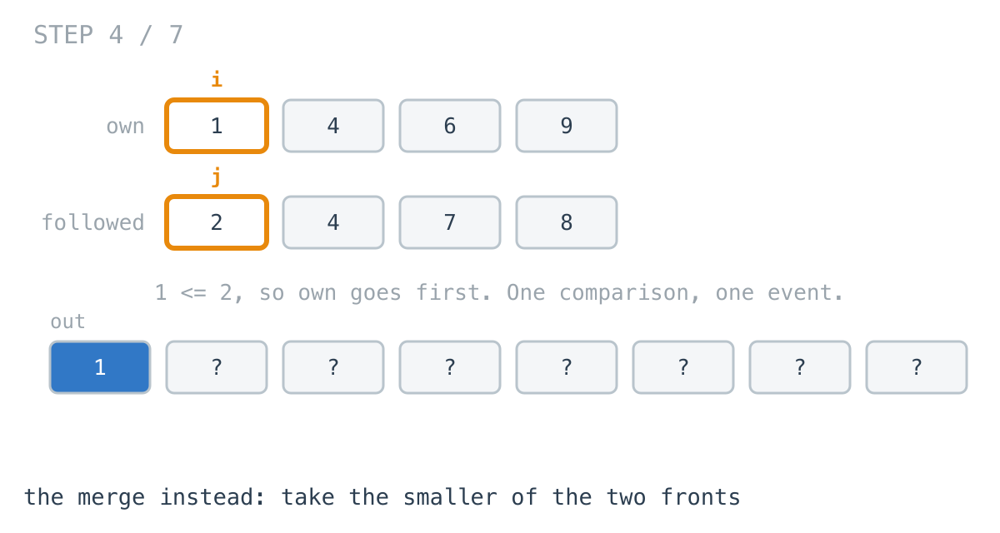
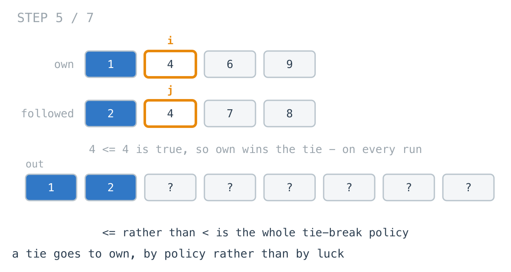
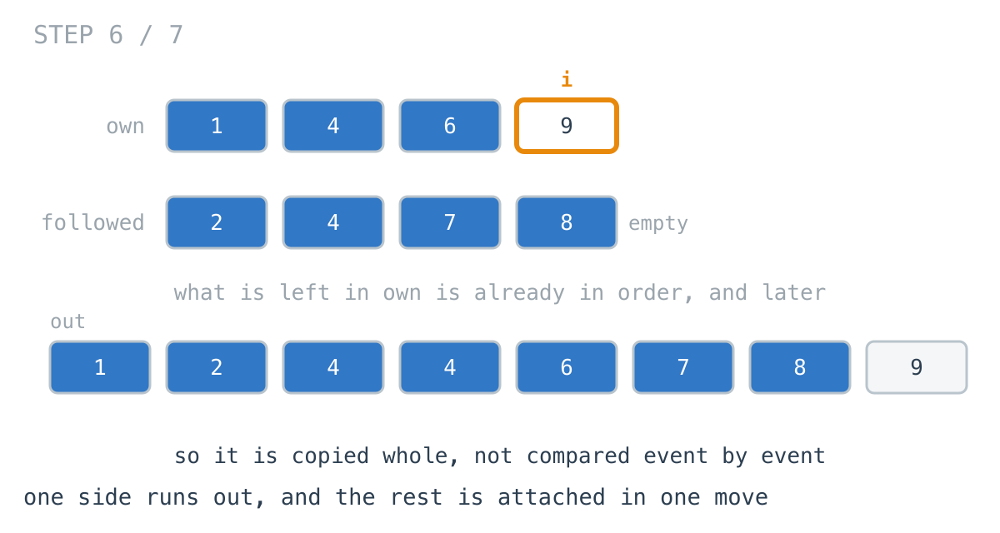
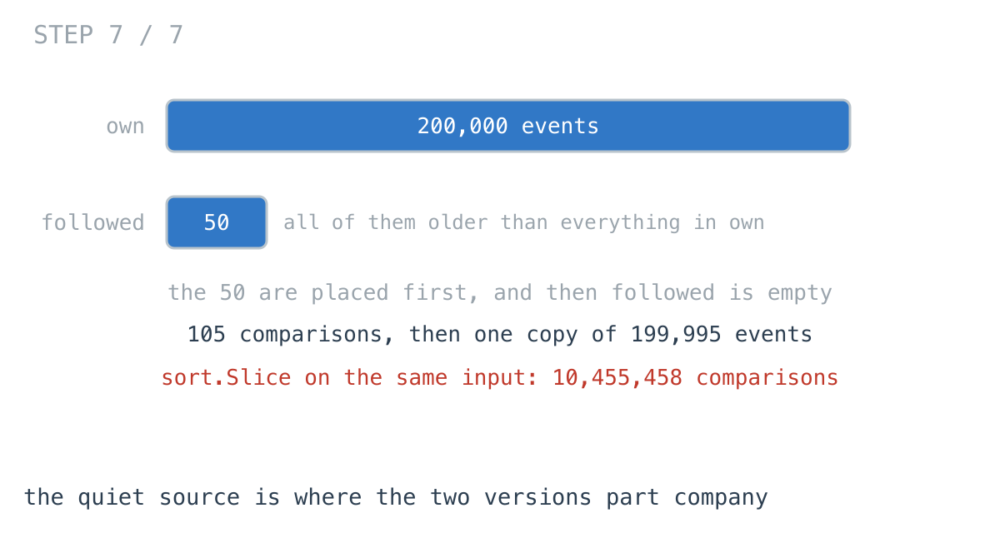

# 200,050 events sorted 2x slower than 400,000

**It worked in dev · Episode 13 · technique: merging two sorted inputs**

An activity feed page runs two queries - your own events, and events from
everyone you follow - and shows them interleaved by time. Both queries end in
`ORDER BY at`, so both result sets arrive sorted. The page concatenates them
and sorts the result.

On 200,000 own events and 200,000 followed events that sort takes 40.1 ms. On
200,000 own events and **50** followed events it takes 80.4 ms - half the data,
twice the time.

---

## The problem

```go
type Event struct {
	At     int64  // when it happened, and what the database ordered by
	Source string // which of the two queries produced it
	Seq    int    // position within that query's result set
}
```

Two sorted slices in, one sorted slice out.



---

## What you would write

```go
func MergeBySorting(own, followed []Event) []Event {
	out := make([]Event, 0, len(own)+len(followed))
	out = append(out, own...)
	out = append(out, followed...)
	sort.Slice(out, func(i, j int) bool { return out[i].At < out[j].At })
	return out
}
```

Three lines, and the middle one says exactly what the page needs: everything,
in time order. It is correct for any two inputs - sorted, unsorted, empty, one
of each - which means it keeps working when somebody later adds a third source
or drops the `ORDER BY` from one query.

I have written this. I would write it again for a feed that shows twenty rows.



---

## How bad, on its own

```
Apple M1 Pro · go1.26.4 · go test -bench=BenchmarkSorting -benchtime=200x
```

| shape | events | sort.Slice |
|---|---:|---:|
| one screen of a feed | 20 + 20 | 1.67 µs |
| a day for an active account | 500 + 500 | 63.7 µs |
| the month view | 20,000 + 20,000 | 3.75 ms |
| an export nobody paginated | 200,000 + 200,000 | 40.1 ms |
| one busy source, one quiet one | 200,000 + 50 | 80.4 ms |

Twenty rows a side costs 1.67 microseconds, which is nothing, and no profiler
will ever point at it.

The last row is the one I did not believe. It has 199,950 fewer events in it
than the row above and it takes **2.0x** as long. Sorting less data took
longer.

Counting the comparisons says why. The comparison function is wrapped in a
counter, so these are exact:

| shape | events | sort.Slice | merge |
|---|---:|---:|---:|
| an export | 400,000 | 7,229,678 | 399,227 |
| one busy source, one quiet one | 200,050 | 10,455,458 | 105 |

Ten and a half million comparisons, on an input where 105 would do.



---

## From the symptom to the shape

### The issue, said plainly

Both result sets came back in order, and the first thing the function does is
destroy that.

`append(out, own...)` then `append(out, followed...)` produces an array whose
first half is ascending and whose second half is ascending and whose join is
wherever the two ranges happen to meet. Every fact the database established is
still in there. Nothing can use it, because nothing recorded where the seam
was.

### Quantify it on the concrete example

Sorting `n` items costs on the order of `n log n` comparisons. At 400,000
events that is about 7.2 million, and the counter above agrees: 7,229,678.

The merge needs one comparison to place one event, so it cannot exceed
`n + m - 1`. At 400,000 events it made 399,227 - about **18 times fewer**
comparisons for exactly the same output.

### Why is it allowed to happen?

Because `sort.Slice` has no way to be told what you know. Its contract is a
bag of elements and a less-than function, and a bag of elements is what it
gets. It cannot see that the array is two sorted runs glued together, so it
cannot skip the work of finding out.

Nothing is wrong with the call. The call is answering a harder question than
the one being asked, and answering it well.

### The order was already there, and then it was thrown away

Walk the timeline. The database sorted `own`. The database sorted `followed`.
The function received both, already ordered, and its first two statements
flattened them into one array where that order is no longer addressable. Then
it spent ten million comparisons recovering it.

The information was never missing. It was discarded one line before it was
needed.

### What shape is the input, actually?

Do not assume it. Two sequences. Each is non-decreasing in `At`. Each is read
front to back and never written to. Neither has any relationship to the other
beyond sharing a key.

That is not a bag. It is **two sorted runs**, and the next rung only holds
because each one really is sorted by the same key the output is sorted by.

### Write the thing you want as an equation

The first event of the output is the earliest event overall:

```
first(out) = min(own[0], followed[0])
```

Read the right-hand side out loud. It names two events. Not two lists - two
events, one from the front of each. Everything behind them is irrelevant,
because everything behind `own[0]` is at least `own[0]`.

And once that event is placed, the same sentence describes the rest: the
second event of the output is the earliest of the two new fronts. The equation
is the same at every step, on a shorter input.

### Conclude the order

If each output event is decided by exactly two candidates, each output event
costs exactly one comparison. `n + m` events, `n + m` comparisons, one pass,
no random access, nothing revisited. That is what linear means here, and it
came out of the equation rather than out of a complexity table.

This is a **merge**, and it earns the name on this rung rather than the first
one.



### The tie is a decision, not a detail

When the two fronts are equal, one of them has to go first, and the comparison
you write is what decides which. `own[i].At <= followed[j].At` puts your own
event first, every time, on every machine, for every input.

`sort.Slice` makes no such promise. It is not stable, and on 400 events where
about half share a timestamp with another it places **271 of them** somewhere
other than where the merge does. Worse, appending one new event after
everything else moved **74 of the 400 events in front of it** - because the
pivots the sort chooses depend on the length of the slice, and the slice got
longer.

That is the bug report that reads "the feed reshuffles itself when I refresh".



### And then one side runs out

The loop ends when either cursor reaches its end. What is left in the other
side is already in order and already later than everything placed, so it is
not compared at all - it is copied.



That is the whole explanation for the 105. In the 200,000 + 50 shape the fifty
followed events are all older than everything in `own`, so after 105
comparisons `followed` is empty and 199,995 events move in a single copy.



### Where it came from in the challenge

[Day 22](https://github.com/architagr/leetcode_solutions/blob/main/easy_problems/1_100/merge_two_sorted_lists/SOLUTION.md),
Merge Two Sorted Lists, is this function on linked lists. Two details carry
over unchanged: `list1.Val <= list2.Val` rather than `<`, which is where
stability comes from, and the final `tail.Next = list1` that attaches the
remainder whole instead of walking it. Its write-up makes the point about the
dummy node that a slice version does not need - `append` into an empty slice
is already the "no special case for the first element" trick.

[Day 19](https://github.com/architagr/leetcode_solutions/blob/main/easy_problems/201_300/reverse_linked_list/SOLUTION.md),
Reverse Linked List, is where a loop over one sequence ends on a cursor
running out rather than on a count. `for head != nil`, not `for i < n`. The
merge's condition is the same shape - `i < len(own) && j < len(followed)` -
and it is why the function never needs to know how long either feed is before
it starts.

### When this does not apply

Go back to the equation and break it.

`first(out) = min(own[0], followed[0])` holds because there are exactly two
fronts. Three feeds make it `min` of three, four make it four, and at some
point scanning the fronts costs more than it saves - that is where a heap
comes in, and it is a different episode.

It also holds only while both inputs are genuinely sorted by the key the
output is sorted by. If somebody changes one query's `ORDER BY at` to
`ORDER BY id`, or the API starts returning newest-first, the merge produces a
wrong answer quietly and `sort.Slice` keeps working. That is a real cost and
it is in the trade section below, not hidden here.

And if the sort key is computed at read time rather than being the column the
database ordered by - a score, a localised timestamp, anything derived - then
the inputs are not sorted by it and none of this follows.

### The rule

> **When two inputs are each already sorted by the key you want, the answer is
> one comparison per output element. Sorting the concatenation pays `n log n`
> to rediscover an order you were handed.**

---

## Try it before reading on

No sort call. No map. One destination slice and two integers, and the whole
function fits in a dozen lines.

The part worth getting right is the end: what happens when one side runs out
while the other still has events in it.

```bash
git clone https://github.com/architagr/leetcode_solutions
cd leetcode_solutions/series/it-worked-in-dev/episodes/13-merge-two-sorted-feeds
go test ./...
```

Reading on costs you the rep.

---

## The version that scales

```go
func MergeByWalking(own, followed []Event) []Event {
	out := make([]Event, 0, len(own)+len(followed))
	i, j := 0, 0
	for i < len(own) && j < len(followed) {
		// <= rather than < is the whole tie-break policy: on an equal
		// timestamp your own event goes first, every time, on every machine.
		if own[i].At <= followed[j].At {
			out = append(out, own[i])
			i++
		} else {
			out = append(out, followed[j])
			j++
		}
	}
	// One side is empty. What is left in the other is already in order and
	// already later than everything placed, so it is copied in one move
	// rather than compared element by element.
	out = append(out, own[i:]...)
	out = append(out, followed[j:]...)
	return out
}
```

Three lines carry it. The loop condition, which ends on a cursor running out
rather than on a count. The `<=`, which is the tie-break policy. And the two
tail appends, one of which is always a no-op and the other of which is a
single copy.

---

## The measurement

```
Apple M1 Pro · go1.26.4 · go test -bench=. -benchtime=200x
```

| shape | events | sort.Slice | slices.SortFunc | merge | ratio |
|---|---:|---:|---:|---:|---:|
| one screen | 20 + 20 | 1.67 µs | 967 ns | 396 ns | 4.2x |
| a day | 500 + 500 | 63.7 µs | 34.2 µs | 5.31 µs | 12.0x |
| the month view | 20,000 + 20,000 | 3.75 ms | 2.27 ms | 280 µs | 13.4x |
| an export | 200,000 + 200,000 | 40.1 ms | 28.5 ms | 2.63 ms | 15.2x |
| busy plus quiet | 200,000 + 50 | 80.4 ms | 40.8 ms | 644 µs | 124.8x |

Raw ns: 1,670 / 967.3 / 395.8 · 63,679 / 34,246 / 5,308 ·
3,750,073 / 2,273,456 / 280,376 · 40,056,674 / 28,510,958 / 2,631,410 ·
80,427,295 / 40,787,244 / 644,223

The ratio column is `sort.Slice` against the merge on the same input.

`slices.SortFunc` is in there so the episode is not beating a version nobody
writes any more. It is the same pdqsort - it makes **exactly** the same number
of comparisons on every shape - and it is faster only because a generic
function swaps `Event` values directly instead of going through the
reflect-based swapper `sort.Slice` builds. Against the merge it is still
**63.3x** on the last row and **10.8x** on the export.

---

## The sort that was already a merge

One more column, because it changes the advice.

| shape | events | sort.Slice | sort.SliceStable |
|---|---:|---:|---:|
| an export | 200,000 + 200,000 | 40.1 ms | 48.3 ms |
| busy plus quiet | 200,000 + 50 | 80.4 ms | 4.69 ms |

`sort.SliceStable` is **17.2x** faster than `sort.Slice` on the shape where
`sort.Slice` falls apart, and 240,743 comparisons against 10,455,458. It is
slower everywhere else.

That is not a coincidence. `sort.SliceStable` insertion-sorts short blocks and
then merges them pairwise, so on an array that is already two long sorted runs
most of its merges find the two halves are already in order and cost almost
nothing. What it cannot avoid is doing those merges in place, by rotating
elements rather than copying them into a destination - which is why it is
still **7.3x** slower than the explicit merge on that row.

So if you change one thing and one thing only, change `sort.Slice` to
`sort.SliceStable`. You get the stable tie-breaking for free and the
pathological row stops being pathological. It is the smallest correct edit,
and it is not the fast one.

---

## What it costs

**An invariant somebody has to maintain.** `MergeByWalking` is correct only
while both inputs are sorted by `At` ascending. `sort.Slice` is correct
regardless. The day someone changes one query's `ORDER BY`, adds a
`UNION ALL`, or starts returning results newest-first, the sort keeps working
and the merge silently emits garbage. Sortedness is a precondition that lives
in a different file from the function that depends on it, which is the worst
place for a precondition to live.

If you take the merge, take a cheap assertion with it - the inputs are walked
in order anyway, so checking `own[i-1].At <= own[i].At` as you go is free, and
a panic in staging beats a scrambled feed in production.

**It does not save memory.** Both versions allocate one destination of
`len(own)+len(followed)`. The merge allocates once where `sort.Slice`
allocates four times, and the extra three are the reflect swapper, not the
data. On the export shape both hold about 12.8 MB.

**It does not generalise for free.** Two feeds is one comparison. Three is
three, or a heap.

**At twenty rows a side, keep the sort.** It is 1.67 microseconds, it is
obviously correct, and it survives a change to either query. Reach for the
merge when the feed is an export, when one source is much larger than the
other, or when the tie order has to be the same on two consecutive requests.

---

## The one line to keep

Two sorted inputs are one comparison per output element. Sorting their
concatenation pays `n log n` to find out what you already knew.

---

## Built on

Days from the [365-day LeetCode challenge](https://github.com/architagr/leetcode_solutions),
with the solution write-up and the problem itself:

- **Day 19 — [Reverse Linked List](https://github.com/architagr/leetcode_solutions/blob/main/easy_problems/201_300/reverse_linked_list/SOLUTION.md)** · LeetCode [#206](https://leetcode.com/problems/reverse-linked-list/) · easy
  <br>two cursors walking one chain, and a loop that ends on a nil pointer rather than on a count
- **Day 22 — [Merge Two Sorted Lists](https://github.com/architagr/leetcode_solutions/blob/main/easy_problems/1_100/merge_two_sorted_lists/SOLUTION.md)** · LeetCode [#21](https://leetcode.com/problems/merge-two-sorted-lists/) · easy
  <br>taking the smaller of the two fronts, and attaching the rest of the surviving list whole rather than walking it

---

## Run it yourself

```bash
git clone https://github.com/architagr/leetcode_solutions
cd leetcode_solutions/series/it-worked-in-dev/episodes/13-merge-two-sorted-feeds
go test ./...                      # all four versions agree, on 500 random feeds
go test -run TestComparisonCounts -v   # the comparison counts above
go test -bench=. -benchtime=200x   # the numbers above
```

---

Part of [It worked in dev](../../), the long-form companion to the
[365-day LeetCode challenge](https://github.com/architagr/leetcode_solutions).

---

*Ideation, problem selection, benchmarks and conclusions: Archit Agarwal.
The prose was drafted with AI assistance and edited by me. Every number here
comes from a run you can reproduce with the commands above.*
