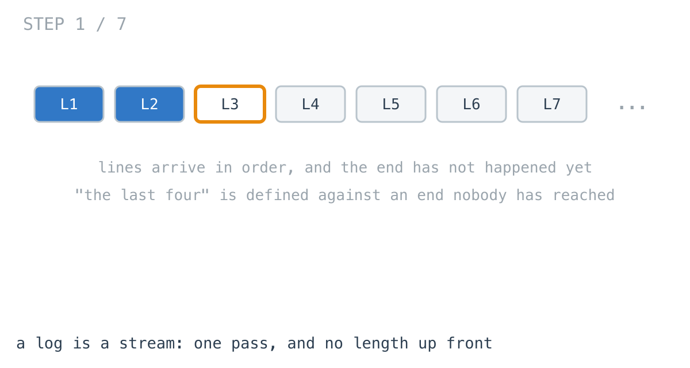
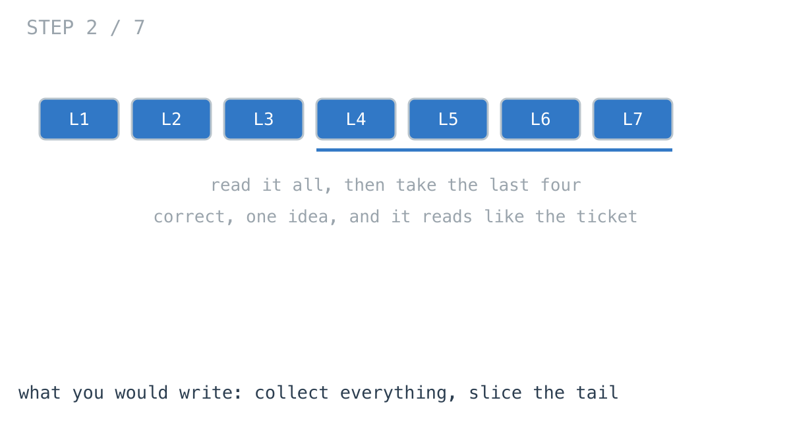
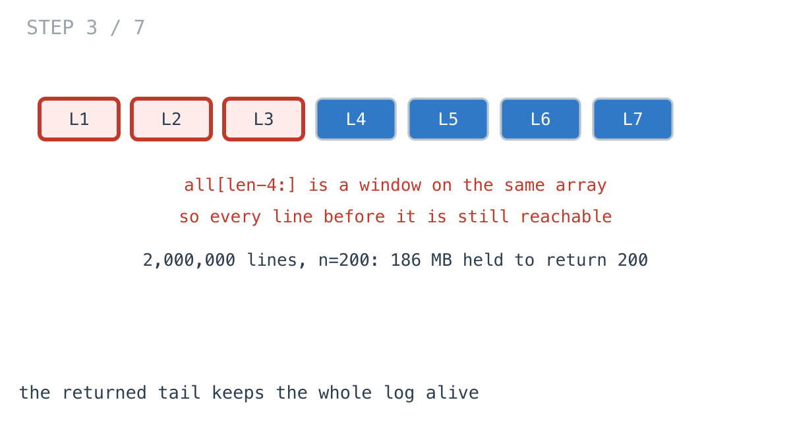
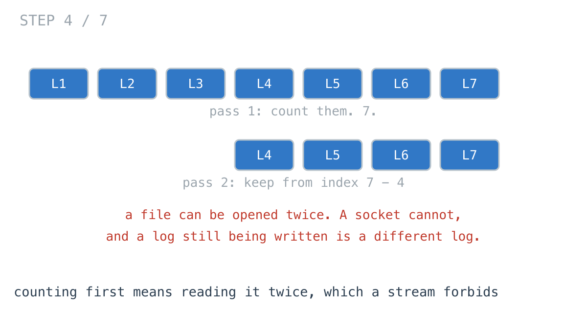
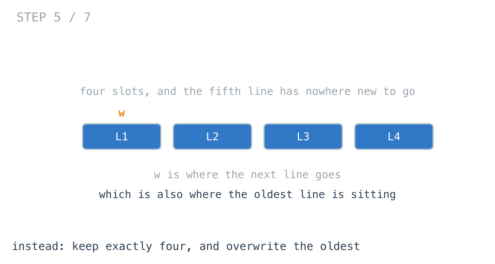
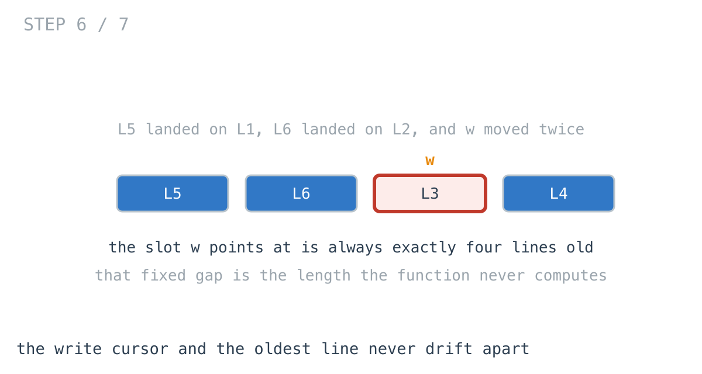
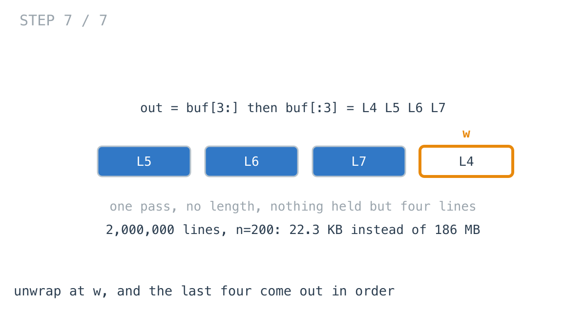

# Your crash report held the whole log to send 200 lines

**It worked in dev · Episode 14 · technique: a fixed gap between two cursors**

A crash reporter attaches the last 200 lines of the request log to the report.
The log is a stream: a scanner over a file, a cursor over a table, a channel
fed by a tailer. It hands you lines in order and it does not know how many
there are.

Reading it all and slicing the tail holds **186 MB** on a two-million-line log,
to return 200 lines. Keeping a ring of 200 holds **22.3 KB**. Both take about
the same time.

---

## The problem

```go
// The log yields lines in order, once. It does not know its own length,
// because the end has not happened yet.
type Log = iter.Seq[string]
```

The last `n` of them.



---

## What you would write

```go
func LastNByCollecting(log Log, n int) []string {
	var all []string
	for line := range log {
		all = append(all, line)
	}
	if len(all) <= n {
		return all
	}
	return all[len(all)-n:]
}
```

One idea, and it reads like the sentence in the ticket. It is correct for a log
shorter than `n`, correct for an empty log, and correct for a log where `n` is
bigger than anything you will ever pass. Nothing about it needs an argument.

I have written this in two languages. On the log in front of me while I wrote
it - a couple of hundred lines - it costs 34 microseconds and 21.8 KB, and
there is nothing wrong with it.



---

## How bad, on its own

The interesting measurement here is not time. It is the live heap with the
answer still held: force a GC, read `HeapAlloc`, run the function, force
another GC, read it again with the result still referenced. What comes back is
what the collector could not take.

```
Apple M1 Pro · go1.26.4 · go test -run TestRetainedHeap -v
```

| shape | lines | held after it returns |
|---|---:|---:|
| the log in front of you | 200 | 21.8 KB |
| one chatty request | 10,000 | 959 KB |
| a pod since its last restart | 1,000,000 | 93.2 MB |
| a rotation period | 2,000,000 | 186 MB |

The function returned 200 strings. 200 strings are about 20 KB. The other
186 megabytes are the rest of the log, and they are still there after the
function has gone out of scope.



---

## From the symptom to the shape

### The issue, said plainly

The answer is 200 lines and the function is holding two million of them.

That is not a figure of speech. `all[len(all)-n:]` is a **window** onto the
array that `all` grew into, not a new array, and a slice keeps its entire
backing array alive. The test reads the capacity off the returned value rather
than arguing about it:

| lines | len of the answer | cap of the answer |
|---:|---:|---:|
| 100,000 | 200 | 17,960 |
| 1,000,000 | 200 | 109,704 |
| 2,000,000 | 200 | 169,032 |

A 200-element answer with 169,032 slots behind it. Everything before the window
sits in the same allocation, so it is scanned and kept too.

### The smallest fix, and what it does not fix

```go
out := make([]string, len(tail))
copy(out, tail)
```

One line, and the retained figure drops from 186 MB to 20.8 KB. If you read
nothing else here, read that: **a tail slice of a big collection should be
copied.**

It does not fix the peak. The copy happens after the collection finishes, so
the two million lines were all in memory a moment earlier, and that moment is
where a container gets killed. You can read that off the function without
benchmarking it.

### Why is it allowed to happen?

Because "the last 200" is defined against an end that has not happened yet, and
the obvious way to find an end is to arrive at it. Collecting is not a lazy
choice, it is the only one available if you insist on knowing the length first.

Day 24 of the daily challenge puts it exactly right: *"nth from the end" is a
position measured from somewhere you cannot start.* The collecting version
translates it into a position you can start from, and the price of the
translation is holding everything until the translation is possible.

### The answer was already in hand, after every line

Walk the timeline. After line 300, the last 200 lines seen were already the
answer to "the last 200 so far". After line 1,999,999 they were the answer
again. At no point in that walk was the function short of information - it was
already holding a correct answer, alongside 1,999,800 lines it would never look
at again.

The rest was not needed. It was kept because nothing in the code ever said out
loud that it could go.

### Count it twice, then

The other thing you write when somebody points at the memory. Walk it once to
get the length, walk it again and keep from `count - n`.

It costs exactly what you would guess: **2.00x** the one-pass version, at every
size in the benchmark. Two passes cost two passes.

And it needs a different argument than a `Log`. It needs a way to *start* the
walk twice, which a file gives you and a socket does not, and a channel from a
tailer does not, and a paginated API with a one-shot cursor does not. On a log
that is still being written, the second walk reads a different log than the
first one measured.



### What shape is the question, actually?

Do not assume it. The output is 200 lines. The input is unbounded and arrives
once. The only lines that can possibly be in the answer are the 200 most recent
ones seen so far, and that is true after every single line, not just at the
end.

So the function does not need the log. It needs a **window** over it, and the
window has a fixed size that was given as an argument.

### Write the thing you want as an equation

```
answer(after k lines) = the last min(k, n) lines seen
```

Read the right-hand side out loud. It names `n` lines and the line that just
arrived. Not the log, not `k`. Whatever was true 201 lines ago cannot affect
it.

That is the whole property: the state needed to answer the question is bounded
by `n`, and `n` was known before the first line arrived.

### Conclude the structure

If the state is exactly `n` lines and one more arrives, one has to leave, and
it is always the oldest. A fixed-size buffer where writing past the end wraps
to the front does that with no bookkeeping: `w` is where the next line goes,
which is also where the oldest line currently sits, because the two are exactly
`n` apart and never drift.

**That gap is the length the function never computes.** It is the same trick as
two cursors `n` apart on a chain, and the ring is what it looks like when you
also want to keep what is between them.





### Closing the last gap

The buffer ends up rotated: the oldest line is at `w`, not at 0. So the answer
is `buf[w:]` followed by `buf[:w]`, which is one allocation of exactly `n` and
two copies.



### Where it came from in the challenge

[Day 20](https://github.com/architagr/leetcode_solutions/blob/main/easy_problems/801_900/middle_of_the_linked_list/SOLUTION.md),
Middle of the Linked List, is where a length stops being computed and starts
being a relationship between two cursors. Its write-up says why both pointers
start at the head: *from the same starting line, after k iterations `end` has
covered 2k nodes and `middle` has covered k.* No length is ever calculated. The
ratio between the cursors is the length, expressed differently.

[Day 24](https://github.com/architagr/leetcode_solutions/blob/main/medium_problems/1_100/remove_nth_node_from_end_of_list/SOLUTION.md),
Remove Nth Node From End of List, is this exact question on a chain, and the
published solution is the **counting** one - the two-pass version this episode
is about. Worth reading for that reason: it is the honest version of the move
everybody makes, and its own write-up names the cost, calling the first pass
"the translation step". `NthFromEndByGap` in this folder is the same problem
with the translation deleted, and the two are benchmarked against each other
below.

### When this does not apply

Go back to the equation and break it.

`answer(after k lines) = the last min(k, n) lines` holds because the answer
depends on a bounded suffix. The moment the question depends on something
unbounded - the whole log, an aggregate over it, the first line matching a
pattern that may be anywhere - the window stops being enough and you are back
to holding things.

It also assumes `n` is known before the walk starts. "The lines since the last
restart" is not a fixed-size window, and neither is "everything after the last
ERROR".

And the ring holds `n` lines, so it is only a win when `n` is much smaller than
the log. At 200 lines of 200, it holds the same thing collecting holds, and the
benchmark says so: **1.1x**.

### The rule

> **When the answer depends only on a bounded suffix of a stream, keep a
> buffer that size and let the write cursor trail itself. The distance between
> the two cursors is the length you would otherwise have to go and measure.**

---

## Try it before reading on

One buffer of exactly `n`, two integers, one pass. No slice that grows, no
second walk, no length.

Two things worth getting right, and both have a test in the folder: a log
shorter than `n`, and the order the lines come out in once the buffer has
wrapped.

```bash
git clone https://github.com/architagr/leetcode_solutions
cd leetcode_solutions/series/it-worked-in-dev/episodes/14-last-n-in-one-pass
go test ./...
```

Reading on costs you the rep.

---

## The version that scales

```go
func LastNByRing(log Log, n int) []string {
	if n <= 0 {
		return nil
	}
	buf := make([]string, 0, n)
	w, count := 0, 0
	for line := range log {
		if len(buf) < n {
			buf = append(buf, line)
		} else {
			buf[w] = line // the line this evicts is exactly n lines old
		}
		w = (w + 1) % n
		count++
	}
	if count <= n {
		return buf
	}
	// Unwrap: the oldest line is at w, so the answer is buf[w:] then buf[:w].
	out := make([]string, 0, n)
	out = append(out, buf[w:]...)
	out = append(out, buf[:w]...)
	return out
}
```

Three things carry it. `buf` has capacity `n` and never grows. `w` is both the
write position and the oldest line, which is the gap doing its work. And the
unwrap at the end, which is the only part that is not obvious and the only part
with a test named after it.

---

## The measurement

```
Apple M1 Pro · go1.26.4 · go test -bench=. -benchtime=20x
```

Held, with the answer still referenced:

| shape | lines | collecting | copying the tail | ring | ratio |
|---|---:|---:|---:|---:|---:|
| the log in front of you | 200 | 21.8 KB | 20.5 KB | 20.5 KB | 1.1x |
| one chatty request | 10,000 | 959 KB | 20.5 KB | 20.5 KB | 46.8x |
| a pod since its last restart | 1,000,000 | 93.2 MB | 20.6 KB | 21.0 KB | 4542x |
| a rotation period | 2,000,000 | 186 MB | 20.8 KB | 22.3 KB | 8528x |

The ratio column is collecting against the ring on the same input.

And the time, which is the part that makes this episode different from the rest
of the series:

| shape | lines | collecting | counting twice | ring | ratio |
|---|---:|---:|---:|---:|---:|
| the log in front of you | 200 | 34.0 µs | 61.3 µs | 30.7 µs | 1.11x |
| one chatty request | 10,000 | 2.20 ms | 3.36 ms | 1.65 ms | 1.33x |
| a pod since its last restart | 1,000,000 | 182 ms | 331 ms | 166 ms | 1.10x |
| a rotation period | 2,000,000 | 356 ms | 658 ms | 329 ms | 1.08x |

Raw ns: 33,954 / 61,292 / 30,656 · 2,195,108 / 3,355,638 / 1,651,600 ·
181,902,317 / 331,457,629 / 166,050,977 · 355,502,315 / 658,353,156 /
328,733,175

**This is not a speed fix.** Between 1.08x and 1.33x, and most of that is the
allocator rather than the algorithm. If somebody sells you a ring buffer on
throughput, ask them for the numbers.

The two-pass version is **2.00x** the ring at every size in the table, which is
the cleanest result in the run: two passes cost two passes.

---

## Allocated is not the same as held

Worth separating, because the benchmark's own `B/op` column tells a much duller
story than the heap does:

| shape | lines | collecting, B/op | ring, B/op | ratio |
|---|---:|---:|---:|---:|
| a pod since its last restart | 1,000,000 | 168 MB | 84.0 MB | 1.91x |
| a rotation period | 2,000,000 | 333 MB | 168 MB | 1.98x |

Both versions allocate every line, because the scanner produces every line
either way. Allocation differs by **1.98x**. Retention differs by **8528x**.

A profiler pointed at allocation will show you the 1.98x and shrug. The thing
that kills the container is the other number, and `B/op` cannot see it.

---

## The same question on data already in memory

When the lines are already a chain in memory - an in-process ring of records, a
linked list, anything you can walk twice - the gap needs no buffer at all. Two
pointers `n` apart, and the answer is where the trailing one stops.

```go
func NthFromEndByGap(head *Line, n int) *Line {
	lead := head
	for i := 0; i < n; i++ {
		if lead == nil {
			return nil // the chain is shorter than n
		}
		lead = lead.Next
	}
	behind := head
	for lead != nil {
		lead = lead.Next
		behind = behind.Next
	}
	return behind
}
```

| entries | counting the chain first | a fixed gap | ratio |
|---:|---:|---:|---:|
| 1,000 | 1.77 µs | 1.05 µs | 1.69x |
| 100,000 | 246 µs | 183 µs | 1.34x |
| 1,000,000 | 3.77 ms | 1.66 ms | 2.27x |

Raw ns: 1,769 / 1,046 · 245,600 / 183,048 · 3,774,704 / 1,662,010

Zero allocations either way. The difference is that one of them walks the chain
once and the other walks it about twice, and the middle row is where the
hardware disagrees with the arithmetic.

---

## What it costs

**A wrapped buffer is not a list, and the unwrap is where bugs live.** The
lines come out rotated and the order has to be restored at the end. Off by one
in `w` and the report starts in the middle. It is four lines and it needs a
test, which is more than `all[len(all)-n:]` needed.

**You lose everything except the window.** The collected version has the whole
log in hand, so "actually, also count the ERROR lines" is a one-line change.
The ring cannot answer any question about line 1 of 2,000,000, and the day
somebody asks, you are adding a second pass or a counter, not extending the
buffer.

**It does not go faster.** Between 1.08x and 1.33x. This is a memory fix and
selling it as anything else is how it ends up rejected in review by somebody
who benchmarked throughput.

**At a few hundred lines, collect it.** 34 microseconds, 21.8 KB, obviously
correct, and it answers the next question too. The ring earns its place when
the log is unbounded, when the process is memory-capped, or when the code is
running inside the failure it is reporting on - which is the case that started
this, because a crash reporter that allocates 186 MB is a second outage.

If you take nothing else: copy the tail. One line, 186 MB to 20.8 KB, and it is
correct in the collecting version too.

---

## The one line to keep

If the answer depends on a bounded suffix, the distance between two cursors is
the length you never have to go and measure.

---

## Built on

Days from the [365-day LeetCode challenge](https://github.com/architagr/leetcode_solutions),
with the solution write-up and the problem itself:

- **Day 20 — [Middle of the Linked List](https://github.com/architagr/leetcode_solutions/blob/main/easy_problems/801_900/middle_of_the_linked_list/SOLUTION.md)** · LeetCode [#876](https://leetcode.com/problems/middle-of-the-linked-list/) · easy
  <br>a length nobody computes, encoded instead as the fixed relationship between two cursors
- **Day 24 — [Remove Nth Node From End of List](https://github.com/architagr/leetcode_solutions/blob/main/medium_problems/1_100/remove_nth_node_from_end_of_list/SOLUTION.md)** · LeetCode [#19](https://leetcode.com/problems/remove-nth-node-from-end-of-list/) · medium
  <br>counting the list first so "nth from the end" becomes an index from the front - the two-pass version this episode is about

---

## Run it yourself

```bash
git clone https://github.com/architagr/leetcode_solutions
cd leetcode_solutions/series/it-worked-in-dev/episodes/14-last-n-in-one-pass
go test ./...                      # all four versions agree, on eight log lengths
go test -run TestRetainedHeap -v   # the live-heap numbers above
go test -bench=. -benchtime=20x    # the timings above
```

---

Part of [It worked in dev](../../), the long-form companion to the
[365-day LeetCode challenge](https://github.com/architagr/leetcode_solutions).

---

*Ideation, problem selection, benchmarks and conclusions: Archit Agarwal.
The prose was drafted with AI assistance and edited by me. Every number here
comes from a run you can reproduce with the commands above.*
