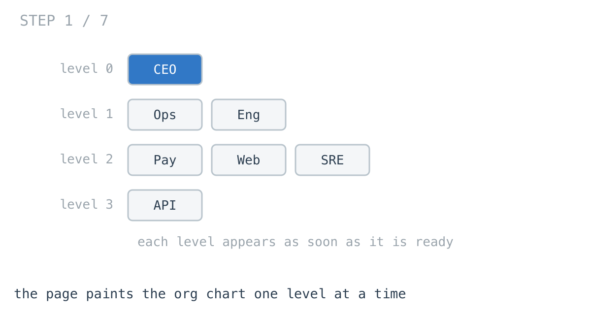
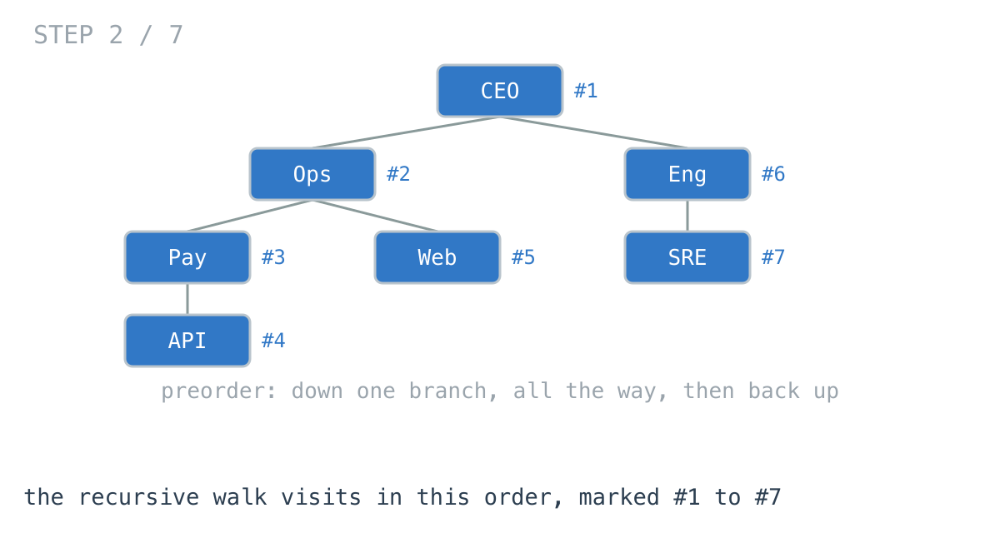
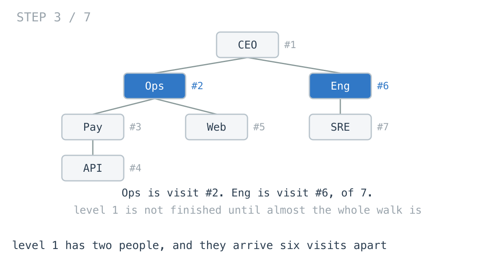
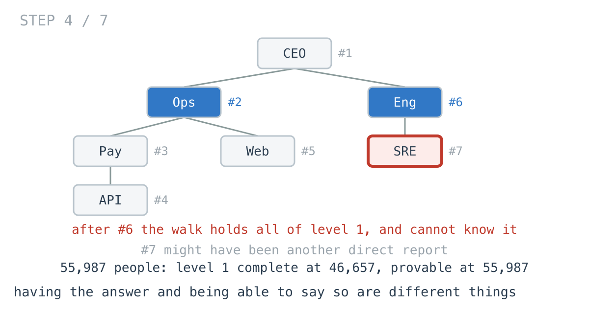
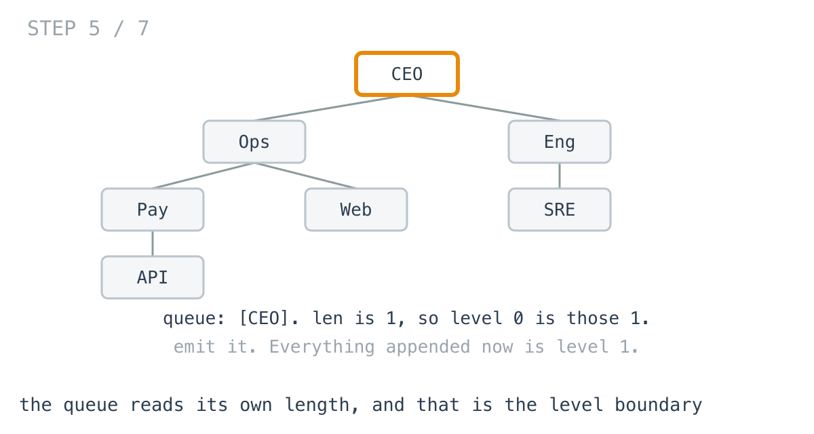
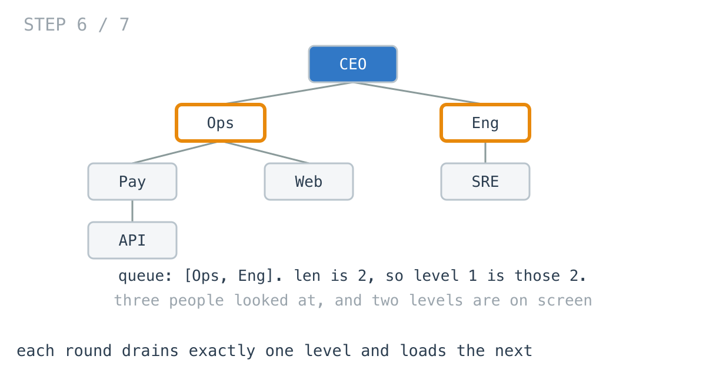
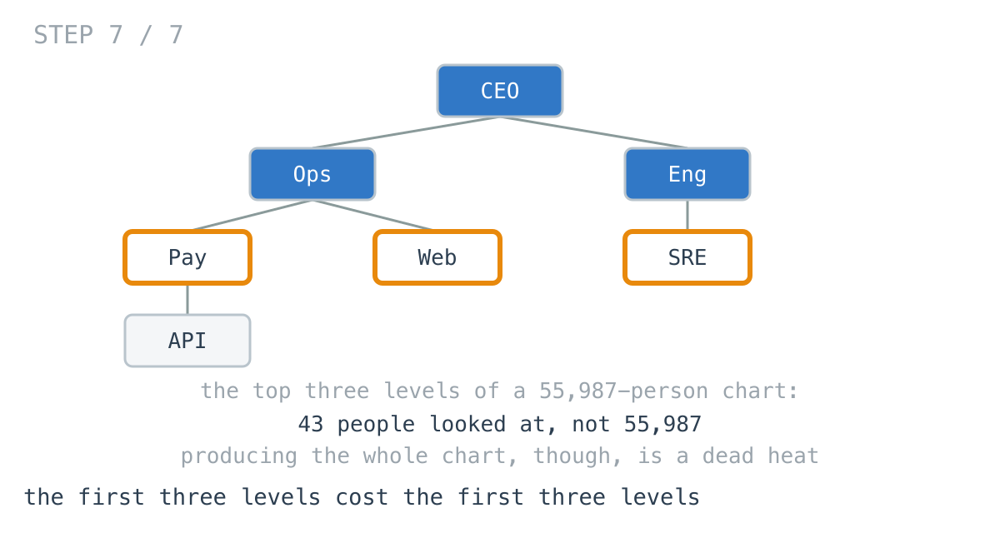

# Your org chart read 55,987 rows to draw the first 43

**It worked in dev · Episode 15 · technique: level order with a queue**

The org chart page renders one level at a time. The person at the top appears,
then their directs, then the level below that, each row group painting as it
becomes available.

Producing the whole chart, the obvious version and the queue version are a
**dead heat**: 894 µs against 895 µs on 55,987 people. Producing the top three
levels, which is what the page needs before it can draw anything, they are
**2383.3x** apart.

---

## The problem

```go
type Person struct {
	Name    string
	Reports []*Person
}
```

`[][]string`: one entry per level, in order, left to right within a level.



---

## What you would write

```go
func LevelsByDepthKeyedWalk(root *Person) [][]string {
	var out [][]string
	var walk func(p *Person, depth int)
	walk = func(p *Person, depth int) {
		if p == nil {
			return
		}
		if len(out) == depth {
			out = append(out, nil) // first node to reach this depth opens it
		}
		out[depth] = append(out[depth], p.Name)
		for _, r := range p.Reports {
			walk(r, depth+1)
		}
	}
	walk(root, 0)
	return out
}
```

One walk, no queue, and the accumulator is keyed on depth rather than on visit
order, so which branch a person arrived from stops mattering. It is O(n), it
allocates one slice per level, and it is nine lines.

This is not a straw man. It is the solution
[day 29 of the challenge publishes](https://github.com/architagr/leetcode_solutions/blob/main/medium_problems/101_200/binary_tree_level_order_traversal/SOLUTION.md),
and it is what I would write.



---

## How bad, on its own

Here it is producing the whole chart, which is the thing it was written to do.

```
Apple M1 Pro · go1.26.4 · go test -bench=AllLevels -benchtime=200x
```

| shape | people | one depth-keyed walk |
|---|---:|---:|
| `org_5k`, six levels of four | 5,461 | 86.8 µs |
| `org_56k`, six levels of six | 55,987 | 894 µs |
| `flat_50k`, everybody under one person | 50,001 | 944 µs |
| `chain_2k`, one report each | 2,001 | 92.7 µs |

Nothing is wrong there. 894 microseconds for 55,987 people is fine, and the
queue version of the same table is within a percent of it.

The bill arrives somewhere else. The page does not want the whole chart, it
wants **level 0 on screen**, and this function cannot hand over level 0 until
it has visited every one of the 55,987 people.



---

## From the symptom to the shape

### The issue, said plainly

The function knows when it has finished. It does not know when a *level* has
finished.

Counted rather than timed, on the seven-person chart above: level 1 is `Ops`
and `Eng`. `Ops` is visit #2. `Eng` is visit #6 of 7. There is nothing in
between them but other people's subtrees.

### Quantify it on the real shapes

`TestVisitsBeforeLevelComplete` reports three counts per level: the visit on
which the walk reaches the last member of that level, the visit on which it can
*say* the level is finished, and what a queue looks at.

| shape | level | walk has it at | walk can say so at | queue |
|---|---:|---:|---:|---:|
| `org_56k` | 1 | 46,657 | 55,987 | 7 |
| `org_56k` | 2 | 54,433 | 55,987 | 43 |
| `chain_2k` | 1 | 2 | 2,001 | 2 |

Read the last row twice. On a 2,001-person chain the walk holds all of level 1
after **two** visits, and cannot declare it for another 1,999.

### Why is it allowed to happen?

Because a depth-first walk descends. It commits to one branch and follows it to
the bottom before it looks at the next, so the order answers arrive in has
nothing to do with the order they are wanted in. Depth is a label the walk
carries, not a thing it proceeds by.

Nothing is wrong with the function. It is answering "what are all the levels"
correctly and quickly. The page asked a different question.

### The answer was already there, and could not be used

That is what the `chain_2k` row is. After visit #2 the walk is holding a
complete, correct level 1. It sits on it for 1,999 more visits, because a
depth-first walk has no way to rule out another person turning up at depth 1 in
some branch it has not entered yet.

The information was not missing. There was no moment at which the function was
allowed to act on it.



### What shape is the question, actually?

Do not assume it. The output is a **sequence of levels**, delivered in order,
and each one is wanted the moment it is complete.

And a level is not an arbitrary set. Every member of level `k` is a direct
report of some member of level `k-1`, and nothing else can be at level `k`.

### Write the thing you want as an equation

```
level(k) = the reports of every person in level(k-1)
```

Read the right-hand side out loud. It names **level k-1** and nothing else. Not
the tree, not the depth below, not which branch anybody came from.

So level `k` is complete exactly when you have looked at every member of level
`k-1` - which is a condition you can check, unlike "no more nodes at depth k
exist anywhere".

### Conclude the order

If level `k` needs level `k-1` complete, then levels have to be produced in
order, one at a time, and the state you carry between them is one level's worth
of people. That is a queue holding a single frontier.

This is **level order**, and it earns the name here rather than in the first
paragraph.

### Closing the last gap: where does a level end?

The one line that makes it work:

```go
width := len(queue) // this level, and nothing else
```

Read the length once, at the top of the round. Everything in the queue at that
instant is this level, because everything appended during the round is a report
of somebody in it, and therefore belongs to the next one. The boundary is not
tracked, it is observed.





### Where it came from in the challenge

[Day 29](https://github.com/architagr/leetcode_solutions/blob/main/medium_problems/101_200/binary_tree_level_order_traversal/SOLUTION.md),
Binary Tree Level Order Traversal, is the depth-keyed recursive walk this
episode starts from - not the version it ends on. Its write-up is worth reading
for the detail that bites people: `arr = traversal(head.Left, arr, level+1)`
takes the returned slice back, because growing `arr` can reallocate it and a
caller who relied on mutation loses later levels. It also carries the reason
left-before-right is what makes each level read left to right.

[Day 27](https://github.com/architagr/leetcode_solutions/blob/main/easy_problems/601_700/average_of_levels_in_binary_tree/SOLUTION.md),
Average of Levels in Binary Tree, is where indexing by level rather than by
visit order is stated on its own - `result[level] += node.Val`, a slot shared by
nodes from different branches that happen to be the same depth. It is also the
honest counter-example to this episode: an average needs the level finished
before it means anything, so no traversal order lets you emit it early.

### When this does not apply

Go back to the equation and break it.

`level(k) = the reports of every person in level(k-1)` is true whatever walk
you use. What the queue buys is knowing *when* level `k-1` ran out, and that is
worth nothing in two cases the benchmark covers:

- **One wide level.** `flat_50k` is one person and 50,000 directs. Finishing
  level 1 means looking at all 50,001 either way, and the queue wins **2.24x**
  on allocation pattern rather than on work avoided.
- **You need the whole thing anyway.** A count in the header, each level sorted
  by name, an average per level like day 27's - if the first paint waits on a
  whole-tree fact, delivering levels early buys nothing.

There is also a cost the other way. The queue holds a whole level at once, so
on a wide tree its peak is the widest level, where the recursive walk's peak is
the stack, which is the depth. Wide and shallow favours recursion's memory;
deep and narrow favours the queue's.

### The rule

> **When the output is a sequence of groups, walk in the order the groups come
> out in. Any other order still produces them, and cannot tell you when one is
> finished.**

---

## Try it before reading on

One queue, and one integer read at the top of each round.

The part worth getting right is that integer: what, exactly, is in the queue at
the moment you read its length, and why is it never a mix of two levels?

```bash
git clone https://github.com/architagr/leetcode_solutions
cd leetcode_solutions/series/it-worked-in-dev/episodes/15-org-chart-by-level
go test ./...
```

Reading on costs you the rep.

---

## The version that scales

```go
func StreamLevels(root *Person, emit func(level []string) bool) {
	if root == nil {
		return
	}
	queue := []*Person{root}
	for len(queue) > 0 {
		width := len(queue)              // this level, and nothing else
		level := make([]string, 0, width)
		for i := 0; i < width; i++ {
			level = append(level, queue[i].Name)
		}
		if !emit(level) {                // the renderer decides when to stop
			return
		}
		next := make([]*Person, 0, width)
		for i := 0; i < width; i++ {
			next = append(next, queue[i].Reports...)
		}
		queue = next
	}
}
```

Three things carry it. `width`, read once per round, which is the level
boundary. `emit` between the two inner loops, so the level goes out before its
reports are gathered. And the return value of `emit`, which is what turns a
traversal into something a page can hang up on.



---

## The measurement

Producing the whole chart, both returning the identical `[][]string`:

| shape | people | one depth-keyed walk | a queue | ratio |
|---|---:|---:|---:|---:|
| `org_5k` | 5,461 | 86.8 µs | 67.7 µs | 1.28x |
| `org_56k` | 55,987 | 894 µs | 895 µs | 1.00x |
| `flat_50k` | 50,001 | 944 µs | 386 µs | 2.45x |
| `chain_2k` | 2,001 | 92.7 µs | 102 µs | 0.91x |

Raw ns: 86,811 / 67,688 · 893,794 / 894,899 · 943,751 / 385,701 ·
92,730 / 101,836

A dead heat on the big realistic chart, and on the chain the recursive walk
**wins** - the queue is 1.10x slower there, because a chain makes it allocate a
fresh frontier per level, 4,013 allocations against 2,014.

If that were the whole story there would be no episode. Here is the first paint:

| shape | people | one depth-keyed walk | a queue | ratio |
|---|---:|---:|---:|---:|
| `org_5k` | 5,461 | 71.2 µs | 366 ns | 194.8x |
| `org_56k` | 55,987 | 917 µs | 385 ns | 2383.3x |
| `flat_50k` | 50,001 | 965 µs | 431 µs | 2.24x |
| `chain_2k` | 2,001 | 87.4 µs | 195 ns | 447.8x |

Raw ns: 71,211 / 365.6 · 916,616 / 384.6 · 964,598 / 431,180 · 87,404 / 195.2

Both columns answer "give me the top three levels". The left one does it by
producing all of them and slicing, because it has no other option.

On `org_56k` that is 1,608 bytes and 10 allocations against 3.95 MB and 78.

---

## What it costs

**Memory moves from the stack to the heap, and changes shape.** The recursive
walk's peak is its call stack, which is the depth of the chart. The queue's
peak is the widest level. On `flat_50k` that is 50,000 people held at once, and
on `chain_2k` it is one. Deep and narrow favours the queue. Wide and shallow
favours recursion.

**Two loops where there was one.** `StreamLevels` reads the level and then
gathers the reports in a second pass, because `emit` has to happen between the
two. Merging them is the natural edit and it is wrong: the level goes out after
its children have been collected, which is the latency the episode is about,
reintroduced by somebody tidying up.

**A callback is an API decision.** Returning `[][]string` is a value anybody can
use. Taking an `emit func([]string) bool` puts the caller inside your loop,
which means error handling, early return and context cancellation are now your
problem too. `LevelsByQueue` is here as the plain version for callers who want
the whole thing, and it is the one to reach for first.

**At 5,461 people and one request, keep the walk.** It is 86.8 microseconds, it
is nine lines, and a dead heat is a dead heat. The queue earns its place when
the page paints incrementally, when the chart is big enough that first paint is
a visible wait, or when the caller may stop after two levels - which is the
case that started this, because a collapsed org chart usually does.

---

## The one line to keep

A walk that does not proceed by level can still label every node with its
level, and can never tell you that a level is finished.

---

## Built on

Days from the [365-day LeetCode challenge](https://github.com/architagr/leetcode_solutions),
with the solution write-up and the problem itself:

- **Day 27 — [Average of Levels in Binary Tree](https://github.com/architagr/leetcode_solutions/blob/main/easy_problems/601_700/average_of_levels_in_binary_tree/SOLUTION.md)** · LeetCode [#637](https://leetcode.com/problems/average-of-levels-in-binary-tree/) · easy
  <br>indexing an accumulator by level rather than by visit order, so nodes from different branches share a slot
- **Day 29 — [Binary Tree Level Order Traversal](https://github.com/architagr/leetcode_solutions/blob/main/medium_problems/101_200/binary_tree_level_order_traversal/SOLUTION.md)** · LeetCode [#102](https://leetcode.com/problems/binary-tree-level-order-traversal/) · medium
  <br>the depth-keyed recursive walk this episode starts from, and why the recursive call has to take its slice back

---

## Run it yourself

```bash
git clone https://github.com/architagr/leetcode_solutions
cd leetcode_solutions/series/it-worked-in-dev/episodes/15-org-chart-by-level
go test ./...                                    # both walks agree, on six shapes
go test -run TestVisitsBeforeLevelComplete -v    # the counts above
go test -bench=. -benchtime=200x                 # the timings above
```

---

Part of [It worked in dev](../../), the long-form companion to the
[365-day LeetCode challenge](https://github.com/architagr/leetcode_solutions).

---

*Ideation, problem selection, benchmarks and conclusions: Archit Agarwal.
The prose was drafted with AI assistance and edited by me. Every number here
comes from a run you can reproduce with the commands above.*
