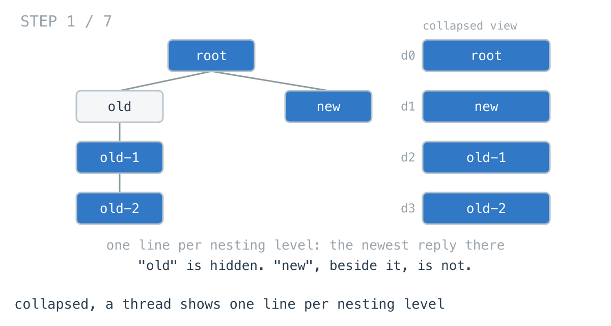
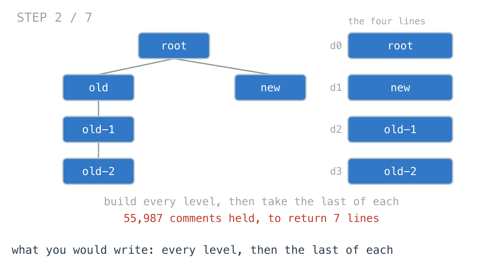
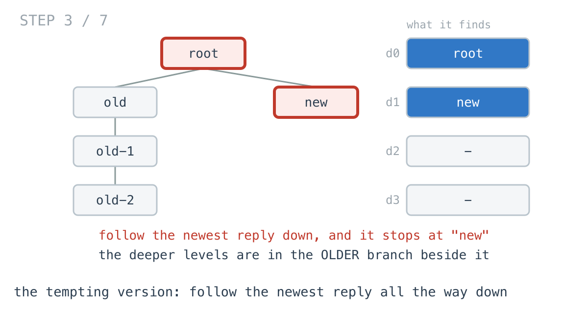
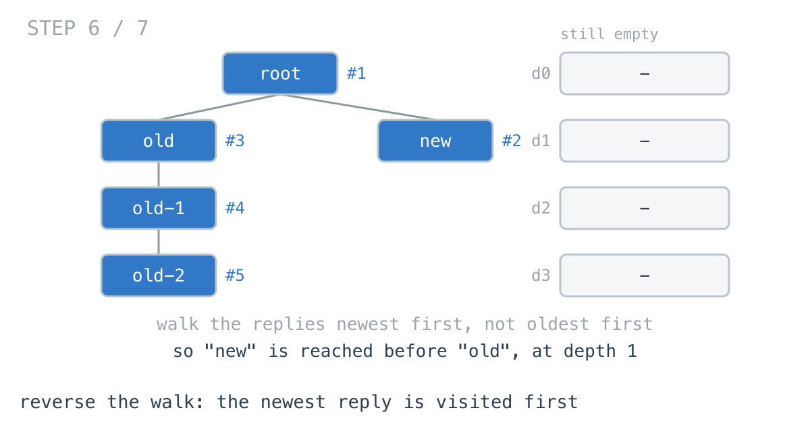

# The collapsed thread built 55,987 previews to show 7

**It worked in dev · Episode 16 · technique: first arrival wins**

A long comment thread collapses to a preview: one line per nesting level, the
most recent reply at that depth. Seven lines, on a thread of 55,987 comments.

Building every level and taking the last of each holds **2.87 MB** to produce
those seven strings. Keeping one slot per depth holds **240 bytes**. And when
the line costs something to build rather than being an id you already have, the
difference between the two remaining versions is **22.5x** and 55,987 previews
against 7.

---

## The problem

```go
type Comment struct {
	ID      string
	Replies []*Comment   // oldest first, the way they were posted
}
```

One line per nesting level: the last comment at that depth in reading order,
whichever branch it is in.



---

## What you would write

I already had the level-order walk from
[last time](../15-org-chart-by-level/), so this was two lines on top of a
function that existed:

```go
func VisibleByAllLevels(root *Comment) []string {
	levels := AllLevels(root)
	out := make([]string, 0, len(levels))
	for _, level := range levels {
		out = append(out, level[len(level)-1])
	}
	return out
}
```

Obviously correct, no new ideas, and it reuses something already tested. This
is the version I would defend, and it is the version that shipped.



---

## How bad, on its own

```
Apple M1 Pro · go1.26.4 · go test -bench=VisibleByAllLevels -benchtime=200x
```

| shape | comments | levels | every level, then the last | held |
|---|---:|---:|---:|---:|
| `thread_1k` | 1,365 | 6 | 24.7 µs | 65.9 KB |
| `thread_5k` | 5,461 | 7 | 92.5 µs | 296 KB |
| `thread_56k` | 55,987 | 7 | 816 µs | 2.87 MB |
| `wide_50k` | 50,001 | 2 | 429 µs | 1.53 MB |
| `chain_2k` | 2,001 | 2,001 | 99.7 µs | 233 KB |

816 microseconds is not a problem and nobody will ever profile it. Look at the
columns beside it instead: 55,987 comments and 7 levels, and 2.87 MB allocated
to return seven strings.

---

## The version that looks right and is not

Before going further, the one almost everybody suggests: the collapsed view
shows the newest reply at each level, so follow the newest reply down.

```go
for c := root; c != nil; {
	out = append(out, c.ID)
	if len(c.Replies) == 0 {
		break
	}
	c = c.Replies[len(c.Replies)-1]
}
```

It is O(depth), it allocates nothing to speak of, and it is wrong.



`TestNewestBranchMissesDeeperSiblings` holds the thread it fails on, and it is
not exotic: somebody replied once to an old comment and that reply got replies,
while the newest top-level reply is a dead end.

```
following the newest reply down gives [root new]
the collapsed view actually shows     [root new old-1 old-2]
```

Two lines where there should be four. **The newest reply at a level need not be
in the newest branch**, so the deeper levels have to be found somewhere the
walk never went. It is not benchmarked below, because a wrong answer has no
time worth reporting.

---

## From the symptom to the shape

### The issue, said plainly

The function builds 55,987 things to return 7.

`AllLevels` produces every level in full. The loop after it reads one element
from each and discards the rest. Nothing in between knows that.

### Quantify it on the concrete example

`TestHeldWhileWorking` counts it rather than estimating:

```
5461 comments in 7 levels: building every level holds 5461 IDs,
the visible answer is 7
```

Every comment in the thread is held so that one comment per level can be read
out of it. On `thread_56k` the ratio between what is held and what is returned
is **12523x**.

### Why is it allowed to happen?

Because `AllLevels` is a general function answering a general question, and it
is answering it well. It has no idea that its caller wants one element per
level. The waste is not inside it; the waste is the shape of the thing it
returns.

### The answer was already decided, and kept anyway

Walk one level. The moment its last comment is read, that level's visible line
is settled - nothing later in the level can change it, because there is nothing
later in the level. The level is then held in full until the caller gets round
to reading its last element.

The information was not missing. The container was the wrong size.

### What shape is the output, actually?

Do not assume it. One value per level. Indexed by depth. As many entries as the
thread is deep, which is 7 while the thread is 55,987.

### Write the thing you want as an equation

```
visible(d) = the last comment at depth d
```

Read the right-hand side out loud. It names **one comment**. Not a level, not a
list, one comment. Nothing in the equation asks for the other 55,980.

### Conclude the container

If the answer is one comment per depth, then the accumulator is one slot per
depth, and every comment writes into the slot for its own depth. The last
writer at a depth is the last comment at that depth, which is the answer.

```go
if len(out) == depth {
	out = append(out, "")
}
out[depth] = c.ID // later arrivals at this depth overwrite earlier ones
```

240 bytes instead of 2.87 MB, and **4.78x** faster on `thread_56k`.


**Most of this episode's win is that, and it is not a clever traversal.** It is
noticing that the output has one entry per level and sizing the accumulator to
match. If you stop reading here you have had the money.

### The second rung: the loser is still produced

There is something left, and it only shows up when the slot holds something
that costs more than a string you already have.

The collapsed view does not render an id. It renders a line: the body trimmed
and escaped, a relative timestamp, a count of the replies underneath. Call that
`Preview`.

Last writer wins means **every** comment gets a `Preview` built for it, and all
but one per level is overwritten a moment later.

```
thread_56k   55,987 comments, 7 visible
             previews built: last writer wins 55,987, newest first 7
```


### Closing the last gap: make the winner arrive first

The walk has to visit every comment - the wrong version above is the proof that
it cannot skip the older branches. What it can choose is the **order**.

Iterate each comment's replies newest first instead of oldest first. Then the
first comment reached at a depth is the newest one at that depth, and first is
something you can record and stop thinking about:

```go
if len(out) == depth {
	out = append(out, Preview(c))   // the only write this depth ever gets
}
for i := len(c.Replies) - 1; i >= 0; i-- {
	walk(c.Replies[i], depth+1)
}
```

Reversing the loop turns *the last at this depth* into *the first I see at this
depth*, and a first is written once.




### Where it came from in the challenge

[Day 31](https://github.com/architagr/leetcode_solutions/blob/main/medium_problems/101_200/binary_tree_right_side_view/SOLUTION.md),
Binary Tree Right Side View, is this function on a binary tree, and its own
comments say the two things that matter. `if len(arr) == level` is true only
for the first node reached at a depth. And right before left "is the whole
solution: it is what makes the first arrival at a depth the rightmost node
there. Swap these two lines and the function returns the left side view." That
is the reversal, stated as a one-line switch between two different answers.

It also names the trap this episode benchmarks: the left subtree is still
walked, because the rightmost visible node at a level need not be in the right
subtree.

[Day 29](https://github.com/architagr/leetcode_solutions/blob/main/medium_problems/101_200/binary_tree_level_order_traversal/SOLUTION.md),
Binary Tree Level Order Traversal, is where `AllLevels` comes from - the
version this episode starts by calling, and the reason the first draft held
2.87 MB. Reusing a tested function is usually right; here it is what made the
container the wrong size.

### When this does not apply

Go back to the equation and break it.

`visible(d) = the last comment at depth d` needs one value per depth. The
moment the collapsed view wants two - the newest reply *and* a count of how
many were hidden - the slot grows, and if it wants all of them you are back to
`AllLevels` and should call it.

The reversal has a narrower condition still. It only pays when producing the
value costs something. On the id version it is **1.01x** on `thread_56k`, and
on the smallest thread the ordinary forward walk is the faster of the two. A
reversed loop reads worse than a forward one, so on an id you are paying
legibility for nothing.

And `chain_2k` is the shape where none of it helps: every level holds one
comment, so the visible answer is the whole thread, every comment is a first
arrival, and the two preview versions are identical to the byte - **1.02x**.

### The rule

> **When you want one element per group and the order decides which one, walk
> so the winner arrives first. Then you never pay to produce the ones you are
> going to throw away.**

---

## Try it before reading on

Two changes, and neither is a new data structure.

The first is the container: what size should the accumulator be, given the
answer is one line per level?

The second is one loop, iterated the other way, and it only matters once you
ask what it costs to *build* an entry rather than to store one.

```bash
git clone https://github.com/architagr/leetcode_solutions
cd leetcode_solutions/series/it-worked-in-dev/episodes/16-collapsed-tree-view
go test ./...
```

Reading on costs you the rep.

---

## The version that scales

```go
func PreviewsByFirstArrival(root *Comment) ([]string, int) {
	var out []string
	built := 0
	var walk func(c *Comment, depth int)
	walk = func(c *Comment, depth int) {
		if c == nil {
			return
		}
		// True only for the first comment reached at this depth, because out
		// holds one entry per depth filled so far.
		if len(out) == depth {
			built++
			out = append(out, Preview(c))
		}
		// Newest reply first. Swap this to forward order and the function
		// returns the oldest reply per level instead.
		for i := len(c.Replies) - 1; i >= 0; i-- {
			walk(c.Replies[i], depth+1)
		}
	}
	walk(root, 0)
	return out, built
}
```

Three things carry it. `len(out) == depth`, which is the first-arrival test and
needs no separate bookkeeping. The reversed loop, which is what makes first
mean newest. And the fact that every branch is still walked, because the answer
for a deep level may be in an old one.

`built` is returned so the claim below is a measurement rather than a sentence.

---

## The measurement

Returning the visible ids:

| shape | comments | every level, then the last | one slot per depth | newest first | ratio |
|---|---:|---:|---:|---:|---:|
| `thread_1k` | 1,365 | 24.7 µs | 4.18 µs | 3.69 µs | 6.70x |
| `thread_5k` | 5,461 | 92.5 µs | 16.8 µs | 16.9 µs | 5.48x |
| `thread_56k` | 55,987 | 816 µs | 173 µs | 171 µs | 4.78x |
| `wide_50k` | 50,001 | 429 µs | 138 µs | 112 µs | 3.84x |
| `chain_2k` | 2,001 | 99.7 µs | 37.6 µs | 37.4 µs | 2.66x |

Raw ns: 24,726 / 4,182 / 3,688 · 92,527 / 16,822 / 16,899 ·
816,478 / 172,914 / 170,691 · 429,405 / 138,465 / 111,928 ·
99,702 / 37,614 / 37,415

The ratio column is the first column against the last. Held: 2.87 MB against
240 bytes on `thread_56k`, which is **12523x**.

Now the two right-hand columns on their own, with the entry costing something
to build:

| shape | comments | previews built | last writer wins | newest first | ratio |
|---|---:|---:|---:|---:|---:|
| `thread_1k` | 1,365 | 1,365 against 6 | 57.3 µs | 3.81 µs | 15.0x |
| `thread_5k` | 5,461 | 5,461 against 7 | 244 µs | 20.4 µs | 12.0x |
| `thread_56k` | 55,987 | 55,987 against 7 | 3.88 ms | 172 µs | 22.5x |
| `wide_50k` | 50,001 | 50,001 against 2 | 3.12 ms | 116 µs | 26.8x |
| `chain_2k` | 2,001 | 2,001 against 2,001 | 179 µs | 176 µs | 1.02x |

Raw ns: 57,310 / 3,810 · 244,381 / 20,427 · 3,879,454 / 172,022 ·
3,115,652 / 116,485 · 179,314 / 176,120

6.77 MB and 101,979 allocations against 1.12 KB and 17, on `thread_56k`. That
is **6165x**, and it is the same walk with one loop reversed.

`chain_2k` is identical in both columns to the byte, which is the honest end of
the table: when every level holds one comment, every comment is a first arrival
and there is nothing to skip.

---

## What it costs

**A reversed loop reads worse than a forward one.** `for i := len(c.Replies)-1;
i >= 0; i--` is three tokens of noise a reviewer has to decode, and the comment
above it is load bearing: delete it and the next person "tidies" the loop into
forward order, at which point the function silently returns the *oldest* reply
per level. Day 31's write-up says the same thing about right before left, and
it is the one line in this episode I would guard with a test naming the
behaviour rather than the implementation.

**It buys nothing on cheap entries.** On the id version it is **1.01x**, and on
the smallest thread the forward walk is faster. If the slot holds something you
already have, keep the loop forward and take the 4.78x from the container
change alone.

**The general function still has to exist.** `AllLevels` is not wrong and is
not deleted - it is what the expanded view calls. What changed is that the
collapsed view stopped going through it.

**Every branch is still walked.** This is not a shortcut; `wide_50k` visits all
50,001 comments to return two lines. The saving is in what is produced and
held, not in what is visited, and anybody who reads "first arrival wins" as
"stops early" will write the broken version at the top of this page.

**At 1,365 comments with an id per line, keep what you have.** 24.7
microseconds, two lines on top of a tested function. The rewrite earns its
place when the entry costs something real to build - a rendered preview, a
hydrated object, a lookup - which is the case that started this.

---

## The one line to keep

If the answer is one element per group, size the accumulator to the groups; and
if producing an element costs something, order the walk so the one you keep is
the one you meet first.

---

## Built on

Days from the [365-day LeetCode challenge](https://github.com/architagr/leetcode_solutions),
with the solution write-up and the problem itself:

- **Day 29 — [Binary Tree Level Order Traversal](https://github.com/architagr/leetcode_solutions/blob/main/medium_problems/101_200/binary_tree_level_order_traversal/SOLUTION.md)** · LeetCode [#102](https://leetcode.com/problems/binary-tree-level-order-traversal/) · medium
  <br>building every level in full, which is the function this episode starts by calling and ends by not calling
- **Day 31 — [Binary Tree Right Side View](https://github.com/architagr/leetcode_solutions/blob/main/medium_problems/101_200/binary_tree_right_side_view/SOLUTION.md)** · LeetCode [#199](https://leetcode.com/problems/binary-tree-right-side-view/) · medium
  <br>first arrival at a depth wins, and the child order that decides which arrival is first

---

## Run it yourself

```bash
git clone https://github.com/architagr/leetcode_solutions
cd leetcode_solutions/series/it-worked-in-dev/episodes/16-collapsed-tree-view
go test ./...                                          # all three correct versions agree
go test -run TestPreviewsAgreeAndCountBuilds -v        # the preview counts above
go test -run TestNewestBranchMissesDeeperSiblings -v   # the thread the tempting version breaks on
go test -bench=. -benchtime=200x                       # the timings above
```

---

Part of [It worked in dev](../../), the long-form companion to the
[365-day LeetCode challenge](https://github.com/architagr/leetcode_solutions).

---

*Ideation, problem selection, benchmarks and conclusions: Archit Agarwal.
The prose was drafted with AI assistance and edited by me. Every number here
comes from a run you can reproduce with the commands above.*
