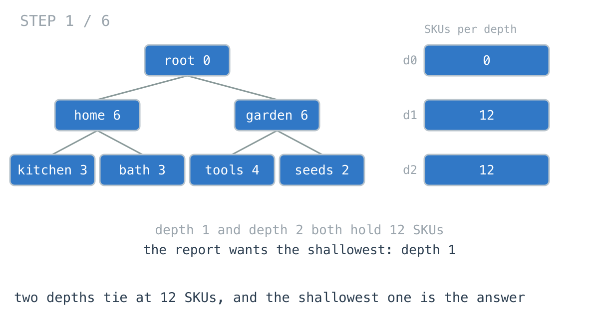
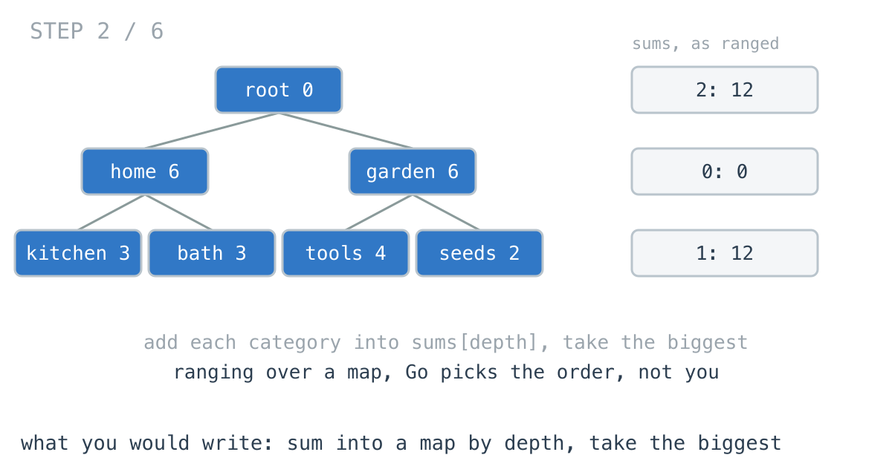
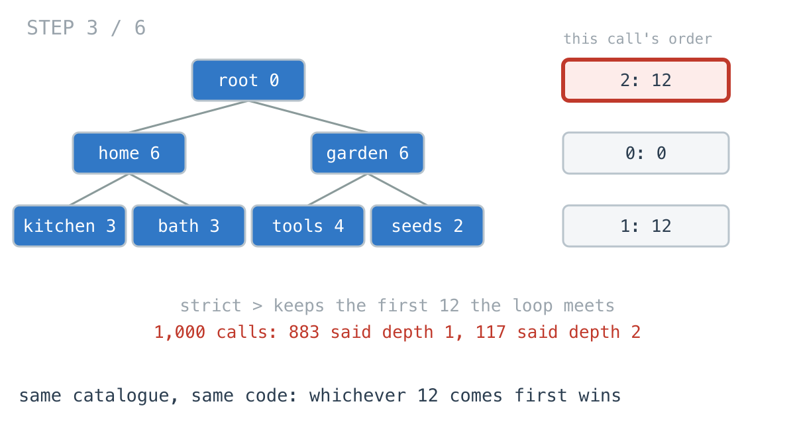
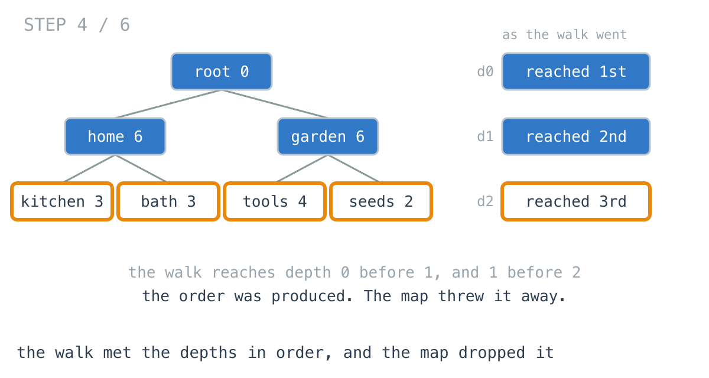
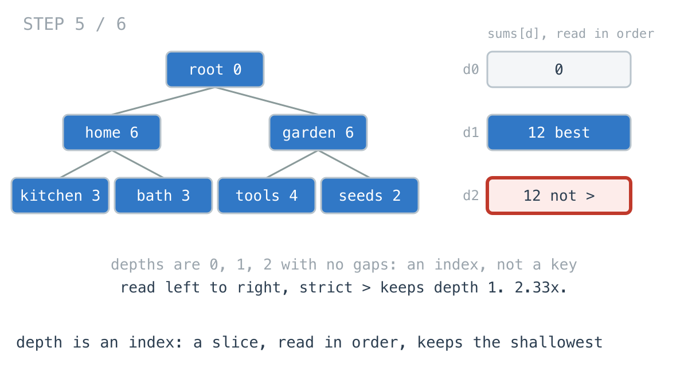
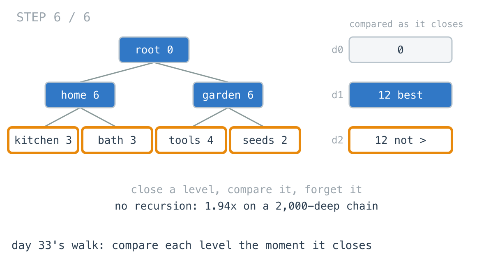

# Your category report changes its answer on refresh

**It worked in dev · Episode 17 · technique: depth as an index, read in order**

The merchandising team wants to know which level of the category tree holds the
most products, so they know which level the navigation should filter on. Same
catalogue, same code, and the report said depth 1 on one call and depth 2 on the
next.

Over 1,000 calls on a seven-category catalogue it said depth 1 **883** times
and depth 2 **117** times. On a 2,000-level catalogue it gave **145 different
answers in 200 calls**. And the version that fixes it is also **2.33x** faster,
because the bug and the cost come from the same line.

---

## The problem

```go
type Category struct {
	ID       string
	SKUs     int          // products filed directly here, not in children
	Children []*Category
}
```

Add up the SKUs at each depth of the tree. Return the depth with the largest
total, and if two depths tie, the shallower one - a department is a better
filter than a shelf.



---

## What you would write

One recursive walk, add each category into a total for its depth, then take the
biggest:

```go
func HeaviestByMap(root *Category) int {
	sums := map[int]int{}
	var walk func(c *Category, depth int)
	walk = func(c *Category, depth int) {
		if c == nil {
			return
		}
		sums[depth] += c.SKUs
		for _, ch := range c.Children {
			walk(ch, depth+1)
		}
	}
	walk(root, 0)

	best, bestDepth := -1, -1
	for depth, sum := range sums {
		if sum > best {
			best, bestDepth = sum, depth
		}
	}
	return bestDepth
}
```

I would approve this. There is no queue to get wrong, a map is the obvious thing
to group into, and the strict `>` even looks like it handles ties: the first
depth to reach the maximum keeps it. The tests passed, because the fixture
catalogue had no tie in it.



---

## How bad, on its own

```
Apple M1 Pro · go1.26.4 · go test -bench=HeaviestByMap -benchtime=2000x
```

| shape | categories | depths | map, as written |
|---|---:|---:|---:|
| `store_400` | 400 | 4 | 3.76 µs |
| `store_7k` | 7,381 | 5 | 58.5 µs |
| `market_56k` | 55,987 | 7 | 406 µs |
| `flat_50k` | 50,001 | 2 | 347 µs |
| `chain_2k` | 2,001 | 2,001 | 119 µs |

Nobody will ever profile 58 microseconds for a department store. On time alone
this function is fine at every size here, and if that were the whole story this
episode would end with "keep it".

It is not the whole story, because of this:

```
map version over 1,000 calls on the same catalogue: map[1:883 2:117]
```

That is `TestMapAnswerChangesBetweenRunsOnATie`, calling the function a thousand
times on one unchanging seven-category tree. The split moves between runs. That
there is a split does not.



---

## From the symptom to the shape

### The issue, said plainly

The function gives a different answer to the same question, and only when two
depths hold the same number of products.

### Quantify it on the concrete example

In the seven-category tree, depth 1 is `home 6` and `garden 6`: 12. Depth 2 is
`3 + 3 + 4 + 2`: also 12. The answer should be depth 1 every time.

On `chain_2k`, each depth holds between 1 and 7 products, so 7 turns up at
nearly three hundred depths:

```
chain_2k, correct answer depth 6; map version over 200 calls gave 145 different depths
```

That is not a rare edge. On a small catalogue, or on one where counts are small
numbers, a tie is the normal case.

### Why is it allowed to happen?

Because strict `>` does not mean "the smallest depth wins". It means **the first
one the loop meets wins**. That is a tie-break only if the loop meets the depths
smallest first.

`range` over a Go map makes no such promise, on purpose. The runtime picks a
random starting point on every iteration so that nobody can come to depend on an
order the map was never going to keep. Every piece of this function is correct
on its own. The fault is in what the last loop assumes about the one before it.

### The order was already there

Go back to the walk. It reaches depth 0 before depth 1 and depth 1 before depth
2, because a category is always visited before its children. By the time the
walk ends, the depths were already produced in exactly the order the tie-break
needs.

Then they went into a map, and the map kept the totals and discarded the order.



The information was not missing. It was thrown away by the container.

### What shape are the keys, actually?

Do not assume it. Look at what goes in: 0, 1, 2, and so on up to the height of
the tree. They start at zero. There are no gaps, because depth `d` can only be
reached from depth `d - 1`. There are at most as many as the tree is deep.

Small, dense integers counting up from zero are not keys. They are an **index**.

### Write the thing you want as an equation

```
answer = the smallest d such that sums[d] == max(sums)
```

Read the right-hand side out loud. "Smallest d" is an ordering word. Whatever
holds `sums` has to be something you can read from `d = 0` upward, or the
equation has no way to say "smallest" without extra code.

### Conclude the container

If the keys are an index and the answer needs them in order, the container is a
slice, and the comparison reads it front to back:

```go
if len(sums) == depth {
	sums = append(sums, 0)   // first category at a new depth opens its slot
}
sums[depth] += c.SKUs
```

```go
for depth, sum := range sums {   // a slice ranges 0, 1, 2 - always
	if sum > best {
		best, bestDepth = sum, depth
	}
}
```

The strict `>` is now the tie-break it looked like all along, without a word of
code about ties. And there is no hashing, which is where the **2.33x** comes
from.



### The other way to keep the order

[Day 33](https://github.com/architagr/leetcode_solutions/blob/main/medium_problems/1101_1200/maximum_level_sum_of_a_binary_tree/SOLUTION.md),
Maximum Level Sum of a Binary Tree, is this exact question on a binary tree, and
it never stores a per-depth total at all. It walks one level at a time, and when
a level closes it compares that level's sum against the best and forgets it. Its
comment on the comparison is the one line this whole episode is about: "Strictly
greater, and that is the entire tie-break". That line works there for the same
reason it fails in a map - levels close in increasing order, so the first to
reach the maximum is the shallowest.



I benchmarked that version too, and it is not the winner on a normal catalogue.
It holds a whole level of pointers at a time, which on `market_56k` is 46,656
leaves, and it is **3.93x** slower than the slice there. It wins in exactly one
shape: `chain_2k`, where the slice version recurses 2,001 frames deep and the
level walk does not recurse at all. **1.94x** faster there.

[Day 29](https://github.com/architagr/leetcode_solutions/blob/main/medium_problems/101_200/binary_tree_level_order_traversal/SOLUTION.md),
Binary Tree Level Order Traversal, is where the slice version comes from. It
solves a level-order problem with a recursive walk, and its write-up names the
move: the node "writes into `arr[level]`, and the level is a parameter it was
handed". Depth as an index into a slice, opened by the first node to reach it.
That is the whole fix, applied to a sum instead of a list.

### When this does not apply

Go back to the equation and break it.

"The smallest `d`" only turns into "read a slice front to back" because the keys
are dense and start at zero. Group by something that is not - a category name, a
price-band ID, a supplier - and a slice is wrong, since you would be allocating
a slot for every ID nobody used. Keep the map there and write the tie-break out
loud:

```go
if sum > best || (sum == best && key < bestKey) {
```

I measured that too, on depth, to see what the fix costs the map: nothing
measurable. It is **2.34x** slower than the slice on `market_56k` against
**2.33x** for the broken one. The hashing is the cost, not the tie-break.

And if no two groups can ever tie - a unique timestamp, say - the whole
correctness half of this episode does not arise, and all that is left is a 2.33x
on something measured in microseconds.

### The rule

> **When the key is a small integer counting up from zero, it is an index, not a
> key. Put it in a slice, and read it in order, because order is often part of
> the answer.**

---

## Try it before reading on

One change, and it is not a new traversal. The walk stays recursive, the
comparison stays a strict `>`, and nothing about ties gets added.

What should `sums` be, given what its keys are?

```bash
git clone https://github.com/architagr/leetcode_solutions
cd leetcode_solutions/series/it-worked-in-dev/episodes/17-which-depth-is-heaviest
go test ./...
```

Reading on costs you the rep.

---

## The version that scales

```go
func HeaviestBySlice(root *Category) int {
	var sums []int
	var walk func(c *Category, depth int)
	walk = func(c *Category, depth int) {
		if c == nil {
			return
		}
		// Depths arrive without gaps: depth d is only reached from depth
		// d-1, so the slice never needs to skip an index.
		if len(sums) == depth {
			sums = append(sums, 0)
		}
		sums[depth] += c.SKUs
		for _, ch := range c.Children {
			walk(ch, depth+1)
		}
	}
	walk(root, 0)
	return firstMax(sums)
}

// firstMax is the smallest index holding the largest value. The strict > is
// the tie-break, and it only works because the indices are read in order.
func firstMax(sums []int) int {
	best, bestDepth := -1, -1
	for depth, sum := range sums {
		if sum > best {
			best, bestDepth = sum, depth
		}
	}
	return bestDepth
}
```

Two things carry it. `len(sums) == depth` opens a slot the first time a depth is
reached, which is safe only because depths never skip. And `firstMax` ranges a
slice, which Go walks from index 0 every time.

---

## The measurement

| shape | categories | map, as written | map, tie-break | slice by depth | level walk | map vs slice |
|---|---:|---:|---:|---:|---:|---:|
| `store_400` | 400 | 3.76 µs | 3.91 µs | 1.19 µs | 3.11 µs | 3.17x |
| `store_7k` | 7,381 | 58.5 µs | 59.2 µs | 22.0 µs | 57.5 µs | 2.65x |
| `market_56k` | 55,987 | 406 µs | 408 µs | 174 µs | 684 µs | 2.33x |
| `flat_50k` | 50,001 | 347 µs | 363 µs | 138 µs | 200 µs | 2.51x |
| `chain_2k` | 2,001 | 119 µs | 125 µs | 27.5 µs | 14.2 µs | 4.31x |

Raw ns: 3,761 / 3,907 / 1,188 / 3,108 · 58,460 / 59,154 / 22,044 / 57,535 ·
406,249 / 408,321 / 174,243 / 684,082 · 346,958 / 363,279 / 138,350 / 200,308 ·
118,754 / 125,497 / 27,549 / 14,193

The slice is the fastest on every shape but one, and correct on all of them.
The level walk is correct on all of them too, and it is the one to use on
`chain_2k`, where it beats the slice by **1.94x** and the original map by
**8.37x**.

Allocated: the maps allocate nothing on the bushy shapes (a map of eight or
fewer small keys fits in stack space the compiler reserves for it), the slice
allocates 120 bytes, and the level walk holds 2.11 MB on `market_56k`. On
`chain_2k` the level walk allocates 8 bytes and the map 145 KB.

---

## What it costs

**Nothing, mostly, which is why the episode is about the bug.** The slice
version is the same length as the map version. It is not harder to read. The
only thing it asks is that the reader understand why `len(sums) == depth` is a
safe way to grow, and the comment says so.

**It depends on depths being dense.** If a later change makes the walk skip
depths - filtering out empty categories before recursing, say, and still
passing `depth+1` - the `len(sums) == depth` check silently stops opening slots
and the next line panics with an index out of range. That is at least loud.
Grow to `depth+1` in a loop if the walk might ever skip.

**It recurses.** Like the map version it started from, on a 2,001-level chain
it goes 2,001 frames deep, and that is where the level walk wins. A real
category tree is five to eight levels deep. An importer that turned every
slash in a path into a level is not, and if you have one of those, use day 33's
shape.

**At 7,381 categories on a catalogue with no ties, time is not a reason.** 58
microseconds against 22. If the report ran once a night on a tree where ties
cannot happen, I would not open a PR for the speed. I would open one for the
day a tie shows up and the nightly report flips between two answers with no
code change, because that is a support ticket nobody can reproduce.

---

## The one line to keep

A strict `>` is a tie-break only when the candidates arrive in order, and a map
never promises an order - so when the key is a small integer from zero, use a
slice, and the order comes free.

---

## Built on

Days from the [365-day LeetCode challenge](https://github.com/architagr/leetcode_solutions),
with the solution write-up and the problem itself:

- **Day 29 — [Binary Tree Level Order Traversal](https://github.com/architagr/leetcode_solutions/blob/main/medium_problems/101_200/binary_tree_level_order_traversal/SOLUTION.md)** · LeetCode [#102](https://leetcode.com/problems/binary-tree-level-order-traversal/) · medium
  <br>every node writes into the slot for its own depth, and the first node to reach a depth opens it - the accumulator, with depth as an index
- **Day 33 — [Maximum Level Sum of a Binary Tree](https://github.com/architagr/leetcode_solutions/blob/main/medium_problems/1101_1200/maximum_level_sum_of_a_binary_tree/SOLUTION.md)** · LeetCode [#1161](https://leetcode.com/problems/maximum-level-sum-of-a-binary-tree/) · medium
  <br>summing a level and comparing the moment it closes, where the strict > is the entire tie-break because levels close in order

---

## Run it yourself

```bash
git clone https://github.com/architagr/leetcode_solutions
cd leetcode_solutions/series/it-worked-in-dev/episodes/17-which-depth-is-heaviest
go test ./...                                               # the ordered versions agree everywhere
go test -run TestMapAnswerChangesBetweenRunsOnATie -v       # the 883 / 117 split
go test -run TestMapOnTheChain -v                           # 145 answers in 200 calls
go test -bench=. -benchtime=2000x                           # the timings above
```

---

Part of [It worked in dev](../../), the long-form companion to the
[365-day LeetCode challenge](https://github.com/architagr/leetcode_solutions).

---

*Ideation, problem selection, benchmarks and conclusions: Archit Agarwal.
The prose was drafted with AI assistance and edited by me. Every number here
comes from a run you can reproduce with the commands above.*
