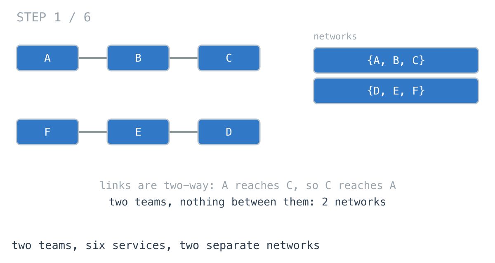
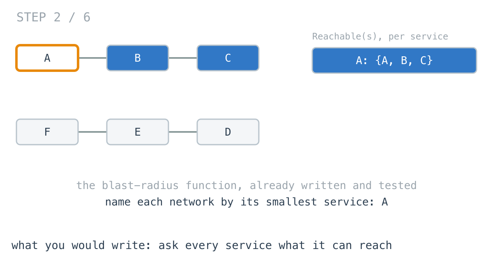
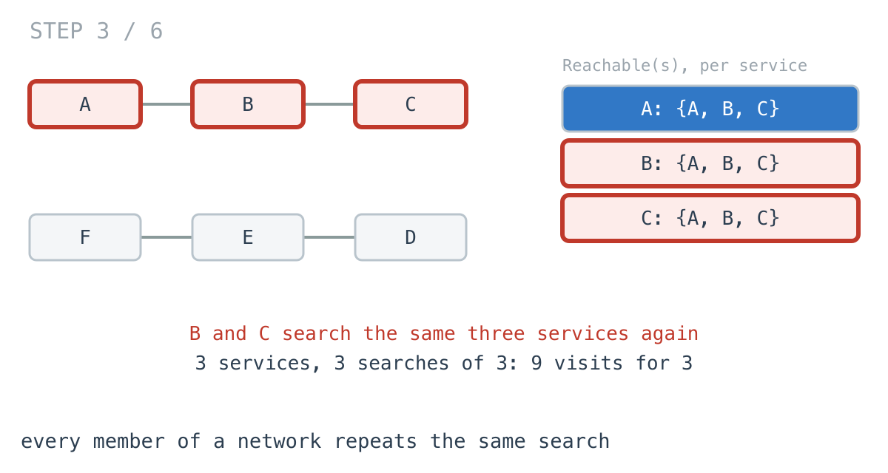
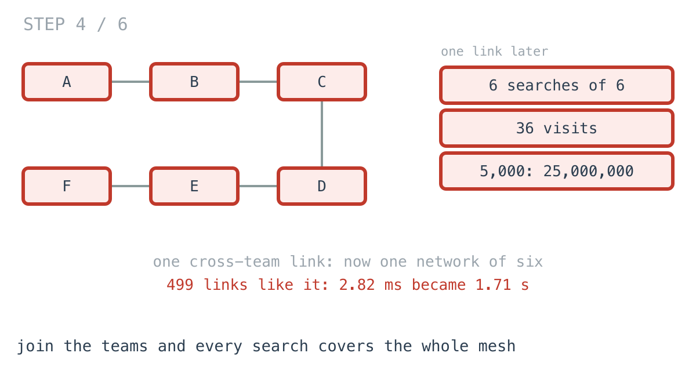
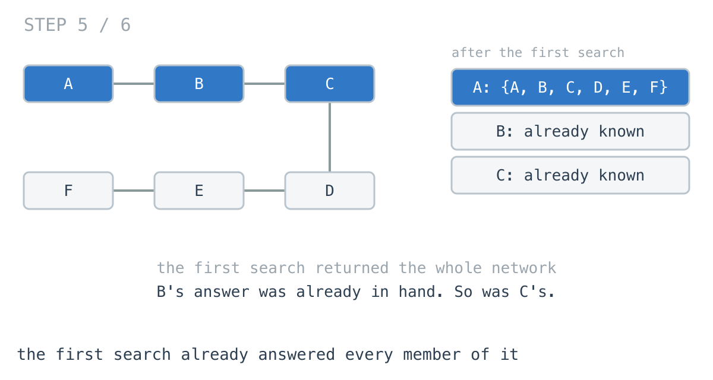
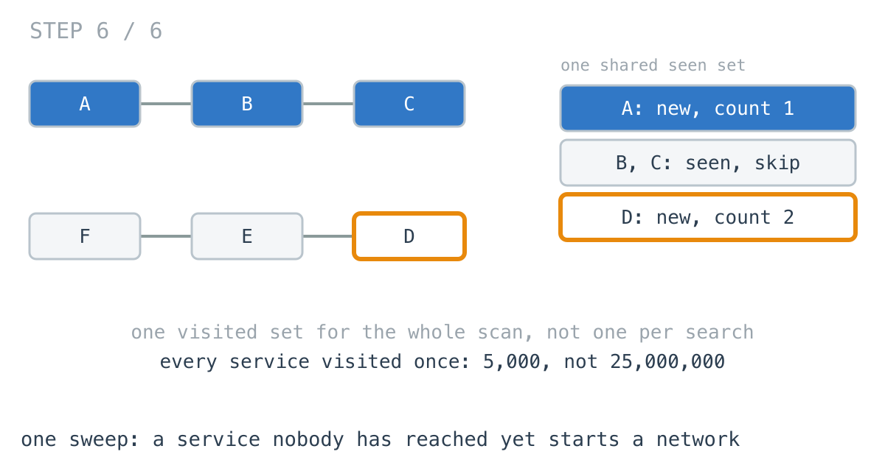

# 499 new links made the network count 608x slower

**It worked in dev · Episode 18 · technique: connected components, one sweep**

How many separate networks are in the service mesh - groups of services that
can reach each other and nothing outside? The platform team runs it after every
routing change, to catch a cluster that has been cut off.

With 500 teams running their own clusters, it took **2.82 ms**. Then the teams
added 499 cross-team links, one each, so the whole mesh became one network. Same
5,000 services. The count took **1.71 seconds**, and allocated **1.97 GB** to
return the number 1.

---

## The problem

```go
// adj[s] holds every service s has a link with. Links are two-way.
type Mesh [][]int
```

Count the networks: the groups where every service can reach every other one,
directly or through others, and none can reach a service outside the group.



---

## What you would write

The admin UI already had a blast-radius page: pick a service, see everything a
failure in it could reach. So `Reachable` existed, and it was tested:

```go
func Reachable(m Mesh, s int) []int {
	seen := map[int]bool{s: true}
	out := []int{s}
	for i := 0; i < len(out); i++ {
		for _, t := range m[out[i]] {
			if !seen[t] {
				seen[t] = true
				out = append(out, t)
			}
		}
	}
	return out
}
```

`seen` is a map on purpose: a service with a blast radius of three should cost
a search of three, not a slice sized to the whole mesh.

With that in hand, a network is what a service can reach. Name each one by the
smallest service in it and count the distinct names:

```go
func NetworksByReach(m Mesh) int {
	names := map[int]bool{}
	for s := range m {
		reach := Reachable(m, s)
		smallest := reach[0]
		for _, t := range reach {
			if t < smallest {
				smallest = t
			}
		}
		names[smallest] = true
	}
	return len(names)
}
```

It reuses a tested function, it has no clever parts, and it is obviously
correct. I would approve it.



---

## How bad, on its own

```
Apple M1 Pro · go1.26.4 · go test -bench=NetworksByReach -benchtime=20x
```

| shape | services | links | networks | reach per service |
|---|---:|---:|---:|---:|
| `isolated_5k` | 5,000 | 0 | 5,000 | 0.61 ms |
| `teams_5k` | 5,000 | 5,000 | 500 | 2.82 ms |
| `joined_5k` | 5,000 | 5,499 | 1 | 1,715 ms |
| `mesh_500` | 500 | 998 | 1 | 23.7 ms |
| `mesh_5k` | 5,000 | 9,998 | 1 | 2,513 ms |

On `teams_5k` this is fine and I would leave it. 2.82 milliseconds, after a
routing change, is nothing.

`joined_5k` is the same 500 teams with one extra link from each to the next.
10% more links, and **608x** the time. The service count did not move. The
network count went down, from 500 to 1, and the function got slower because of
it.

---

## From the symptom to the shape

### The issue, said plainly

Every service in a network runs the same search as every other service in that
network.

### Quantify it on the concrete example

In the diagram, `Reachable(A)` visits A, B and C. Then `Reachable(B)` visits A,
B and C. Then `Reachable(C)` does it again. Three services, three searches of
three: nine visits to find out about three.



A network of `k` services costs `k × k`. Ten-service teams cost 100 each, 50,000
across the mesh. Join them into one network of 5,000 and it is 5,000 × 5,000.
`TestVisits` counts it rather than estimating:

```
teams_5k    5000 services,   500 networks  |  services visited: reach per service       50000, one sweep   5000
joined_5k   5000 services,     1 networks  |  services visited: reach per service    25000000, one sweep   5000
```

That is the 608x. The cost was never in the number of services. It is in the
square of the size of the biggest network, and 499 links made the biggest
network 500 times bigger.



### Why is it allowed to happen?

Because `Reachable(B)` has no idea `Reachable(A)` ran. It is a blast-radius
function answering a per-service question, and it answers it correctly every
time. Nothing is wrong with it. The loop that calls it 5,000 times is what
turns a correct per-service answer into a quadratic count.

### The answer was already in hand

Look at what the first call returned. `Reachable(A)` came back with
`{A, B, C, D, E, F}` - the whole network. At that moment B's answer was already
known: B is in A's network, so B's network is A's network. So was C's. So was
every service on the list.



The next 4,999 calls recompute a set that was already sitting in a variable.

### What is the question actually asking?

Do not assume it. Links are two-way, so if A reaches B, B reaches A. And if A
reaches B and B reaches C, A reaches C. Every service reaches itself.

Those three together mean "can reach" splits the services into groups where
everyone reaches everyone inside and nobody reaches outside. Each service is in
exactly one group. That is what a network is here, and in a graph it has a
name: a **connected component**.

### Write the thing you want as an equation

```
networks = the number of groups, where every service is in exactly one group
```

Read "exactly one" out loud. Once a service has been placed in a group, it can
never be placed in another one, and it can never start a new one. Any work that
starts from a placed service is work on a group already counted.

### Conclude the order

So scan the services once. Keep **one** visited set for the whole scan, not one
per search. When the scan reaches a service nobody has visited, it is the first
member of a network nobody has found yet: count one, and search from it,
marking everything it reaches. When it reaches a service already visited, skip
it.

```go
if seen[s] {
	continue // already placed: its network is already counted
}
count++
```

Every service is visited once. 5,000 instead of 25,000,000.



### Where it came from in the challenge

[Day 37](https://github.com/architagr/leetcode_solutions/blob/main/medium_problems/101_200/number_of_islands/SOLUTION.md),
Number of Islands, is this function on a grid, and its write-up says the thing
this episode spends a page arriving at: the count "is not counting islands
directly. It counts how many times the scan encountered land that no earlier
traversal had already consumed, and that is the same number." There, consuming
an island means overwriting its cells with `'2'`, so the visited set is the grid
itself.

[Day 39](https://github.com/architagr/leetcode_solutions/blob/main/medium_problems/501_600/number_of_provinces/SOLUTION.md),
Number of Provinces, is the same scan over a list of relationships rather than a
map of places, which is exactly what a service mesh is. Its `visited` map is
created once, in the outer function, and handed to every search. That one line
of placement is the whole difference between it and the version at the top of
this page, which creates its `seen` inside the search.

### When this does not apply

Go back to the three properties and break the first one.

Make the links one-way: service A calls service B, and B never calls A. Now A
reaching B says nothing about B reaching A. The API gateway can reach
everything; a leaf service can reach only itself. `Reachable(gateway)` and
`Reachable(leaf)` return different sets even though they share a network, so the
"one group each" rung is false, and the sweep over outgoing links returns a
count that depends on which service the scan happens to meet first.

For directed links you have to say which question you mean. "Which services
share any path in either direction" treats the links as two-way and the sweep
works. "Which services can all reach each other" is strongly connected
components, which is a different algorithm.

And if the mesh changes between counts - links added one at a time, a count
wanted after each - one sweep per change is the right answer only while changes
are rare. A structure that merges groups as links arrive is the tool for that.

### The rule

> **When "can reach" is two-way, it splits everything into groups, and the first
> search from any member finds the whole group. Share one visited set across the
> searches, and start a new one only from something no search has reached.**

---

## Try it before reading on

One variable moves, and it is not a new data structure. `Reachable` already
has a visited set. The question is where it lives, and what it means for a
service to already be in it when the loop reaches that service.

```bash
git clone https://github.com/architagr/leetcode_solutions
cd leetcode_solutions/series/it-worked-in-dev/episodes/18-how-many-networks
go test ./...
```

Reading on costs you the rep.

---

## The version that scales

```go
func NetworksBySweep(m Mesh) int {
	// One visited set for the whole scan, not one per search. A service
	// reached from s is in s's network, so it can never start a new one.
	seen := make([]bool, len(m))
	queue := make([]int, 0, len(m))
	count := 0
	for s := range m {
		if seen[s] {
			continue
		}
		count++
		seen[s] = true
		queue = append(queue[:0], s)
		for i := 0; i < len(queue); i++ {
			for _, t := range m[queue[i]] {
				if !seen[t] {
					seen[t] = true
					queue = append(queue, t)
				}
			}
		}
	}
	return count
}
```

Two lines carry it. `seen` is made once, above the loop, which is the whole
fix. And `if seen[s] { continue }` is what turns "every service searches" into
"only the first member of each network searches".

The visited set is a slice now rather than a map, because it covers the whole
mesh anyway. The map in `Reachable` made sense for one small search. Here it
would only add hashing.

---

## The measurement

| shape | services | networks | reach per service | one sweep | ratio |
|---|---:|---:|---:|---:|---:|
| `isolated_5k` | 5,000 | 5,000 | 0.61 ms | 11.7 µs | 51.7x |
| `teams_5k` | 5,000 | 500 | 2.82 ms | 22.7 µs | 124x |
| `joined_5k` | 5,000 | 1 | 1,715 ms | 23.1 µs | 74175x |
| `mesh_500` | 500 | 1 | 23.7 ms | 3.92 µs | 6051x |
| `mesh_5k` | 5,000 | 1 | 2,513 ms | 90.7 µs | 27696x |

Raw ns: 606,904 / 11,740 · 2,819,054 / 22,658 · 1,714,851,190 / 23,119 ·
23,724,279 / 3,921 · 2,513,095,419 / 90,740

The number to look at is not the biggest ratio. It is that the sweep takes
22.7 µs on `teams_5k` and 23.1 µs on `joined_5k`: **1.02x**. The 499 links that
made the first version 608x slower made the sweep no slower at all, because it
never depended on how big a network is.

Allocated: 1.97 GB per call for reach per service on `joined_5k`, against
45.3 KB for the sweep. That 1.97 GB is not held at once - each `Reachable`
returns its set and the next call drops it - but the garbage collector still has
to clear it, and it is a good share of the 1.71 seconds.

---

## What it costs

**The blast-radius function is no longer reused.** The count now has its own
search loop, which is the same BFS written a second time. That is a real cost in
a codebase: two searches that must agree on what a link is. If someone adds a
"link disabled" flag and updates one of them, the page and the count disagree.
I would keep them next to each other and test them against each other, the way
`TestBothAgree` does.

**It answers only the count.** The old loop, as a side effect, computed every
service's network. The sweep can do that too - write `count` into a slice
indexed by service as each one is marked - but it has to be asked.

**On a mesh of small, separate teams, it does not matter.** 2.82 ms on
`teams_5k`, 0.61 ms when nothing is linked. If your services really do sit in
small clusters and always will, the version that reuses `Reachable` is fine and
has one less loop to maintain. The problem is that "always will" is a claim about
future routing changes, and one link per team is what it took to break it here.

---

## The one line to keep

If a relation is two-way, the first search from any member finds its whole
group - so keep one visited set across all the searches, and a member already in
it never needs a search of its own.

---

## Built on

Days from the [365-day LeetCode challenge](https://github.com/architagr/leetcode_solutions),
with the solution write-up and the problem itself:

- **Day 37 — [Number of Islands](https://github.com/architagr/leetcode_solutions/blob/main/medium_problems/101_200/number_of_islands/SOLUTION.md)** · LeetCode [#200](https://leetcode.com/problems/number-of-islands/) · medium
  <br>counting the times a scan meets land no earlier search has consumed, and consuming the whole island when it does
- **Day 39 — [Number of Provinces](https://github.com/architagr/leetcode_solutions/blob/main/medium_problems/501_600/number_of_provinces/SOLUTION.md)** · LeetCode [#547](https://leetcode.com/problems/number-of-provinces/) · medium
  <br>the same scan over relationships instead of places, with one visited set made once and handed to every search

---

## Run it yourself

```bash
git clone https://github.com/architagr/leetcode_solutions
cd leetcode_solutions/series/it-worked-in-dev/episodes/18-how-many-networks
go test ./...                          # both versions agree, including the odd shapes
go test -run TestVisits -v             # 25,000,000 visits against 5,000
go test -bench=. -benchtime=20x        # the timings above; a few minutes
```

---

Part of [It worked in dev](../../), the long-form companion to the
[365-day LeetCode challenge](https://github.com/architagr/leetcode_solutions).

---

*Ideation, problem selection, benchmarks and conclusions: Archit Agarwal.
The prose was drafted with AI assistance and edited by me. Every number here
comes from a run you can reproduce with the commands above.*
