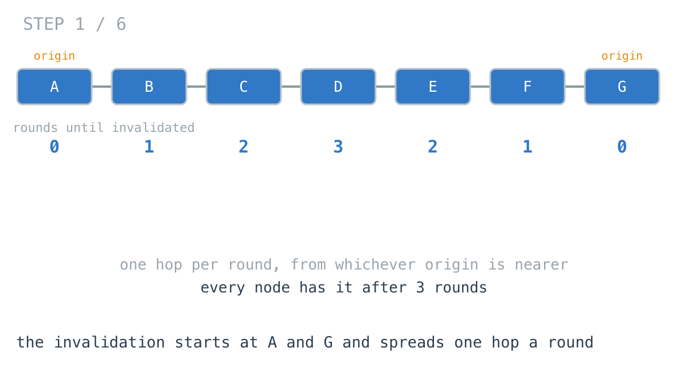
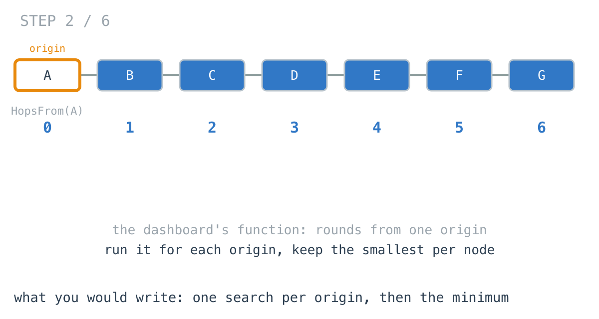
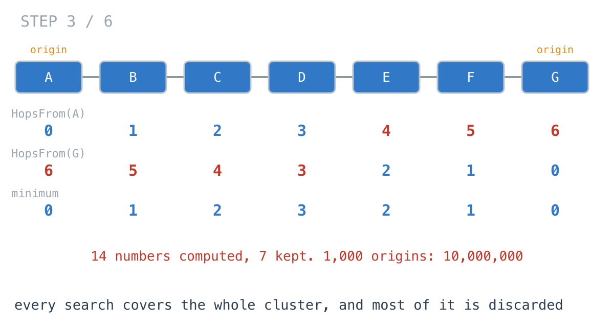
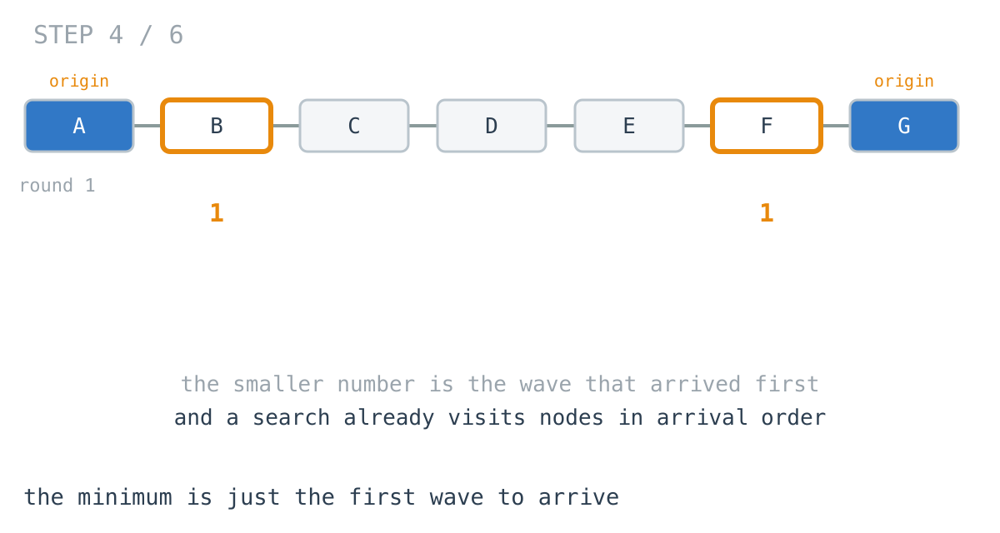
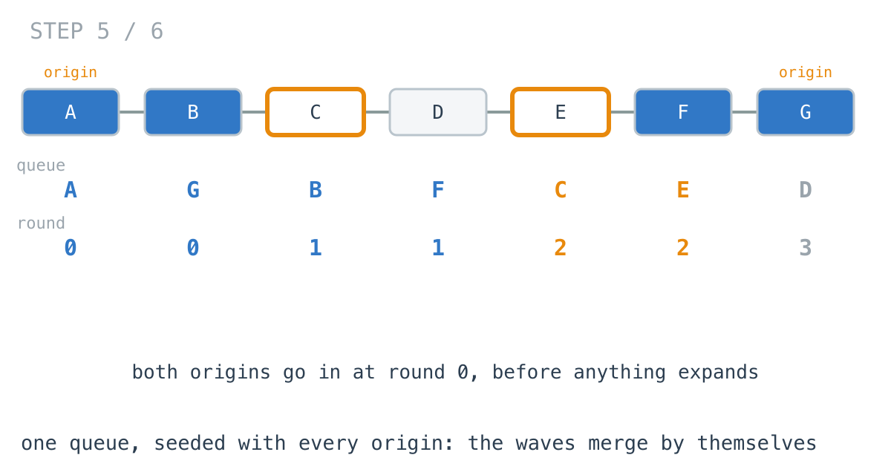
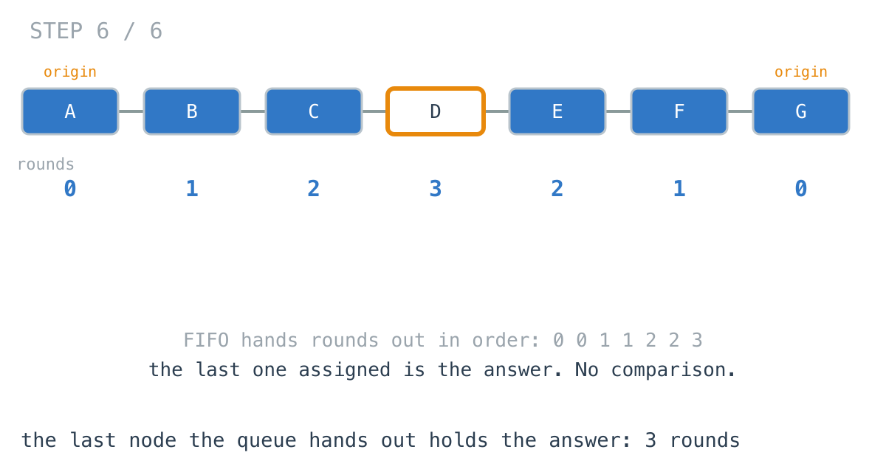

# Invalidation got faster; computing it got 540x slower

**It worked in dev · Episode 19 · technique: multi-source BFS**

When a cached value changes, the invalidation gossips out from the nodes that
took the write, one hop per round. The ops dashboard shows how many rounds until
every node in the cluster has it.

A write landing on one node: 9 rounds, and the dashboard computed that in
**0.50 ms**. A region-wide deploy landing on 1,000 nodes at once: only 6
rounds, because it starts from everywhere. The dashboard took **269 ms** to
say so, **540x** longer, for an invalidation that finished sooner.

---

## The problem

```go
// peers[n] holds the nodes n forwards an invalidation to. Two-way, one round per hop.
type Cluster [][]int
```

Given the origins - the nodes where the invalidation starts - return how many
rounds until every node has it, or -1 if some node never does.



---

## What you would write

The dashboard already had `HopsFrom`: pick a node, see how many rounds a change
there takes to reach every other node. A plain BFS, tested, drawn on a page.

```go
func HopsFrom(c Cluster, origin int) []int {
	dist := make([]int, len(c))
	for i := range dist {
		dist[i] = -1
	}
	dist[origin] = 0
	queue := []int{origin}
	for i := 0; i < len(queue); i++ {
		n := queue[i]
		for _, p := range c[n] {
			if dist[p] < 0 {
				dist[p] = dist[n] + 1
				queue = append(queue, p)
			}
		}
	}
	return dist
}
```

With several origins, a node is invalidated by whichever one reaches it first.
So run `HopsFrom` for each origin, keep the smallest number at each node, and
report the largest of those:

```go
func RoundsBySearchEach(c Cluster, origins []int) int {
	best := make([]int, len(c))
	for i := range best {
		best[i] = -1
	}
	for _, o := range origins {
		for n, d := range HopsFrom(c, o) {
			if d >= 0 && (best[n] < 0 || d < best[n]) {
				best[n] = d
			}
		}
	}
	rounds := 0
	for _, d := range best {
		if d < 0 {
			return -1
		}
		if d > rounds {
			rounds = d
		}
	}
	return rounds
}
```

It is the definition, written down: minimum over origins, maximum over nodes.
It reuses a tested search. I would approve it.



---

## How bad, on its own

```
Apple M1 Pro · go1.26.4 · go test -bench=RoundsBySearchEach -benchtime=50x
```

| shape | nodes | origins | rounds | search from each |
|---|---:|---:|---:|---:|
| `origins_1` | 10,000 | 1 | 9 | 0.50 ms |
| `origins_10` | 10,000 | 10 | 9 | 2.81 ms |
| `origins_100` | 10,000 | 100 | 7 | 26.7 ms |
| `origins_1000` | 10,000 | 1,000 | 6 | 269 ms |
| `ring_2k_20` | 2,000 | 20 | 50 | 0.36 ms |

The four `origins_*` rows are the same 10,000-node cluster. Read the two middle
columns against each other: as the origins go up, the rounds go down, and the
time goes up in step with the origins. The dashboard gets slower exactly when
the thing it is measuring gets faster.

A write on one node, or on one node per zone, is fine and I would leave it.

---

## From the symptom to the shape

### The issue, said plainly

Every origin searches the whole cluster, and at each node all but one of those
searches is thrown away.

### Quantify it on the concrete example

Seven nodes in a line, origins at both ends. `HopsFrom(A)` fills in seven
numbers. `HopsFrom(G)` fills in seven more. The minimum keeps seven. Fourteen
computed, seven kept.



On the real cluster, `TestShapes` counts it:

```
origins_1       10000 nodes,     1 origins,   9 rounds  |  nodes visited: search each      10000, one wave  10000
origins_1000    10000 nodes,  1000 origins,   6 rounds  |  nodes visited: search each   10000000, one wave  10000
```

10,000,000 node visits to fill in 10,000 numbers. The cost is origins times
nodes, and the origins are exactly the thing that grows when a deploy is big.

### Why is it allowed to happen?

Because `HopsFrom` answers a per-origin question - "how far is everything from
here" - and answers it correctly. The minimum loop is correct too. Each piece is
the definition of something. What neither knows is that the other origins exist
while it is running, so `HopsFrom(A)` keeps walking deep into the part of the
cluster G had already covered in two rounds.

### The answer was already produced, in the right order

Look at the minimum at node F. It is 1, from G. The 5 from A is discarded. Why
was G's number smaller? Because G's wave got to F first.



"The smallest distance over all origins" is "the round the first wave arrives".
And a BFS already visits nodes in the order waves arrive - that is what a FIFO
queue does. Each separate search was producing arrival order, correctly, for one
wave at a time. The minimum loop then rebuilt the combined arrival order from
the outside, after the fact.

### What is the question actually asking?

Do not assume it. An invalidated node does not care which origin invalidated
it. A node invalidated at round 2 forwards it at round 3 regardless of where it
came from. And a node that already has it does not get it again.

So there are not 1,000 waves. There is one wave, with 1,000 starting points.

### Write the thing you want as an equation

```
round(n) = 0                                  if n is an origin
round(n) = 1 + min(round(p) for each peer p)  otherwise
```

Read the right-hand side out loud. It never says which origin. Every origin is
the same kind of thing - a node at round 0 - and after that, the rule is the
same for every node no matter how many origins there were.

### Conclude the order

If every origin is just a node at round 0, then put every origin in the queue
at round 0, **before anything is expanded**, and run one BFS. The FIFO queue
hands out all the round-0 nodes, then all the round-1 nodes they reached, and
so on. The first time any wave reaches a node is its smallest round, and once a
node has a round it is never touched again.

```go
for _, o := range origins {
	if dist[o] < 0 {
		dist[o] = 0
		queue = append(queue, o)
	}
}
```

This is **multi-source BFS**. Nothing in the loop after it knows there was more
than one start.



### Closing the last gap: the answer is the last round handed out

The queue hands out rounds in non-decreasing order. So the answer is not a max
over an array afterwards - it is whatever round the queue handed out last:

```go
rounds = dist[n] // no comparison: FIFO order means the last one is the largest
```



### Where it came from in the challenge

[Day 40](https://github.com/architagr/leetcode_solutions/blob/main/medium_problems/901_1000/rotting_oranges/SOLUTION.md),
Rotting Oranges, is this on a grid, and its write-up states the whole trick in
two sentences: every rotten orange "goes into the queue at `t = 0`, before the
walk begins", and "nothing inside the loop has to know there was more than one
start; the queue does not care where its contents came from." It even names the
version at the top of this page, "running a separate BFS per rotten orange and
taking the minimum at each cell, which is correct and costs O(sources x cells)".
And its `ans = x.t`, "not `if x.t > ans`", is the line above.

[Day 37](https://github.com/architagr/leetcode_solutions/blob/main/medium_problems/101_200/number_of_islands/SOLUTION.md),
Number of Islands, is where marking a node the moment it is reached comes from:
its search overwrites a cell as it consumes it, so nothing is ever visited
twice. Here that mark is `dist[p] >= 0`, and it is what stops 1,000 origins
from turning into 1,000 visits per node.

### When this does not apply

Go back to the equation and break it.

`1 + min(...)` says every hop costs one round. Give hops different costs - a
same-rack peer forwards in 1 ms, a cross-region one in 80 ms - and the first
node the queue reaches is no longer the nearest in time. BFS stops being
correct at all, not just slow, and you need Dijkstra. The same seeding trick
carries over: put every origin in the heap at time 0.

And if the question is per origin - which origin's write reached which node,
and when, for each one - the per-origin searches are the question, not a
waste. One wave throws that away by design.

Last, the queue has to be a queue. Day 40 says it about its own `ans = x.t`:
swap the FIFO for a stack and the line "silently becomes wrong".

### The rule

> **When many starting points spread by the same rule and you only care which
> one arrives first, they are one search with many seeds. Put every seed in the
> queue before expanding anything.**

---

## Try it before reading on

One BFS, not a new data structure. The loop that expands the queue does not
change at all. What changes is what is in the queue before it starts.

```bash
git clone https://github.com/architagr/leetcode_solutions
cd leetcode_solutions/series/it-worked-in-dev/episodes/19-invalidation-wavefront
go test ./...
```

Reading on costs you the rep.

---

## The version that scales

```go
func RoundsByOneWave(c Cluster, origins []int) int {
	dist := make([]int, len(c))
	for i := range dist {
		dist[i] = -1
	}
	queue := make([]int, 0, len(c))
	for _, o := range origins {
		// Every origin is at round 0, and all of them are in the queue
		// before anything is expanded. That ordering is the whole idea.
		if dist[o] < 0 {
			dist[o] = 0
			queue = append(queue, o)
		}
	}
	rounds, reached := 0, len(queue)
	for i := 0; i < len(queue); i++ {
		n := queue[i]
		// No comparison: a FIFO queue hands nodes out in non-decreasing
		// round order, so the last one assigned is the largest.
		rounds = dist[n]
		for _, p := range c[n] {
			if dist[p] < 0 {
				dist[p] = dist[n] + 1
				queue = append(queue, p)
				reached++
			}
		}
	}
	if reached < len(c) {
		return -1
	}
	return rounds
}
```

Three things carry it. The seeding loop runs to completion before the expand
loop starts. `if dist[o] < 0` quietly handles the same origin listed twice,
which a deploy tool will eventually do. And `rounds = dist[n]` with no
comparison, because the queue is FIFO.

`reached` counts nodes as they are first marked, so -1 for an unreachable node
costs no extra pass.

---

## The measurement

| shape | origins | rounds | search from each | one wave | ratio |
|---|---:|---:|---:|---:|---:|
| `origins_1` | 1 | 9 | 0.50 ms | 196 µs | 2.54x |
| `origins_10` | 10 | 9 | 2.81 ms | 197 µs | 14.2x |
| `origins_100` | 100 | 7 | 26.7 ms | 198 µs | 135x |
| `origins_1000` | 1,000 | 6 | 269 ms | 200 µs | 1350x |
| `ring_2k_20` | 20 | 50 | 0.36 ms | 8.76 µs | 40.6x |

Raw ns: 499,208 / 196,275 · 2,806,441 / 197,028 · 26,743,015 / 197,672 ·
269,397,452 / 199,597 · 355,043 / 8,755

The column to read is the one wave: 196 µs with one origin, 200 µs with a
thousand, **1.02x**. It visits every node once however many origins there are.

Allocated: 419 MB per call for search from each on `origins_1000`, against
160 KB for one wave.

Even with a single origin, where both do exactly one search, search from each
is **2.54x** slower. `HopsFrom` grows its queue from empty rather than sizing it
once, and the minimum-then-maximum pass is a second walk over every node. Not
the story here, but it is in the table, so it gets a sentence.

---

## What it costs

**Nothing you could not name, which is unusual.** It is the same length as the
version it replaces and it is one BFS instead of a BFS inside a loop. The one
thing lost is `HopsFrom`'s reuse, and with it the per-origin numbers - if the
dashboard ever wants "this node was reached by origin 412", one wave cannot say.
Recording the origin alongside the round in the seeding loop gets it back.

**It only works because every hop costs the same.** The day the cluster spans
regions and a hop has a latency rather than a count, this is the wrong
algorithm, and it gives a confident wrong number rather than a slow right one.

**At one origin, or ten, keep what you have.** 0.50 ms and 2.81 ms. If writes
in your system land on one node and fan out, the reuse of `HopsFrom` is worth
more than the microseconds. It is the region-wide deploy, the bulk write, the
cache flush from a hundred nodes at once - the events where the dashboard is
actually being watched - that make it slow.

---

## The one line to keep

If you are taking the minimum over many searches that all spread by the same
rule, you are running one search with many starting points - seed the queue with
all of them and run it once.

---

## Built on

Days from the [365-day LeetCode challenge](https://github.com/architagr/leetcode_solutions),
with the solution write-up and the problem itself:

- **Day 37 — [Number of Islands](https://github.com/architagr/leetcode_solutions/blob/main/medium_problems/101_200/number_of_islands/SOLUTION.md)** · LeetCode [#200](https://leetcode.com/problems/number-of-islands/) · medium
  <br>marking land consumed the moment a search reaches it, so nothing is visited twice, and counting only the searches that start on land nobody has consumed
- **Day 40 — [Rotting Oranges](https://github.com/architagr/leetcode_solutions/blob/main/medium_problems/901_1000/rotting_oranges/SOLUTION.md)** · LeetCode [#994](https://leetcode.com/problems/rotting-oranges/) · medium
  <br>every source in the queue at time zero before the walk begins, and the answer as the last time the FIFO queue hands out

---

## Run it yourself

```bash
git clone https://github.com/architagr/leetcode_solutions
cd leetcode_solutions/series/it-worked-in-dev/episodes/19-invalidation-wavefront
go test ./...                        # both agree, including duplicates and an unreachable node
go test -run TestShapes -v           # 10,000,000 visits against 10,000
go test -bench=. -benchtime=50x      # the timings above
```

---

Part of [It worked in dev](../../), the long-form companion to the
[365-day LeetCode challenge](https://github.com/architagr/leetcode_solutions).

---

*Ideation, problem selection, benchmarks and conclusions: Archit Agarwal.
The prose was drafted with AI assistance and edited by me. Every number here
comes from a run you can reproduce with the commands above.*
