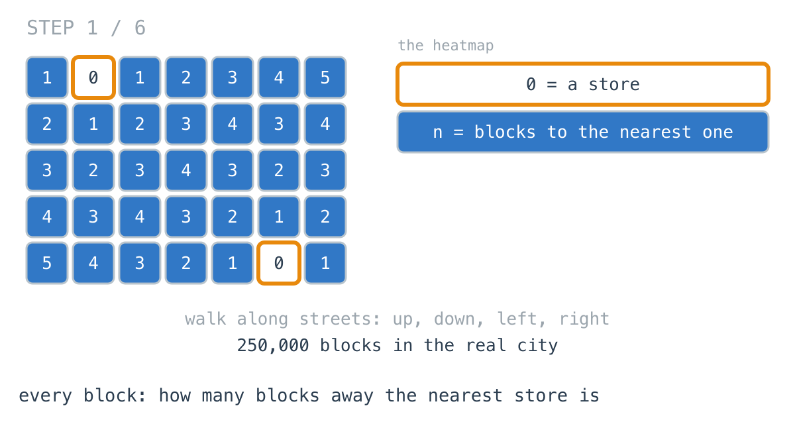
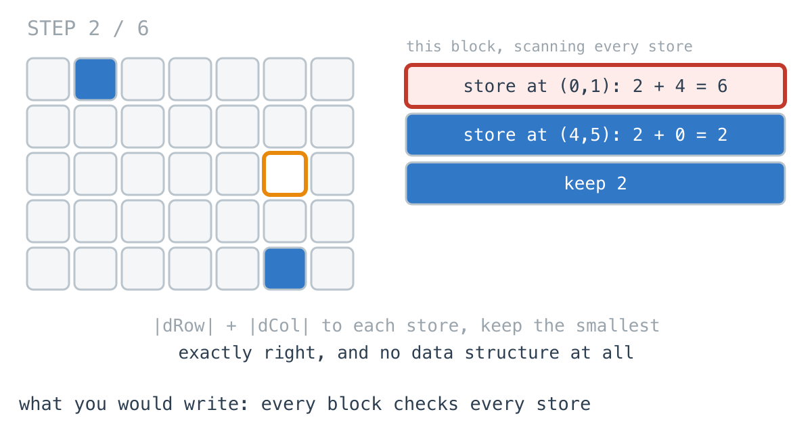
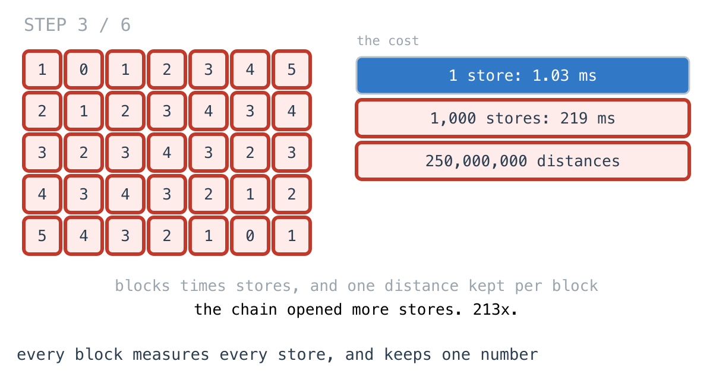
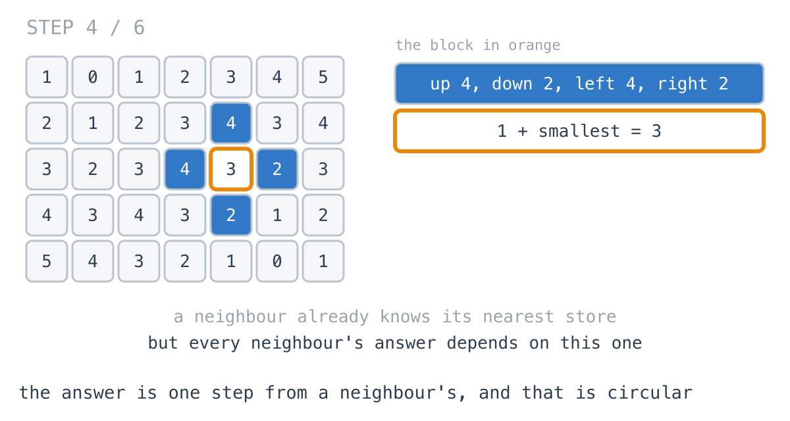
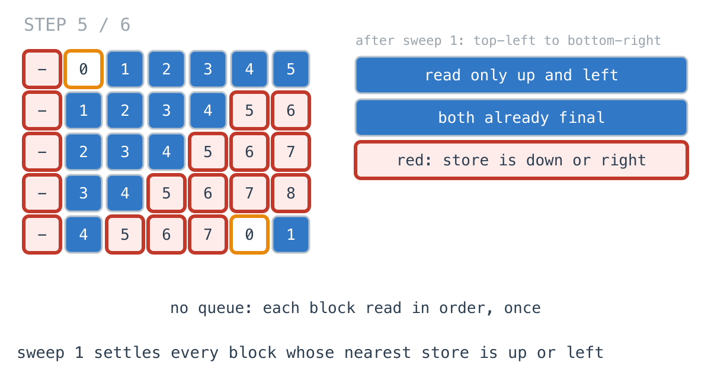
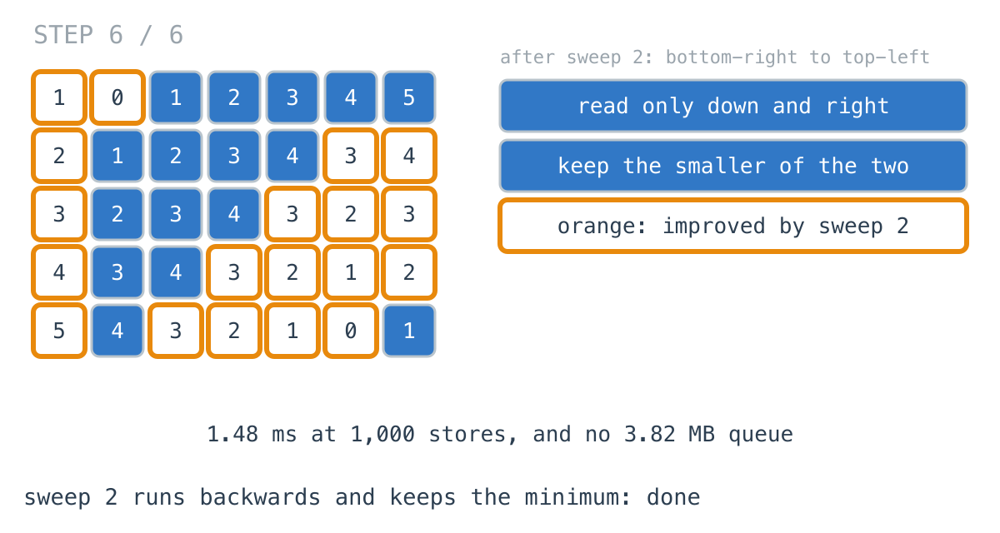

# 999 more stores made the delivery map 213x slower

**It worked in dev · Episode 20 · technique: two sweeps instead of a queue**

A delivery app draws a heatmap over the city: for every block, how many blocks
away the nearest open store is. It decides who gets the 15-minute promise.

With one warehouse the map took **1.03 ms** for 250,000 blocks. The chain opened
dark stores, 1,000 of them, and the same map took **219 ms**. The fix I reached
for first, from last episode, made that flat and allocated **3.82 MB** of queue
to do it. The one from the daily challenge needs no queue at all and is **1.48
ms** at a thousand stores - and it is wrong the moment a river runs through the
city.

---

## The problem

```go
type Point struct{ Row, Col int }

// rows x cols blocks, stores at the given points. Walking is along streets:
// up, down, left, right.
func Heatmap(rows, cols int, stores []Point) [][]int
```

For every block, the number of blocks to walk to the nearest store.



---

## What you would write

With no obstacles, walking distance on a street grid is `|dRow| + |dCol|`. So
every block checks every store and keeps the closest:

```go
func HeatmapByScan(rows, cols int, stores []Point) [][]int {
	out := make([][]int, rows)
	for r := range out {
		out[r] = make([]int, cols)
		for c := range out[r] {
			best := rows + cols
			for _, s := range stores {
				if d := abs(r-s.Row) + abs(c-s.Col); d < best {
					best = d
				}
			}
			out[r][c] = best
		}
	}
	return out
}
```

This is the definition. It has no data structure, no queue, no visited set,
nothing to get wrong. With one store it is the fastest version on this page,
and I would approve it without a comment.



---

## How bad, on its own

```
Apple M1 Pro · go1.26.4 · go test -bench=HeatmapByScan -benchtime=20x
```

| shape | blocks | stores | scan every store |
|---|---:|---:|---:|
| `stores_1` | 250,000 | 1 | 1.03 ms |
| `stores_10` | 250,000 | 10 | 2.92 ms |
| `stores_100` | 250,000 | 100 | 21.8 ms |
| `stores_1000` | 250,000 | 1,000 | 219 ms |

Same city in every row. One store to a thousand is **213x**. The map does not
get bigger; the business gets more successful, and the page gets slower.

At one store, or ten, leave it alone.

---

## From the symptom to the shape

### The issue, said plainly

Every block measures its distance to every store and keeps one number.

### Quantify it on the concrete example

250,000 blocks times 1,000 stores is 250,000,000 distance calculations to fill
in 250,000 cells. At a thousand stores, 999 of every thousand are measured and
thrown away.



### Why is it allowed to happen?

Because `|dRow| + |dCol|` is exact and cheap, so nothing ever looks expensive.
Each block's answer is computed from scratch, correctly, as if no other block
had been computed.

### The answer was already one step away

Take the orange block in the diagram. Its neighbours say 4, 2, 4 and 2. Its
own answer is 3: one step to a neighbour, plus that neighbour's answer. The
neighbour already knew where its nearest store was. The block did not need to
look at the stores at all.



```
dist(b) = 0                                  if b is a store
dist(b) = 1 + min(dist(n) for each neighbour n)  otherwise
```

### What is the question actually asking?

Read that equation out loud and it goes in a circle. My answer needs my
neighbour's, and my neighbour's needs mine. There is no cell to start from.

[Last episode](../19-invalidation-wavefront/) had the same circle and broke it
with **time**: seed a queue with every store at 0, and a FIFO queue settles
blocks in order of distance, so every block's neighbours-that-matter are final
before it is. That works here too:

```
shape        scan every store   multi-source BFS
stores_1               1.03 ms            2.25 ms
stores_1000             219 ms            2.80 ms
```

Flat, as promised. But it is slower than the scan at one store, and it holds a
queue with every block in it: 5.79 MB allocated where the heatmap itself is
1.96 MB. The queue is doing one job - deciding an order - and on a street grid
with nothing in the way, there is a cheaper way to decide it.

### Write the circle as two halves

A shortest walk from a store to a block, with nothing in the way, never needs
to double back. It goes some way vertically and some way horizontally. So split
the neighbours by direction instead of by time:

```
from above or the left:   1 + min(dist(up), dist(left))
from below or the right:  1 + min(dist(down), dist(right))
dist(b) = the smaller of the two
```

Read the first line out loud. If you visit blocks top-left to bottom-right, then
when you reach a block, the one above it and the one to its left are already
done. Nothing circular about it - it is a single pass in reading order.

### Conclude the order

Two sweeps. The first goes top-left to bottom-right and reads only up and left.
The second goes bottom-right to top-left and reads only down and right. A walk
that comes down and then goes left is carried by the first sweep for its
downward leg and the second for its leftward leg, which runs after.



### Closing the last gap: a minimum, not an assignment

The second sweep must not overwrite the first. Where the first already found
the nearest store up and to the left, that answer stands:

```go
if r < rows-1 && out[r+1][c]+1 < out[r][c] {
	out[r][c] = out[r+1][c] + 1 // only if it is better than sweep 1's
}
```



No queue, no visited set, every block read twice in memory order.

### Where it came from in the challenge

[Day 41](https://github.com/architagr/leetcode_solutions/blob/main/medium_problems/501_600/01_matrix/SOLUTION.md),
01 Matrix, is this exact problem - distance from every cell to the nearest zero
- and its write-up opens by saying it is "yesterday's problem, and not
yesterday's solution". It names the circle ("True, and useless as written"),
breaks it by direction, and has a section called "Why exactly two". It also
flags the line that makes two passes enough: `minValue(result[i][j], ...)`
"rather than a plain assignment".

[Day 40](https://github.com/architagr/leetcode_solutions/blob/main/medium_problems/901_1000/rotting_oranges/SOLUTION.md),
Rotting Oranges, is the queue version, the one I reached for first. Day 41 says
which to use in an interview: "multi-source BFS. It is the natural framing of a
distance problem, it generalises to weighted edges". That sentence is the whole
of the next section.

### When this does not apply

Go back to "never needs to double back" and break it.

Put a river through the city with one bridge. Now the walk to some blocks goes
right, crosses, and comes back left. Put a second river with its bridge at the
other end and the walk zigzags: right, down, left, down, right. No single sweep
direction sees a leg that runs against it after a leg that runs with it.
`TestSweepsBreakWhenAWalkMustDoubleBack` holds that city:

```
bottom-right block: BFS 16, two sweeps -1, straight-line scan 8
```

BFS walks the zigzag and says 16. The sweeps never reach the block. And the
straight-line scan, which ignores the rivers entirely, says 8 - the version at
the top of this page was only ever right because the city had no obstacles.

So: streets with nothing in the way, sweeps. A real map with rivers, closed
roads, one-way streets or blocks that cost different amounts to cross, BFS or
Dijkstra, and the queue earns its 3.82 MB.

### The rule

> **When every answer is one step from a neighbour's and walks never double
> back, you do not need a queue to order them: sweep one way for half the
> directions, sweep back for the rest, and keep the minimum.**

---

## Try it before reading on

No queue and no new data structure. The grid you are filling in is the only
memory, and every block is read twice. Which neighbours can a block trust if
you visit blocks in reading order?

```bash
git clone https://github.com/architagr/leetcode_solutions
cd leetcode_solutions/series/it-worked-in-dev/episodes/20-nearest-store-heatmap
go test ./...
```

Reading on costs you the rep.

---

## The version that scales

```go
func HeatmapBySweeps(rows, cols int, stores []Point) [][]int {
	far := rows + cols // further than any real distance on this grid
	out := make([][]int, rows)
	for r := range out {
		out[r] = make([]int, cols)
		for c := range out[r] {
			out[r][c] = far
		}
	}
	for _, s := range stores {
		out[s.Row][s.Col] = 0
	}
	for r := 0; r < rows; r++ {
		for c := 0; c < cols; c++ {
			if r > 0 && out[r-1][c]+1 < out[r][c] {
				out[r][c] = out[r-1][c] + 1
			}
			if c > 0 && out[r][c-1]+1 < out[r][c] {
				out[r][c] = out[r][c-1] + 1
			}
		}
	}
	for r := rows - 1; r >= 0; r-- {
		for c := cols - 1; c >= 0; c-- {
			// A minimum, not an assignment: the first pass's answer stands
			// whenever the nearest store was up or to the left.
			if r < rows-1 && out[r+1][c]+1 < out[r][c] {
				out[r][c] = out[r+1][c] + 1
			}
			if c < cols-1 && out[r][c+1]+1 < out[r][c] {
				out[r][c] = out[r][c+1] + 1
			}
		}
	}
	return out
}
```

Three things carry it. `far` is `rows + cols`, larger than any walk on the grid,
so an unset block always loses a comparison. The first sweep reads only
neighbours it has already finished. And the second sweep compares before it
writes.

---

## The measurement

| shape | stores | scan every store | multi-source BFS | two sweeps | scan vs sweeps |
|---|---:|---:|---:|---:|---:|
| `stores_1` | 1 | 1.03 ms | 2.25 ms | 1.22 ms | 0.841x |
| `stores_10` | 10 | 2.92 ms | 2.22 ms | 1.19 ms | 2.45x |
| `stores_100` | 100 | 21.8 ms | 2.26 ms | 1.22 ms | 17.9x |
| `stores_1000` | 1,000 | 219 ms | 2.80 ms | 1.48 ms | 148x |

Raw ns: 1,025,958 / 2,247,356 / 1,220,246 · 2,924,729 / 2,217,275 / 1,191,550 ·
21,773,417 / 2,262,615 / 1,216,802 · 218,805,908 / 2,800,675 / 1,482,408

Three things in that table. At one store the scan wins, and **0.841x** means the
sweeps are the slower of the two. The BFS is flat across a thousandfold change
in stores, and **1.84x** to **1.89x** slower than the sweeps on every row. And
the sweeps are flat too, 1.22 ms to 1.48 ms.

Allocated: 1.96 MB for the scan and the sweeps, which is the heatmap itself.
5.79 MB for the BFS, whose extra 3.82 MB is a queue holding every block once.

---

## What it costs

**It is only correct without obstacles.** This is the big one, and it fails
silently: the sweeps do not crash on a map with a river, they return numbers,
and some of them are wrong. If the map can ever gain a closed road, a one-way
street or a block that costs more to cross, the BFS is the version that stays
correct, and its 1.9x is the price of that.

**The reason it works is not visible in the code.** Two nested loops, twice,
with the second one backwards. A reviewer can check every line and still not
see why two passes are enough and one is not. It needs the comment, and it
needs `TestAllThreeAgree` running against the scan on random cities.

**At one store, or ten, the scan is fine.** 1.03 ms and 2.92 ms, and it is the
only one of the three you can verify by reading. It stops being fine as stores
are added, which is a business decision nobody will tell engineering about.

---

## The one line to keep

When a distance is one step from a neighbour's and walks never double back, the
order a queue would give you is already given by reading the grid forwards and
then backwards.

---

## Built on

Days from the [365-day LeetCode challenge](https://github.com/architagr/leetcode_solutions),
with the solution write-up and the problem itself:

- **Day 40 — [Rotting Oranges](https://github.com/architagr/leetcode_solutions/blob/main/medium_problems/901_1000/rotting_oranges/SOLUTION.md)** · LeetCode [#994](https://leetcode.com/problems/rotting-oranges/) · medium
  <br>every source in the queue at time zero before the walk begins, and the answer as the last time the FIFO queue hands out
- **Day 41 — [01 Matrix](https://github.com/architagr/leetcode_solutions/blob/main/medium_problems/501_600/01_matrix/SOLUTION.md)** · LeetCode [#542](https://leetcode.com/problems/01-matrix/) · medium
  <br>breaking a circular distance definition by direction: one sweep for up and left, one back for down and right, keeping the minimum

---

## Run it yourself

```bash
git clone https://github.com/architagr/leetcode_solutions
cd leetcode_solutions/series/it-worked-in-dev/episodes/20-nearest-store-heatmap
go test ./...                                               # all three agree on open cities
go test -run TestSweepsBreakWhenAWalkMustDoubleBack -v      # the city with two rivers
go test -bench=. -benchtime=20x                             # the timings above
```

---

Part of [It worked in dev](../../), the long-form companion to the
[365-day LeetCode challenge](https://github.com/architagr/leetcode_solutions).

---

*Ideation, problem selection, benchmarks and conclusions: Archit Agarwal.
The prose was drafted with AI assistance and edited by me. Every number here
comes from a run you can reproduce with the commands above.*
