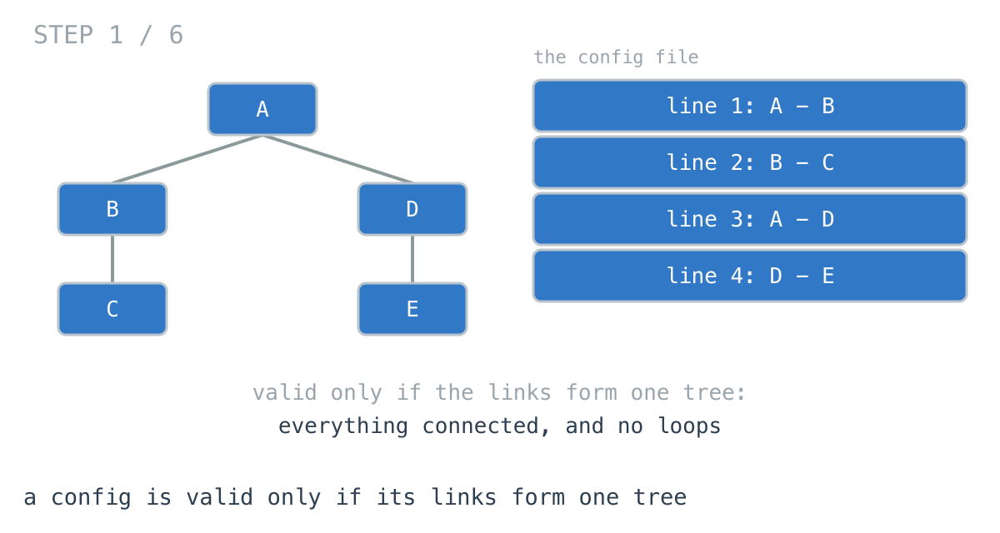
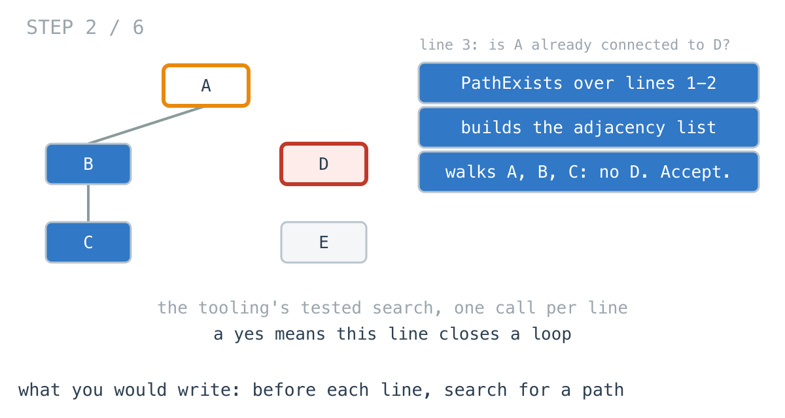
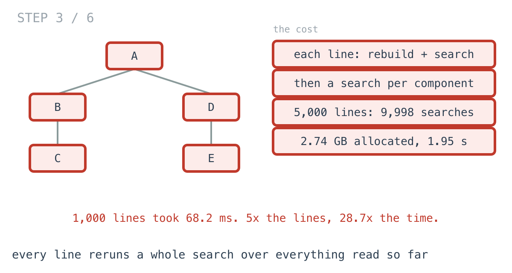
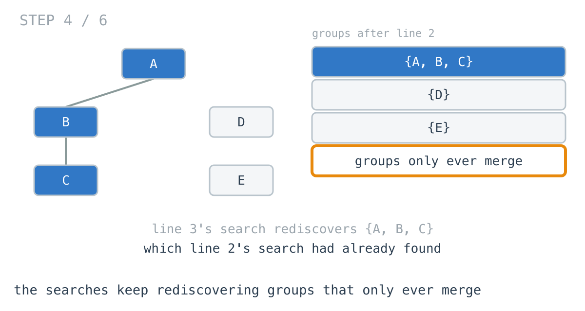
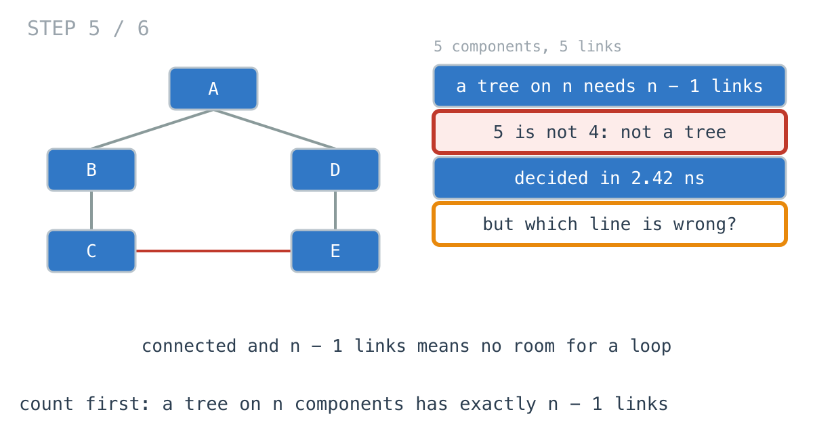
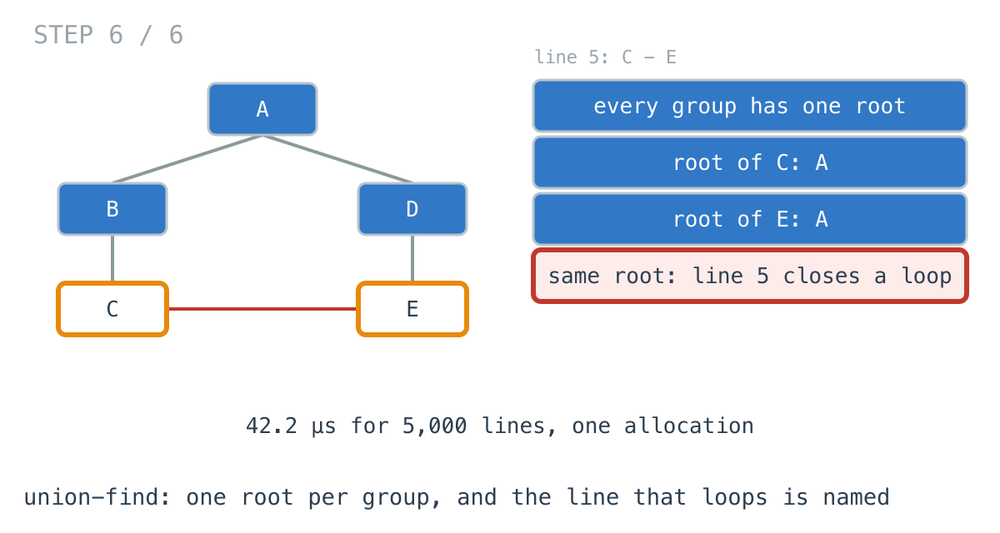

# A config 5x longer took 28.7x longer to validate

**It worked in dev · Episode 21 · technique: count the links, then union-find**

The platform config declares every component and the links between them, and
the loader refuses to start unless those links form one tree: everything
connected, no loops. When it refuses, it says which line is wrong.

With 1,000 components the check took **68.2 ms**, which nobody noticed. The org
grew to 5,000 and it took **1.95 seconds** and allocated **2.74 GB**, on every
deploy. Five times the config, 28.7 times the time. The version at the bottom
of this page does it in **42.2 µs** with one allocation, and still names the
line.

---

## The problem

```go
// n components, numbered 0..n-1, and the links between them in file order.
func Validate(n int, links [][2]int) int // -1 if a tree, else the line to blame
```

Valid only if the links form a single tree. If a link closes a loop, report
that line. If everything is loop-free but some component is unreachable,
report that too.



---

## What you would write

The config tooling already had `PathExists` - the function behind "why can
service 12 reach service 40". Build the adjacency list from the links, then
BFS:

```go
func PathExists(n int, links [][2]int, src, dst int) bool {
	adj := make([][]int, n)
	for _, l := range links {
		adj[l[0]] = append(adj[l[0]], l[1])
		adj[l[1]] = append(adj[l[1]], l[0])
	}
	seen := make([]bool, n)
	seen[src] = true
	queue := []int{src}
	for i := 0; i < len(queue); i++ {
		for _, t := range adj[queue[i]] {
			if !seen[t] {
				seen[t] = true
				queue = append(queue, t)
			}
		}
	}
	return seen[dst]
}
```

So read the file the way a person would. Before accepting each line, ask
whether its two components are already connected by the lines above it. If
they are, this line closes a loop - blame it. At the end, every component must
be reachable from component 0:

```go
func IsTreeByLinkCheck(n int, links [][2]int) int {
	for i, l := range links {
		if PathExists(n, links[:i], l[0], l[1]) {
			return i
		}
	}
	for c := 1; c < n; c++ {
		if !PathExists(n, links, 0, c) {
			return len(links)
		}
	}
	return -1
}
```

It gives the exact line number a person needs, it reuses a tested function,
and every step is the definition of a loop. I would approve it.



---

## How bad, on its own

```
Apple M1 Pro · go1.26.4 · go test -bench=ByLinkCheck -benchtime=5x
```

| shape | components | links | a tree? | link check |
|---|---:|---:|---|---:|
| `tree_100` | 100 | 99 | yes | 0.99 ms |
| `tree_1k` | 1,000 | 999 | yes | 68.2 ms |
| `tree_5k` | 5,000 | 4,999 | yes | 1,955 ms |
| `loop_5k` | 5,000 | 5,000 | no, extra last line | 561 ms |
| `swapped_5k` | 5,000 | 4,999 | no, a duplicate link | 559 ms |

At a hundred components, under a millisecond. Leave it. At a thousand, 68 ms at
startup, and I would still leave it. At five thousand it is two seconds and
2.74 GB, and **28.7x** the thousand-component time for five times the input.

---

## From the symptom to the shape

### The issue, said plainly

Every line of the config triggers a search of everything read so far, and each
search starts from nothing.

### Quantify it on the concrete example

`TestSearches` counts them:

```
tree_1k      n=  1000 links=   999  valid=true   link check runs at least   1998 full searches
tree_5k      n=  5000 links=  4999  valid=true   link check runs at least   9998 full searches
```

One search per line, then one per component to check connectivity. Each one
rebuilds the adjacency list from the links it is given before walking it. That
rebuild is where the 69 million allocations come from.



### Why is it allowed to happen?

Because `PathExists` answers a general question - can this reach that, in this
set of links - and has to assume the links are new every time. It is correct.
It is just being asked the same question about an almost identical set of links
five thousand times in a row.

### The answer was already there

After line 2, A, B and C are one group. Line 3's search walks A, B and C to
find out whether D is among them. Line 2's search had already walked them. So
had line 1's, for A and B.



And the groups never split. A link can join two groups or close a loop inside
one. It can never pull a group apart. Every search is rediscovering a grouping
that only ever changes by merging.

### What is the question actually asking?

Do not assume it. "Is this a tree?" is two questions: is it connected, and is
it free of loops. The line-by-line version answers the second by hunting for
each loop as it forms.

But there is a fact about trees that makes the hunt unnecessary. A tree on `n`
components has exactly `n - 1` links. If it has `n - 1` links and is connected,
there is no room left for a loop.

### Write the thing you want as an equation

```
tree  ⇔  len(links) == n - 1  and  connected
```

Read the right-hand side out loud. Neither half mentions a loop. The first half
is a length check. The second is a single search from one component.

```go
if len(links) != n-1 {
	return false // decided without reading a single link
}
// one BFS from component 0; tree if it reaches all n
```



On `tree_5k`, 279 µs instead of 1.95 s. On `loop_5k`, where there is one link
too many, **2.42 ns**, because the length is the whole answer.

### Closing the last gap: which line?

The count tells you the config is wrong. It does not tell you where. On
`loop_5k` it knows there is one link too many and has no idea which one, and on
`swapped_5k` - the right count, with one line duplicating another - its BFS
finds a component it cannot reach and still cannot name the line that caused
it.

The error message needs the line. So go back to the observation the count
skipped: groups only merge. Give every group one **root**. A link joins the
groups of its two ends by pointing one root at the other. And a link whose two
ends already have the same root closes a loop - that is the line.

```go
a, b := find(l[0]), find(l[1])
if a == b {
	return i // already connected: this link closes a loop
}
root[a] = b
```

That is **union-find**, and it is the question the line-by-line version was
asking, answered without a search.



### Where it came from in the challenge

[Day 43](https://github.com/architagr/leetcode_solutions/blob/main/medium_problems/201_300/graph_valid_tree/SOLUTION.md),
Graph Valid Tree, is this exact check, and it uses both halves of this episode.
Its write-up says of the count: "Notice what the solution never does: it never
looks for a cycle. It counts." And it builds a disjoint set for connectivity,
calling it "the first structure in the arc that does not traverse anything —
it merges". Its `Find` does the one thing that keeps it fast: "It does not just
return the root, it **writes it back**."

[Day 36](https://github.com/architagr/leetcode_solutions/blob/main/easy_problems/1901_2000/find_if_path_exists_in_graph/SOLUTION.md),
Find if Path Exists in Graph, is `PathExists` - the same `(n, edges)` input and
the same "two halves: build a usable representation, then walk it". It is the
right function for one question. This episode is what happens when it is asked
five thousand of them.

### When this does not apply

Go back to the equation and break it.

`n - 1 links and connected` describes an undirected tree. If the config's links
are **parent → child**, a hierarchy has a stricter shape: one root, and every
other component with exactly one parent. `TestTwoParentsPassesTheUndirectedCheck`
holds the smallest config that passes every check on this page and is still a
broken hierarchy:

```
links: 0 -> 2, 1 -> 2
count says tree=true, union-find says -1 (-1 is a tree)
```

Three components, two links, connected, no loop. Component 2 has two parents
and the hierarchy has two roots. For parent links, count the parents per
component too - that is one more pass and a slice of counters, and none of the
checks above will do it for you.

### The rule

> **When a structure only ever merges, do not search it to ask what is
> connected: keep one root per group and compare roots. And before that, check
> the count - a tree on n things has n - 1 links, and the wrong count is an
> answer in itself.**

---

## Try it before reading on

Two changes. The first is one line at the top of the function and needs no
data structure: what must be true of `len(links)` for a tree? The second
replaces `PathExists` with something that remembers which components are
already together, and never searches.

```bash
git clone https://github.com/architagr/leetcode_solutions
cd leetcode_solutions/series/it-worked-in-dev/episodes/21-is-this-config-a-tree
go test ./...
```

Reading on costs you the rep.

---

## The version that scales

```go
func IsTreeByUnionFind(n int, links [][2]int) int {
	root := make([]int, n)
	for i := range root {
		root[i] = i
	}
	var find func(x int) int
	find = func(x int) int {
		if root[x] != x {
			root[x] = find(root[x]) // point straight at the root next time
		}
		return root[x]
	}
	groups := n
	for i, l := range links {
		a, b := find(l[0]), find(l[1])
		if a == b {
			return i // already connected: this link closes a loop
		}
		root[a] = b
		groups--
	}
	if groups != 1 {
		return len(links)
	}
	return -1
}
```

Three things carry it. `find` writes the root back as it returns, so a chain of
pointers is walked once and then flattened. `a == b` is the loop check and the
line number in one. And `groups` counts down with every merge, so connectivity
at the end is a comparison, not a search.

If you do not need the line number, put `if len(links) != n-1` above all of it
and a wrong-length config never reaches the loop. The benchmark below keeps the
two versions separate so each can be measured on its own.

---

## The measurement

| shape | link check | count, then one BFS | union-find | link check vs union-find |
|---|---:|---:|---:|---:|
| `tree_100` | 0.99 ms | 7.97 µs | 620 ns | 1594x |
| `tree_1k` | 68.2 ms | 49.8 µs | 6.51 µs | 10485x |
| `tree_5k` | 1,955 ms | 279 µs | 42.2 µs | 46306x |
| `loop_5k` | 561 ms | 2.42 ns | 41.6 µs | 13472x |
| `swapped_5k` | 559 ms | 273 µs | 41.7 µs | 13428x |

Raw ns: 988,292 / 7,971 / 619.9 · 68,213,100 / 49,836 / 6,506 ·
1,954,961,917 / 279,190 / 42,218 · 560,890,017 / 2.417 / 41,635 ·
559,299,667 / 272,895 / 41,651

The result I did not expect is the middle column. I thought the count version
would be the fastest - it is the clever idea, it never looks for a loop. It is
**6.61x** slower than union-find on `tree_5k`, because it still builds an
adjacency list: 9,062 allocations, one small slice per component. Union-find
makes one allocation and reads each link once.

The count wins exactly one row, and wins it absurdly: `loop_5k` has the wrong
number of links, so it answers in 2.42 ns without reading the file.

Allocated: 2.74 GB for the link check on `tree_5k`, 303 KB for count-then-BFS,
40.0 KB for union-find.

---

## What it costs

**Union-find is a structure somebody has to recognise.** `PathExists` is a BFS
every engineer can read. `find` with path compression is ten lines that look
like a bug the first time you see them - a recursive function that assigns to
the array it is reading. It needs the comment, and it needs to live in one
place rather than being rewritten per call site.

**It only answers undirected questions.** Two parents for one component slips
straight through, as above. For a real parent-pointer hierarchy, add the parent
count.

**At a few hundred components, keep the search.** 0.99 ms at a hundred. If the
config will never be large, the line-by-line check with a tested `PathExists` is
the easiest one to trust. It stops being fine at a size somebody else decides,
on a deploy, which is when a two-second startup is least welcome.

---

## The one line to keep

A tree on n things has n - 1 links, so check the count before anything else; and
when you need to know which link breaks it, keep a root per group rather than
searching for paths, because groups only ever merge.

---

## Built on

Days from the [365-day LeetCode challenge](https://github.com/architagr/leetcode_solutions),
with the solution write-up and the problem itself:

- **Day 36 — [Find if Path Exists in Graph](https://github.com/architagr/leetcode_solutions/blob/main/easy_problems/1901_2000/find_if_path_exists_in_graph/SOLUTION.md)** · LeetCode [#1971](https://leetcode.com/problems/find-if-path-exists-in-graph/) · easy
  <br>building an adjacency list from an edge list, recording each edge under both endpoints, then one BFS from the source
- **Day 43 — [Graph Valid Tree](https://github.com/architagr/leetcode_solutions/blob/main/medium_problems/201_300/graph_valid_tree/SOLUTION.md)** · LeetCode [#261](https://leetcode.com/problems/graph-valid-tree/) · medium
  <br>a tree as n - 1 edges plus connected, so no cycle is ever looked for, and a disjoint set that merges instead of traversing

---

## Run it yourself

```bash
git clone https://github.com/architagr/leetcode_solutions
cd leetcode_solutions/series/it-worked-in-dev/episodes/21-is-this-config-a-tree
go test ./...                                              # all three agree, including the broken configs
go test -run TestSearches -v                               # 9,998 searches for one config
go test -run TestTwoParentsPassesTheUndirectedCheck -v     # what none of them catch
go test -bench='ByCount|ByUnionFind' -benchtime=2000x      # the fast versions
go test -bench=ByLinkCheck -benchtime=5x                   # the slow one; about a minute
```

---

Part of [It worked in dev](../../), the long-form companion to the
[365-day LeetCode challenge](https://github.com/architagr/leetcode_solutions).

---

*Ideation, problem selection, benchmarks and conclusions: Archit Agarwal.
The prose was drafted with AI assistance and edited by me. Every number here
comes from a run you can reproduce with the commands above.*
