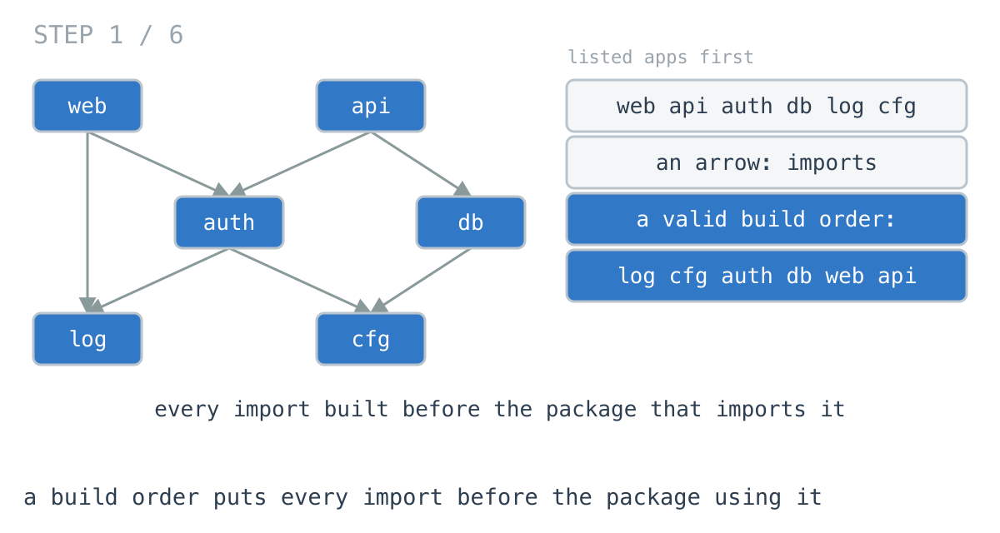
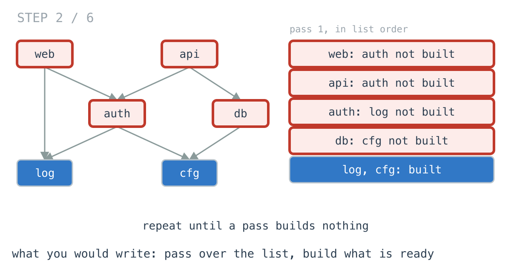
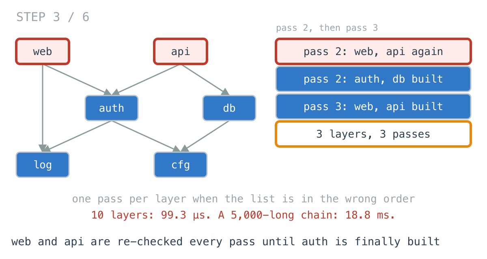
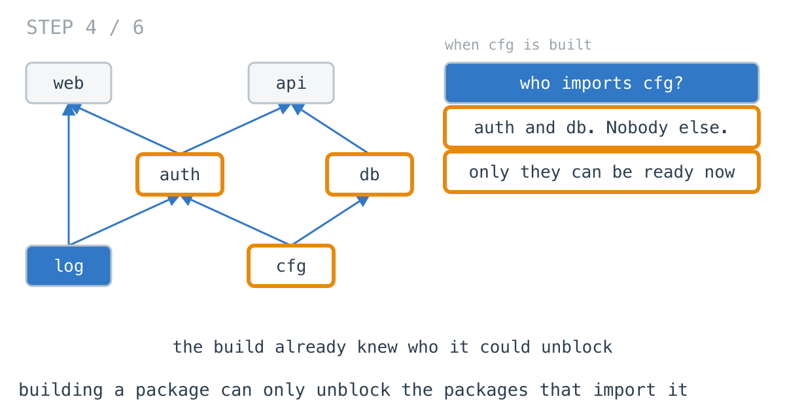
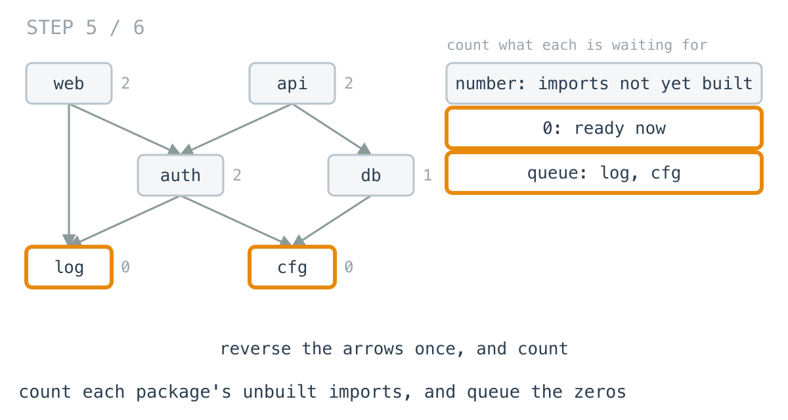
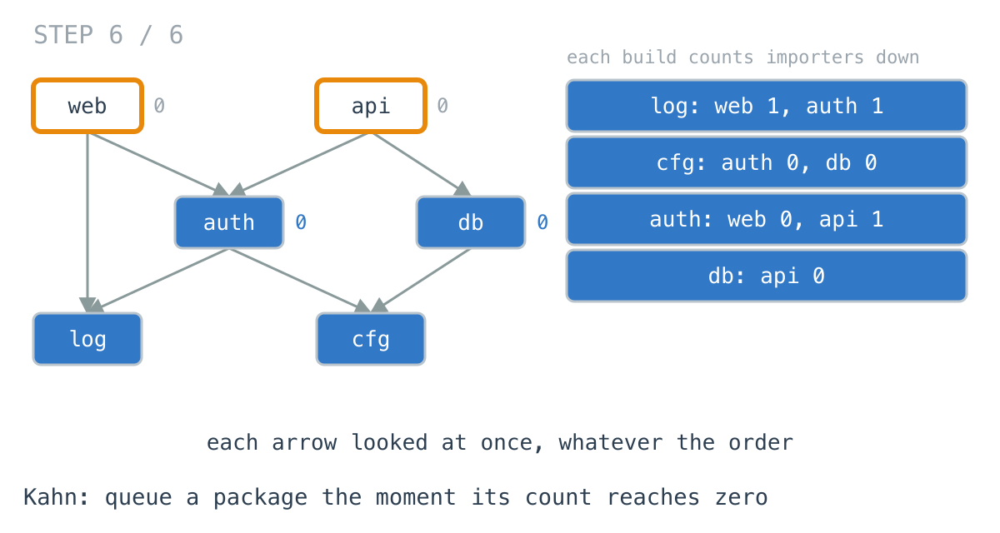

# Kahn's algorithm lost to a for loop on our build graph

**It worked in dev · Episode 22 · technique: topological sort, counting what each node waits for**

The build tool reads the package list and works out an order: every import
built before the package that imports it. If there is no order, a cycle, it
says which packages are in it.

I wrote a loop that makes passes over the list until nothing is left, measured
it against the textbook answer, and the textbook answer lost: on a 5,000-package
repo ten layers deep, the loop took **99.3 µs** and Kahn's algorithm, written
the way the daily challenge wrote it, took **276 µs**. Then I made the repo
deeper. At a 5,000-long import chain the loop took **18.8 ms** and Kahn, with
its memory laid out flat, **128 µs**. This episode is about where that line is.

---

## The problem

```go
// imports[p] lists the packages p imports.
func BuildOrder(imports [][]int) (order []int, ok bool)
```

Every package after everything it imports. If some packages can never be
built because they are in an import cycle, `ok` is false.



---

## What you would write

Read it the way the build log does. Walk the list, build every package whose
imports are all built, and keep going round until a pass builds nothing. If
anything is left over, it is waiting on something that is waiting on it.

```go
func OrderByPasses(imports [][]int) ([]int, bool, int) {
	n := len(imports)
	built := make([]bool, n)
	order := make([]int, 0, n)
	passes := 0
	for len(order) < n {
		passes++
		progress := false
		for p := 0; p < n; p++ {
			if built[p] {
				continue
			}
			ready := true
			for _, d := range imports[p] {
				if !built[d] {
					ready = false
					break
				}
			}
			if ready {
				built[p] = true
				order = append(order, p)
				progress = true
			}
		}
		if !progress {
			return order, false, passes
		}
	}
	return order, true, passes
}
```

Two allocations, no data structure beyond a flag per package, and the cycle
check falls out of "a pass made no progress". I would approve it, and on the
repo I have, I would keep it. The numbers below are why.



---

## How bad, on its own

```
Apple M1 Pro · go1.26.4 · go test -bench=OrderByPasses -benchtime=100x
```

| shape | packages | layers | passes | pass loop |
|---|---:|---:|---:|---:|
| `deps_first_10` | 5,000 | 10 | 1 | 55.1 µs |
| `apps_first_10` | 5,000 | 10 | 10 | 99.3 µs |
| `apps_first_100` | 5,000 | 100 | 100 | 474 µs |
| `apps_first_1000` | 5,000 | 1,000 | 1,000 | 3,735 µs |
| `chain_5000` | 5,000 | 5,000 | 5,000 | 18,757 µs |
| `cycle_10` | 5,000 | 10 | 11 | 74.2 µs |

Listed libraries-first, one pass does everything: 55 µs. Listed apps-first, the
way an alphabetical `apps/ ... libs/` tree comes out, it takes one pass per
layer. A real monorepo is ten or twenty layers deep, and at ten layers this is
99 µs. That is fine.

The bottom rows are the shapes that are not fine. Five thousand packages in one
long line of imports looks artificial until you notice it is exactly what a
directory of database migrations is, each one importing the one before: the
pass loop takes **189x** as long there as on the ten-layer repo, for the same
number of packages.

---

## From the symptom to the shape

### The issue, said plainly

Every pass re-checks every package that is not built yet, including the ones
nothing has changed for since the last pass.

### Quantify it on the concrete example

In the diagram, `web` and `api` are checked in pass 1, found waiting on `auth`,
and checked again in pass 2, where `auth` still is not built because it is
further down the list than they are. They are checked a third time in pass 3,
and built.



The cost is packages times passes, and passes is the depth of the import chain
when the list is in the wrong order. At a depth of 5,000, that is 5,000 passes.

### Why is it allowed to happen?

Because each pass asks one question of every package - are all your imports
built? - and has no memory of the answer it got last time. A package that was
waiting on `auth` a pass ago is still waiting on `auth`, and nothing about the
loop remembers that.

### The answer was already known

When `cfg` is built, which packages might have just become ready? Only the ones
that import `cfg`: `auth` and `db`. Nothing else in the repo was waiting on it.



The build already knew exactly who it could unblock. The loop threw that away
and went back to the top of the list to find out.

### What is the question actually asking?

Do not assume it. "Is this package ready?" is "how many of its imports are
still not built - is it zero?". That number starts at the import count and only
ever goes down, by exactly one, at the moment one of its imports is built.

The direction matters: the imports point down, towards libraries, but the
question "who does building `cfg` unblock?" points up. It needs the arrows
reversed.

### Write the thing you want as an equation

```
waiting(p) = len(imports(p))                  at the start
waiting(p) = waiting(p) - 1                   each time an import of p is built
p is ready  ⇔  waiting(p) == 0
```

Read it out loud. Nothing in it asks you to look at a package that is not an
importer of the thing you just built.



### Conclude the order

Count each package's imports. Put every package with a count of zero in a
queue. Take one off, build it, and count down each of its importers; any that
reach zero go in the queue. Every import arrow is looked at exactly once, when
the package it points at is built.

```go
for _, u := range users[queue[i]] {
	waiting[u]--
	if waiting[u] == 0 {
		queue = append(queue, u) // everything u imports is built
	}
}
```

That is **Kahn's algorithm**, and the cycle check is the same one the loop had,
said differently: whatever never reached zero is in a cycle or depends on one.



### And then it lost

This is where I expected the episode to end. It did not:

```
shape           pass loop     Kahn
apps_first_10     99.3 µs   276 µs
chain_5000      18,757 µs   276 µs
```

Kahn is flat, as promised - the depth makes no difference to it. But at ten
layers it is **2.78x** slower than the loop it replaces. The loop allocates two
things. Kahn, written as `users := make([][]int, n)` with an `append` per
import, allocates 8,205: one small slice for every package that is imported by
anything.

So I wrote it again with the reverse edges in one flat array - count each
package's importers, lay them out end to end, fill - and it drops to 5
allocations and **112 µs**. Still slower than the loop at ten layers, by a
hair. Faster from somewhere between ten and a hundred.

### Where it came from in the challenge

[Day 44](https://github.com/architagr/leetcode_solutions/blob/main/medium_problems/201_300/course_schedule/SOLUTION.md),
Course Schedule, is Kahn's algorithm, and its write-up puts the whole idea in
one line: "It is enqueued when that counter hits **zero**." It also says why
the edge direction is a real decision - the adjacency list is keyed by the
prerequisite, pointing at what it unlocks - and "Build this the other way round
and the code runs perfectly and answers a different question." And the cycle
check: "The cycle is detected by what fails to appear."

[Day 36](https://github.com/architagr/leetcode_solutions/blob/main/easy_problems/1901_2000/find_if_path_exists_in_graph/SOLUTION.md),
Find if Path Exists in Graph, is the BFS day 44 is defined against. Day 44 says
so: "In day 36, a node was enqueued the first time it was reached. Here,
reaching a node only decrements its counter." Same queue, same loop. The only
change is when a node is allowed in.

### When this does not apply

Go back to the equation and break it.

`waiting(p)` only goes down, one import at a time, and only because building is
all-or-nothing. If packages can be rebuilt - a watch mode where changing `cfg`
means `auth`, `db` and everything above them must rebuild - the counts go back
up, and a one-shot Kahn is the wrong shape. You want the reverse edges kept
around and walked from the changed package, not a fresh sort.

And the cost argument does not apply at the size most repos are. At ten or
twenty layers the loop is as fast or faster, uses less memory, and anyone can
read it. Kahn wins when the import chain is long, and in a code build it rarely
is. Migrations, versioned schemas, a changelog where each entry depends on the
last - those are long.

### The rule

> **When a node becomes ready only after all its inputs are done, count what
> each one is still waiting for and let each finished node count down its
> dependents. But measure first: a loop that re-scans a shallow graph can be
> faster than the algorithm that never re-scans.**

---

## Try it before reading on

No new traversal. One count per package, and the reverse of the import list.
What should building a package do to the packages that import it, and when is
one of them ready?

```bash
git clone https://github.com/architagr/leetcode_solutions
cd leetcode_solutions/series/it-worked-in-dev/episodes/22-circular-dependency
go test ./...
```

Reading on costs you the rep.

---

## The version that scales

```go
func OrderByKahnFlat(imports [][]int) ([]int, bool) {
	n := len(imports)
	waiting := make([]int, n)
	start := make([]int, n+1) // users of d live in flat[start[d]:start[d+1]]
	for p, ds := range imports {
		waiting[p] = len(ds)
		for _, d := range ds {
			start[d+1]++
		}
	}
	for d := 0; d < n; d++ {
		start[d+1] += start[d]
	}
	flat := make([]int, start[n])
	fill := append([]int(nil), start[:n]...)
	for p, ds := range imports {
		for _, d := range ds {
			flat[fill[d]] = p
			fill[d]++
		}
	}
	queue := make([]int, 0, n)
	for p := 0; p < n; p++ {
		if waiting[p] == 0 {
			queue = append(queue, p)
		}
	}
	for i := 0; i < len(queue); i++ {
		d := queue[i]
		for _, u := range flat[start[d]:start[d+1]] {
			waiting[u]--
			if waiting[u] == 0 {
				queue = append(queue, u)
			}
		}
	}
	return queue, len(queue) == n
}
```

Three things carry it. `waiting` is the count from the equation. The queue is
seeded with every package that imports nothing, before anything is built, the seeding from
[episode 19](../19-invalidation-wavefront/). And the reverse edges live in one array indexed by
`start`, so reversing the graph costs five allocations rather than eight
thousand.

The `start` and `fill` bookkeeping is what the flat layout costs in legibility.
If you do not need the last 2.46x, the slice-per-package version is the one to
read, and it is in `build.go` beside this.

When `ok` is false, `Cycle` follows unbuilt imports from any unbuilt package
until it revisits one, and returns the loop. The build error can then name the
packages instead of saying "cycle somewhere".

---

## The measurement

| shape | layers | pass loop | Kahn, slices | Kahn, flat | loop vs flat |
|---|---:|---:|---:|---:|---:|
| `deps_first_10` | 10 | 55.1 µs | 281 µs | 115 µs | 0.478x |
| `apps_first_10` | 10 | 99.3 µs | 276 µs | 112 µs | 0.887x |
| `apps_first_100` | 100 | 474 µs | 312 µs | 144 µs | 3.3x |
| `apps_first_1000` | 1,000 | 3,735 µs | 331 µs | 129 µs | 29x |
| `chain_5000` | 5,000 | 18,757 µs | 276 µs | 128 µs | 147x |
| `cycle_10` | 10 | 74.2 µs | 273 µs | 104 µs | 0.714x |

Raw ns: 55,067 / 281,410 / 115,234 · 99,291 / 275,580 / 111,889 ·
474,244 / 311,581 / 143,699 · 3,735,157 / 330,958 / 128,926 ·
18,757,135 / 276,224 / 127,555 · 74,175 / 272,832 / 103,862

Below 1 in the last column, the loop is faster. It is below 1 on every
ten-layer repo, including the one with a cycle. From a hundred layers it is not,
and at five thousand it is **147x** slower.

Kahn with a slice per package against flat Kahn: **2.17x** to **2.63x** on
every row. Same algorithm. The whole difference is allocation.

Allocated: 45.3 KB for the loop, 331 KB and 8,205 allocations for Kahn with
slices, 232 KB and 5 allocations for flat Kahn, on `apps_first_10`.

---

## What it costs

**On a normal repo, Kahn costs you.** It is slower at ten layers, in both
forms, and it allocates five to seven times the memory of the loop. That is the honest
headline, and the reason the title is the way round it is.

**It needs the graph reversed.** The imports list points down; the question
points up. Somebody has to build the reverse edges, and the flat version of
that is bookkeeping a reviewer has to trust. Get the direction wrong and, as
day 44 says, the code runs perfectly and answers a different question.

**The loop's cost is invisible until the input changes shape.** 99 µs at ten
layers, 18.8 ms on a chain, and nothing in the code tells you which you have.
If the thing being ordered can ever be a long line - migrations, schema
versions - that is the case to benchmark, not the average one.

**At your scale, write the loop.** If what you are ordering is a code build ten
or twenty layers deep, the pass loop is faster, smaller and readable by anyone.
Use Kahn where chains are long.

---

## The one line to keep

Count what each node is still waiting for and let finished nodes count their
dependents down - and before you swap a shallow loop for it, measure, because
the loop may be winning.

---

## Built on

Days from the [365-day LeetCode challenge](https://github.com/architagr/leetcode_solutions),
with the solution write-up and the problem itself:

- **Day 36 — [Find if Path Exists in Graph](https://github.com/architagr/leetcode_solutions/blob/main/easy_problems/1901_2000/find_if_path_exists_in_graph/SOLUTION.md)** · LeetCode [#1971](https://leetcode.com/problems/find-if-path-exists-in-graph/) · easy
  <br>building an adjacency list from an edge list, recording each edge under both endpoints, then one BFS from the source
- **Day 44 — [Course Schedule](https://github.com/architagr/leetcode_solutions/blob/main/medium_problems/201_300/course_schedule/SOLUTION.md)** · LeetCode [#207](https://leetcode.com/problems/course-schedule/) · medium
  <br>enqueueing a node when its count of unmet prerequisites reaches zero rather than when it is first reached, and detecting a cycle by what never comes out of the queue

---

## Run it yourself

```bash
git clone https://github.com/architagr/leetcode_solutions
cd leetcode_solutions/series/it-worked-in-dev/episodes/22-circular-dependency
go test ./...                          # all three give valid orders; cycles are named
go test -run TestPasses -v             # passes per shape
go test -bench=. -benchtime=100x       # the timings above
```

---

Part of [It worked in dev](../../), the long-form companion to the
[365-day LeetCode challenge](https://github.com/architagr/leetcode_solutions).

---

*Ideation, problem selection, benchmarks and conclusions: Archit Agarwal.
The prose was drafted with AI assistance and edited by me. Every number here
comes from a run you can reproduce with the commands above.*
