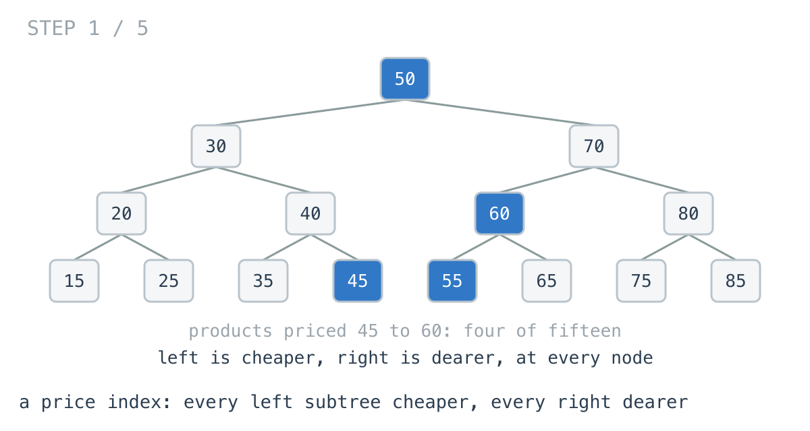
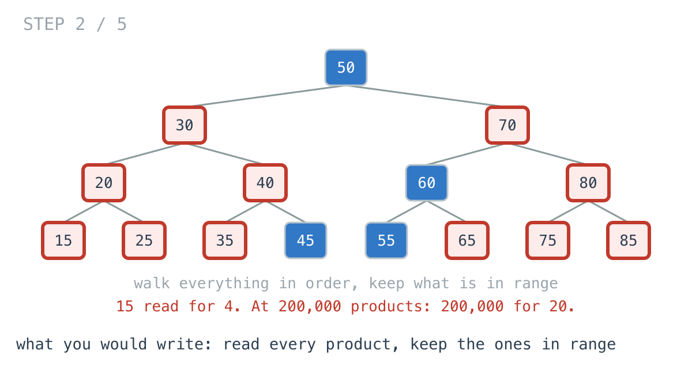
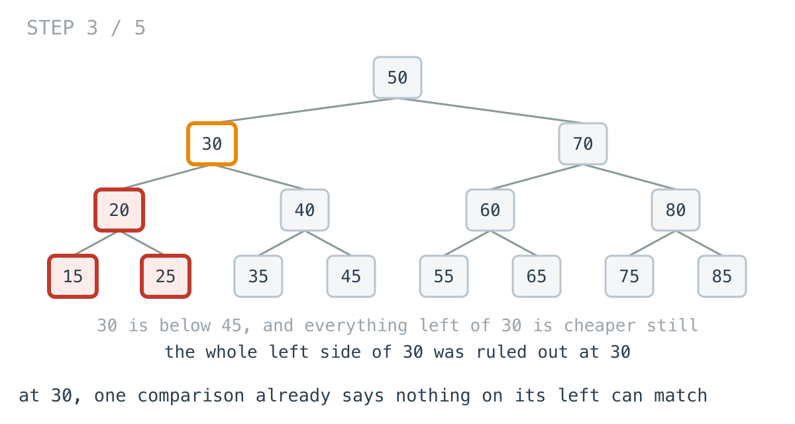
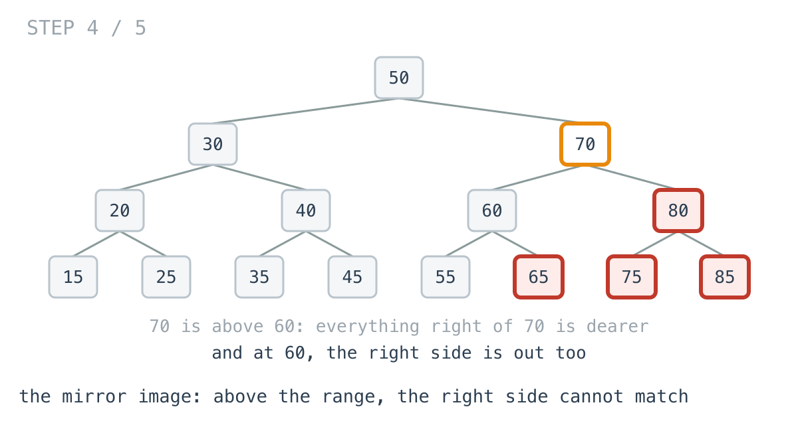
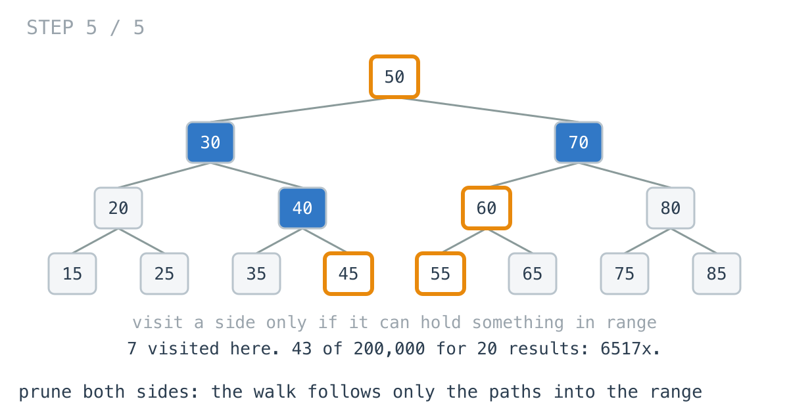

# A price filter read 200,000 products to return 20

**It worked in dev · Episode 23 · technique: in-order walk, pruned by the ordering**

The catalogue keeps an in-memory price index so the "price between" filter does
not hit the database. It is a binary search tree keyed by price, 200,000
products, and the filter returns them in price order.

A shopper asks for ₹10,000 to ₹10,001.90. Twenty products match. The filter
read **all 200,000** to find them, in **2.33 ms**. Walking only the paths that
can lead into the range reads **43** and takes **357 ns**. That is **6517x**,
and it is the same in-order walk with two `if`s added.

---

## The problem

```go
type Node struct {
	Price       int // paise
	Left, Right *Node
}

// Every price in [lo, hi], in increasing order.
func Range(root *Node, lo, hi int) []int
```

Everything in a node's left subtree is cheaper than it; everything in its right
subtree is dearer.



---

## What you would write

The results have to come out sorted, and an in-order walk of a binary search
tree - left, node, right - visits prices in increasing order. So walk it in
order and keep what is in range:

```go
func RangeByScan(root *Node, lo, hi int) []int {
	var out []int
	var walk func(n *Node)
	walk = func(n *Node) {
		if n == nil {
			return
		}
		walk(n.Left)
		if n.Price >= lo && n.Price <= hi {
			out = append(out, n.Price)
		}
		walk(n.Right)
	}
	walk(root)
	return out
}
```

It is the definition, it uses the tree's ordering to get sorted output for
free, and it cannot miss anything. I would approve it.



---

## How bad, on its own

```
Apple M1 Pro · go1.26.4 · go test -bench=RangeByScan -benchtime=300x
```

| shape | products | in range | scan and filter |
|---|---:|---:|---:|
| `narrow_20` | 200,000 | 20 | 2.33 ms |
| `band_2k` | 200,000 | 2,000 | 2.40 ms |
| `wide_100k` | 200,000 | 100,000 | 4.09 ms |
| `everything` | 200,000 | 200,000 | 5.87 ms |

Twenty results and two thousand results cost the same: 2.33 ms and 2.40 ms. The
cost is the catalogue, not the answer. When the range is the whole catalogue,
reading everything is exactly right; when it is twenty products, it is 199,980
products too many, on every filter click.

---

## From the symptom to the shape

### The issue, said plainly

The filter reads every product, including whole branches of the tree where no
product can possibly be in range.

### Quantify it on the concrete example

`TestVisits` counts the nodes each version touches:

```
narrow_20        depth     44,     20 in range  |  nodes visited: scan  200000, pruning      43
band_2k          depth     44,   2000 in range  |  nodes visited: scan  200000, pruning    2021
```

In the diagram, four of fifteen products are between 45 and 60, and all
fifteen are read.

### Why is it allowed to happen?

Because the walk uses the tree's ordering for exactly one thing - to get the
output sorted - and ignores what the ordering says about where things are.
Every node's comparison with `lo` and `hi` happens after the walk has already
gone down both sides of it.

### The answer was already there, one comparison up

At node 30, the walk compares 30 against the range and finds it too cheap. But
30 is the most expensive thing in its own left subtree. Everything down there -
20, 15, 25 - is cheaper than 30, so cheaper than 45. The walk had already
learned that nothing on 30's left could match, and went down there anyway.



The mirror image holds on the other side: at 70, too dear, and everything to
its right is dearer still.



### What is the question actually asking?

Do not assume it. "Every price in the range, in order" does not need every
price. It needs the ones in the range, and a way to know which branches cannot
hold any. In a binary search tree, each node is that way: its price is a
fence between the two sides.

### Write the thing you want as an equation

```
the left subtree of n can hold something in range   ⇔  n.Price > lo
the right subtree of n can hold something in range  ⇔  n.Price < hi
```

Read it out loud. Both conditions are one comparison against a number the walk
already has in hand when it reaches `n`, before it goes down either side.

### Conclude the walk

Keep the in-order walk, because the order is still what makes the output
sorted. Guard each side with its condition:

```go
if n.Price > lo {
	walk(n.Left) // something on the left could still be >= lo
}
if n.Price >= lo && n.Price <= hi {
	out = append(out, n.Price)
}
if n.Price < hi {
	walk(n.Right) // something on the right could still be <= hi
}
```

The walk now follows the path down to `lo`, the path down to `hi`, and
everything in between: about the tree's depth plus the number of results. 43
nodes for 20 results.



### Where it came from in the challenge

[Day 45](https://github.com/architagr/leetcode_solutions/blob/main/easy_problems/601_700/search_in_a_binary_search_tree/SOLUTION.md),
Search in a Binary Search Tree, is the pruning with a range of one value. Its
code comment is the whole idea: "if root.Val is already too big, val (if
present) can only live in the left subtree. The right subtree is ruled out
without ever visiting it." A range query is that comparison made against two
bounds instead of one, so both sides can survive.

[Day 47](https://github.com/architagr/leetcode_solutions/blob/main/easy_problems/501_600/minimum_absolute_difference_in_bst/SOLUTION.md),
Minimum Absolute Difference in BST, is where the sorted output comes from:
"standard in-order traversal (left, node, right), which for a BST visits values
in strictly increasing sorted order", and "the algorithm never explicitly sorts
anything". This episode keeps that walk and stops it wandering.

### When this does not apply

Go back to the equation and break it.

The conditions prune a subtree, and a subtree is only worth pruning if it is
big. That is true when the tree is balanced, 44 levels for 200,000 products.
Build the index from a CSV that was already sorted by price and every insert
goes to the right: a chain 20,000 deep, where every node's left subtree is
empty and there is nothing on that side to prune.

```
import_low_20    depth  20000,     20 in range  |  nodes visited: scan   20000, pruning      20
import_high_20   depth  20000,     20 in range  |  nodes visited: scan   20000, pruning  20000
```

The cheapest twenty are the first twenty links of the chain, and pruning stops
after them. The dearest twenty are at the far end, and pruning walks all 20,000
to reach them - **1.21x**, which is nothing. The equation is still true on a
chain; it just never gets to cut anything off. A self-balancing tree, or a
sorted slice and a binary search, is the fix for that, and it is a different
episode.

And when the range is the whole catalogue there is nothing to prune either, so
the two extra comparisons per node make the pruned walk the slower one:
**0.937x**.

### The rule

> **In an ordered structure, every node is a fence. Compare against the fence
> before you cross it, and never walk into a side that cannot hold what you
> are looking for.**

---

## Try it before reading on

Two `if` statements, and no new data structure. The walk stays in order, so the
output stays sorted. What do you know about a node's left subtree when the node
itself is already below `lo`?

```bash
git clone https://github.com/architagr/leetcode_solutions
cd leetcode_solutions/series/it-worked-in-dev/episodes/23-range-query-without-scan
go test ./...
```

Reading on costs you the rep.

---

## The version that scales

```go
func RangeByPruning(root *Node, lo, hi int) []int {
	var out []int
	var walk func(n *Node)
	walk = func(n *Node) {
		if n == nil {
			return
		}
		// Everything on the left is cheaper than n. If n is already below
		// lo, so is all of it.
		if n.Price > lo {
			walk(n.Left)
		}
		if n.Price >= lo && n.Price <= hi {
			out = append(out, n.Price)
		}
		// Everything on the right is dearer than n. If n is already above
		// hi, so is all of it.
		if n.Price < hi {
			walk(n.Right)
		}
	}
	walk(root)
	return out
}
```

Two guards carry it. `n.Price > lo` rather than `>=`: when `n` is exactly `lo`,
everything on its left is below the range. And the guards sit before the
recursive calls, not inside them, so a pruned side costs nothing at all.

---

## The measurement

| shape | in range | scan and filter | pruned walk | ratio |
|---|---:|---:|---:|---:|
| `narrow_20` | 20 | 2.33 ms | 357 ns | 6517x |
| `band_2k` | 2,000 | 2.40 ms | 32.4 µs | 74x |
| `wide_100k` | 100,000 | 4.09 ms | 2.90 ms | 1.41x |
| `everything` | 200,000 | 5.87 ms | 6.27 ms | 0.937x |
| `import_low_20` | 20 | 0.20 ms | 286 ns | 710x |
| `import_high_20` | 20 | 0.20 ms | 167 µs | 1.21x |

Raw ns: 2,327,739 / 357.2 · 2,397,919 / 32,393 · 4,088,227 / 2,900,003 ·
5,872,954 / 6,270,529 · 203,243 / 286.2 · 201,053 / 166,565

The ratio tracks the range, which is the point: the pruned walk costs what the
answer costs. Narrow filters are the common case in a shop - a price band, a
budget - and there it is **6517x** and **74x**. When half the catalogue
matches, **1.41x**; when all of it matches, the scan wins.

Allocated: the same in both, because both build the same result slice. 504 B
for 20 results.

---

## What it costs

**Almost nothing, and that is unusual.** Two `if`s, the same walk, the same
output, the same allocations. There is no new structure to maintain and no
readability to give up. If your index is a balanced tree, this is free.

**It is only as good as the tree's balance.** The pruning is worth depth plus
results, and on a tree built by sorted inserts depth is the whole catalogue.
The bulk import is the one that silently does that, and nothing in the query
code will tell you. Check the depth of your index once in a test.

**On full-range queries it is 6.7% slower.** Two comparisons per node that
never prune anything. If most of your queries are "everything", the scan is
fine - but then you did not need an index.

---

## The one line to keep

An ordered tree tells you which side a value can be on before you go there;
compare at the fence, and a range query costs the depth plus the answer, not
the size of the catalogue.

---

## Built on

Days from the [365-day LeetCode challenge](https://github.com/architagr/leetcode_solutions),
with the solution write-up and the problem itself:

- **Day 45 — [Search in a Binary Search Tree](https://github.com/architagr/leetcode_solutions/blob/main/easy_problems/601_700/search_in_a_binary_search_tree/SOLUTION.md)** · LeetCode [#700](https://leetcode.com/problems/search-in-a-binary-search-tree/) · easy
  <br>one comparison at a node rules out a whole subtree without visiting it
- **Day 47 — [Minimum Absolute Difference in BST](https://github.com/architagr/leetcode_solutions/blob/main/easy_problems/501_600/minimum_absolute_difference_in_bst/SOLUTION.md)** · LeetCode [#530](https://leetcode.com/problems/minimum-absolute-difference-in-bst/) · easy
  <br>an in-order walk of a BST visits values in sorted order, so nothing ever has to be sorted

---

## Run it yourself

```bash
git clone https://github.com/architagr/leetcode_solutions
cd leetcode_solutions/series/it-worked-in-dev/episodes/23-range-query-without-scan
go test ./...                          # both agree on every range, both trees
go test -run TestVisits -v             # 43 nodes against 200,000
go test -bench=. -benchtime=300x       # the timings above
```

---

Part of [It worked in dev](../../), the long-form companion to the
[365-day LeetCode challenge](https://github.com/architagr/leetcode_solutions).

---

*Ideation, problem selection, benchmarks and conclusions: Archit Agarwal.
The prose was drafted with AI assistance and edited by me. Every number here
comes from a run you can reproduce with the commands above.*
