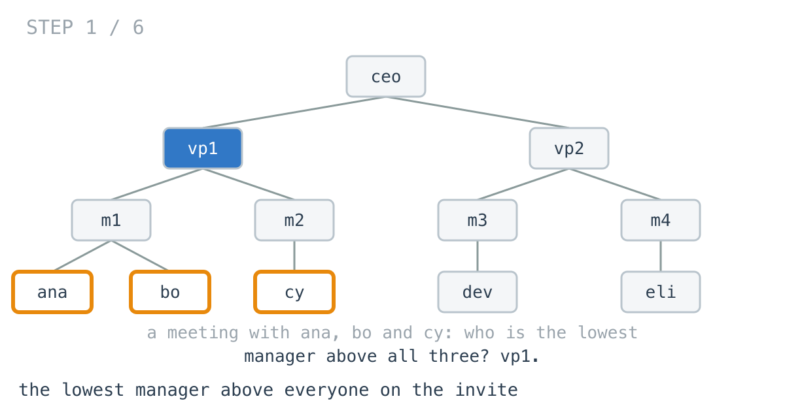
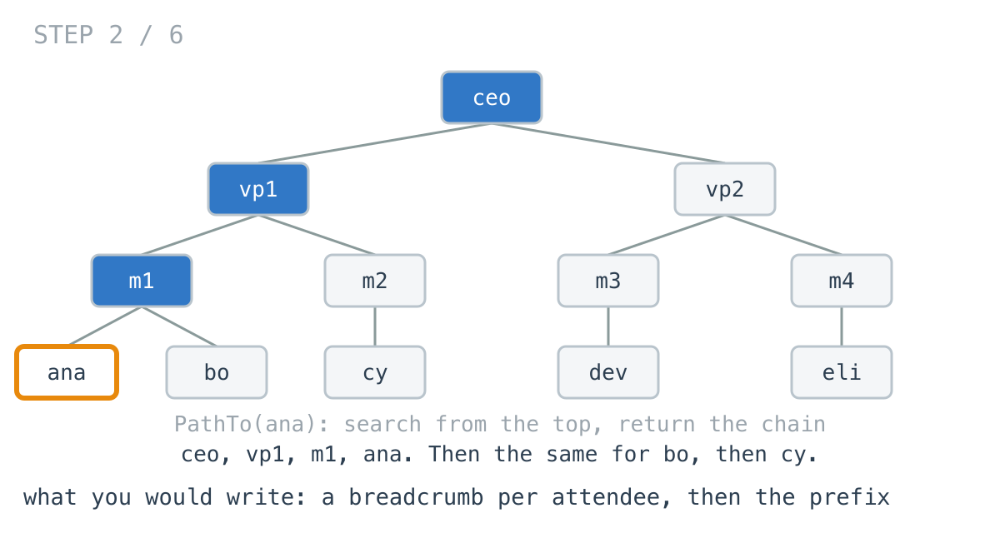
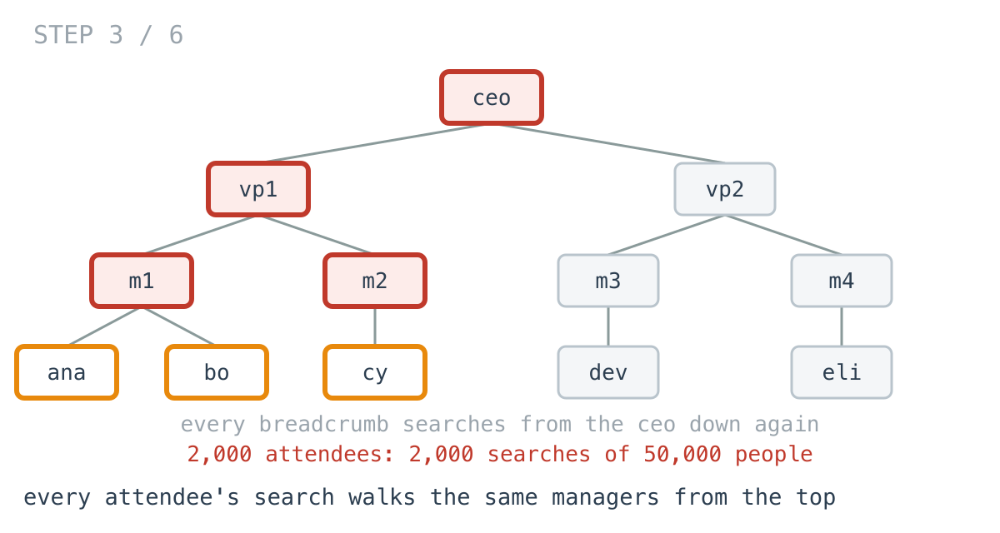
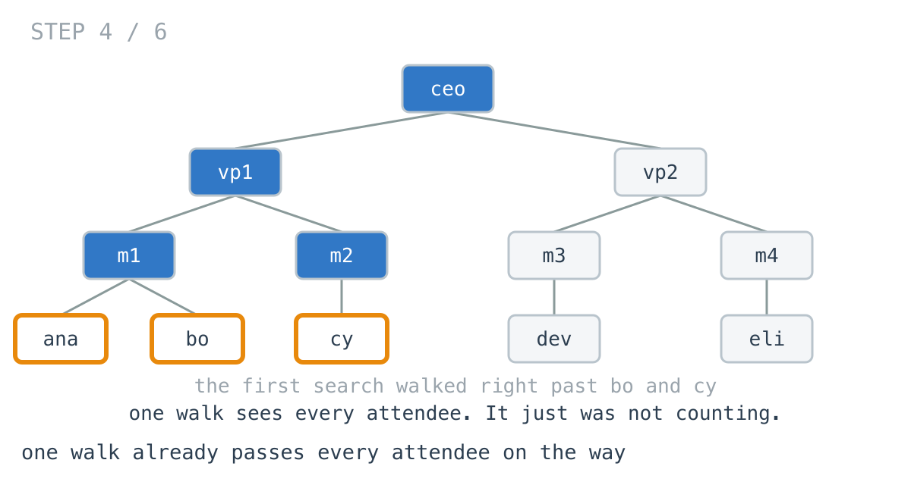
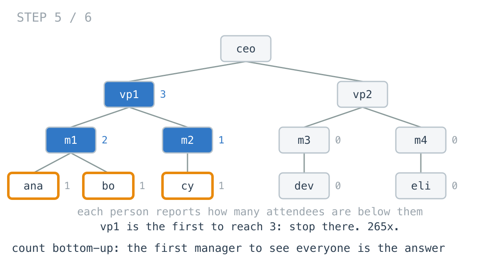
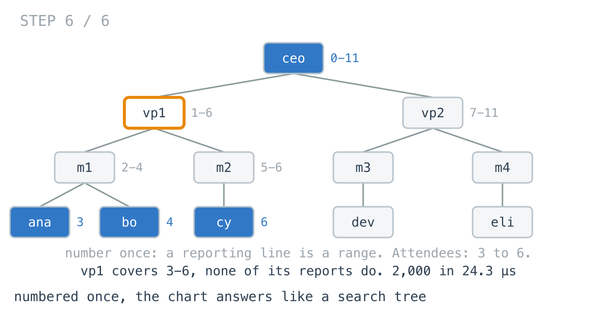

# An all-hands invite searched the org chart 2,000 times

**It worked in dev · Episode 24 · technique: lowest common ancestor, counted bottom-up**

The calendar tool suggests who should own a meeting: the lowest manager above
everyone invited. For a team meeting that is the team lead; for a cross-org
review it is a director.

For two people it took **0.22 ms**. For an all-hands invite with 2,000 people
on it, **168 ms** - one search of the 50,000-person org chart per attendee. A
single bottom-up walk that counts attendees as it goes answers the same
question in **0.63 ms**. And if the chart is numbered once when it changes,
the answer is **24.3 µs** with no walk at all.

---

## The problem

```go
// The org chart as the HR service returns it. There is no manager pointer.
type Employee struct {
	ID      int
	Reports []*Employee
}

// The lowest employee whose reporting line, themselves included, holds
// every attendee.
func CommonManager(root *Employee, ids []int) *Employee
```



---

## What you would write

The directory page already had a "reports to" breadcrumb: search from the CEO
down and return the chain of managers to an employee.

```go
func PathTo(root *Employee, id int) []*Employee {
	if root == nil {
		return nil
	}
	if root.ID == id {
		return []*Employee{root}
	}
	for _, r := range root.Reports {
		if p := PathTo(r, id); p != nil {
			return append([]*Employee{root}, p...)
		}
	}
	return nil
}
```

Every breadcrumb starts at the CEO. So the lowest common manager is the last
person who appears on all of them: take everyone's breadcrumb and keep the
shared prefix.

```go
func ManagerByPaths(root *Employee, ids []int) *Employee {
	var common []*Employee
	for i, id := range ids {
		p := PathTo(root, id)
		if p == nil {
			return nil
		}
		if i == 0 {
			common = p
			continue
		}
		k := 0
		for k < len(common) && k < len(p) && common[k] == p[k] {
			k++
		}
		common = common[:k]
	}
	if len(common) == 0 {
		return nil
	}
	return common[len(common)-1]
}
```

It reuses a tested function, it reads exactly like the definition, and for a
pair of people it is the fastest version on this page. I would approve it.



---

## How bad, on its own

```
Apple M1 Pro · go1.26.4 · go test -bench=ByPaths -benchtime=30x
```

| shape | employees | attendees | a breadcrumb per attendee |
|---|---:|---:|---:|
| `pair` | 50,000 | 2 | 0.22 ms |
| `team_20` | 50,000 | 20 | 2.62 ms |
| `allhands_200` | 50,000 | 200 | 17.2 ms |
| `allhands_2000` | 50,000 | 2,000 | 168 ms |

It grows with the invite, not the company. Two people, fine. An all-hands, 168
ms every time somebody adds a name to the invite and the suggestion refreshes.

---

## From the symptom to the shape

### The issue, said plainly

Every attendee's breadcrumb is a separate search from the CEO down, over the
same managers.

### Quantify it on the concrete example

Three attendees, three searches. Each starts at `ceo`, goes through `vp1`, and
looks down. `vp1` is visited by all three; so is `m1` for `ana` and `bo`.



On the real chart it is 2,000 searches of a 50,000-person tree, each allocating
its own breadcrumb: 27,404 allocations per suggestion.

### Why is it allowed to happen?

Because `PathTo` answers a one-person question - where is this employee - and
answers it well. Asked 2,000 times, it has no way to know that the answers
overlap almost entirely, or that the question being asked is about all of them
at once.

### The answer was already in view

Look at the search for `ana`. To find her, it walks `ceo`, `vp1`, `m1`. If it
had kept going, it would have walked past `bo` and `cy` too - every attendee is
somewhere in the chart, and one walk of the chart passes all of them.



The first search saw what it needed. It was looking for one name instead of
counting.

### What is the question actually asking?

Do not assume it. "The lowest manager above everyone" is not about paths at
all. A manager is above everyone if everyone is in their reporting line. So
the question each employee needs to answer is a number: how many attendees
are in my reporting line, me included?

### Write the thing you want as an equation

```
count(e) = (1 if e is an attendee) + sum of count(r) for each direct report r
answer   = the lowest e with count(e) == number of attendees
```

Read it out loud. `count(e)` needs only the counts of `e`'s reports - answers
from strictly below. So compute it bottom-up, and the first employee whose
count reaches everyone is the lowest one that can.

### Conclude the walk

One post-order walk. Every employee returns their count to their manager. The
moment one reaches the total, record them and stop - because every manager
above them will also reach the total, and would overwrite the answer with
someone higher.

```go
for _, r := range e.Reports {
	n += walk(r)
	if answer != nil {
		return n // found below: stop, or every manager above overwrites it
	}
}
if n == need {
	answer = e // bottom-up, so the first to see everyone is the lowest
}
```



That is the **lowest common ancestor**, for any number of people at once. One
walk of the chart however long the invite: 0.63 ms for 2,000 attendees,
**265x**.

### Closing the last gap: a chart that is already in order

The walk is still a walk. It does not need to be, if the chart carries an
order - which is what a binary search tree does for values.

Number everyone in pre-order, once, when the chart changes: each employee gets
an `In`, and an `Out` that is the last number in their reporting line. Now a
reporting line is a range. The attendees span some range of `In` numbers, and
the lowest common manager is the deepest employee whose range covers it. Walk
down from the CEO into whichever report covers it; when none does, you are
there.



No search, no counting: **24.3 µs** for 2,000 attendees, most of it reading
their numbers. Numbering costs 2.16 ms, and pays for itself after six
suggestions.

### Where it came from in the challenge

[Day 49](https://github.com/architagr/leetcode_solutions/blob/main/medium_problems/201_300/lowest_common_ancestor_of_a_binary_tree/SOLUTION.md),
Lowest Common Ancestor of a Binary Tree, is the count, for two targets. Its
code says both things this episode depends on: "Post-order means nodes are
reached bottom-up, so the first node to reach 2 is the lowest one that can",
and "Early return is what keeps the answer LOWEST. Without it the walk
continues and every ancestor above the real LCA also reaches a count of 2."
Changing 2 to the number of attendees is the whole generalisation.

[Day 48](https://github.com/architagr/leetcode_solutions/blob/main/medium_problems/201_300/lowest_common_ancestor_of_a_binary_search_tree/SOLUTION.md),
Lowest Common Ancestor of a Binary Search Tree, is the ordered version: "One
comparison per target eliminates a whole side, with no search and no
backtracking." Day 49's own write-up names what the difference costs: "Compare
yesterday's O(h) *time*: that's the whole cost of losing the ordering." The
numbering is how you buy the ordering back for a tree that did not come with
one.

### When this does not apply

Go back to the equation and break it.

`count(e)` needs the whole chart walked from the top. If the data has a
**manager pointer** instead - an `employees` table with `manager_id` - none of
this is the right shape. Walk up from each attendee to the CEO, marking as you
go, and the first manager every walk passes is the answer. That costs the depth
of the chart per attendee, a few dozen steps, and needs no walk of the whole
company.

For a **pair**, the breadcrumbs win: two searches that stop when they find their
person beat one walk that runs until it has seen both, **0.683x**.

And the **numbering goes stale** the moment anyone moves team. It has to be
redone after every reorg, and a suggestion served from stale numbers is
confidently wrong, not slow.

### The rule

> **When you want the lowest ancestor of a set, do not find each member and
> compare paths. Walk once bottom-up, count how many of the set each subtree
> holds, and stop at the first node that holds all of them.**

---

## Try it before reading on

One walk of the chart instead of one per attendee, and no breadcrumbs. What
should each employee tell their manager, and how does a manager know they are
the answer?

```bash
git clone https://github.com/architagr/leetcode_solutions
cd leetcode_solutions/series/it-worked-in-dev/episodes/24-who-is-the-common-manager
go test ./...
```

Reading on costs you the rep.

---

## The version that scales

```go
func ManagerByCount(root *Employee, ids []int) *Employee {
	want := map[int]bool{}
	for _, id := range ids {
		want[id] = true
	}
	need := len(want)
	var answer *Employee
	var walk func(e *Employee) int
	walk = func(e *Employee) int {
		n := 0
		if want[e.ID] {
			n++ // an employee is in their own reporting line
		}
		for _, r := range e.Reports {
			n += walk(r)
			if answer != nil {
				return n // found below: stop, or every manager above overwrites it
			}
		}
		if n == need {
			answer = e // bottom-up, so the first to see everyone is the lowest
		}
		return n
	}
	if need > 0 && root != nil {
		walk(root)
	}
	return answer
}
```

Three things carry it. `n++` for the employee themselves, which is what makes a
manager who is also invited the answer when their reports are too. `need` is
the size of the set, not the list, so a name on the invite twice does not
double-count. And the early return, without which the answer is always the CEO.

---

## The measurement

| shape | attendees | breadcrumbs | bottom-up count | numbered | breadcrumbs vs count |
|---|---:|---:|---:|---:|---:|
| `pair` | 2 | 0.22 ms | 0.32 ms | 22.8 ns | 0.683x |
| `team_20` | 20 | 2.62 ms | 0.38 ms | 253 ns | 6.92x |
| `allhands_200` | 200 | 17.2 ms | 1.00 ms | 1.87 µs | 17.1x |
| `allhands_2000` | 2,000 | 168 ms | 0.63 ms | 24.3 µs | 265x |

Raw ns: 216,267 / 316,738 / 22.77 · 2,621,826 / 378,729 / 252.9 ·
17,215,733 / 1,004,361 / 1,869 · 167,868,197 / 633,664 / 24,283

The count stays at about a millisecond or less at every invite size, because it is one
walk of the chart whatever the invite holds. The breadcrumbs grow with the
invite. For a pair they win; from twenty people on, they lose by more with
every name.

Numbered, the count is beaten again, **26.1x** at 2,000 attendees and
**13910x** for a pair - after a one-off 2.16 ms.

Allocated: 612 KB and 27,404 allocations for the breadcrumbs at 2,000, 145 KB
and 29 for the count (the set of attendee IDs), nothing for the numbered chart.

---

## What it costs

**The breadcrumb function is no longer reused.** The count is its own walk, and
it only answers this question. The breadcrumb page still needs `PathTo`.

**It walks the whole chart for a pair.** Two people is the most common meeting,
and there the breadcrumbs are faster. If the tool mostly sees pairs, switch on
invite size, or keep the breadcrumbs.

**The numbering is a cache, with a cache's problems.** 2.16 ms after every
reorg, and wrong answers if anyone forgets. It is worth it for a service that
answers this all day; not for a tool that asks once per meeting.

**At a team-sized invite, the breadcrumbs are 2.62 ms.** If invites are small,
that is fine and it reuses tested code. The all-hands is where it hurts, and the
all-hands is exactly when a slow suggestion gets noticed.

---

## The one line to keep

The lowest common ancestor of a set is the first node, walking bottom-up, whose
subtree holds the whole set - so count on the way up instead of searching for
each member on the way down.

---

## Built on

Days from the [365-day LeetCode challenge](https://github.com/architagr/leetcode_solutions),
with the solution write-up and the problem itself:

- **Day 48 — [Lowest Common Ancestor of a Binary Search Tree](https://github.com/architagr/leetcode_solutions/blob/main/medium_problems/201_300/lowest_common_ancestor_of_a_binary_search_tree/SOLUTION.md)** · LeetCode [#235](https://leetcode.com/problems/lowest-common-ancestor-of-a-binary-search-tree/) · medium
  <br>descending by comparison alone, because an ordering says which side every target is on without searching
- **Day 49 — [Lowest Common Ancestor of a Binary Tree](https://github.com/architagr/leetcode_solutions/blob/main/medium_problems/201_300/lowest_common_ancestor_of_a_binary_tree/SOLUTION.md)** · LeetCode [#236](https://leetcode.com/problems/lowest-common-ancestor-of-a-binary-tree/) · medium
  <br>counting targets bottom-up and stopping at the first node whose count reaches them all, which is what keeps the answer lowest

---

## Run it yourself

```bash
git clone https://github.com/architagr/leetcode_solutions
cd leetcode_solutions/series/it-worked-in-dev/episodes/24-who-is-the-common-manager
go test ./...                                              # all three agree, including a manager and their report
go test -bench='ByPaths|ByCount|Number$' -benchtime=30x    # breadcrumbs, count, numbering
go test -bench=ByNumbers -benchtime=20000x                 # the numbered chart
```

---

Part of [It worked in dev](../../), the long-form companion to the
[365-day LeetCode challenge](https://github.com/architagr/leetcode_solutions).

---

*Ideation, problem selection, benchmarks and conclusions: Archit Agarwal.
The prose was drafted with AI assistance and edited by me. Every number here
comes from a run you can reproduce with the commands above.*
